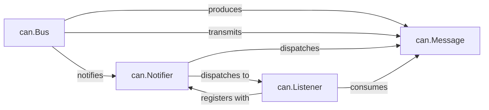

## Details

The CAN Core Abstraction subsystem is defined by `can/message.py`, `can/bus.py`, `can/notifier.py`, and `can/listener.py`. `can.Message` encapsulates CAN frame data. `can.Bus` handles hardware communication, sending and receiving messages, and initiating notifications. `can.Notifier` manages asynchronous message flow from `can.Bus` to `can.Listener` objects. `can.Listener` defines interfaces for processing incoming CAN messages, acting as a flexible extension point.

### can.Message
The immutable data structure representing a single CAN message, encapsulating all its attributes (ID, data, timestamp, flags). It is the fundamental unit of data exchange.

**Related Classes/Methods**:

- <a href="https://github.com/hardbyte/python-can/blob/main/can/interfaces/socketcan/socketcan.py" target="_blank" rel="noopener noreferrer">`can.Message`</a>

### can.Bus
Provides a high-level, hardware-agnostic interface for sending and receiving CAN messages, abstracting underlying hardware complexities. It aligns with the Adapter/Bridge Pattern.

**Related Classes/Methods**:

- <a href="https://github.com/hardbyte/python-can/blob/main/can/bus.py" target="_blank" rel="noopener noreferrer">`can.Bus`</a>

### can.Notifier
Acts as the central event dispatcher (publisher role in Observer pattern), monitoring `can.Bus` instances for messages and asynchronously dispatching them to registered `can.Listener` objects.

**Related Classes/Methods**:

- <a href="https://github.com/hardbyte/python-can/blob/main/can/notifier.py" target="_blank" rel="noopener noreferrer">`can.Notifier`</a>

### can.Listener
Defines an abstract interface for objects that consume and process CAN messages (subscriber role in Observer pattern). Concrete implementations provide specific message handling logic.

**Related Classes/Methods**:

- <a href="https://github.com/hardbyte/python-can/blob/main/can/listener.py" target="_blank" rel="noopener noreferrer">`can.Listener`</a>

### [FAQ](https://github.com/CodeBoarding/GeneratedOnBoardings/tree/main?tab=readme-ov-file#faq)