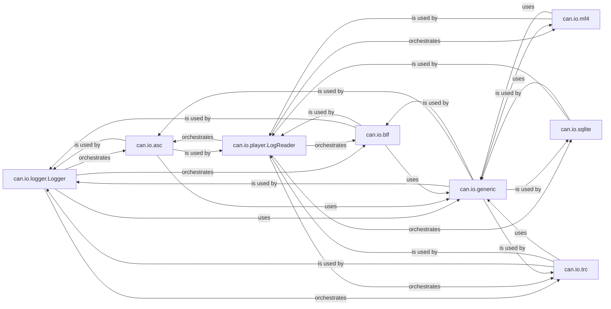

## Details

Analysis of the CAN Log Management subsystem, detailing its central components and their interactions for logging and replaying CAN messages across various file formats.

### can.io.logger.Logger
Orchestrates the logging of live CAN messages. It acts as a central point for receiving messages and dispatching them to the appropriate log file writer based on the configured format. It handles log file creation, rotation, and stopping.

**Related Classes/Methods**:

- <a href="https://github.com/hardbyte/python-can/blob/main/can/io/logger.py" target="_blank" rel="noopener noreferrer">`can.io.logger.Logger`</a>

### can.io.player.LogReader
Manages the replay of recorded CAN messages from various log file formats. It abstracts the underlying file format details, providing an iterable interface to access messages.

**Related Classes/Methods**:

- <a href="https://github.com/hardbyte/python-can/blob/main/can/io/player.py#L81-L125" target="_blank" rel="noopener noreferrer">`can.io.player.LogReader`:81-125</a>

### can.io.asc
Provides specific logic for reading from and writing to ASC (ASCII) log files, parsing and formatting messages according to the ASC specification.

**Related Classes/Methods**:

- <a href="https://github.com/hardbyte/python-can/blob/main/can/io/asc.py" target="_blank" rel="noopener noreferrer">`can.io.asc`</a>

### can.io.blf
Provides specific logic for reading from and writing to BLF (Binary Log File) format, handling its binary structure.

**Related Classes/Methods**:

- <a href="https://github.com/hardbyte/python-can/blob/main/can/io/blf.py" target="_blank" rel="noopener noreferrer">`can.io.blf`</a>

### can.io.mf4
Focuses on reading CAN messages from MF4 (Measurement Data Format 4) files, iterating through different CAN frame types.

**Related Classes/Methods**:

- <a href="https://github.com/hardbyte/python-can/blob/main/can/io/mf4.py" target="_blank" rel="noopener noreferrer">`can.io.mf4`</a>

### can.io.sqlite
Manages the persistence and retrieval of CAN messages using an SQLite database.

**Related Classes/Methods**:

- <a href="https://github.com/hardbyte/python-can/blob/main/can/io/sqlite.py" target="_blank" rel="noopener noreferrer">`can.io.sqlite`</a>

### can.io.trc
Handles reading from and writing to TRC (Trace) log files, supporting various TRC versions.

**Related Classes/Methods**:

- <a href="https://github.com/hardbyte/python-can/blob/main/can/io/trc.py" target="_blank" rel="noopener noreferrer">`can.io.trc`</a>

### can.io.generic
Provides generic utility functions for file operations (e.g., file_size), reused across different log handlers to avoid code duplication.

**Related Classes/Methods**:

- <a href="https://github.com/hardbyte/python-can/blob/main/can/io/generic.py" target="_blank" rel="noopener noreferrer">`can.io.generic`</a>

### [FAQ](https://github.com/CodeBoarding/GeneratedOnBoardings/tree/main?tab=readme-ov-file#faq)