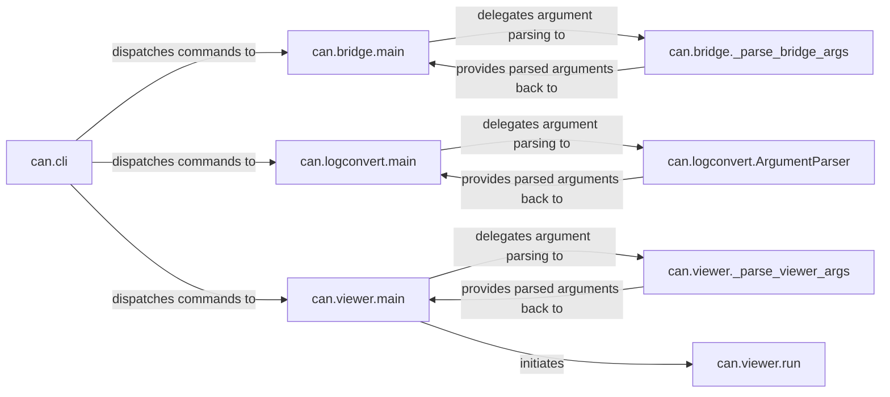

## Details

The Command-Line Interface (CLI) subsystem provides user-facing executable tools for common CAN bus operations, leveraging the core library components. These tools offer functionalities like bridging CAN traffic, converting log files, and live viewing.

### can.cli
The primary entry point for the `python-can` command-line interface. It is responsible for parsing the initial command (e.g., `can bridge`, `can logconvert`, `can viewer`) and dispatching control to the appropriate sub-tool's main function.

**Related Classes/Methods**:

- <a href="https://github.com/hardbyte/python-can/blob/main/can/cli.py" target="_blank" rel="noopener noreferrer">`can.cli`</a>

### can.bridge.main
Initializes and manages the operation of bridging CAN messages between different interfaces or buses. It sets up the core logic for the `can bridge` command.

**Related Classes/Methods**:

- <a href="https://github.com/hardbyte/python-can/blob/main/can/bridge.py#L45-L62" target="_blank" rel="noopener noreferrer">`can.bridge.main`:45-62</a>

### can.logconvert.main
Orchestrates the process of converting CAN log files from one format to another, handling file input/output and format-specific parsing/writing for the `can logconvert` command.

**Related Classes/Methods**:

- <a href="https://github.com/hardbyte/python-can/blob/main/can/logconvert.py#L22-L65" target="_blank" rel="noopener noreferrer">`can.logconvert.main`:22-65</a>

### can.viewer.main
Sets up and initiates the interactive, real-time display of live CAN bus traffic. It prepares the environment for the `can viewer`'s operation.

**Related Classes/Methods**:

- <a href="https://github.com/hardbyte/python-can/blob/main/can/viewer.py#L540-L544" target="_blank" rel="noopener noreferrer">`can.viewer.main`:540-544</a>

### can.bridge._parse_bridge_args
Parses command-line arguments specifically for the `can bridge` tool, validating inputs and preparing them for the bridge's main logic.

**Related Classes/Methods**:

- <a href="https://github.com/hardbyte/python-can/blob/main/can/bridge.py#L29-L42" target="_blank" rel="noopener noreferrer">`can.bridge._parse_bridge_args`:29-42</a>

### can.logconvert.ArgumentParser
Handles command-line argument parsing for the `can logconvert` tool, ensuring correct parameters are provided for file conversion.

**Related Classes/Methods**:

- <a href="https://github.com/hardbyte/python-can/blob/main/can/logconvert.py#L16-L19" target="_blank" rel="noopener noreferrer">`can.logconvert.ArgumentParser`:16-19</a>

### can.viewer._parse_viewer_args
Parses command-line arguments for the `can viewer` tool, configuring its display and operational parameters.

**Related Classes/Methods**:

- <a href="https://github.com/hardbyte/python-can/blob/main/can/viewer.py#L390-L537" target="_blank" rel="noopener noreferrer">`can.viewer._parse_viewer_args`:390-537</a>

### can.viewer.run
The core operational loop for the `can viewer`, responsible for continuously reading and displaying CAN messages in real-time.

**Related Classes/Methods**:

- <a href="https://github.com/hardbyte/python-can/blob/main/can/viewer.py#L85-L158" target="_blank" rel="noopener noreferrer">`can.viewer.run`:85-158</a>

### [FAQ](https://github.com/CodeBoarding/GeneratedOnBoardings/tree/main?tab=readme-ov-file#faq)