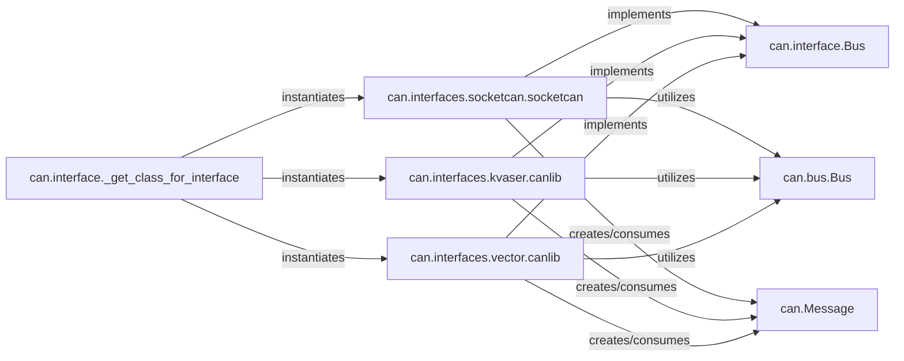

## Details

The `python-can` library's core architecture revolves around a flexible and extensible design for interacting with various CAN bus hardware. The `can.interface.Bus` acts as the central abstract interface, defining a unified contract for all CAN operations. Concrete implementations, such as `can.interfaces.socketcan.socketcan`, `can.interfaces.kvaser.canlib`, and `can.interfaces.vector.canlib`, serve as adapters that translate these abstract operations into hardware-specific commands. These adapters also leverage `can.bus.Bus` for common functionalities like message filtering and periodic task management. All communication within the system is standardized through the `can.Message` data structure, which is created and consumed by the concrete bus implementations. The `can.interface._get_class_for_interface` factory function dynamically selects and instantiates the appropriate bus interface based on configuration, promoting modularity and simplifying the integration of new hardware. This design ensures a consistent and adaptable approach to CAN bus communication.

### can.interface.Bus
The core abstract interface (Adapter/Bridge pattern) that defines the contract for all CAN bus operations. It ensures a consistent API for sending, receiving, filtering, and managing periodic tasks, regardless of the underlying hardware.

**Related Classes/Methods**:

- <a href="https://github.com/hardbyte/python-can/blob/main/can/interface.py" target="_blank" rel="noopener noreferrer">`can.interface.Bus`</a>

### can.bus.Bus
Provides foundational, generic functionalities for CAN bus implementations. Concrete hardware adapters can extend or utilize this class to inherit common behaviors like message filtering and periodic task management, promoting code reuse.

**Related Classes/Methods**:

- <a href="https://github.com/hardbyte/python-can/blob/main/can/bus.py" target="_blank" rel="noopener noreferrer">`can.bus.Bus`</a>

### can.interfaces.socketcan.socketcan
A concrete adapter for Linux SocketCAN. It encapsulates the low-level details of communicating with SocketCAN, including CAN frame encoding/decoding and periodic message handling via BCM. It implements `can.interface.Bus`.

**Related Classes/Methods**:

- <a href="https://github.com/hardbyte/python-can/blob/main/can/interfaces/socketcan/socketcan.py" target="_blank" rel="noopener noreferrer">`can.interfaces.socketcan.socketcan`</a>

### can.interfaces.kvaser.canlib
A concrete adapter for Kvaser CAN devices. It interfaces with the Kvaser CANlib API to manage hardware communication, retrieve channel information, and perform status checks. It implements `can.interface.Bus`.

**Related Classes/Methods**:

- <a href="https://github.com/hardbyte/python-can/blob/main/can/interfaces/kvaser/__init__.py" target="_blank" rel="noopener noreferrer">`can.interfaces.kvaser.canlib`</a>

### can.interfaces.vector.canlib
A concrete adapter for Vector CAN devices. It interacts with the Vector XL Driver Library to configure bit timing, output modes, and handle both CAN and CAN FD messages. It implements `can.interface.Bus`.

**Related Classes/Methods**:

- <a href="https://github.com/hardbyte/python-can/blob/main/can/interfaces/vector/__init__.py" target="_blank" rel="noopener noreferrer">`can.interfaces.vector.canlib`</a>

### can.Message
The fundamental data structure representing a CAN message. All hardware adapters translate raw CAN data into `can.Message` objects upon reception and convert `can.Message` objects into hardware-specific formats for transmission. This ensures a consistent data representation across the system.

**Related Classes/Methods**:

- <a href="https://github.com/hardbyte/python-can/blob/main/can/interfaces/socketcan/socketcan.py" target="_blank" rel="noopener noreferrer">`can.Message`</a>

### can.interface._get_class_for_interface
This is a factory function that dynamically loads and returns the appropriate concrete `Bus` implementation based on a specified interface type (e.g., 'socketcan', 'kvaser'). This promotes modularity and extensibility, allowing new hardware interfaces to be added without modifying existing code.

**Related Classes/Methods**:

- <a href="https://github.com/hardbyte/python-can/blob/main/can/interface.py#L23-L57" target="_blank" rel="noopener noreferrer">`can.interface._get_class_for_interface`:23-57</a>

### [FAQ](https://github.com/CodeBoarding/GeneratedOnBoardings/tree/main?tab=readme-ov-file#faq)