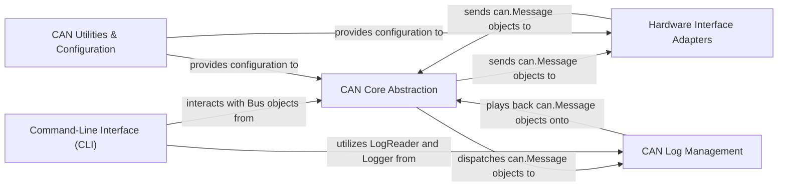

## Details

The `python-can` project is structured around a core CAN abstraction layer that facilitates communication with various hardware interfaces and manages message logging and replay. The `CAN Core Abstraction` acts as the central component, defining the fundamental `Message` object and handling bus communication and event notification. It interacts bi-directionally with `Hardware Interface Adapters`, which translate hardware-specific CAN data to and from the core `can.Message` format. The `CAN Log Management` component is responsible for persisting and replaying CAN messages, receiving data from and sending data to the `CAN Core Abstraction`. User interaction is primarily handled by the `Command-Line Interface (CLI)`, which leverages both the `CAN Core Abstraction` for live bus operations and `CAN Log Management` for log file manipulation. Finally, `CAN Utilities & Configuration` provides essential helper functions and configuration data to both the `CAN Core Abstraction` and `Hardware Interface Adapters`, ensuring proper bus operation and interface setup. This modular design allows for flexible integration with diverse CAN hardware and robust handling of CAN message data.

### CAN Core Abstraction [[Expand]](./CAN_Core_Abstraction.md)
The central hub for CAN message representation, bus communication, and event notification. It defines the fundamental `Message` object, manages bus communication, and facilitates event notification through a `Notifier` and `Listener` mechanism.

**Related Classes/Methods**:

- <a href="https://github.com/hardbyte/python-can/blob/main/can/bus.py" target="_blank" rel="noopener noreferrer">`can/bus.py`</a>
- <a href="https://github.com/hardbyte/python-can/blob/main/can/message.py" target="_blank" rel="noopener noreferrer">`can/message.py`</a>
- <a href="https://github.com/hardbyte/python-can/blob/main/can/notifier.py" target="_blank" rel="noopener noreferrer">`can/notifier.py`</a>
- <a href="https://github.com/hardbyte/python-can/blob/main/can/listener.py" target="_blank" rel="noopener noreferrer">`can/listener.py`</a>

### Hardware Interface Adapters [[Expand]](./Hardware_Interface_Adapters.md)
A modular layer for interacting with diverse CAN hardware and software interfaces. Each adapter implements a consistent `Bus` interface, translating raw CAN data to `can.Message` objects and vice-versa.

**Related Classes/Methods**:

- <a href="https://github.com/hardbyte/python-can/blob/main/can/interface.py" target="_blank" rel="noopener noreferrer">`can/interface.py`</a>
- <a href="https://github.com/hardbyte/python-can/blob/main/can/interfaces/socketcan/socketcan.py" target="_blank" rel="noopener noreferrer">`can/interfaces/socketcan.py`</a>
- <a href="https://github.com/hardbyte/python-can/blob/main/can/interfaces/kvaser/__init__.py" target="_blank" rel="noopener noreferrer">`can/interfaces/kvaser/__init__.py`</a>
- <a href="https://github.com/hardbyte/python-can/blob/main/can/interfaces/vector/__init__.py" target="_blank" rel="noopener noreferrer">`can/interfaces/vector/__init__.py`</a>

### CAN Log Management [[Expand]](./CAN_Log_Management.md)
Manages the persistence and replay of CAN messages to and from various log file formats. This component supports both logging live traffic (`Logger`) and replaying recorded data (`Player`).

**Related Classes/Methods**:

- <a href="https://github.com/hardbyte/python-can/blob/main/can/io/logger.py" target="_blank" rel="noopener noreferrer">`can/io/logger.py`</a>
- <a href="https://github.com/hardbyte/python-can/blob/main/can/io/player.py" target="_blank" rel="noopener noreferrer">`can/io/player.py`</a>
- <a href="https://github.com/hardbyte/python-can/blob/main/can/io/asc.py" target="_blank" rel="noopener noreferrer">`can/io/asc.py`</a>
- <a href="https://github.com/hardbyte/python-can/blob/main/can/io/blf.py" target="_blank" rel="noopener noreferrer">`can/io/blf.py`</a>

### Command-Line Interface (CLI) [[Expand]](./Command_Line_Interface_CLI_.md)
Provides user-facing executable tools for common CAN bus operations, leveraging the core library components. These tools offer functionalities like bridging CAN traffic, converting log files, and live viewing.

**Related Classes/Methods**:

- <a href="https://github.com/hardbyte/python-can/blob/main/can/cli.py" target="_blank" rel="noopener noreferrer">`can/cli.py`</a>
- <a href="https://github.com/hardbyte/python-can/blob/main/can/bridge.py" target="_blank" rel="noopener noreferrer">`can/bridge.py`</a>
- <a href="https://github.com/hardbyte/python-can/blob/main/can/logconvert.py" target="_blank" rel="noopener noreferrer">`can/logconvert.py`</a>
- <a href="https://github.com/hardbyte/python-can/blob/main/can/viewer.py" target="_blank" rel="noopener noreferrer">`can/viewer.py`</a>

### CAN Utilities & Configuration
Contains helper functions and data structures for CAN bus configuration, particularly bit timing calculations, and general utility functions used across the library. This also includes common exceptions.

**Related Classes/Methods**:

- <a href="https://github.com/hardbyte/python-can/blob/main/can/bit_timing.py" target="_blank" rel="noopener noreferrer">`can/bit_timing.py`</a>
- <a href="https://github.com/hardbyte/python-can/blob/main/can/util.py" target="_blank" rel="noopener noreferrer">`can/util.py`</a>
- <a href="https://github.com/hardbyte/python-can/blob/main/can/exceptions.py" target="_blank" rel="noopener noreferrer">`can/exceptions.py`</a>

### [FAQ](https://github.com/CodeBoarding/GeneratedOnBoardings/tree/main?tab=readme-ov-file#faq)