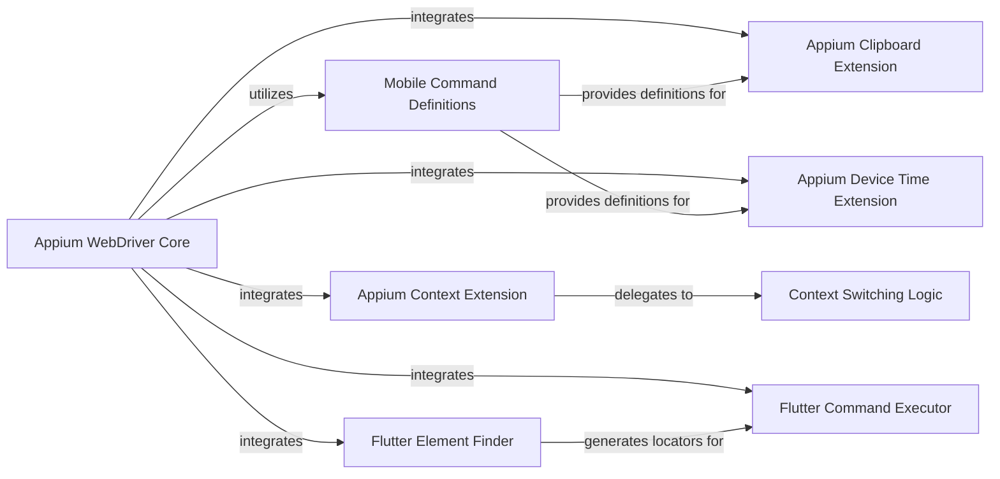

## Details

The `Appium Python Client Core` subsystem is centered around the `appium.webdriver.webdriver` component, which acts as the primary interface for test scripts. It encompasses the core WebDriver functionality extended with Appium-specific capabilities, including command orchestration, session management, and integration of various Appium extensions.

### Appium WebDriver Core
The central component, serving as the primary interface for test scripts. It extends Selenium's WebDriver to manage the session, orchestrate command execution, and integrate Appium-specific extensions, providing the main entry point for automation.

**Related Classes/Methods**:

- <a href="https://github.com/appium/python-client/blob/master/appium/webdriver/webdriver.py" target="_blank" rel="noopener noreferrer">`appium.webdriver.webdriver`</a>

### Mobile Command Definitions
Defines a set of constants representing Appium-specific mobile commands. It ensures consistent command naming across the client and is crucial for abstracting the underlying W3C WebDriver Protocol, acting as a registry for all supported Appium commands.

**Related Classes/Methods**:

- <a href="https://github.com/appium/python-client/blob/master/appium/webdriver/mobilecommand.py" target="_blank" rel="noopener noreferrer">`appium.webdriver.mobilecommand`</a>

### Context Switching Logic
Provides the underlying mechanism for WebDriver's context switching operations. While `Appium Context Extension` offers the user-facing API, this component handles the low-level logic for managing different application contexts (e.g., native, webview).

**Related Classes/Methods**:

- <a href="https://github.com/appium/python-client/blob/master/appium/webdriver/switch_to.py" target="_blank" rel="noopener noreferrer">`appium.webdriver.switch_to`</a>

### Appium Clipboard Extension
Extends the core WebDriver functionality with Appium-specific features for interacting with the device's clipboard, allowing test scripts to get and set clipboard content.

**Related Classes/Methods**:

- <a href="https://github.com/appium/python-client/blob/master/appium/webdriver/extensions/clipboard.py" target="_blank" rel="noopener noreferrer">`appium.webdriver.extensions.clipboard`</a>

### Appium Context Extension
Extends the core WebDriver functionality with Appium-specific features, specifically providing the user-facing API for context switching between native, webview, and other application contexts.

**Related Classes/Methods**:

- <a href="https://github.com/appium/python-client/blob/master/appium/webdriver/extensions/context.py" target="_blank" rel="noopener noreferrer">`appium.webdriver.extensions.context`</a>

### Appium Device Time Extension
Extends the core WebDriver functionality with Appium-specific features for managing and retrieving the device's time settings.

**Related Classes/Methods**:

- <a href="https://github.com/appium/python-client/blob/master/appium/webdriver/extensions/device_time.py" target="_blank" rel="noopener noreferrer">`appium.webdriver.extensions.device_time`</a>

### Flutter Element Finder
A specialized extension providing element location capabilities specifically for Flutter applications, enabling the identification of Flutter widgets within the application's UI tree.

**Related Classes/Methods**:

- <a href="https://github.com/appium/python-client/blob/master/appium/webdriver/extensions/flutter_integration/flutter_finder.py" target="_blank" rel="noopener noreferrer">`appium.webdriver.extensions.flutter_integration.flutter_finder`</a>

### Flutter Command Executor
A specialized extension for executing actions on Flutter elements, working in conjunction with the `Flutter Element Finder` to interact with identified Flutter widgets.

**Related Classes/Methods**:

- <a href="https://github.com/appium/python-client/blob/master/appium/webdriver/extensions/flutter_integration/flutter_commands.py" target="_blank" rel="noopener noreferrer">`appium.webdriver.extensions.flutter_integration.flutter_commands`</a>

### [FAQ](https://github.com/CodeBoarding/GeneratedOnBoardings/tree/main?tab=readme-ov-file#faq)