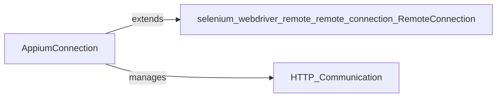

## Details

The `AppiumConnection` subsystem serves as the foundational communication layer for the Appium Python client, enabling robust interaction with the Appium server. It builds upon Selenium's `RemoteConnection` to provide specialized HTTP communication, handling Appium-specific requirements such as user-agent identification and the intricate management of HTTP headers. This central component is solely responsible for establishing and maintaining the connection, dispatching commands, and processing server responses. Its internal logic ensures strict adherence to the Appium protocol, particularly concerning the dynamic inclusion and modification of session and command-specific headers, making it the critical interface for all server-side operations.

### AppiumConnection
This is the central component responsible for establishing, maintaining, and managing the underlying HTTP communication channel with the Appium server. It extends `selenium.webdriver.remote.remote_connection.RemoteConnection` to inherit fundamental remote communication capabilities, then customizes and enhances them for Appium's specific requirements. This includes handling Appium-specific user-agent identification and internally managing HTTP headers for all requests. This internal header management logic constructs, modifies, and provides necessary Appium-specific headers (e.g., `X-Idempotency-Key` for session creation), dynamically adding and removing them as needed to ensure protocol compliance. It serves as the primary interface for sending commands and receiving responses over HTTP.

**Related Classes/Methods**:

- <a href="https://github.com/appium/python-client/blob/master/appium/webdriver/appium_connection.py#L38-L65" target="_blank" rel="noopener noreferrer">`AppiumConnection`:38-65</a>
- <a href="https://github.com/appium/python-client/blob/master/appium/webdriver/appium_connection.py" target="_blank" rel="noopener noreferrer">`AppiumConnection:get_remote_connection_headers`</a>
- <a href="https://github.com/appium/python-client/blob/master/appium/webdriver/appium_connection.py" target="_blank" rel="noopener noreferrer">`AppiumConnection:_get_new_headers`</a>

### [FAQ](https://github.com/CodeBoarding/GeneratedOnBoardings/tree/main?tab=readme-ov-file#faq)