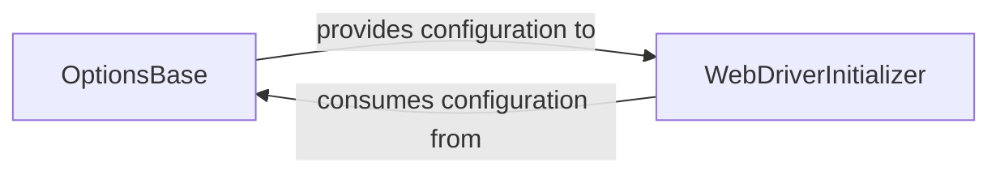

## Details

The Appium Python client's core initialization process is orchestrated by two primary components: `OptionsBase` and `WebDriverInitializer`. `OptionsBase` acts as the "Configuration Adapter," responsible for defining, validating, and transforming Appium-specific capabilities into the standardized W3C WebDriver protocol. This ensures that all client-defined options are correctly formatted for the Appium server. Subsequently, `WebDriverInitializer` functions as the "Client Connector," taking these W3C-formatted capabilities to establish and configure the remote connection with the Appium server. It also integrates Appium-specific commands into the WebDriver instance, making them accessible for client-side interactions. This clear separation of concerns ensures robust configuration management and seamless client-server communication, forming the foundation for all Appium test automation.

### OptionsBase
This component acts as the "Configuration Adapter." It is responsible for defining, loading, validating, and crucially, transforming Appium-specific capabilities and options into the standardized W3C WebDriver protocol format. It encapsulates the logic for managing the lifecycle of these options, ensuring they conform to the required structure before being sent to the Appium server.

**Related Classes/Methods**:

- <a href="https://github.com/appium/python-client/blob/master/appium/options/common/base.py" target="_blank" rel="noopener noreferrer">`OptionsBase`</a>
- <a href="https://github.com/appium/python-client/blob/master/appium/options/common/base.py" target="_blank" rel="noopener noreferrer">`OptionsBase:__init__`</a>
- <a href="https://github.com/appium/python-client/blob/master/appium/options/common/base.py" target="_blank" rel="noopener noreferrer">`OptionsBase:default_capabilities`</a>
- <a href="https://github.com/appium/python-client/blob/master/appium/options/common/base.py" target="_blank" rel="noopener noreferrer">`OptionsBase:load_capabilities`</a>
- <a href="https://github.com/appium/python-client/blob/master/appium/options/common/base.py" target="_blank" rel="noopener noreferrer">`OptionsBase:set_capability`</a>
- <a href="https://github.com/appium/python-client/blob/master/appium/options/common/base.py" target="_blank" rel="noopener noreferrer">`OptionsBase:as_w3c`</a>
- <a href="https://github.com/appium/python-client/blob/master/appium/options/common/base.py" target="_blank" rel="noopener noreferrer">`OptionsBase:process_key`</a>
- <a href="https://github.com/appium/python-client/blob/master/appium/options/common/base.py" target="_blank" rel="noopener noreferrer">`OptionsBase:to_w3c`</a>
- <a href="https://github.com/appium/python-client/blob/master/appium/options/common/base.py" target="_blank" rel="noopener noreferrer">`OptionsBase:to_capabilities`</a>

### WebDriverInitializer
This component functions as the "Client Connector." It consumes the W3C-formatted capabilities provided by OptionsBase to establish and configure the remote connection with the Appium server. It is also responsible for setting up the WebDriver's internal command execution environment and integrating Appium-specific commands into the WebDriver instance, making them available for client-side interaction.

**Related Classes/Methods**:

- <a href="https://github.com/appium/python-client/blob/master/appium/options/windows/windows/expreimental_web_driver_option.py#L33-L39" target="_blank" rel="noopener noreferrer">`WebDriver`:33-39</a>
- <a href="https://github.com/appium/python-client/blob/master/appium/webdriver/webdriver.py" target="_blank" rel="noopener noreferrer">`WebDriver:__init__`</a>
- <a href="https://github.com/appium/python-client/blob/master/appium/webdriver/webdriver.py" target="_blank" rel="noopener noreferrer">`WebDriver:_get_remote_connection_and_client_config`</a>
- <a href="https://github.com/appium/python-client/blob/master/appium/webdriver/webdriver.py" target="_blank" rel="noopener noreferrer">`WebDriver:_add_commands`</a>
- <a href="https://github.com/appium/python-client/blob/master/appium/webdriver/webdriver.py" target="_blank" rel="noopener noreferrer">`WebDriver:_update_command_executor`</a>
- <a href="https://github.com/appium/python-client/blob/master/appium/webdriver/webdriver.py" target="_blank" rel="noopener noreferrer">`WebDriver:add_command`</a>

### [FAQ](https://github.com/CodeBoarding/GeneratedOnBoardings/tree/main?tab=readme-ov-file#faq)