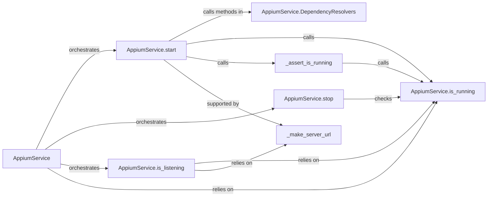

## Details

The Local Server Manager subsystem is primarily defined by the appium.webdriver.appium_service module, specifically the AppiumService class. Its core responsibility is to manage the lifecycle of a local Appium server instance.

### AppiumService
The central orchestrator and public interface for managing the lifecycle of a local Appium server instance. It encapsulates the logic for starting, stopping, and verifying the server's operational status.

**Related Classes/Methods**:

- <a href="https://github.com/appium/python-client/blob/master/appium/webdriver/appium_service.py#L42-L194" target="_blank" rel="noopener noreferrer">`appium.webdriver.appium_service.AppiumService`:42-194</a>

### AppiumService.start
Initiates the Appium server process. This involves locating necessary executables (Node.js, npm, Appium main script) and launching the server as a subprocess.

**Related Classes/Methods**:

- <a href="https://github.com/appium/python-client/blob/master/appium/webdriver/appium_service.py" target="_blank" rel="noopener noreferrer">`appium.webdriver.appium_service.AppiumService:start`</a>

### AppiumService.stop
Terminates the running Appium server process, ensuring a clean shutdown of the local instance.

**Related Classes/Methods**:

- <a href="https://github.com/appium/python-client/blob/master/appium/webdriver/appium_service.py" target="_blank" rel="noopener noreferrer">`appium.webdriver.appium_service.AppiumService:stop`</a>

### AppiumService.is_listening
Verifies if the Appium server is not only running but also actively listening for connections on its configured URL, indicating it's ready to accept commands.

**Related Classes/Methods**:

- <a href="https://github.com/appium/python-client/blob/master/appium/webdriver/appium_service.py" target="_blank" rel="noopener noreferrer">`appium.webdriver.appium_service.AppiumService:is_listening`</a>

### AppiumService.is_running
An internal utility method that checks the current operational status of the Appium server process, typically by inspecting the process ID.

**Related Classes/Methods**:

- <a href="https://github.com/appium/python-client/blob/master/appium/webdriver/appium_service.py" target="_blank" rel="noopener noreferrer">`appium.webdriver.appium_service.AppiumService:is_running`</a>

### AppiumService.DependencyResolvers
A conceptual grouping of helper methods (get_node, get_npm, get_main_script) responsible for locating the necessary Node.js runtime, npm package manager, and the main Appium script on the system. These are crucial for the server's successful startup.

**Related Classes/Methods**:

- <a href="https://github.com/appium/python-client/blob/master/appium/webdriver/appium_service.py" target="_blank" rel="noopener noreferrer">`appium.webdriver.appium_service.AppiumService:get_node`</a>
- <a href="https://github.com/appium/python-client/blob/master/appium/webdriver/appium_service.py" target="_blank" rel="noopener noreferrer">`appium.webdriver.appium_service.AppiumService:get_npm`</a>
- <a href="https://github.com/appium/python-client/blob/master/appium/webdriver/appium_service.py" target="_blank" rel="noopener noreferrer">`appium.webdriver.appium_service.AppiumService:get_main_script`</a>

### _assert_is_running
A helper that wraps is_running to enforce preconditions or postconditions for server operations.

**Related Classes/Methods**:

- <a href="https://github.com/appium/python-client/blob/master/appium/webdriver/appium_service.py#L192-L194" target="_blank" rel="noopener noreferrer">`appium.webdriver.appium_service._assert_is_running`:192-194</a>

### _make_server_url
An internal utility that supports both AppiumService.start (for constructing the server URL) and AppiumService.is_listening (for checking the server's network availability).

**Related Classes/Methods**:

- <a href="https://github.com/appium/python-client/blob/master/appium/webdriver/appium_service.py#L316-L317" target="_blank" rel="noopener noreferrer">`appium.webdriver.appium_service._make_server_url`:316-317</a>

### [FAQ](https://github.com/CodeBoarding/GeneratedOnBoardings/tree/main?tab=readme-ov-file#faq)