```mermaid
graph LR
    User_Test_Script["User/Test Script"]
    Appium_Python_Client_Core["Appium Python Client Core"]
    Configuration_Manager["Configuration Manager"]
    Communication_Layer["Communication Layer"]
    Local_Server_Manager["Local Server Manager"]
    External_Appium_Server["External Appium Server"]
    User_Test_Script -- "initiates commands to" --> Appium_Python_Client_Core
    User_Test_Script -- "provides configuration to" --> Configuration_Manager
    User_Test_Script -- "manages lifecycle of" --> Local_Server_Manager
    Configuration_Manager -- "supplies capabilities to" --> Appium_Python_Client_Core
    Appium_Python_Client_Core -- "delegates commands to" --> Communication_Layer
    Communication_Layer -- "sends commands to" --> External_Appium_Server
    External_Appium_Server -- "returns responses to" --> Communication_Layer
    Communication_Layer -- "forwards responses to" --> Appium_Python_Client_Core
    Local_Server_Manager -- "controls" --> External_Appium_Server
    click Appium_Python_Client_Core href "https://github.com/CodeBoarding/GeneratedOnBoardings/blob/main/python-client/Appium_Python_Client_Core.md" "Details"
    click Configuration_Manager href "https://github.com/CodeBoarding/GeneratedOnBoardings/blob/main/python-client/Configuration_Manager.md" "Details"
    click Communication_Layer href "https://github.com/CodeBoarding/GeneratedOnBoardings/blob/main/python-client/Communication_Layer.md" "Details"
    click Local_Server_Manager href "https://github.com/CodeBoarding/GeneratedOnBoardings/blob/main/python-client/Local_Server_Manager.md" "Details"
```

## Details

The Appium Python Client acts as a robust intermediary between user-defined test scripts and the Appium automation server. The User/Test Script initiates automation commands, which are processed by the Appium Python Client Core. This core component, built upon the WebDriver standard, orchestrates the session and integrates various Appium-specific extensions. Before commands are sent, the Configuration Manager ensures that desired capabilities and options are correctly formatted for the Appium server. All communication with the External Appium Server is handled by the Communication Layer, which manages HTTP requests and responses. For local testing environments, the Local Server Manager provides lifecycle control over a local Appium server instance. This architecture ensures a clear separation of concerns, facilitating efficient command execution, session management, and reliable interaction with the Appium automation backend.

### User/Test Script
Represents the external entity (human user or automated test framework) that drives the automation process by interacting with the Appium Python Client.

**Related Classes/Methods**:

- <a href="https://github.com/appium/python-client/blob/master/appium/options/windows/windows/expreimental_web_driver_option.py#L33-L39" target="_blank" rel="noopener noreferrer">`webdriver`:33-39</a>

### Appium Python Client Core [[Expand]](./Appium_Python_Client_Core.md)
The primary interface for test scripts, extending Selenium's WebDriver. It orchestrates command execution, manages the session, and integrates Appium-specific extensions (e.g., clipboard, context, Flutter automation).

**Related Classes/Methods**:

- <a href="https://github.com/appium/python-client/blob/master/appium/options/windows/windows/expreimental_web_driver_option.py#L33-L39" target="_blank" rel="noopener noreferrer">`webdriver`:33-39</a>
- <a href="https://github.com/appium/python-client/blob/master/appium/webdriver/mobilecommand.py" target="_blank" rel="noopener noreferrer">`clipboard`</a>
- <a href="https://github.com/appium/python-client/blob/master/appium/webdriver/switch_to.py#L24-L35" target="_blank" rel="noopener noreferrer">`context`:24-35</a>
- <a href="https://github.com/appium/python-client/blob/master/appium/webdriver/extensions/device_time.py#L27-L39" target="_blank" rel="noopener noreferrer">`device_time`:27-39</a>
- <a href="https://github.com/appium/python-client/blob/master/appium/webdriver/mobilecommand.py" target="_blank" rel="noopener noreferrer">`keyboard`</a>
- <a href="https://github.com/appium/python-client/blob/master/appium/webdriver/extensions/android/network.py#L44-L175" target="_blank" rel="noopener noreferrer">`network`:44-175</a>
- <a href="https://github.com/appium/python-client/blob/master/appium/webdriver/extensions/flutter_integration/flutter_finder.py#L1-L99999" target="_blank" rel="noopener noreferrer">`flutter_finder`:1-99999</a>
- <a href="https://github.com/appium/python-client/blob/master/appium/webdriver/extensions/flutter_integration/flutter_commands.py#L1-L99999" target="_blank" rel="noopener noreferrer">`flutter_commands`:1-99999</a>

### Configuration Manager [[Expand]](./Configuration_Manager.md)
Responsible for defining, validating, and transforming desired capabilities and Appium-specific options into the W3C WebDriver protocol format required by the Appium server.

**Related Classes/Methods**:

- <a href="https://github.com/appium/python-client/blob/master/appium/webdriver/webdriver.py#L66-L186" target="_blank" rel="noopener noreferrer">`base`:66-186</a>

### Communication Layer [[Expand]](./Communication_Layer.md)
Handles the underlying HTTP communication with the Appium server, including constructing requests, managing headers, sending commands, and parsing server responses.

**Related Classes/Methods**:

- <a href="https://github.com/appium/python-client/blob/master/appium/webdriver/appium_connection.py#L1-L99999" target="_blank" rel="noopener noreferrer">`appium_connection`:1-99999</a>

### Local Server Manager [[Expand]](./Local_Server_Manager.md)
Manages the lifecycle of a local Appium server instance, including starting, stopping, and verifying its operational status, primarily for local test execution environments.

**Related Classes/Methods**:

- <a href="https://github.com/appium/python-client/blob/master/appium/webdriver/appium_service.py#L1-L99999" target="_blank" rel="noopener noreferrer">`appium_service`:1-99999</a>

### External Appium Server
The remote Appium server (or locally managed instance) that the client library interacts with to perform automation tasks on mobile devices. This is the target endpoint for all client commands.

**Related Classes/Methods**:

- <a href="https://github.com/appium/python-client/blob/master/appium/webdriver/appium_connection.py#L1-L99999" target="_blank" rel="noopener noreferrer">`appium_connection`:1-99999</a>

### [FAQ](https://github.com/CodeBoarding/GeneratedOnBoardings/tree/main?tab=readme-ov-file#faq)