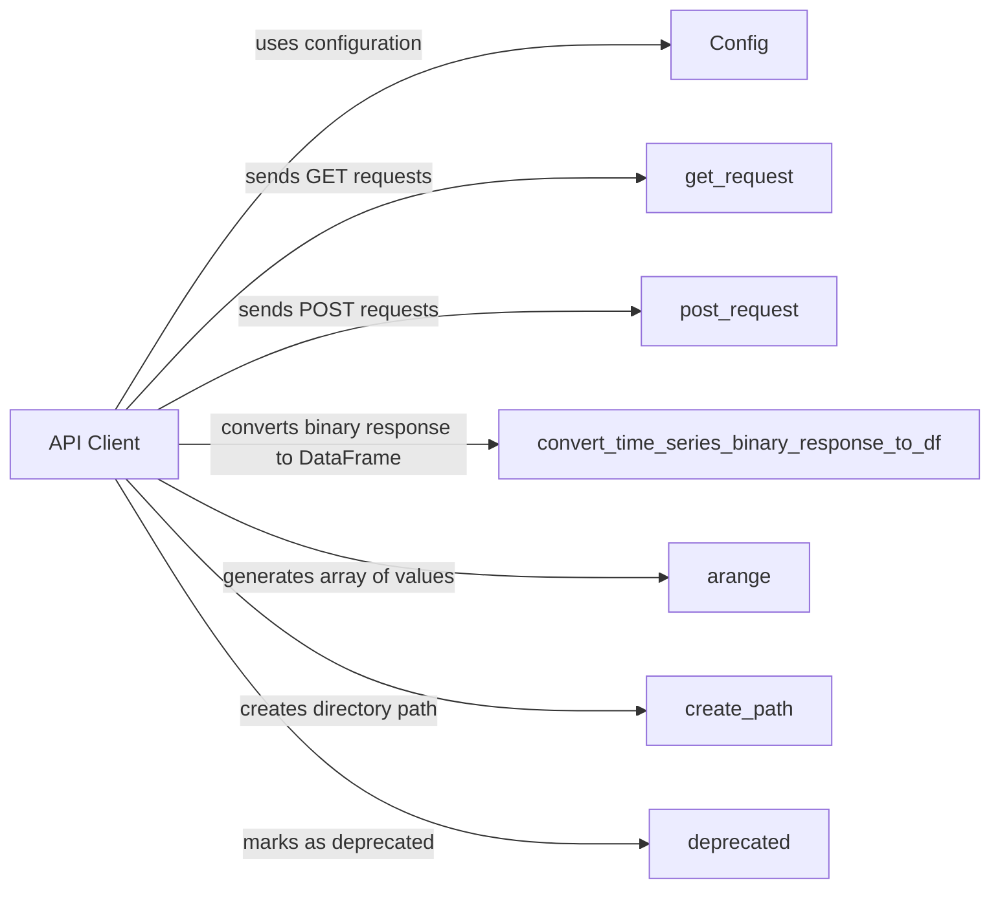

## Component Details

The Meteomatics API Client facilitates communication with the Meteomatics weather data service. It encapsulates the complexities of constructing and sending API requests, handling authentication, managing SSL and proxy configurations, and parsing responses. The client provides a set of functions to query various types of data, including time series, grid data, and station information, abstracting away the underlying HTTP requests and data formatting.

### API Client
The API Client component is responsible for handling the communication with the Meteomatics API. It manages authentication, constructs API requests, handles SSL and proxy configurations, and manages user features and limits. It serves as the central point for all API interactions, ensuring secure and efficient data retrieval.

**Related Classes/Methods**:

- <a href="https://github.com/meteomatics/python-connector-api/blob/master/meteomatics/api.py#L104-L121" target="_blank" rel="noopener noreferrer">`meteomatics.api:query_api` (104:121)</a>
- <a href="https://github.com/meteomatics/python-connector-api/blob/master/meteomatics/api.py#L125-L131" target="_blank" rel="noopener noreferrer">`meteomatics.api:query_user_features` (125:131)</a>
- <a href="https://github.com/meteomatics/python-connector-api/blob/master/meteomatics/api.py#L134-L143" target="_blank" rel="noopener noreferrer">`meteomatics.api:query_user_limits` (134:143)</a>
- <a href="https://github.com/meteomatics/python-connector-api/blob/master/meteomatics/api.py#L61-L71" target="_blank" rel="noopener noreferrer">`meteomatics.api:handle_ssl` (61:71)</a>
- <a href="https://github.com/meteomatics/python-connector-api/blob/master/meteomatics/api.py#L74-L82" target="_blank" rel="noopener noreferrer">`meteomatics.api:handle_proxy` (74:82)</a>

### Config
The Config component manages the configuration settings required to connect to the Meteomatics API, such as proxy settings and SSL configuration. It provides a centralized way to access and manage these settings, ensuring that the API client can connect to the API securely and efficiently.

**Related Classes/Methods**:

- <a href="https://github.com/meteomatics/python-connector-api/blob/master/meteomatics/api.py#L51-L52" target="_blank" rel="noopener noreferrer">`meteomatics.api.Config.get` (51:52)</a>

### get_request
The get_request component is responsible for sending GET requests to the Meteomatics API. It encapsulates the logic for constructing and sending HTTP GET requests, handling any necessary authentication or authorization, and processing the response from the API.

**Related Classes/Methods**:

- <a href="https://github.com/meteomatics/python-connector-api/blob/master/meteomatics/api.py#L87-L88" target="_blank" rel="noopener noreferrer">`meteomatics.api.get_request` (87:88)</a>

### post_request
The post_request component is responsible for sending POST requests to the Meteomatics API. It encapsulates the logic for constructing and sending HTTP POST requests, handling any necessary authentication or authorization, and processing the response from the API.

**Related Classes/Methods**:

- <a href="https://github.com/meteomatics/python-connector-api/blob/master/meteomatics/api.py#L93-L94" target="_blank" rel="noopener noreferrer">`meteomatics.api.post_request` (93:94)</a>

### convert_time_series_binary_response_to_df
This component converts the binary response from the Meteomatics API for time series data into a Pandas DataFrame. It handles the parsing of the binary data and transforms it into a structured format that can be easily analyzed and manipulated.

**Related Classes/Methods**:

- <a href="https://github.com/meteomatics/python-connector-api/blob/master/meteomatics/api.py#L146-L152" target="_blank" rel="noopener noreferrer">`meteomatics.api.convert_time_series_binary_response_to_df` (146:152)</a>

### arange
This component generates an array of evenly spaced values within a given interval, likely used for time series or grid data manipulation. It provides a convenient way to create sequences of numbers for use in data processing and analysis.

**Related Classes/Methods**:

- <a href="https://github.com/meteomatics/python-connector-api/blob/master/meteomatics/api.py#L666-L673" target="_blank" rel="noopener noreferrer">`meteomatics.api.arange` (666:673)</a>

### create_path
This component creates a directory path, likely used for storing downloaded NetCDF files. It ensures that the necessary directories exist before attempting to save files, preventing errors and simplifying file management.

**Related Classes/Methods**:

- <a href="https://github.com/meteomatics/python-connector-api/blob/master/meteomatics/api.py#L97-L101" target="_blank" rel="noopener noreferrer">`meteomatics.api.create_path` (97:101)</a>

### deprecated
This component marks a function or class as deprecated, indicating that it should no longer be used and may be removed in a future version. It provides a way to communicate to developers that a particular feature is no longer supported and should be replaced with an alternative.

**Related Classes/Methods**:

- <a href="https://github.com/meteomatics/python-connector-api/blob/master/meteomatics/deprecated.py#L4-L17" target="_blank" rel="noopener noreferrer">`meteomatics.deprecated.deprecated` (4:17)</a>