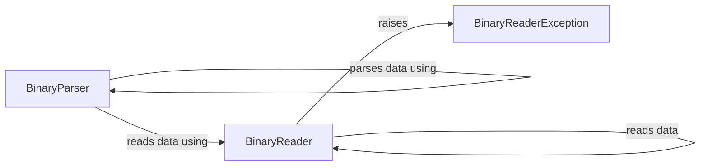

## Component Details

The Binary Data Parser component is responsible for parsing binary data responses received from the Meteomatics API. It includes classes and methods for parsing different data structures (station, postal, latlon) and reading data from the binary stream. It converts the raw binary data into a usable format for further processing, enabling efficient extraction of information from binary responses.

### BinaryParser
The BinaryParser class is responsible for parsing binary data into a more usable format. It contains methods for parsing different types of data, such as station, postal, and lat/lon data. It uses helper methods to parse the data based on the type. The `parse` method serves as the entry point, delegating the parsing to specific methods based on the data structure.

**Related Classes/Methods**:

- <a href="https://github.com/meteomatics/python-connector-api/blob/master/meteomatics/binary_parser.py#L14-L21" target="_blank" rel="noopener noreferrer">`meteomatics.binary_parser.BinaryParser:parse` (14:21)</a>
- <a href="https://github.com/meteomatics/python-connector-api/blob/master/meteomatics/binary_parser.py#L23-L25" target="_blank" rel="noopener noreferrer">`meteomatics.binary_parser.BinaryParser:_parse_station` (23:25)</a>
- <a href="https://github.com/meteomatics/python-connector-api/blob/master/meteomatics/binary_parser.py#L27-L29" target="_blank" rel="noopener noreferrer">`meteomatics.binary_parser.BinaryParser:_parse_postal` (27:29)</a>
- <a href="https://github.com/meteomatics/python-connector-api/blob/master/meteomatics/binary_parser.py#L31-L34" target="_blank" rel="noopener noreferrer">`meteomatics.binary_parser.BinaryParser:_parse_latlon` (31:34)</a>
- <a href="https://github.com/meteomatics/python-connector-api/blob/master/meteomatics/binary_parser.py#L37-L75" target="_blank" rel="noopener noreferrer">`meteomatics.binary_parser.BinaryParser._parse_internal` (37:75)</a>

### BinaryReader
The BinaryReader class is responsible for reading binary data from a source. It provides methods for reading different data types, such as integers, doubles, characters, floats, strings and unsigned longs. It also handles potential exceptions during the reading process. The `_read_data` method is the core method for reading raw bytes, while other `get` methods provide convenient wrappers for reading specific data types.

**Related Classes/Methods**:

- <a href="https://github.com/meteomatics/python-connector-api/blob/master/meteomatics/binary_reader.py#L50-L60" target="_blank" rel="noopener noreferrer">`meteomatics.binary_reader.BinaryReader:get` (50:60)</a>
- <a href="https://github.com/meteomatics/python-connector-api/blob/master/meteomatics/binary_reader.py#L62-L63" target="_blank" rel="noopener noreferrer">`meteomatics.binary_reader.BinaryReader:get_int` (62:63)</a>
- <a href="https://github.com/meteomatics/python-connector-api/blob/master/meteomatics/binary_reader.py#L65-L66" target="_blank" rel="noopener noreferrer">`meteomatics.binary_reader.BinaryReader:get_double` (65:66)</a>
- <a href="https://github.com/meteomatics/python-connector-api/blob/master/meteomatics/binary_reader.py#L68-L69" target="_blank" rel="noopener noreferrer">`meteomatics.binary_reader.BinaryReader:get_char` (68:69)</a>
- <a href="https://github.com/meteomatics/python-connector-api/blob/master/meteomatics/binary_reader.py#L71-L72" target="_blank" rel="noopener noreferrer">`meteomatics.binary_reader.BinaryReader:get_float` (71:72)</a>
- <a href="https://github.com/meteomatics/python-connector-api/blob/master/meteomatics/binary_reader.py#L74-L75" target="_blank" rel="noopener noreferrer">`meteomatics.binary_reader.BinaryReader:get_unsigned_long` (74:75)</a>
- <a href="https://github.com/meteomatics/python-connector-api/blob/master/meteomatics/binary_reader.py#L77-L83" target="_blank" rel="noopener noreferrer">`meteomatics.binary_reader.BinaryReader:get_string` (77:83)</a>
- <a href="https://github.com/meteomatics/python-connector-api/blob/master/meteomatics/binary_reader.py#L30-L48" target="_blank" rel="noopener noreferrer">`meteomatics.binary_reader.BinaryReader:_read_data` (30:48)</a>

### BinaryReaderException
Exception raised by the BinaryReader when an error occurs during reading binary data. It signals that something went wrong during the binary data reading process.

**Related Classes/Methods**:

- <a href="https://github.com/meteomatics/python-connector-api/blob/master/meteomatics/binary_reader.py#L6-L8" target="_blank" rel="noopener noreferrer">`meteomatics.binary_reader.BinaryReaderException` (6:8)</a>