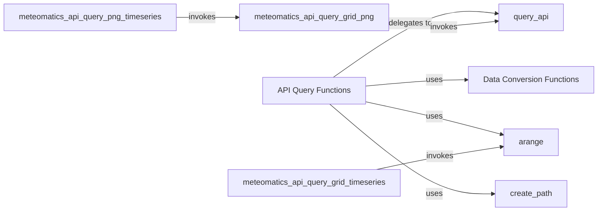

## Component Details

The Data Retrieval Services component provides a set of functions for querying various types of weather data from the Meteomatics API. It abstracts the complexity of constructing and executing API requests, handling authentication, and converting the raw API responses into usable data structures like pandas DataFrames. This component serves as a central point for accessing weather information, offering specialized functions for different data types such as time series, grid data, and station lists.

### API Query Functions
This component encompasses the various functions in the `meteomatics.api` module responsible for constructing and executing API queries to the Meteomatics weather data service. It includes functions for querying different types of data, such as station data, time series, grid data, and more. These functions abstract the underlying API calls and provide a higher-level interface for users to retrieve specific weather information.

**Related Classes/Methods**:

- <a href="https://github.com/meteomatics/python-connector-api/blob/master/meteomatics/api.py#L161-L184" target="_blank" rel="noopener noreferrer">`meteomatics.api:query_station_list` (161:184)</a>
- <a href="https://github.com/meteomatics/python-connector-api/blob/master/meteomatics/api.py#L187-L223" target="_blank" rel="noopener noreferrer">`meteomatics.api:query_station_timeseries` (187:223)</a>
- <a href="https://github.com/meteomatics/python-connector-api/blob/master/meteomatics/api.py#L226-L262" target="_blank" rel="noopener noreferrer">`meteomatics.api:query_special_locations_timeseries` (226:262)</a>
- <a href="https://github.com/meteomatics/python-connector-api/blob/master/meteomatics/api.py#L265-L304" target="_blank" rel="noopener noreferrer">`meteomatics.api:query_time_series` (265:304)</a>
- <a href="https://github.com/meteomatics/python-connector-api/blob/master/meteomatics/api.py#L307-L331" target="_blank" rel="noopener noreferrer">`meteomatics.api:query_grid` (307:331)</a>
- <a href="https://github.com/meteomatics/python-connector-api/blob/master/meteomatics/api.py#L334-L368" target="_blank" rel="noopener noreferrer">`meteomatics.api:query_grid_unpivoted` (334:368)</a>
- <a href="https://github.com/meteomatics/python-connector-api/blob/master/meteomatics/api.py#L371-L414" target="_blank" rel="noopener noreferrer">`meteomatics.api:query_grid_timeseries` (371:414)</a>
- <a href="https://github.com/meteomatics/python-connector-api/blob/master/meteomatics/api.py#L417-L456" target="_blank" rel="noopener noreferrer">`meteomatics.api:query_polygon` (417:456)</a>
- <a href="https://github.com/meteomatics/python-connector-api/blob/master/meteomatics/api.py#L459-L484" target="_blank" rel="noopener noreferrer">`meteomatics.api:query_lightnings` (459:484)</a>
- <a href="https://github.com/meteomatics/python-connector-api/blob/master/meteomatics/api.py#L487-L528" target="_blank" rel="noopener noreferrer">`meteomatics.api:query_netcdf` (487:528)</a>
- <a href="https://github.com/meteomatics/python-connector-api/blob/master/meteomatics/api.py#L531-L562" target="_blank" rel="noopener noreferrer">`meteomatics.api:query_init_date` (531:562)</a>
- <a href="https://github.com/meteomatics/python-connector-api/blob/master/meteomatics/api.py#L565-L585" target="_blank" rel="noopener noreferrer">`meteomatics.api:query_available_time_ranges` (565:585)</a>
- <a href="https://github.com/meteomatics/python-connector-api/blob/master/meteomatics/api.py#L588-L634" target="_blank" rel="noopener noreferrer">`meteomatics.api:query_grid_png` (588:634)</a>
- <a href="https://github.com/meteomatics/python-connector-api/blob/master/meteomatics/api.py#L637-L663" target="_blank" rel="noopener noreferrer">`meteomatics.api:query_png_timeseries` (637:663)</a>

### query_api
This function in `meteomatics.api` is the central point for making requests to the Meteomatics API. It likely handles the construction of the API request URL, manages authentication, sends the request, and handles potential errors. All the specific query functions delegate to this function to perform the actual API interaction.

**Related Classes/Methods**:

- <a href="https://github.com/meteomatics/python-connector-api/blob/master/meteomatics/api.py#L104-L121" target="_blank" rel="noopener noreferrer">`meteomatics.api:query_api` (104:121)</a>

### Data Conversion Functions
This component includes functions responsible for converting the raw data received from the Meteomatics API into more usable formats, such as pandas DataFrames. This conversion is essential for enabling users to easily analyze and visualize the retrieved weather data.

**Related Classes/Methods**:

- <a href="https://github.com/meteomatics/python-connector-api/blob/master/meteomatics/api.py#L146-L152" target="_blank" rel="noopener noreferrer">`meteomatics.api:convert_time_series_binary_response_to_df` (146:152)</a>

### arange
This function in `meteomatics.api` is used to generate a sequence of numbers, similar to NumPy's `arange` function. It's likely used for creating time ranges or coordinate ranges for grid data queries.

**Related Classes/Methods**:

- <a href="https://github.com/meteomatics/python-connector-api/blob/master/meteomatics/api.py#L666-L673" target="_blank" rel="noopener noreferrer">`meteomatics.api:arange` (666:673)</a>

### create_path
This function in `meteomatics.api` is responsible for creating file paths, likely used when querying data in NetCDF format where the data needs to be saved to a file.

**Related Classes/Methods**:

- <a href="https://github.com/meteomatics/python-connector-api/blob/master/meteomatics/api.py#L97-L101" target="_blank" rel="noopener noreferrer">`meteomatics.api:create_path` (97:101)</a>