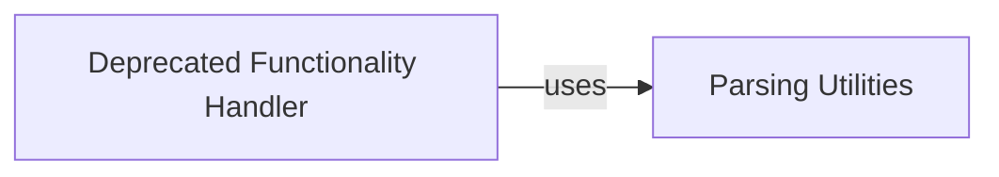

## Component Details

The Meteomatics API connector's parsing utilities provide a suite of functions designed to sanitize, validate, and structure input parameters for API requests. These utilities handle tasks such as extracting user statistics, parsing date and numerical values, and processing query parameters for both station and time series data. By ensuring data integrity and proper formatting, these utilities facilitate the construction of accurate and reliable API calls, contributing to the overall robustness and usability of the connector.

### Parsing Utilities
This component offers a collection of utility functions for parsing and processing data, including extracting user statistics, parsing date/time values, and parsing query parameters. These utilities facilitate data manipulation and preparation for further analysis or use, providing reusable functions for common parsing tasks.

**Related Classes/Methods**:

- <a href="https://github.com/meteomatics/python-connector-api/blob/master/meteomatics/parsing_util.py#L216-L224" target="_blank" rel="noopener noreferrer">`meteomatics.parsing_util:extract_user_statistics` (216:224)</a>
- <a href="https://github.com/meteomatics/python-connector-api/blob/master/meteomatics/parsing_util.py#L276-L278" target="_blank" rel="noopener noreferrer">`meteomatics.parsing_util:parse_date_num` (276:278)</a>
- <a href="https://github.com/meteomatics/python-connector-api/blob/master/meteomatics/parsing_util.py#L281-L301" target="_blank" rel="noopener noreferrer">`meteomatics.parsing_util:parse_query_station_params` (281:301)</a>
- <a href="https://github.com/meteomatics/python-connector-api/blob/master/meteomatics/parsing_util.py#L304-L313" target="_blank" rel="noopener noreferrer">`meteomatics.parsing_util:parse_query_station_timeseries_params` (304:313)</a>
- <a href="https://github.com/meteomatics/python-connector-api/blob/master/meteomatics/parsing_util.py#L316-L330" target="_blank" rel="noopener noreferrer">`meteomatics.parsing_util:parse_time_series_params` (316:330)</a>
- <a href="https://github.com/meteomatics/python-connector-api/blob/master/meteomatics/parsing_util.py#L356-L390" target="_blank" rel="noopener noreferrer">`meteomatics.parsing_util:set_index_for_ts` (356:390)</a>
- <a href="https://github.com/meteomatics/python-connector-api/blob/master/meteomatics/parsing_util.py#L244-L245" target="_blank" rel="noopener noreferrer">`meteomatics.parsing_util.filter_none_from_dict` (244:245)</a>
- <a href="https://github.com/meteomatics/python-connector-api/blob/master/meteomatics/parsing_util.py#L201-L209" target="_blank" rel="noopener noreferrer">`meteomatics.parsing_util.datenum_to_date` (201:209)</a>
- <a href="https://github.com/meteomatics/python-connector-api/blob/master/meteomatics/parsing_util.py#L16-L17" target="_blank" rel="noopener noreferrer">`meteomatics.parsing_util.all_entries_postal` (16:17)</a>

### Deprecated Functionality Handler
This component manages deprecated functionalities within the Meteomatics API connector. It provides a mechanism to handle older, non-recommended features, potentially offering a transition period for users before their eventual removal. It uses parsing utilities.

**Related Classes/Methods**:

- <a href="https://github.com/meteomatics/python-connector-api/blob/master/meteomatics/deprecated.py#L4-L17" target="_blank" rel="noopener noreferrer">`meteomatics.deprecated.deprecated` (4:17)</a>