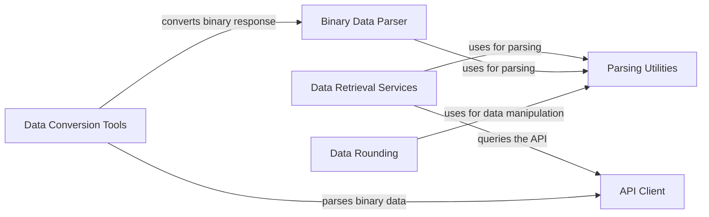

## Component Details

The python-connector-api provides a Python interface for interacting with the Meteomatics weather API. It handles API request construction, data retrieval, binary data parsing, and data conversion into usable formats like Pandas DataFrames. The core functionality revolves around querying the API for various weather data types, parsing the responses, and transforming the data for analysis.

### API Client
The API Client component is responsible for handling the communication with the Meteomatics API. It manages authentication, constructs API requests, handles SSL and proxy configurations, and manages user features and limits. It serves as the central point for all API interactions, ensuring secure and efficient data retrieval.

**Related Classes/Methods**:

- <a href="https://github.com/meteomatics/python-connector-api/blob/master/meteomatics/api.py#L104-L121" target="_blank" rel="noopener noreferrer">`meteomatics.api:query_api` (104:121)</a>
- <a href="https://github.com/meteomatics/python-connector-api/blob/master/meteomatics/api.py#L125-L131" target="_blank" rel="noopener noreferrer">`meteomatics.api:query_user_features` (125:131)</a>
- <a href="https://github.com/meteomatics/python-connector-api/blob/master/meteomatics/api.py#L134-L143" target="_blank" rel="noopener noreferrer">`meteomatics.api:query_user_limits` (134:143)</a>
- <a href="https://github.com/meteomatics/python-connector-api/blob/master/meteomatics/api.py#L61-L71" target="_blank" rel="noopener noreferrer">`meteomatics.api:handle_ssl` (61:71)</a>
- <a href="https://github.com/meteomatics/python-connector-api/blob/master/meteomatics/api.py#L74-L82" target="_blank" rel="noopener noreferrer">`meteomatics.api:handle_proxy` (74:82)</a>

### Data Retrieval Services
The Data Retrieval Services component provides specialized functions for retrieving different types of weather data from the Meteomatics API. It leverages the API Client to execute requests for time series data, grid data, station lists, lightning data, and other data types. This component abstracts the complexity of querying different data types and provides a consistent interface for accessing weather information.

**Related Classes/Methods**:

- <a href="https://github.com/meteomatics/python-connector-api/blob/master/meteomatics/api.py#L161-L184" target="_blank" rel="noopener noreferrer">`meteomatics.api:query_station_list` (161:184)</a>
- <a href="https://github.com/meteomatics/python-connector-api/blob/master/meteomatics/api.py#L187-L223" target="_blank" rel="noopener noreferrer">`meteomatics.api:query_station_timeseries` (187:223)</a>
- <a href="https://github.com/meteomatics/python-connector-api/blob/master/meteomatics/api.py#L226-L262" target="_blank" rel="noopener noreferrer">`meteomatics.api:query_special_locations_timeseries` (226:262)</a>
- <a href="https://github.com/meteomatics/python-connector-api/blob/master/meteomatics/api.py#L265-L304" target="_blank" rel="noopener noreferrer">`meteomatics.api:query_time_series` (265:304)</a>
- <a href="https://github.com/meteomatics/python-connector-api/blob/master/meteomatics/api.py#L307-L331" target="_blank" rel="noopener noreferrer">`meteomatics.api:query_grid` (307:331)</a>
- <a href="https://github.com/meteomatics/python-connector-api/blob/master/meteomatics/api.py#L334-L368" target="_blank" rel="noopener noreferrer">`meteomatics.api:query_grid_unpivoted` (334:368)</a>
- <a href="https://github.com/meteomatics/python-connector-api/blob/master/meteomatics/api.py#L371-L414" target="_blank" rel="noopener noreferrer">`meteomatics.api:query_grid_timeseries` (371:414)</a>
- <a href="https://github.com/meteomatics/python-connector-api/blob/master/meteomatics/api.py#L417-L456" target="_blank" rel="noopener noreferrer">`meteomatics.api:query_polygon` (417:456)</a>
- <a href="https://github.com/meteomatics/python-connector-api/blob/master/meteomatics/api.py#L459-L484" target="_blank" rel="noopener noreferrer">`meteomatics.api:query_lightnings` (459:484)</a>
- <a href="https://github.com/meteomatics/python-connector-api/blob/master/meteomatics/api.py#L487-L528" target="_blank" rel="noopener noreferrer">`meteomatics.api:query_netcdf` (487:528)</a>
- <a href="https://github.com/meteomatics/python-connector-api/blob/master/meteomatics/api.py#L531-L562" target="_blank" rel="noopener noreferrer">`meteomatics.api:query_init_date` (531:562)</a>
- <a href="https://github.com/meteomatics/python-connector-api/blob/master/meteomatics/api.py#L565-L585" target="_blank" rel="noopener noreferrer">`meteomatics.api:query_available_time_ranges` (565:585)</a>
- <a href="https://github.com/meteomatics/python-connector-api/blob/master/meteomatics/api.py#L588-L634" target="_blank" rel="noopener noreferrer">`meteomatics.api:query_grid_png` (588:634)</a>
- <a href="https://github.com/meteomatics/python-connector-api/blob/master/meteomatics/api.py#L637-L663" target="_blank" rel="noopener noreferrer">`meteomatics.api:query_png_timeseries` (637:663)</a>

### Binary Data Parser
The Binary Data Parser component is responsible for parsing binary data responses received from the Meteomatics API. It includes classes and methods for parsing different data structures (station, postal, latlon) and reading data from the binary stream. It converts the raw binary data into a usable format for further processing, enabling efficient extraction of information from binary responses.

**Related Classes/Methods**:

- <a href="https://github.com/meteomatics/python-connector-api/blob/master/meteomatics/binary_parser.py#L14-L21" target="_blank" rel="noopener noreferrer">`meteomatics.binary_parser.BinaryParser:parse` (14:21)</a>
- <a href="https://github.com/meteomatics/python-connector-api/blob/master/meteomatics/binary_parser.py#L23-L25" target="_blank" rel="noopener noreferrer">`meteomatics.binary_parser.BinaryParser:_parse_station` (23:25)</a>
- <a href="https://github.com/meteomatics/python-connector-api/blob/master/meteomatics/binary_parser.py#L27-L29" target="_blank" rel="noopener noreferrer">`meteomatics.binary_parser.BinaryParser:_parse_postal` (27:29)</a>
- <a href="https://github.com/meteomatics/python-connector-api/blob/master/meteomatics/binary_parser.py#L31-L34" target="_blank" rel="noopener noreferrer">`meteomatics.binary_parser.BinaryParser:_parse_latlon` (31:34)</a>
- <a href="https://github.com/meteomatics/python-connector-api/blob/master/meteomatics/binary_reader.py#L50-L60" target="_blank" rel="noopener noreferrer">`meteomatics.binary_reader.BinaryReader:get` (50:60)</a>
- <a href="https://github.com/meteomatics/python-connector-api/blob/master/meteomatics/binary_reader.py#L62-L63" target="_blank" rel="noopener noreferrer">`meteomatics.binary_reader.BinaryReader:get_int` (62:63)</a>
- <a href="https://github.com/meteomatics/python-connector-api/blob/master/meteomatics/binary_reader.py#L65-L66" target="_blank" rel="noopener noreferrer">`meteomatics.binary_reader.BinaryReader:get_double` (65:66)</a>
- <a href="https://github.com/meteomatics/python-connector-api/blob/master/meteomatics/binary_reader.py#L68-L69" target="_blank" rel="noopener noreferrer">`meteomatics.binary_reader.BinaryReader:get_char` (68:69)</a>
- <a href="https://github.com/meteomatics/python-connector-api/blob/master/meteomatics/binary_reader.py#L71-L72" target="_blank" rel="noopener noreferrer">`meteomatics.binary_reader.BinaryReader:get_float` (71:72)</a>
- <a href="https://github.com/meteomatics/python-connector-api/blob/master/meteomatics/binary_reader.py#L74-L75" target="_blank" rel="noopener noreferrer">`meteomatics.binary_reader.BinaryReader:get_unsigned_long` (74:75)</a>
- <a href="https://github.com/meteomatics/python-connector-api/blob/master/meteomatics/binary_reader.py#L77-L83" target="_blank" rel="noopener noreferrer">`meteomatics.binary_reader.BinaryReader:get_string` (77:83)</a>
- <a href="https://github.com/meteomatics/python-connector-api/blob/master/meteomatics/binary_reader.py#L30-L48" target="_blank" rel="noopener noreferrer">`meteomatics.binary_reader.BinaryReader:_read_data` (30:48)</a>

### Data Conversion Tools
The Data Conversion Tools component provides tools for converting data from the Meteomatics API into more usable formats, primarily Pandas DataFrames. It includes functions for converting binary time series responses and lightning responses into DataFrames. This component bridges the gap between the raw API data and structured data analysis, facilitating easier manipulation and analysis of weather data.

**Related Classes/Methods**:

- <a href="https://github.com/meteomatics/python-connector-api/blob/master/meteomatics/api.py#L146-L152" target="_blank" rel="noopener noreferrer">`meteomatics.api:convert_time_series_binary_response_to_df` (146:152)</a>
- <a href="https://github.com/meteomatics/python-connector-api/blob/master/meteomatics/parsing_util.py#L152-L188" target="_blank" rel="noopener noreferrer">`meteomatics.parsing_util:convert_lightning_response_to_df` (152:188)</a>

### Parsing Utilities
The Parsing Utilities component offers a collection of utility functions for parsing and processing data, including extracting user statistics, parsing date/time values, and parsing query parameters. These utilities facilitate data manipulation and preparation for further analysis or use, providing reusable functions for common parsing tasks.

**Related Classes/Methods**:

- <a href="https://github.com/meteomatics/python-connector-api/blob/master/meteomatics/parsing_util.py#L216-L224" target="_blank" rel="noopener noreferrer">`meteomatics.parsing_util:extract_user_statistics` (216:224)</a>
- <a href="https://github.com/meteomatics/python-connector-api/blob/master/meteomatics/parsing_util.py#L276-L278" target="_blank" rel="noopener noreferrer">`meteomatics.parsing_util:parse_date_num` (276:278)</a>
- <a href="https://github.com/meteomatics/python-connector-api/blob/master/meteomatics/parsing_util.py#L281-L301" target="_blank" rel="noopener noreferrer">`meteomatics.parsing_util:parse_query_station_params` (281:301)</a>
- <a href="https://github.com/meteomatics/python-connector-api/blob/master/meteomatics/parsing_util.py#L304-L313" target="_blank" rel="noopener noreferrer">`meteomatics.parsing_util:parse_query_station_timeseries_params` (304:313)</a>
- <a href="https://github.com/meteomatics/python-connector-api/blob/master/meteomatics/parsing_util.py#L316-L330" target="_blank" rel="noopener noreferrer">`meteomatics.parsing_util:parse_time_series_params` (316:330)</a>
- <a href="https://github.com/meteomatics/python-connector-api/blob/master/meteomatics/parsing_util.py#L356-L390" target="_blank" rel="noopener noreferrer">`meteomatics.parsing_util:set_index_for_ts` (356:390)</a>

### Data Rounding
The Data Rounding component provides functionality for rounding data within DataFrames, allowing control over the precision of the data. It includes the `round_df` function, which likely rounds numerical values to a specified number of decimal places, ensuring data consistency and facilitating easier analysis.

**Related Classes/Methods**:

- <a href="https://github.com/meteomatics/python-connector-api/blob/master/meteomatics/rounding.py#L162-L168" target="_blank" rel="noopener noreferrer">`meteomatics.rounding:round_df` (162:168)</a>