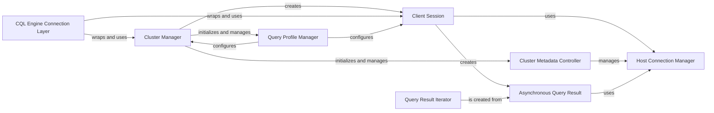

## Component Details

This component overview describes the core functionalities for establishing and managing connections to a Cassandra cluster, handling client sessions for query execution, and maintaining connection pools. It encompasses the discovery of cluster topology, schema updates, and the management of various execution profiles for queries, ensuring robust and efficient interaction with the Cassandra database.

### Cluster Manager
The primary entry point for interacting with a Cassandra cluster. It manages the overall connection to the cluster, including discovering hosts, applying load balancing policies, and creating Session objects. It also handles global configurations like authentication, compression, and protocol versions.

**Related Classes/Methods**:

- <a href="https://github.com/datastax/python-driver/blob/master/cassandra/cluster.py#L596-L2350" target="_blank" rel="noopener noreferrer">`cassandra.cluster.Cluster` (596:2350)</a>

### Client Session
Represents a client's interaction with the Cassandra cluster. It is responsible for executing queries (synchronously and asynchronously), managing prepared statements, and utilizing connection pools to communicate with individual hosts. It also handles execution profiles and user-defined type registrations.

**Related Classes/Methods**:

- <a href="https://github.com/datastax/python-driver/blob/master/cassandra/cluster.py#L2353-L3504" target="_blank" rel="noopener noreferrer">`cassandra.cluster.Session` (2353:3504)</a>

### Cluster Metadata Controller
A specialized connection responsible for maintaining an up-to-date view of the Cassandra cluster's metadata, including schema (keyspaces, tables, types), node topology, and host status. It listens for server-side events and triggers refreshes accordingly.

**Related Classes/Methods**:

- <a href="https://github.com/datastax/python-driver/blob/master/cassandra/cluster.py#L3562-L4257" target="_blank" rel="noopener noreferrer">`cassandra.cluster.ControlConnection` (3562:4257)</a>

### Host Connection Manager
Manages the network connections to individual Cassandra hosts. Depending on the protocol version, it either maintains a pool of connections (HostConnectionPool for v1/v2) or a single connection (HostConnection for v3+). It handles borrowing and returning connections, managing in-flight requests, and re-establishing connections upon failure.

**Related Classes/Methods**:

- <a href="https://github.com/datastax/python-driver/blob/master/cassandra/pool.py#L584-L933" target="_blank" rel="noopener noreferrer">`cassandra.pool.HostConnectionPool` (584:933)</a>
- <a href="https://github.com/datastax/python-driver/blob/master/cassandra/pool.py#L368-L578" target="_blank" rel="noopener noreferrer">`cassandra.pool.HostConnection` (368:578)</a>

### Query Profile Manager
Manages different execution profiles, which encapsulate various query options such as load balancing policy, retry policy, consistency level, and request timeout. This allows for flexible configuration of query behavior.

**Related Classes/Methods**:

- <a href="https://github.com/datastax/python-driver/blob/master/cassandra/cluster.py#L504-L553" target="_blank" rel="noopener noreferrer">`cassandra.cluster.ProfileManager` (504:553)</a>
- <a href="https://github.com/datastax/python-driver/blob/master/cassandra/cluster.py#L337-L439" target="_blank" rel="noopener noreferrer">`cassandra.cluster.ExecutionProfile` (337:439)</a>
- <a href="https://github.com/datastax/python-driver/blob/master/cassandra/cluster.py#L442-L474" target="_blank" rel="noopener noreferrer">`cassandra.cluster.GraphExecutionProfile` (442:474)</a>
- <a href="https://github.com/datastax/python-driver/blob/master/cassandra/cluster.py#L477-L501" target="_blank" rel="noopener noreferrer">`cassandra.cluster.GraphAnalyticsExecutionProfile` (477:501)</a>

### Asynchronous Query Result
Represents the asynchronous result of a query executed through a Session. It allows for non-blocking operations by providing methods to attach callbacks and errbacks, and to retrieve the result synchronously when needed. It also handles query tracing and paging state.

**Related Classes/Methods**:

- <a href="https://github.com/datastax/python-driver/blob/master/cassandra/cluster.py#L4361-L5197" target="_blank" rel="noopener noreferrer">`cassandra.cluster.ResponseFuture` (4361:5197)</a>

### Query Result Iterator
Provides an iterable interface over the rows returned from a query. It handles transparent fetching of subsequent pages of results and offers methods to access all rows or a single row.

**Related Classes/Methods**:

- <a href="https://github.com/datastax/python-driver/blob/master/cassandra/cluster.py#L5211-L5417" target="_blank" rel="noopener noreferrer">`cassandra.cluster.ResultSet` (5211:5417)</a>

### CQL Engine Connection Layer
A higher-level abstraction built on top of the core Cluster and Session objects, specifically designed for the CQL Engine ORM. It simplifies connection management for ORM users, handling lazy connections, default keyspaces, and user-defined type registrations within the ORM context.

**Related Classes/Methods**:

- <a href="https://github.com/datastax/python-driver/blob/master/cassandra/cqlengine/connection.py#L58-L148" target="_blank" rel="noopener noreferrer">`cassandra.cqlengine.connection.Connection` (58:148)</a>

### [FAQ](https://github.com/CodeBoarding/GeneratedOnBoardings/tree/main?tab=readme-ov-file#faq)