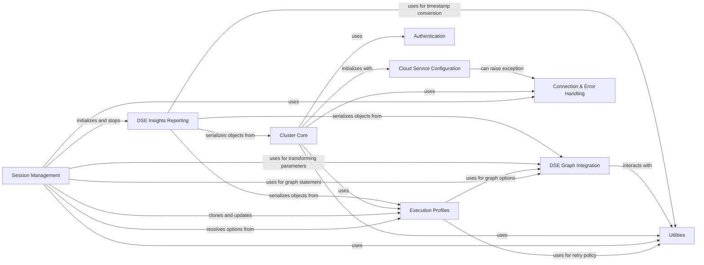

## Component Details

The DSE & Auxiliary Services component provides specialized integrations for DataStax Enterprise features such as Graph and Insights, handles various authentication mechanisms, and offers general utility functions and robust error handling for the driver's operations.

### DSE Graph Integration
This component handles all aspects of interacting with DataStax Enterprise Graph, including defining graph element types, serializing/deserializing graph data (GraphSON), defining query options, processing results, and building fluent API queries.

**Related Classes/Methods**:

- <a href="https://github.com/datastax/python-driver/blob/master/cassandra/datastax/graph/types.py#L18-L41" target="_blank" rel="noopener noreferrer">`cassandra.datastax.graph.types.Element` (18:41)</a>
- <a href="https://github.com/datastax/python-driver/blob/master/cassandra/datastax/graph/types.py#L44-L65" target="_blank" rel="noopener noreferrer">`cassandra.datastax.graph.types.Vertex` (44:65)</a>
- <a href="https://github.com/datastax/python-driver/blob/master/cassandra/datastax/graph/types.py#L100-L125" target="_blank" rel="noopener noreferrer">`cassandra.datastax.graph.types.Edge` (100:125)</a>
- <a href="https://github.com/datastax/python-driver/blob/master/cassandra/datastax/graph/types.py#L128-L161" target="_blank" rel="noopener noreferrer">`cassandra.datastax.graph.types.Path` (128:161)</a>
- <a href="https://github.com/datastax/python-driver/blob/master/cassandra/datastax/graph/types.py#L68-L97" target="_blank" rel="noopener noreferrer">`cassandra.datastax.graph.types.VertexProperty` (68:97)</a>
- <a href="https://github.com/datastax/python-driver/blob/master/cassandra/datastax/graph/graphson.py#L342-L361" target="_blank" rel="noopener noreferrer">`cassandra.datastax.graph.graphson.DseDurationTypeIO` (342:361)</a>
- <a href="https://github.com/datastax/python-driver/blob/master/cassandra/datastax/graph/graphson.py#L379-L386" target="_blank" rel="noopener noreferrer">`cassandra.datastax.graph.graphson.PointTypeIO` (379:386)</a>
- <a href="https://github.com/datastax/python-driver/blob/master/cassandra/datastax/graph/graphson.py#L389-L396" target="_blank" rel="noopener noreferrer">`cassandra.datastax.graph.graphson.LineStringTypeIO` (389:396)</a>
- <a href="https://github.com/datastax/python-driver/blob/master/cassandra/datastax/graph/graphson.py#L399-L406" target="_blank" rel="noopener noreferrer">`cassandra.datastax.graph.graphson.PolygonTypeIO` (399:406)</a>
- <a href="https://github.com/datastax/python-driver/blob/master/cassandra/datastax/graph/graphson.py#L415-L426" target="_blank" rel="noopener noreferrer">`cassandra.datastax.graph.graphson.VertexTypeIO` (415:426)</a>
- <a href="https://github.com/datastax/python-driver/blob/master/cassandra/datastax/graph/graphson.py#L429-L436" target="_blank" rel="noopener noreferrer">`cassandra.datastax.graph.graphson.VertexPropertyTypeIO` (429:436)</a>
- <a href="https://github.com/datastax/python-driver/blob/master/cassandra/datastax/graph/graphson.py#L439-L461" target="_blank" rel="noopener noreferrer">`cassandra.datastax.graph.graphson.EdgeTypeIO` (439:461)</a>
- <a href="https://github.com/datastax/python-driver/blob/master/cassandra/datastax/graph/graphson.py#L472-L481" target="_blank" rel="noopener noreferrer">`cassandra.datastax.graph.graphson.PathTypeIO` (472:481)</a>
- <a href="https://github.com/datastax/python-driver/blob/master/cassandra/datastax/graph/graphson.py#L626-L647" target="_blank" rel="noopener noreferrer">`cassandra.datastax.graph.graphson.TupleTypeIO` (626:647)</a>
- <a href="https://github.com/datastax/python-driver/blob/master/cassandra/datastax/graph/graphson.py#L650-L736" target="_blank" rel="noopener noreferrer">`cassandra.datastax.graph.graphson.UserTypeIO` (650:736)</a>
- <a href="https://github.com/datastax/python-driver/blob/master/cassandra/datastax/graph/graphson.py#L748-L806" target="_blank" rel="noopener noreferrer">`cassandra.datastax.graph.graphson._BaseGraphSONSerializer` (748:806)</a>
- <a href="https://github.com/datastax/python-driver/blob/master/cassandra/datastax/graph/graphson.py#L841-L868" target="_blank" rel="noopener noreferrer">`cassandra.datastax.graph.graphson._BaseGraphSONDeserializer` (841:868)</a>
- <a href="https://github.com/datastax/python-driver/blob/master/cassandra/datastax/graph/graphson.py#L871-L948" target="_blank" rel="noopener noreferrer">`cassandra.datastax.graph.graphson.GraphSON1Deserializer` (871:948)</a>
- <a href="https://github.com/datastax/python-driver/blob/master/cassandra/datastax/graph/graphson.py#L956-L989" target="_blank" rel="noopener noreferrer">`cassandra.datastax.graph.graphson.GraphSON2Serializer` (956:989)</a>
- <a href="https://github.com/datastax/python-driver/blob/master/cassandra/datastax/graph/graphson.py#L1008-L1043" target="_blank" rel="noopener noreferrer">`cassandra.datastax.graph.graphson.GraphSON2Reader` (1008:1043)</a>
- <a href="https://github.com/datastax/python-driver/blob/master/cassandra/datastax/graph/graphson.py#L1057-L1058" target="_blank" rel="noopener noreferrer">`cassandra.datastax.graph.graphson._wrap_value` (1057:1058)</a>
- <a href="https://github.com/datastax/python-driver/blob/master/cassandra/datastax/graph/graphson.py#L1068-L1099" target="_blank" rel="noopener noreferrer">`cassandra.datastax.graph.graphson.GraphSON3Serializer` (1068:1099)</a>
- <a href="https://github.com/datastax/python-driver/blob/master/cassandra/datastax/graph/graphson.py#L1119-L1132" target="_blank" rel="noopener noreferrer">`cassandra.datastax.graph.graphson.GraphSON3Reader` (1119:1132)</a>
- <a href="https://github.com/datastax/python-driver/blob/master/cassandra/datastax/graph/query.py#L65-L147" target="_blank" rel="noopener noreferrer">`cassandra.datastax.graph.query.GraphOptions` (65:147)</a>
- <a href="https://github.com/datastax/python-driver/blob/master/cassandra/datastax/graph/query.py#L199-L204" target="_blank" rel="noopener noreferrer">`cassandra.datastax.graph.query.graph_result_row_factory` (199:204)</a>
- <a href="https://github.com/datastax/python-driver/blob/master/cassandra/datastax/graph/query.py#L207-L213" target="_blank" rel="noopener noreferrer">`cassandra.datastax.graph.query.graph_object_row_factory` (207:213)</a>
- <a href="https://github.com/datastax/python-driver/blob/master/cassandra/datastax/graph/query.py#L216-L225" target="_blank" rel="noopener noreferrer">`cassandra.datastax.graph.query._graph_object_sequence` (216:225)</a>
- <a href="https://github.com/datastax/python-driver/blob/master/cassandra/datastax/graph/query.py#L255-L330" target="_blank" rel="noopener noreferrer">`cassandra.datastax.graph.query.Result` (255:330)</a>
- <a href="https://github.com/datastax/python-driver/blob/master/cassandra/datastax/graph/fluent/_predicates.py#L24-L41" target="_blank" rel="noopener noreferrer">`cassandra.datastax.graph.fluent._predicates.GeoP` (24:41)</a>
- <a href="https://github.com/datastax/python-driver/blob/master/cassandra/datastax/graph/fluent/_predicates.py#L44-L68" target="_blank" rel="noopener noreferrer">`cassandra.datastax.graph.fluent._predicates.TextDistanceP` (44:68)</a>
- <a href="https://github.com/datastax/python-driver/blob/master/cassandra/datastax/graph/fluent/_predicates.py#L71-L138" target="_blank" rel="noopener noreferrer">`cassandra.datastax.graph.fluent._predicates.Search` (71:138)</a>
- <a href="https://github.com/datastax/python-driver/blob/master/cassandra/datastax/graph/fluent/_predicates.py#L189-L202" target="_blank" rel="noopener noreferrer">`cassandra.datastax.graph.fluent._predicates.Geo` (189:202)</a>
- <a href="https://github.com/datastax/python-driver/blob/master/cassandra/datastax/graph/fluent/_query.py#L33-L81" target="_blank" rel="noopener noreferrer">`cassandra.datastax.graph.fluent._query._GremlinGraphSONWriterAdapter` (33:81)</a>
- <a href="https://github.com/datastax/python-driver/blob/master/cassandra/datastax/graph/fluent/_query.py#L96-L118" target="_blank" rel="noopener noreferrer">`cassandra.datastax.graph.fluent._query._query_from_traversal` (96:118)</a>
- <a href="https://github.com/datastax/python-driver/blob/master/cassandra/datastax/graph/fluent/_query.py#L186-L228" target="_blank" rel="noopener noreferrer">`cassandra.datastax.graph.fluent._query._DefaultTraversalBatch` (186:228)</a>
- <a href="https://github.com/datastax/python-driver/blob/master/cassandra/datastax/graph/fluent/_query.py#L121-L183" target="_blank" rel="noopener noreferrer">`cassandra.datastax.graph.fluent._query.TraversalBatch` (121:183)</a>
- <a href="https://github.com/datastax/python-driver/blob/master/cassandra/cluster.py#L442-L474" target="_blank" rel="noopener noreferrer">`cassandra.cluster.GraphExecutionProfile` (442:474)</a>
- <a href="https://github.com/datastax/python-driver/blob/master/cassandra/cluster.py#L477-L501" target="_blank" rel="noopener noreferrer">`cassandra.cluster.GraphAnalyticsExecutionProfile` (477:501)</a>

### DSE Insights Reporting
This component is responsible for collecting, serializing, and reporting operational metrics and data to DataStax Insights. It includes the serialization registry and specific serializers.

**Related Classes/Methods**:

- <a href="https://github.com/datastax/python-driver/blob/master/cassandra/datastax/insights/registry.py#L35-L119" target="_blank" rel="noopener noreferrer">`cassandra.datastax.insights.registry.InsightsSerializerRegistry` (35:119)</a>
- <a href="https://github.com/datastax/python-driver/blob/master/cassandra/datastax/insights/registry.py#L23-L32" target="_blank" rel="noopener noreferrer">`cassandra.datastax.insights.registry._default_serializer_for_object` (23:32)</a>
- <a href="https://github.com/datastax/python-driver/blob/master/cassandra/datastax/insights/serializers.py#L16-L219" target="_blank" rel="noopener noreferrer">`cassandra.datastax.insights.serializers.initialize_registry` (16:219)</a>
- <a href="https://github.com/datastax/python-driver/blob/master/cassandra/datastax/insights/reporter.py#L36-L221" target="_blank" rel="noopener noreferrer">`cassandra.datastax.insights.reporter.MonitorReporter` (36:221)</a>

### Cloud Service Configuration
Manages secure connection configurations for cloud-based DataStax deployments, including parsing connection bundles and setting up SSL.

**Related Classes/Methods**:

- `cassandra.datastax.cloud.CloudConfig` (full file reference)
- `cassandra.datastax.cloud.get_cloud_config` (full file reference)
- `cassandra.datastax.cloud.read_cloud_config_from_zip` (full file reference)
- `cassandra.datastax.cloud.parse_cloud_config` (full file reference)
- `cassandra.datastax.cloud.read_metadata_info` (full file reference)
- `cassandra.datastax.cloud.parse_metadata_info` (full file reference)

### Authentication
Provides mechanisms for authenticating with the Cassandra cluster.

**Related Classes/Methods**:

- <a href="https://github.com/datastax/python-driver/blob/master/cassandra/auth.py#L115-L136" target="_blank" rel="noopener noreferrer">`cassandra.auth.PlainTextAuthProvider` (115:136)</a>
- <a href="https://github.com/datastax/python-driver/blob/master/cassandra/auth.py#L264-L280" target="_blank" rel="noopener noreferrer">`cassandra.auth.PlainTextAuthenticator` (264:280)</a>

### Cluster Core
The central component for managing connections to a Cassandra cluster, handling host discovery, and overall cluster state.

**Related Classes/Methods**:

- <a href="https://github.com/datastax/python-driver/blob/master/cassandra/cluster.py#L596-L2350" target="_blank" rel="noopener noreferrer">`cassandra.cluster.Cluster` (596:2350)</a>

### Session Management
Manages active sessions with the Cassandra cluster, enabling query execution, paging, and integration with execution profiles and insights reporting.

**Related Classes/Methods**:

- <a href="https://github.com/datastax/python-driver/blob/master/cassandra/cluster.py#L2353-L3504" target="_blank" rel="noopener noreferrer">`cassandra.cluster.Session` (2353:3504)</a>

### Execution Profiles
Defines various query execution configurations, such as load balancing policies, retry policies, and timeouts.

**Related Classes/Methods**:

- <a href="https://github.com/datastax/python-driver/blob/master/cassandra/cluster.py#L337-L439" target="_blank" rel="noopener noreferrer">`cassandra.cluster.ExecutionProfile` (337:439)</a>

### Connection & Error Handling
Manages underlying network connections, handles connection-related exceptions, and provides asynchronous response handling for queries.

**Related Classes/Methods**:

- <a href="https://github.com/datastax/python-driver/blob/master/cassandra/cluster.py#L197-L212" target="_blank" rel="noopener noreferrer">`cassandra.cluster.NoHostAvailable` (197:212)</a>
- <a href="https://github.com/datastax/python-driver/blob/master/cassandra/cluster.py#L3562-L4257" target="_blank" rel="noopener noreferrer">`cassandra.cluster.ControlConnection` (3562:4257)</a>
- <a href="https://github.com/datastax/python-driver/blob/master/cassandra/cluster.py#L4361-L5197" target="_blank" rel="noopener noreferrer">`cassandra.cluster.ResponseFuture` (4361:5197)</a>

### Utilities
Provides general-purpose helper functions, including date/time conversions and network address resolution.

**Related Classes/Methods**:

- <a href="https://github.com/datastax/python-driver/blob/master/cassandra/util.py#L97-L104" target="_blank" rel="noopener noreferrer">`cassandra.util.datetime_from_uuid1` (97:104)</a>
- <a href="https://github.com/datastax/python-driver/blob/master/cassandra/util.py#L86-L94" target="_blank" rel="noopener noreferrer">`cassandra.util.unix_time_from_uuid1` (86:94)</a>

### [FAQ](https://github.com/CodeBoarding/GeneratedOnBoardings/tree/main?tab=readme-ov-file#faq)