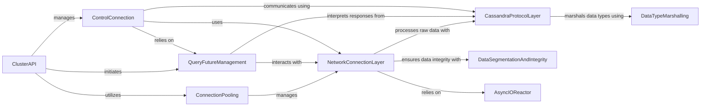

## Component Details

This subsystem is responsible for all aspects of network interaction with Cassandra clusters, encompassing low-level socket operations, data serialization and deserialization according to the Cassandra native protocol, asynchronous I/O management, connection pooling, and high-level cluster interaction including query execution and cluster state management.

### DataTypeMarshalling
This component is responsible for the serialization and deserialization of various Cassandra CQL data types into and from their binary representations. It handles the conversion between Python native types and the specific binary formats required by the Cassandra protocol, including variable-length integers and other complex types.

**Related Classes/Methods**:

- <a href="https://github.com/datastax/python-driver/blob/master/cassandra/cqltypes.py#L427-L430" target="_blank" rel="noopener noreferrer">`cassandra.cqltypes.DecimalType:deserialize` (427:430)</a>
- <a href="https://github.com/datastax/python-driver/blob/master/cassandra/cqltypes.py#L433-L446" target="_blank" rel="noopener noreferrer">`cassandra.cqltypes.DecimalType:serialize` (433:446)</a>
- <a href="https://github.com/datastax/python-driver/blob/master/cassandra/cqltypes.py#L471-L472" target="_blank" rel="noopener noreferrer">`cassandra.cqltypes.BooleanType:deserialize` (471:472)</a>
- <a href="https://github.com/datastax/python-driver/blob/master/cassandra/cqltypes.py#L486-L487" target="_blank" rel="noopener noreferrer">`cassandra.cqltypes.ByteType:deserialize` (486:487)</a>
- <a href="https://github.com/datastax/python-driver/blob/master/cassandra/cqltypes.py#L514-L515" target="_blank" rel="noopener noreferrer">`cassandra.cqltypes.FloatType:deserialize` (514:515)</a>
- <a href="https://github.com/datastax/python-driver/blob/master/cassandra/cqltypes.py#L529-L530" target="_blank" rel="noopener noreferrer">`cassandra.cqltypes.DoubleType:deserialize` (529:530)</a>
- <a href="https://github.com/datastax/python-driver/blob/master/cassandra/cqltypes.py#L544-L545" target="_blank" rel="noopener noreferrer">`cassandra.cqltypes.LongType:deserialize` (544:545)</a>
- <a href="https://github.com/datastax/python-driver/blob/master/cassandra/cqltypes.py#L559-L560" target="_blank" rel="noopener noreferrer">`cassandra.cqltypes.Int32Type:deserialize` (559:560)</a>
- <a href="https://github.com/datastax/python-driver/blob/master/cassandra/cqltypes.py#L574-L575" target="_blank" rel="noopener noreferrer">`cassandra.cqltypes.IntegerType:deserialize` (574:575)</a>
- <a href="https://github.com/datastax/python-driver/blob/master/cassandra/cqltypes.py#L578-L579" target="_blank" rel="noopener noreferrer">`cassandra.cqltypes.IntegerType:serialize` (578:579)</a>
- <a href="https://github.com/datastax/python-driver/blob/master/cassandra/cqltypes.py#L644-L646" target="_blank" rel="noopener noreferrer">`cassandra.cqltypes.DateType:deserialize` (644:646)</a>
- <a href="https://github.com/datastax/python-driver/blob/master/cassandra/cqltypes.py#L704-L706" target="_blank" rel="noopener noreferrer">`cassandra.cqltypes.SimpleDateType:deserialize` (704:706)</a>
- <a href="https://github.com/datastax/python-driver/blob/master/cassandra/cqltypes.py#L709-L719" target="_blank" rel="noopener noreferrer">`cassandra.cqltypes.SimpleDateType:serialize` (709:719)</a>
- <a href="https://github.com/datastax/python-driver/blob/master/cassandra/cqltypes.py#L726-L727" target="_blank" rel="noopener noreferrer">`cassandra.cqltypes.ShortType:deserialize` (726:727)</a>
- <a href="https://github.com/datastax/python-driver/blob/master/cassandra/cqltypes.py#L743-L744" target="_blank" rel="noopener noreferrer">`cassandra.cqltypes.TimeType:deserialize` (743:744)</a>
- <a href="https://github.com/datastax/python-driver/blob/master/cassandra/cqltypes.py#L747-L752" target="_blank" rel="noopener noreferrer">`cassandra.cqltypes.TimeType:serialize` (747:752)</a>
- <a href="https://github.com/datastax/python-driver/blob/master/cassandra/cqltypes.py#L759-L761" target="_blank" rel="noopener noreferrer">`cassandra.cqltypes.DurationType:deserialize` (759:761)</a>
- <a href="https://github.com/datastax/python-driver/blob/master/cassandra/cqltypes.py#L764-L769" target="_blank" rel="noopener noreferrer">`cassandra.cqltypes.DurationType:serialize` (764:769)</a>
- <a href="https://github.com/datastax/python-driver/blob/master/cassandra/cqltypes.py#L813-L834" target="_blank" rel="noopener noreferrer">`cassandra.cqltypes._SimpleParameterizedType:deserialize_safe` (813:834)</a>
- <a href="https://github.com/datastax/python-driver/blob/master/cassandra/cqltypes.py#L870-L903" target="_blank" rel="noopener noreferrer">`cassandra.cqltypes.MapType:deserialize_safe` (870:903)</a>
- <a href="https://github.com/datastax/python-driver/blob/master/cassandra/cqltypes.py#L930-L952" target="_blank" rel="noopener noreferrer">`cassandra.cqltypes.TupleType:deserialize_safe` (930:952)</a>
- <a href="https://github.com/datastax/python-driver/blob/master/cassandra/cqltypes.py#L1091-L1105" target="_blank" rel="noopener noreferrer">`cassandra.cqltypes.CompositeType:deserialize_safe` (1091:1105)</a>
- <a href="https://github.com/datastax/python-driver/blob/master/cassandra/cqltypes.py#L1335-L1379" target="_blank" rel="noopener noreferrer">`cassandra.cqltypes.DateRangeType:deserialize` (1335:1379)</a>
- <a href="https://github.com/datastax/python-driver/blob/master/cassandra/cqltypes.py#L1382-L1430" target="_blank" rel="noopener noreferrer">`cassandra.cqltypes.DateRangeType:serialize` (1382:1430)</a>
- <a href="https://github.com/datastax/python-driver/blob/master/cassandra/cqltypes.py#L1450-L1476" target="_blank" rel="noopener noreferrer">`cassandra.cqltypes.VectorType:deserialize` (1450:1476)</a>
- <a href="https://github.com/datastax/python-driver/blob/master/cassandra/cqltypes.py#L1479-L1493" target="_blank" rel="noopener noreferrer">`cassandra.cqltypes.VectorType:serialize` (1479:1493)</a>
- <a href="https://github.com/datastax/python-driver/blob/master/cassandra/cqltypes.py#L1285-L1289" target="_blank" rel="noopener noreferrer">`cassandra.cqltypes.BoundKind.to_int` (1285:1289)</a>
- <a href="https://github.com/datastax/python-driver/blob/master/cassandra/cqltypes.py#L1325-L1332" target="_blank" rel="noopener noreferrer">`cassandra.cqltypes.DateRangeType._decode_precision` (1325:1332)</a>
- <a href="https://github.com/datastax/python-driver/blob/master/cassandra/cqltypes.py#L1314-L1322" target="_blank" rel="noopener noreferrer">`cassandra.cqltypes.DateRangeType._encode_precision` (1314:1322)</a>
- <a href="https://github.com/datastax/python-driver/blob/master/cassandra/marshal.py#L59-L74" target="_blank" rel="noopener noreferrer">`cassandra.marshal:varint_pack` (59:74)</a>
- <a href="https://github.com/datastax/python-driver/blob/master/cassandra/marshal.py#L92-L112" target="_blank" rel="noopener noreferrer">`cassandra.marshal:vints_unpack` (92:112)</a>
- <a href="https://github.com/datastax/python-driver/blob/master/cassandra/marshal.py#L114-L144" target="_blank" rel="noopener noreferrer">`cassandra.marshal:vints_pack` (114:144)</a>
- <a href="https://github.com/datastax/python-driver/blob/master/cassandra/marshal.py#L55-L56" target="_blank" rel="noopener noreferrer">`cassandra.marshal:bit_length` (55:56)</a>
- <a href="https://github.com/datastax/python-driver/blob/master/cassandra/marshal.py#L88-L89" target="_blank" rel="noopener noreferrer">`cassandra.marshal:decode_zig_zag` (88:89)</a>
- <a href="https://github.com/datastax/python-driver/blob/master/cassandra/marshal.py#L84-L85" target="_blank" rel="noopener noreferrer">`cassandra.marshal:encode_zig_zag` (84:85)</a>

### NetworkConnectionLayer
This component manages the establishment, maintenance, and termination of individual network connections to Cassandra nodes. It handles the low-level socket operations, including SSL/TLS handshakes, and provides mechanisms for sending and receiving raw byte streams. It also includes error handling specific to connection issues.

**Related Classes/Methods**:

- <a href="https://github.com/datastax/python-driver/blob/master/cassandra/connection.py#L229-L241" target="_blank" rel="noopener noreferrer">`cassandra.connection.DefaultEndPointFactory:create` (229:241)</a>
- <a href="https://github.com/datastax/python-driver/blob/master/cassandra/connection.py#L309-L314" target="_blank" rel="noopener noreferrer">`cassandra.connection.SniEndPointFactory:create` (309:314)</a>
- <a href="https://github.com/datastax/python-driver/blob/master/cassandra/connection.py#L316-L317" target="_blank" rel="noopener noreferrer">`cassandra.connection.SniEndPointFactory:create_from_sni` (316:317)</a>
- <a href="https://github.com/datastax/python-driver/blob/master/cassandra/connection.py#L413-L416" target="_blank" rel="noopener noreferrer">`cassandra.connection.ProtocolVersionUnsupported:__init__` (413:416)</a>
- <a href="https://github.com/datastax/python-driver/blob/master/cassandra/connection.py#L631-L633" target="_blank" rel="noopener noreferrer">`cassandra.connection._ConnectionIOBuffer:set_checksumming_buffer` (631:633)</a>
- <a href="https://github.com/datastax/python-driver/blob/master/cassandra/connection.py#L653-L658" target="_blank" rel="noopener noreferrer">`cassandra.connection._ConnectionIOBuffer:reset_cql_frame_buffer` (653:658)</a>
- <a href="https://github.com/datastax/python-driver/blob/master/cassandra/connection.py#L649-L651" target="_blank" rel="noopener noreferrer">`cassandra.connection._ConnectionIOBuffer:reset_io_buffer` (649:651)</a>
- <a href="https://github.com/datastax/python-driver/blob/master/cassandra/connection.py#L749-L807" target="_blank" rel="noopener noreferrer">`cassandra.connection.Connection:__init__` (749:807)</a>
- <a href="https://github.com/datastax/python-driver/blob/master/cassandra/connection.py#L838-L857" target="_blank" rel="noopener noreferrer">`cassandra.connection.Connection:factory` (838:857)</a>
- <a href="https://github.com/datastax/python-driver/blob/master/cassandra/connection.py#L911-L921" target="_blank" rel="noopener noreferrer">`cassandra.connection.Connection:_get_socket_addresses` (911:921)</a>
- <a href="https://github.com/datastax/python-driver/blob/master/cassandra/connection.py#L923-L956" target="_blank" rel="noopener noreferrer">`cassandra.connection.Connection:_connect_socket` (923:956)</a>
- <a href="https://github.com/datastax/python-driver/blob/master/cassandra/connection.py#L962-L966" target="_blank" rel="noopener noreferrer">`cassandra.connection.Connection:_enable_checksumming` (962:966)</a>
- <a href="https://github.com/datastax/python-driver/blob/master/cassandra/connection.py#L971-L991" target="_blank" rel="noopener noreferrer">`cassandra.connection.Connection:defunct` (971:991)</a>
- <a href="https://github.com/datastax/python-driver/blob/master/cassandra/connection.py#L998-L1036" target="_blank" rel="noopener noreferrer">`cassandra.connection.Connection:error_all_requests` (998:1036)</a>
- <a href="https://github.com/datastax/python-driver/blob/master/cassandra/connection.py#L1059-L1079" target="_blank" rel="noopener noreferrer">`cassandra.connection.Connection:send_msg` (1059:1079)</a>
- <a href="https://github.com/datastax/python-driver/blob/master/cassandra/connection.py#L1081-L1082" target="_blank" rel="noopener noreferrer">`cassandra.connection.Connection:wait_for_response` (1081:1082)</a>
- <a href="https://github.com/datastax/python-driver/blob/master/cassandra/connection.py#L1084-L1129" target="_blank" rel="noopener noreferrer">`cassandra.connection.Connection:wait_for_responses` (1084:1129)</a>
- <a href="https://github.com/datastax/python-driver/blob/master/cassandra/connection.py#L1131-L1138" target="_blank" rel="noopener noreferrer">`cassandra.connection.Connection:register_watcher` (1131:1138)</a>
- <a href="https://github.com/datastax/python-driver/blob/master/cassandra/connection.py#L1140-L1148" target="_blank" rel="noopener noreferrer">`cassandra.connection.Connection:register_watchers` (1140:1148)</a>
- <a href="https://github.com/datastax/python-driver/blob/master/cassandra/connection.py#L1155-L1170" target="_blank" rel="noopener noreferrer">`cassandra.connection.Connection:_read_frame_header` (1155:1170)</a>
- <a href="https://github.com/datastax/python-driver/blob/master/cassandra/connection.py#L1173-L1193" target="_blank" rel="noopener noreferrer">`cassandra.connection.Connection:_process_segment_buffer` (1173:1193)</a>
- <a href="https://github.com/datastax/python-driver/blob/master/cassandra/connection.py#L1195-L1227" target="_blank" rel="noopener noreferrer">`cassandra.connection.Connection:process_io_buffer` (1195:1227)</a>
- <a href="https://github.com/datastax/python-driver/blob/master/cassandra/connection.py#L1230-L1295" target="_blank" rel="noopener noreferrer">`cassandra.connection.Connection:process_msg` (1230:1295)</a>
- <a href="https://github.com/datastax/python-driver/blob/master/cassandra/connection.py#L1297-L1300" target="_blank" rel="noopener noreferrer">`cassandra.connection.Connection:new_continuous_paging_session` (1297:1300)</a>
- <a href="https://github.com/datastax/python-driver/blob/master/cassandra/connection.py#L1312-L1314" target="_blank" rel="noopener noreferrer">`cassandra.connection.Connection:_send_options_message` (1312:1314)</a>
- <a href="https://github.com/datastax/python-driver/blob/master/cassandra/connection.py#L1317-L1387" target="_blank" rel="noopener noreferrer">`cassandra.connection.Connection:_handle_options_response` (1317:1387)</a>
- <a href="https://github.com/datastax/python-driver/blob/master/cassandra/connection.py#L1390-L1400" target="_blank" rel="noopener noreferrer">`cassandra.connection.Connection:_send_startup_message` (1390:1400)</a>
- <a href="https://github.com/datastax/python-driver/blob/master/cassandra/connection.py#L1403-L1464" target="_blank" rel="noopener noreferrer">`cassandra.connection.Connection:_handle_startup_response` (1403:1464)</a>
- <a href="https://github.com/datastax/python-driver/blob/master/cassandra/connection.py#L1467-L1494" target="_blank" rel="noopener noreferrer">`cassandra.connection.Connection:_handle_auth_response` (1467:1494)</a>
- <a href="https://github.com/datastax/python-driver/blob/master/cassandra/connection.py#L1496-L1519" target="_blank" rel="noopener noreferrer">`cassandra.connection.Connection:set_keyspace_blocking` (1496:1519)</a>
- <a href="https://github.com/datastax/python-driver/blob/master/cassandra/connection.py#L1521-L1571" target="_blank" rel="noopener noreferrer">`cassandra.connection.Connection:set_keyspace_async` (1521:1571)</a>
- <a href="https://github.com/datastax/python-driver/blob/master/cassandra/connection.py#L968-L969" target="_blank" rel="noopener noreferrer">`cassandra.connection.Connection.close` (968:969)</a>
- <a href="https://github.com/datastax/python-driver/blob/master/cassandra/connection.py#L993-L996" target="_blank" rel="noopener noreferrer">`cassandra.connection.Connection.error_all_cp_sessions` (993:996)</a>
- `cassandra.connection.Connection.error_all_requests.try_callback` (full file reference)
- `cassandra.connection.Connection.error_all_requests.err_all_callbacks` (full file reference)
- <a href="https://github.com/datastax/python-driver/blob/master/cassandra/connection.py#L859-L884" target="_blank" rel="noopener noreferrer">`cassandra.connection.Connection._build_ssl_context_from_options` (859:884)</a>
- <a href="https://github.com/datastax/python-driver/blob/master/cassandra/connection.py#L886-L900" target="_blank" rel="noopener noreferrer">`cassandra.connection.Connection._wrap_socket_from_context` (886:900)</a>
- <a href="https://github.com/datastax/python-driver/blob/master/cassandra/connection.py#L902-L903" target="_blank" rel="noopener noreferrer">`cassandra.connection.Connection._initiate_connection` (902:903)</a>
- <a href="https://github.com/datastax/python-driver/blob/master/cassandra/connection.py#L908-L909" target="_blank" rel="noopener noreferrer">`cassandra.connection.Connection._validate_hostname` (908:909)</a>
- <a href="https://github.com/datastax/python-driver/blob/master/cassandra/connection.py#L1051-L1057" target="_blank" rel="noopener noreferrer">`cassandra.connection.Connection.handle_pushed` (1051:1057)</a>
- <a href="https://github.com/datastax/python-driver/blob/master/cassandra/connection.py#L1302-L1309" target="_blank" rel="noopener noreferrer">`cassandra.connection.Connection.remove_continuous_paging_session` (1302:1309)</a>
- <a href="https://github.com/datastax/python-driver/blob/master/cassandra/connection.py#L1038-L1049" target="_blank" rel="noopener noreferrer">`cassandra.connection.Connection.get_request_id` (1038:1049)</a>
- <a href="https://github.com/datastax/python-driver/blob/master/cassandra/connection.py#L958-L960" target="_blank" rel="noopener noreferrer">`cassandra.connection.Connection._enable_compression` (958:960)</a>
- <a href="https://github.com/datastax/python-driver/blob/master/cassandra/connection.py#L402-L406" target="_blank" rel="noopener noreferrer">`cassandra.connection.ConnectionShutdown` (402:406)</a>
- <a href="https://github.com/datastax/python-driver/blob/master/cassandra/connection.py#L419-L424" target="_blank" rel="noopener noreferrer">`cassandra.connection.ConnectionBusy` (419:424)</a>
- <a href="https://github.com/datastax/python-driver/blob/master/cassandra/connection.py#L427-L431" target="_blank" rel="noopener noreferrer">`cassandra.connection.ProtocolError` (427:431)</a>
- <a href="https://github.com/datastax/python-driver/blob/master/cassandra/connection.py#L361-L381" target="_blank" rel="noopener noreferrer">`cassandra.connection._Frame` (361:381)</a>
- <a href="https://github.com/datastax/python-driver/blob/master/cassandra/connection.py#L434-L435" target="_blank" rel="noopener noreferrer">`cassandra.connection.CrcMismatchException` (434:435)</a>
- <a href="https://github.com/datastax/python-driver/blob/master/cassandra/connection.py#L387-L399" target="_blank" rel="noopener noreferrer">`cassandra.connection.ConnectionException` (387:399)</a>
- <a href="https://github.com/datastax/python-driver/blob/master/cassandra/connection.py#L181-L215" target="_blank" rel="noopener noreferrer">`cassandra.connection.DefaultEndPoint` (181:215)</a>
- <a href="https://github.com/datastax/python-driver/blob/master/cassandra/connection.py#L1622-L1638" target="_blank" rel="noopener noreferrer">`cassandra.connection.ResponseWaiter:deliver` (1622:1638)</a>
- <a href="https://github.com/datastax/python-driver/blob/master/cassandra/connection.py#L1642-L1655" target="_blank" rel="noopener noreferrer">`cassandra.connection.HeartbeatFuture:__init__` (1642:1655)</a>
- <a href="https://github.com/datastax/python-driver/blob/master/cassandra/connection.py#L1657-L1663" target="_blank" rel="noopener noreferrer">`cassandra.connection.HeartbeatFuture:wait` (1657:1663)</a>
- <a href="https://github.com/datastax/python-driver/blob/master/cassandra/connection.py#L1665-L1675" target="_blank" rel="noopener noreferrer">`cassandra.connection.HeartbeatFuture:_options_callback` (1665:1675)</a>
- <a href="https://github.com/datastax/python-driver/blob/master/cassandra/connection.py#L1692-L1752" target="_blank" rel="noopener noreferrer">`cassandra.connection.ConnectionHeartbeat:run` (1692:1752)</a>
- <a href="https://github.com/datastax/python-driver/blob/master/cassandra/connection.py#L1758-L1760" target="_blank" rel="noopener noreferrer">`cassandra.connection.ConnectionHeartbeat:_raise_if_stopped` (1758:1760)</a>
- <a href="https://github.com/datastax/python-driver/blob/master/cassandra/connection.py#L1689-L1690" target="_blank" rel="noopener noreferrer">`cassandra.connection.ConnectionHeartbeat.ShutdownException` (1689:1690)</a>
- <a href="https://github.com/datastax/python-driver/blob/master/cassandra/connection.py#L476-L480" target="_blank" rel="noopener noreferrer">`cassandra.connection.ContinuousPagingSession:on_message` (476:480)</a>
- <a href="https://github.com/datastax/python-driver/blob/master/cassandra/connection.py#L506-L529" target="_blank" rel="noopener noreferrer">`cassandra.connection.ContinuousPagingSession:results` (506:529)</a>
- <a href="https://github.com/datastax/python-driver/blob/master/cassandra/connection.py#L531-L543" target="_blank" rel="noopener noreferrer">`cassandra.connection.ContinuousPagingSession:maybe_request_more` (531:543)</a>
- <a href="https://github.com/datastax/python-driver/blob/master/cassandra/connection.py#L545-L558" target="_blank" rel="noopener noreferrer">`cassandra.connection.ContinuousPagingSession:update_next_pages` (545:558)</a>
- <a href="https://github.com/datastax/python-driver/blob/master/cassandra/connection.py#L560-L566" target="_blank" rel="noopener noreferrer">`cassandra.connection.ContinuousPagingSession:_on_backpressure_response` (560:566)</a>
- <a href="https://github.com/datastax/python-driver/blob/master/cassandra/connection.py#L568-L582" target="_blank" rel="noopener noreferrer">`cassandra.connection.ContinuousPagingSession:cancel` (568:582)</a>
- <a href="https://github.com/datastax/python-driver/blob/master/cassandra/connection.py#L482-L491" target="_blank" rel="noopener noreferrer">`cassandra.connection.ContinuousPagingSession.on_page` (482:491)</a>
- <a href="https://github.com/datastax/python-driver/blob/master/cassandra/connection.py#L493-L504" target="_blank" rel="noopener noreferrer">`cassandra.connection.ContinuousPagingSession.on_error` (493:504)</a>

### CassandraProtocolLayer
This component is responsible for encoding and decoding messages according to the Cassandra native protocol. It defines the structure of various request and response messages, handles error messages, and manages protocol-specific data types and flags.

**Related Classes/Methods**:

- <a href="https://github.com/datastax/python-driver/blob/master/cassandra/protocol.py#L82-L84" target="_blank" rel="noopener noreferrer">`cassandra.protocol._RegisterMessageType:__init__` (82:84)</a>
- <a href="https://github.com/datastax/python-driver/blob/master/cassandra/protocol.py#L101-L102" target="_blank" rel="noopener noreferrer">`cassandra.protocol._MessageType:__repr__` (101:102)</a>
- <a href="https://github.com/datastax/python-driver/blob/master/cassandra/protocol.py#L127-L132" target="_blank" rel="noopener noreferrer">`cassandra.protocol.ErrorMessage:recv_body` (127:132)</a>
- <a href="https://github.com/datastax/python-driver/blob/master/cassandra/protocol.py#L139-L140" target="_blank" rel="noopener noreferrer">`cassandra.protocol.ErrorMessage:__str__` (139:140)</a>
- <a href="https://github.com/datastax/python-driver/blob/master/cassandra/protocol.py#L193-L198" target="_blank" rel="noopener noreferrer">`cassandra.protocol.UnavailableErrorMessage:recv_error_info` (193:198)</a>
- <a href="https://github.com/datastax/python-driver/blob/master/cassandra/protocol.py#L200-L201" target="_blank" rel="noopener noreferrer">`cassandra.protocol.UnavailableErrorMessage:to_exception` (200:201)</a>
- <a href="https://github.com/datastax/python-driver/blob/master/cassandra/protocol.py#L224-L230" target="_blank" rel="noopener noreferrer">`cassandra.protocol.WriteTimeoutErrorMessage:recv_error_info` (224:230)</a>
- <a href="https://github.com/datastax/python-driver/blob/master/cassandra/protocol.py#L232-L233" target="_blank" rel="noopener noreferrer">`cassandra.protocol.WriteTimeoutErrorMessage:to_exception` (232:233)</a>
- <a href="https://github.com/datastax/python-driver/blob/master/cassandra/protocol.py#L241-L247" target="_blank" rel="noopener noreferrer">`cassandra.protocol.ReadTimeoutErrorMessage:recv_error_info` (241:247)</a>
- <a href="https://github.com/datastax/python-driver/blob/master/cassandra/protocol.py#L249-L250" target="_blank" rel="noopener noreferrer">`cassandra.protocol.ReadTimeoutErrorMessage:to_exception` (249:250)</a>
- <a href="https://github.com/datastax/python-driver/blob/master/cassandra/protocol.py#L258-L279" target="_blank" rel="noopener noreferrer">`cassandra.protocol.ReadFailureMessage:recv_error_info` (258:279)</a>
- <a href="https://github.com/datastax/python-driver/blob/master/cassandra/protocol.py#L281-L282" target="_blank" rel="noopener noreferrer">`cassandra.protocol.ReadFailureMessage:to_exception` (281:282)</a>
- <a href="https://github.com/datastax/python-driver/blob/master/cassandra/protocol.py#L290-L295" target="_blank" rel="noopener noreferrer">`cassandra.protocol.FunctionFailureMessage:recv_error_info` (290:295)</a>
- <a href="https://github.com/datastax/python-driver/blob/master/cassandra/protocol.py#L297-L298" target="_blank" rel="noopener noreferrer">`cassandra.protocol.FunctionFailureMessage:to_exception` (297:298)</a>
- <a href="https://github.com/datastax/python-driver/blob/master/cassandra/protocol.py#L306-L327" target="_blank" rel="noopener noreferrer">`cassandra.protocol.WriteFailureMessage:recv_error_info` (306:327)</a>
- <a href="https://github.com/datastax/python-driver/blob/master/cassandra/protocol.py#L329-L330" target="_blank" rel="noopener noreferrer">`cassandra.protocol.WriteFailureMessage:to_exception` (329:330)</a>
- <a href="https://github.com/datastax/python-driver/blob/master/cassandra/protocol.py#L347-L348" target="_blank" rel="noopener noreferrer">`cassandra.protocol.UnauthorizedErrorMessage:to_exception` (347:348)</a>
- <a href="https://github.com/datastax/python-driver/blob/master/cassandra/protocol.py#L355-L356" target="_blank" rel="noopener noreferrer">`cassandra.protocol.InvalidRequestException:to_exception` (355:356)</a>
- <a href="https://github.com/datastax/python-driver/blob/master/cassandra/protocol.py#L369-L371" target="_blank" rel="noopener noreferrer">`cassandra.protocol.PreparedQueryNotFound:recv_error_info` (369:371)</a>
- <a href="https://github.com/datastax/python-driver/blob/master/cassandra/protocol.py#L379-L383" target="_blank" rel="noopener noreferrer">`cassandra.protocol.AlreadyExistsException:recv_error_info` (379:383)</a>
- <a href="https://github.com/datastax/python-driver/blob/master/cassandra/protocol.py#L385-L386" target="_blank" rel="noopener noreferrer">`cassandra.protocol.AlreadyExistsException:to_exception` (385:386)</a>
- <a href="https://github.com/datastax/python-driver/blob/master/cassandra/protocol.py#L408-L411" target="_blank" rel="noopener noreferrer">`cassandra.protocol.StartupMessage:send_body` (408:411)</a>
- <a href="https://github.com/datastax/python-driver/blob/master/cassandra/protocol.py#L419-L420" target="_blank" rel="noopener noreferrer">`cassandra.protocol.ReadyMessage:recv_body` (419:420)</a>
- <a href="https://github.com/datastax/python-driver/blob/master/cassandra/protocol.py#L431-L433" target="_blank" rel="noopener noreferrer">`cassandra.protocol.AuthenticateMessage:recv_body` (431:433)</a>
- <a href="https://github.com/datastax/python-driver/blob/master/cassandra/protocol.py#L443-L452" target="_blank" rel="noopener noreferrer">`cassandra.protocol.CredentialsMessage:send_body` (443:452)</a>
- <a href="https://github.com/datastax/python-driver/blob/master/cassandra/protocol.py#L463-L464" target="_blank" rel="noopener noreferrer">`cassandra.protocol.AuthChallengeMessage:recv_body` (463:464)</a>
- <a href="https://github.com/datastax/python-driver/blob/master/cassandra/protocol.py#L474-L475" target="_blank" rel="noopener noreferrer">`cassandra.protocol.AuthResponseMessage:send_body` (474:475)</a>
- <a href="https://github.com/datastax/python-driver/blob/master/cassandra/protocol.py#L486-L487" target="_blank" rel="noopener noreferrer">`cassandra.protocol.AuthSuccessMessage:recv_body` (486:487)</a>
- <a href="https://github.com/datastax/python-driver/blob/master/cassandra/protocol.py#L507-L510" target="_blank" rel="noopener noreferrer">`cassandra.protocol.SupportedMessage:recv_body` (507:510)</a>
- <a href="https://github.com/datastax/python-driver/blob/master/cassandra/protocol.py#L543-L613" target="_blank" rel="noopener noreferrer">`cassandra.protocol._QueryMessage:_write_query_params` (543:613)</a>
- <a href="https://github.com/datastax/python-driver/blob/master/cassandra/protocol.py#L615-L619" target="_blank" rel="noopener noreferrer">`cassandra.protocol._QueryMessage:_write_paging_options` (615:619)</a>
- <a href="https://github.com/datastax/python-driver/blob/master/cassandra/protocol.py#L626-L630" target="_blank" rel="noopener noreferrer">`cassandra.protocol.QueryMessage:__init__` (626:630)</a>
- <a href="https://github.com/datastax/python-driver/blob/master/cassandra/protocol.py#L632-L634" target="_blank" rel="noopener noreferrer">`cassandra.protocol.QueryMessage:send_body` (632:634)</a>
- <a href="https://github.com/datastax/python-driver/blob/master/cassandra/protocol.py#L641-L648" target="_blank" rel="noopener noreferrer">`cassandra.protocol.ExecuteMessage:__init__` (641:648)</a>
- <a href="https://github.com/datastax/python-driver/blob/master/cassandra/protocol.py#L650-L666" target="_blank" rel="noopener noreferrer">`cassandra.protocol.ExecuteMessage:_write_query_params` (650:666)</a>
- <a href="https://github.com/datastax/python-driver/blob/master/cassandra/protocol.py#L668-L672" target="_blank" rel="noopener noreferrer">`cassandra.protocol.ExecuteMessage:send_body` (668:672)</a>
- <a href="https://github.com/datastax/python-driver/blob/master/cassandra/protocol.py#L721-L733" target="_blank" rel="noopener noreferrer">`cassandra.protocol.ResultMessage:recv` (721:733)</a>
- <a href="https://github.com/datastax/python-driver/blob/master/cassandra/protocol.py#L736-L740" target="_blank" rel="noopener noreferrer">`cassandra.protocol.ResultMessage:recv_body` (736:740)</a>
- <a href="https://github.com/datastax/python-driver/blob/master/cassandra/protocol.py#L742-L770" target="_blank" rel="noopener noreferrer">`cassandra.protocol.ResultMessage:recv_results_rows` (742:770)</a>
- <a href="https://github.com/datastax/python-driver/blob/master/cassandra/protocol.py#L772-L778" target="_blank" rel="noopener noreferrer">`cassandra.protocol.ResultMessage:recv_results_prepared` (772:778)</a>
- <a href="https://github.com/datastax/python-driver/blob/master/cassandra/protocol.py#L780-L814" target="_blank" rel="noopener noreferrer">`cassandra.protocol.ResultMessage:recv_results_metadata` (780:814)</a>
- <a href="https://github.com/datastax/python-driver/blob/master/cassandra/protocol.py#L816-L844" target="_blank" rel="noopener noreferrer">`cassandra.protocol.ResultMessage:recv_prepared_metadata` (816:844)</a>
- <a href="https://github.com/datastax/python-driver/blob/master/cassandra/protocol.py#L846-L847" target="_blank" rel="noopener noreferrer">`cassandra.protocol.ResultMessage:recv_results_schema_change` (846:847)</a>
- <a href="https://github.com/datastax/python-driver/blob/master/cassandra/protocol.py#L850-L881" target="_blank" rel="noopener noreferrer">`cassandra.protocol.ResultMessage:read_type` (850:881)</a>
- <a href="https://github.com/datastax/python-driver/blob/master/cassandra/protocol.py#L884-L885" target="_blank" rel="noopener noreferrer">`cassandra.protocol.ResultMessage:recv_row` (884:885)</a>
- <a href="https://github.com/datastax/python-driver/blob/master/cassandra/protocol.py#L896-L923" target="_blank" rel="noopener noreferrer">`cassandra.protocol.PrepareMessage:send_body` (896:923)</a>
- <a href="https://github.com/datastax/python-driver/blob/master/cassandra/protocol.py#L940-L982" target="_blank" rel="noopener noreferrer">`cassandra.protocol.BatchMessage:send_body` (940:982)</a>
- <a href="https://github.com/datastax/python-driver/blob/master/cassandra/protocol.py#L999-L1000" target="_blank" rel="noopener noreferrer">`cassandra.protocol.RegisterMessage:send_body` (999:1000)</a>
- <a href="https://github.com/datastax/python-driver/blob/master/cassandra/protocol.py#L1012-L1017" target="_blank" rel="noopener noreferrer">`cassandra.protocol.EventMessage:recv_body` (1012:1017)</a>
- <a href="https://github.com/datastax/python-driver/blob/master/cassandra/protocol.py#L1020-L1024" target="_blank" rel="noopener noreferrer">`cassandra.protocol.EventMessage:recv_topology_change` (1020:1024)</a>
- <a href="https://github.com/datastax/python-driver/blob/master/cassandra/protocol.py#L1027-L1031" target="_blank" rel="noopener noreferrer">`cassandra.protocol.EventMessage:recv_status_change` (1027:1031)</a>
- <a href="https://github.com/datastax/python-driver/blob/master/cassandra/protocol.py#L1034-L1056" target="_blank" rel="noopener noreferrer">`cassandra.protocol.EventMessage:recv_schema_change` (1034:1056)</a>
- <a href="https://github.com/datastax/python-driver/blob/master/cassandra/protocol.py#L1073-L1084" target="_blank" rel="noopener noreferrer">`cassandra.protocol.ReviseRequestMessage:send_body` (1073:1084)</a>
- <a href="https://github.com/datastax/python-driver/blob/master/cassandra/protocol.py#L1109-L1144" target="_blank" rel="noopener noreferrer">`cassandra.protocol._ProtocolHandler:encode_message` (1109:1144)</a>
- <a href="https://github.com/datastax/python-driver/blob/master/cassandra/protocol.py#L1147-L1153" target="_blank" rel="noopener noreferrer">`cassandra.protocol._ProtocolHandler:_write_header` (1147:1153)</a>
- <a href="https://github.com/datastax/python-driver/blob/master/cassandra/protocol.py#L1156-L1212" target="_blank" rel="noopener noreferrer">`cassandra.protocol._ProtocolHandler:decode_message` (1156:1212)</a>
- <a href="https://github.com/datastax/python-driver/blob/master/cassandra/protocol.py#L1275-L1276" target="_blank" rel="noopener noreferrer">`cassandra.protocol:read_byte` (1275:1276)</a>
- <a href="https://github.com/datastax/python-driver/blob/master/cassandra/protocol.py#L1283-L1284" target="_blank" rel="noopener noreferrer">`cassandra.protocol:read_int` (1283:1284)</a>
- <a href="https://github.com/datastax/python-driver/blob/master/cassandra/protocol.py#L1287-L1299" target="_blank" rel="noopener noreferrer">`cassandra.protocol:read_uint_le` (1287:1299)</a>
- <a href="https://github.com/datastax/python-driver/blob/master/cassandra/protocol.py#L1302-L1311" target="_blank" rel="noopener noreferrer">`cassandra.protocol:write_uint_le` (1302:1311)</a>
- <a href="https://github.com/datastax/python-driver/blob/master/cassandra/protocol.py#L1326-L1327" target="_blank" rel="noopener noreferrer">`cassandra.protocol:read_short` (1326:1327)</a>
- <a href="https://github.com/datastax/python-driver/blob/master/cassandra/protocol.py#L1334-L1335" target="_blank" rel="noopener noreferrer">`cassandra.protocol:read_consistency_level` (1334:1335)</a>
- <a href="https://github.com/datastax/python-driver/blob/master/cassandra/protocol.py#L1338-L1339" target="_blank" rel="noopener noreferrer">`cassandra.protocol:write_consistency_level` (1338:1339)</a>
- <a href="https://github.com/datastax/python-driver/blob/master/cassandra/protocol.py#L1342-L1345" target="_blank" rel="noopener noreferrer">`cassandra.protocol:read_string` (1342:1345)</a>
- <a href="https://github.com/datastax/python-driver/blob/master/cassandra/protocol.py#L1348-L1351" target="_blank" rel="noopener noreferrer">`cassandra.protocol:read_binary_string` (1348:1351)</a>
- <a href="https://github.com/datastax/python-driver/blob/master/cassandra/protocol.py#L1354-L1358" target="_blank" rel="noopener noreferrer">`cassandra.protocol:write_string` (1354:1358)</a>
- <a href="https://github.com/datastax/python-driver/blob/master/cassandra/protocol.py#L1361-L1364" target="_blank" rel="noopener noreferrer">`cassandra.protocol:read_binary_longstring` (1361:1364)</a>
- <a href="https://github.com/datastax/python-driver/blob/master/cassandra/protocol.py#L1367-L1368" target="_blank" rel="noopener noreferrer">`cassandra.protocol:read_longstring` (1367:1368)</a>
- <a href="https://github.com/datastax/python-driver/blob/master/cassandra/protocol.py#L1371-L1375" target="_blank" rel="noopener noreferrer">`cassandra.protocol:write_longstring` (1371:1375)</a>
- <a href="https://github.com/datastax/python-driver/blob/master/cassandra/protocol.py#L1378-L1380" target="_blank" rel="noopener noreferrer">`cassandra.protocol:read_stringlist` (1378:1380)</a>
- <a href="https://github.com/datastax/python-driver/blob/master/cassandra/protocol.py#L1383-L1386" target="_blank" rel="noopener noreferrer">`cassandra.protocol:write_stringlist` (1383:1386)</a>
- <a href="https://github.com/datastax/python-driver/blob/master/cassandra/protocol.py#L1389-L1395" target="_blank" rel="noopener noreferrer">`cassandra.protocol:read_stringmap` (1389:1395)</a>
- <a href="https://github.com/datastax/python-driver/blob/master/cassandra/protocol.py#L1398-L1402" target="_blank" rel="noopener noreferrer">`cassandra.protocol:write_stringmap` (1398:1402)</a>
- <a href="https://github.com/datastax/python-driver/blob/master/cassandra/protocol.py#L1405-L1411" target="_blank" rel="noopener noreferrer">`cassandra.protocol:read_bytesmap` (1405:1411)</a>
- <a href="https://github.com/datastax/python-driver/blob/master/cassandra/protocol.py#L1414-L1418" target="_blank" rel="noopener noreferrer">`cassandra.protocol:write_bytesmap` (1414:1418)</a>
- <a href="https://github.com/datastax/python-driver/blob/master/cassandra/protocol.py#L1421-L1427" target="_blank" rel="noopener noreferrer">`cassandra.protocol:read_stringmultimap` (1421:1427)</a>
- <a href="https://github.com/datastax/python-driver/blob/master/cassandra/protocol.py#L1430-L1434" target="_blank" rel="noopener noreferrer">`cassandra.protocol:write_stringmultimap` (1430:1434)</a>
- <a href="https://github.com/datastax/python-driver/blob/master/cassandra/protocol.py#L1437-L1443" target="_blank" rel="noopener noreferrer">`cassandra.protocol:read_error_code_map` (1437:1443)</a>
- <a href="https://github.com/datastax/python-driver/blob/master/cassandra/protocol.py#L1446-L1450" target="_blank" rel="noopener noreferrer">`cassandra.protocol:read_value` (1446:1450)</a>
- <a href="https://github.com/datastax/python-driver/blob/master/cassandra/protocol.py#L1453-L1460" target="_blank" rel="noopener noreferrer">`cassandra.protocol:write_value` (1453:1460)</a>
- <a href="https://github.com/datastax/python-driver/blob/master/cassandra/protocol.py#L1463-L1472" target="_blank" rel="noopener noreferrer">`cassandra.protocol:read_inet_addr_only` (1463:1472)</a>
- <a href="https://github.com/datastax/python-driver/blob/master/cassandra/protocol.py#L1475-L1478" target="_blank" rel="noopener noreferrer">`cassandra.protocol:read_inet` (1475:1478)</a>
- <a href="https://github.com/datastax/python-driver/blob/master/cassandra/protocol.py#L1481-L1490" target="_blank" rel="noopener noreferrer">`cassandra.protocol:write_inet` (1481:1490)</a>
- <a href="https://github.com/datastax/python-driver/blob/master/cassandra/protocol.py#L73-L74" target="_blank" rel="noopener noreferrer">`cassandra.protocol.register_class` (73:74)</a>
- <a href="https://github.com/datastax/python-driver/blob/master/cassandra/protocol.py#L105-L110" target="_blank" rel="noopener noreferrer">`cassandra.protocol._get_params` (105:110)</a>
- <a href="https://github.com/datastax/python-driver/blob/master/cassandra/protocol.py#L134-L137" target="_blank" rel="noopener noreferrer">`cassandra.protocol.ErrorMessage.summary_msg` (134:137)</a>
- `cassandra.protocol.ColumnMetadata` (full file reference)
- <a href="https://github.com/datastax/python-driver/blob/master/cassandra/protocol.py#L49-L50" target="_blank" rel="noopener noreferrer">`cassandra.protocol.NotSupportedError` (49:50)</a>
- <a href="https://github.com/datastax/python-driver/blob/master/cassandra/protocol.py#L53-L54" target="_blank" rel="noopener noreferrer">`cassandra.protocol.InternalError` (53:54)</a>

### DataSegmentationAndIntegrity
This component is responsible for handling the segmentation of data frames and ensuring their integrity through checksum calculations. It encodes and decodes data segments, including header information and CRC checks, to guarantee reliable data transmission over the network.

**Related Classes/Methods**:

- <a href="https://github.com/datastax/python-driver/blob/master/cassandra/segment.py#L127-L143" target="_blank" rel="noopener noreferrer">`cassandra.segment.SegmentCodec:encode_header` (127:143)</a>
- <a href="https://github.com/datastax/python-driver/blob/master/cassandra/segment.py#L145-L166" target="_blank" rel="noopener noreferrer">`cassandra.segment.SegmentCodec:_encode_segment` (145:166)</a>
- <a href="https://github.com/datastax/python-driver/blob/master/cassandra/segment.py#L168-L183" target="_blank" rel="noopener noreferrer">`cassandra.segment.SegmentCodec:encode` (168:183)</a>
- <a href="https://github.com/datastax/python-driver/blob/master/cassandra/segment.py#L185-L205" target="_blank" rel="noopener noreferrer">`cassandra.segment.SegmentCodec:decode_header` (185:205)</a>
- <a href="https://github.com/datastax/python-driver/blob/master/cassandra/segment.py#L207-L220" target="_blank" rel="noopener noreferrer">`cassandra.segment.SegmentCodec:decode` (207:220)</a>
- <a href="https://github.com/datastax/python-driver/blob/master/cassandra/segment.py#L39-L51" target="_blank" rel="noopener noreferrer">`cassandra.segment.compute_crc24` (39:51)</a>
- <a href="https://github.com/datastax/python-driver/blob/master/cassandra/segment.py#L54-L56" target="_blank" rel="noopener noreferrer">`cassandra.segment.compute_crc32` (54:56)</a>
- <a href="https://github.com/datastax/python-driver/blob/master/cassandra/segment.py#L28-L36" target="_blank" rel="noopener noreferrer">`cassandra.segment.CrcException` (28:36)</a>
- <a href="https://github.com/datastax/python-driver/blob/master/cassandra/segment.py#L59-L77" target="_blank" rel="noopener noreferrer">`cassandra.segment.SegmentHeader` (59:77)</a>
- <a href="https://github.com/datastax/python-driver/blob/master/cassandra/segment.py#L80-L89" target="_blank" rel="noopener noreferrer">`cassandra.segment.Segment` (80:89)</a>
- <a href="https://github.com/datastax/python-driver/blob/master/cassandra/segment.py#L119-L122" target="_blank" rel="noopener noreferrer">`cassandra.segment.SegmentCodec.compress` (119:122)</a>
- <a href="https://github.com/datastax/python-driver/blob/master/cassandra/segment.py#L124-L125" target="_blank" rel="noopener noreferrer">`cassandra.segment.SegmentCodec.decompress` (124:125)</a>

### ClusterAPI
This component provides the primary high-level interface for applications to interact with the Cassandra cluster. It manages the overall cluster state, including host discovery, load balancing, and session management, abstracting away the complexities of direct connection handling.

**Related Classes/Methods**:

- <a href="https://github.com/datastax/python-driver/blob/master/cassandra/cluster.py#L1113-L1411" target="_blank" rel="noopener noreferrer">`cassandra.cluster.Cluster:__init__` (1113:1411)</a>
- <a href="https://github.com/datastax/python-driver/blob/master/cassandra/cluster.py#L1664-L1670" target="_blank" rel="noopener noreferrer">`cassandra.cluster.Cluster:connection_factory` (1664:1670)</a>
- <a href="https://github.com/datastax/python-driver/blob/master/cassandra/cluster.py#L1672-L1674" target="_blank" rel="noopener noreferrer">`cassandra.cluster.Cluster:_make_connection_factory` (1672:1674)</a>
- <a href="https://github.com/datastax/python-driver/blob/master/cassandra/cluster.py#L1706-L1771" target="_blank" rel="noopener noreferrer">`cassandra.cluster.Cluster:connect` (1706:1771)</a>
- <a href="https://github.com/datastax/python-driver/blob/master/cassandra/cluster.py#L1787-L1813" target="_blank" rel="noopener noreferrer">`cassandra.cluster.Cluster:shutdown` (1787:1813)</a>
- <a href="https://github.com/datastax/python-driver/blob/master/cassandra/cluster.py#L1949-L1971" target="_blank" rel="noopener noreferrer">`cassandra.cluster.Cluster:_start_reconnector` (1949:1971)</a>
- <a href="https://github.com/datastax/python-driver/blob/master/cassandra/cluster.py#L2298-L2308" target="_blank" rel="noopener noreferrer">`cassandra.cluster.Cluster:_send_chunks` (2298:2308)</a>
- <a href="https://github.com/datastax/python-driver/blob/master/cassandra/cluster.py#L2310-L2346" target="_blank" rel="noopener noreferrer">`cassandra.cluster.Cluster:_prepare_all_queries` (2310:2346)</a>
- <a href="https://github.com/datastax/python-driver/blob/master/cassandra/cluster.py#L2105-L2118" target="_blank" rel="noopener noreferrer">`cassandra.cluster.Cluster.add_host` (2105:2118)</a>
- <a href="https://github.com/datastax/python-driver/blob/master/cassandra/cluster.py#L1413-L1447" target="_blank" rel="noopener noreferrer">`cassandra.cluster.Cluster._create_thread_pool_executor` (1413:1447)</a>
- <a href="https://github.com/datastax/python-driver/blob/master/cassandra/cluster.py#L4270-L4346" target="_blank" rel="noopener noreferrer">`cassandra.cluster._Scheduler` (4270:4346)</a>
- <a href="https://github.com/datastax/python-driver/blob/master/cassandra/cluster.py#L244-L245" target="_blank" rel="noopener noreferrer">`cassandra.cluster._register_cluster_shutdown` (244:245)</a>
- <a href="https://github.com/datastax/python-driver/blob/master/cassandra/cluster.py#L248-L249" target="_blank" rel="noopener noreferrer">`cassandra.cluster._discard_cluster_shutdown` (248:249)</a>
- `cassandra.cluster._new_session` (full file reference)
- <a href="https://github.com/datastax/python-driver/blob/master/cassandra/cluster.py#L261-L264" target="_blank" rel="noopener noreferrer">`cassandra.cluster.default_lbp_factory` (261:264)</a>
- <a href="https://github.com/datastax/python-driver/blob/master/cassandra/cluster.py#L504-L553" target="_blank" rel="noopener noreferrer">`cassandra.cluster.ProfileManager` (504:553)</a>
- <a href="https://github.com/datastax/python-driver/blob/master/cassandra/cluster.py#L337-L439" target="_blank" rel="noopener noreferrer">`cassandra.cluster.ExecutionProfile` (337:439)</a>
- <a href="https://github.com/datastax/python-driver/blob/master/cassandra/cluster.py#L442-L474" target="_blank" rel="noopener noreferrer">`cassandra.cluster.GraphExecutionProfile` (442:474)</a>
- <a href="https://github.com/datastax/python-driver/blob/master/cassandra/cluster.py#L477-L501" target="_blank" rel="noopener noreferrer">`cassandra.cluster.GraphAnalyticsExecutionProfile` (477:501)</a>
- <a href="https://github.com/datastax/python-driver/blob/master/cassandra/cluster.py#L509-L516" target="_blank" rel="noopener noreferrer">`cassandra.cluster.ProfileManager._profiles_without_explicit_lbps` (509:516)</a>
- <a href="https://github.com/datastax/python-driver/blob/master/cassandra/cluster.py#L524-L526" target="_blank" rel="noopener noreferrer">`cassandra.cluster.ProfileManager.populate` (524:526)</a>
- <a href="https://github.com/datastax/python-driver/blob/master/cassandra/cluster.py#L518-L522" target="_blank" rel="noopener noreferrer">`cassandra.cluster.ProfileManager.distance` (518:522)</a>
- <a href="https://github.com/datastax/python-driver/blob/master/cassandra/cluster.py#L528-L530" target="_blank" rel="noopener noreferrer">`cassandra.cluster.ProfileManager.check_supported` (528:530)</a>
- `cassandra.cluster._set_default_dbaas_consistency` (full file reference)
- <a href="https://github.com/datastax/python-driver/blob/master/cassandra/cluster.py#L2574-L2632" target="_blank" rel="noopener noreferrer">`cassandra.cluster.Session:__init__` (2574:2632)</a>
- <a href="https://github.com/datastax/python-driver/blob/master/cassandra/cluster.py#L3005-L3110" target="_blank" rel="noopener noreferrer">`cassandra.cluster.Session:_create_response_future` (3005:3110)</a>
- <a href="https://github.com/datastax/python-driver/blob/master/cassandra/cluster.py#L3176-L3240" target="_blank" rel="noopener noreferrer">`cassandra.cluster.Session:prepare` (3176:3240)</a>
- <a href="https://github.com/datastax/python-driver/blob/master/cassandra/cluster.py#L3242-L3274" target="_blank" rel="noopener noreferrer">`cassandra.cluster.Session:prepare_on_all_hosts` (3242:3274)</a>
- <a href="https://github.com/datastax/python-driver/blob/master/cassandra/cluster.py#L3315-L3371" target="_blank" rel="noopener noreferrer">`cassandra.cluster.Session:add_or_renew_pool` (3315:3371)</a>
- <a href="https://github.com/datastax/python-driver/blob/master/cassandra/cluster.py#L3489-L3492" target="_blank" rel="noopener noreferrer">`cassandra.cluster.Session.submit` (3489:3492)</a>
- <a href="https://github.com/datastax/python-driver/blob/master/cassandra/cluster.py#L2897-L2911" target="_blank" rel="noopener noreferrer">`cassandra.cluster.Session._check_graph_paging_available` (2897:2911)</a>
- <a href="https://github.com/datastax/python-driver/blob/master/cassandra/cluster.py#L3126-L3127" target="_blank" rel="noopener noreferrer">`cassandra.cluster.Session._maybe_get_execution_profile` (3126:3127)</a>
- <a href="https://github.com/datastax/python-driver/blob/master/cassandra/cluster.py#L197-L212" target="_blank" rel="noopener noreferrer">`cassandra.cluster.NoHostAvailable` (197:212)</a>

### ControlConnection
This component manages a dedicated connection to the Cassandra cluster for administrative tasks, such as discovering nodes, refreshing schema metadata, and maintaining the token map. It ensures the client has an up-to-date view of the cluster topology.

**Related Classes/Methods**:

- <a href="https://github.com/datastax/python-driver/blob/master/cassandra/cluster.py#L3630-L3637" target="_blank" rel="noopener noreferrer">`cassandra.cluster.ControlConnection:connect` (3630:3637)</a>
- <a href="https://github.com/datastax/python-driver/blob/master/cassandra/cluster.py#L3651-L3680" target="_blank" rel="noopener noreferrer">`cassandra.cluster.ControlConnection:_reconnect_internal` (3651:3680)</a>
- <a href="https://github.com/datastax/python-driver/blob/master/cassandra/cluster.py#L3682-L3748" target="_blank" rel="noopener noreferrer">`cassandra.cluster.ControlConnection:_try_connect` (3682:3748)</a>
- <a href="https://github.com/datastax/python-driver/blob/master/cassandra/cluster.py#L3756-L3780" target="_blank" rel="noopener noreferrer">`cassandra.cluster.ControlConnection:_reconnect` (3756:3780)</a>
- <a href="https://github.com/datastax/python-driver/blob/master/cassandra/cluster.py#L3861-L3993" target="_blank" rel="noopener noreferrer">`cassandra.cluster.ControlConnection:_refresh_node_list_and_token_map` (3861:3993)</a>
- <a href="https://github.com/datastax/python-driver/blob/master/cassandra/cluster.py#L4072-L4134" target="_blank" rel="noopener noreferrer">`cassandra.cluster.ControlConnection:wait_for_schema_agreement` (4072:4134)</a>
- <a href="https://github.com/datastax/python-driver/blob/master/cassandra/cluster.py#L3639-L3649" target="_blank" rel="noopener noreferrer">`cassandra.cluster.ControlConnection:_set_new_connection` (3639:3649)</a>
- <a href="https://github.com/datastax/python-driver/blob/master/cassandra/cluster.py#L4160-L4203" target="_blank" rel="noopener noreferrer">`cassandra.cluster.ControlConnection:_get_peers_query` (4160:4203)</a>
- <a href="https://github.com/datastax/python-driver/blob/master/cassandra/cluster.py#L3829-L3847" target="_blank" rel="noopener noreferrer">`cassandra.cluster.ControlConnection:_refresh_schema` (3829:3847)</a>
- <a href="https://github.com/datastax/python-driver/blob/master/cassandra/cluster.py#L4001-L4011" target="_blank" rel="noopener noreferrer">`cassandra.cluster.ControlConnection:_update_location_info` (4001:4011)</a>
- <a href="https://github.com/datastax/python-driver/blob/master/cassandra/cluster.py#L3996-L3999" target="_blank" rel="noopener noreferrer">`cassandra.cluster.ControlConnection:_is_valid_peer` (3996:3999)</a>
- <a href="https://github.com/datastax/python-driver/blob/master/cassandra/cluster.py#L3516-L3537" target="_blank" rel="noopener noreferrer">`cassandra.cluster._ControlReconnectionHandler` (3516:3537)</a>

### AsyncIOReactor
This component provides an abstraction layer for different asynchronous I/O frameworks, allowing the Cassandra driver to integrate with various event loops and concurrency models (e.g., asyncio, gevent, eventlet, libev, twisted, asyncore). It handles the scheduling of I/O operations and timers.

**Related Classes/Methods**:

- <a href="https://github.com/datastax/python-driver/blob/master/cassandra/io/asyncorereactor.py#L55-L60" target="_blank" rel="noopener noreferrer">`cassandra.io.asyncorereactor.WaitableTimer:__init__` (55:60)</a>
- <a href="https://github.com/datastax/python-driver/blob/master/cassandra/io/asyncorereactor.py#L62-L73" target="_blank" rel="noopener noreferrer">`cassandra.io.asyncorereactor.WaitableTimer:finish` (62:73)</a>
- <a href="https://github.com/datastax/python-driver/blob/master/cassandra/io/asyncorereactor.py#L110-L115" target="_blank" rel="noopener noreferrer">`cassandra.io.asyncorereactor._AsyncoreDispatcher:validate` (110:115)</a>
- <a href="https://github.com/datastax/python-driver/blob/master/cassandra/io/asyncorereactor.py#L123-L125" target="_blank" rel="noopener noreferrer">`cassandra.io.asyncorereactor._AsyncorePipeDispatcher:__init__` (123:125)</a>
- <a href="https://github.com/datastax/python-driver/blob/master/cassandra/io/asyncorereactor.py#L156-L160" target="_blank" rel="noopener noreferrer">`cassandra.io.asyncorereactor._AsyncoreUDPDispatcher:__init__` (156:160)</a>
- <a href="https://github.com/datastax/python-driver/blob/master/cassandra/io/asyncorereactor.py#L210-L228" target="_blank" rel="noopener noreferrer">`cassandra.io.asyncorereactor.AsyncoreLoop:__init__` (210:228)</a>
- <a href="https://github.com/datastax/python-driver/blob/master/cassandra/io/asyncorereactor.py#L247-L248" target="_blank" rel="noopener noreferrer">`cassandra.io.asyncorereactor.AsyncoreLoop:wake_loop` (247:248)</a>
- <a href="https://github.com/datastax/python-driver/blob/master/cassandra/io/asyncorereactor.py#L250-L262" target="_blank" rel="noopener noreferrer">`cassandra.io.asyncorereactor.AsyncoreLoop:_run_loop` (250:262)</a>
- <a href="https://github.com/datastax/python-driver/blob/master/cassandra/io/asyncorereactor.py#L273-L279" target="_blank" rel="noopener noreferrer">`cassandra.io.asyncorereactor.AsyncoreLoop:add_timer` (273:279)</a>
- <a href="https://github.com/datastax/python-driver/blob/master/cassandra/io/asyncorereactor.py#L281-L305" target="_blank" rel="noopener noreferrer">`cassandra.io.asyncorereactor.AsyncoreLoop:_cleanup` (281:305)</a>
- <a href="https://github.com/datastax/python-driver/blob/master/cassandra/io/asyncorereactor.py#L322-L331" target="_blank" rel="noopener noreferrer">`cassandra.io.asyncorereactor.AsyncoreConnection:initialize_reactor` (322:331)</a>
- <a href="https://github.com/datastax/python-driver/blob/master/cassandra/io/asyncorereactor.py#L342-L345" target="_blank" rel="noopener noreferrer">`cassandra.io.asyncorereactor.AsyncoreConnection:create_timer` (342:345)</a>
- <a href="https://github.com/datastax/python-driver/blob/master/cassandra/io/asyncorereactor.py#L347-L369" target="_blank" rel="noopener noreferrer">`cassandra.io.asyncorereactor.AsyncoreConnection:__init__` (347:369)</a>
- <a href="https://github.com/datastax/python-driver/blob/master/cassandra/io/asyncorereactor.py#L371-L395" target="_blank" rel="noopener noreferrer">`cassandra.io.asyncorereactor.AsyncoreConnection:close` (371:395)</a>
- <a href="https://github.com/datastax/python-driver/blob/master/cassandra/io/asyncorereactor.py#L397-L398" target="_blank" rel="noopener noreferrer">`cassandra.io.asyncorereactor.AsyncoreConnection:handle_error` (397:398)</a>
- <a href="https://github.com/datastax/python-driver/blob/master/cassandra/io/asyncorereactor.py#L400-L402" target="_blank" rel="noopener noreferrer">`cassandra.io.asyncorereactor.AsyncoreConnection:handle_close` (400:402)</a>
- <a href="https://github.com/datastax/python-driver/blob/master/cassandra/io/asyncorereactor.py#L404-L429" target="_blank" rel="noopener noreferrer">`cassandra.io.asyncorereactor.AsyncoreConnection:handle_write` (404:429)</a>
- <a href="https://github.com/datastax/python-driver/blob/master/cassandra/io/asyncorereactor.py#L431-L456" target="_blank" rel="noopener noreferrer">`cassandra.io.asyncorereactor.AsyncoreConnection:handle_read` (431:456)</a>
- <a href="https://github.com/datastax/python-driver/blob/master/cassandra/io/asyncorereactor.py#L458-L470" target="_blank" rel="noopener noreferrer">`cassandra.io.asyncorereactor.AsyncoreConnection:push` (458:470)</a>
- <a href="https://github.com/datastax/python-driver/blob/master/cassandra/io/asyncorereactor.py#L101-L105" target="_blank" rel="noopener noreferrer">`cassandra.io.asyncorereactor._AsyncoreDispatcher.__init__` (101:105)</a>
- <a href="https://github.com/datastax/python-driver/blob/master/cassandra/io/asyncorereactor.py#L81-L96" target="_blank" rel="noopener noreferrer">`cassandra.io.asyncorereactor._PipeWrapper` (81:96)</a>
- <a href="https://github.com/datastax/python-driver/blob/master/cassandra/io/asyncorereactor.py#L180-L201" target="_blank" rel="noopener noreferrer">`cassandra.io.asyncorereactor._BusyWaitDispatcher` (180:201)</a>
- <a href="https://github.com/datastax/python-driver/blob/master/cassandra/io/asyncorereactor.py#L230-L245" target="_blank" rel="noopener noreferrer">`cassandra.io.asyncorereactor.AsyncoreLoop.maybe_start` (230:245)</a>
- <a href="https://github.com/datastax/python-driver/blob/master/cassandra/io/asyncorereactor.py#L264-L271" target="_blank" rel="noopener noreferrer">`cassandra.io.asyncorereactor.AsyncoreLoop._maybe_log_debug` (264:271)</a>
- <a href="https://github.com/datastax/python-driver/blob/master/cassandra/io/asyncorereactor.py#L135-L138" target="_blank" rel="noopener noreferrer">`cassandra.io.asyncorereactor._AsyncorePipeDispatcher.notify_loop` (135:138)</a>
- <a href="https://github.com/datastax/python-driver/blob/master/cassandra/io/asyncorereactor.py#L334-L339" target="_blank" rel="noopener noreferrer">`cassandra.io.asyncorereactor.AsyncoreConnection.handle_fork` (334:339)</a>
- <a href="https://github.com/datastax/python-driver/blob/master/cassandra/io/asyncioreactor.py#L42-L45" target="_blank" rel="noopener noreferrer">`cassandra.io.asyncioreactor.AsyncioTimer:__init__` (42:45)</a>
- <a href="https://github.com/datastax/python-driver/blob/master/cassandra/io/asyncioreactor.py#L86-L103" target="_blank" rel="noopener noreferrer">`cassandra.io.asyncioreactor.AsyncioConnection:__init__` (86:103)</a>
- <a href="https://github.com/datastax/python-driver/blob/master/cassandra/io/asyncioreactor.py#L122-L123" target="_blank" rel="noopener noreferrer">`cassandra.io.asyncioreactor.AsyncioConnection:create_timer` (122:123)</a>
- <a href="https://github.com/datastax/python-driver/blob/master/cassandra/io/asyncioreactor.py#L125-L135" target="_blank" rel="noopener noreferrer">`cassandra.io.asyncioreactor.AsyncioConnection:close` (125:135)</a>
- <a href="https://github.com/datastax/python-driver/blob/master/cassandra/io/asyncioreactor.py#L137-L154" target="_blank" rel="noopener noreferrer">`cassandra.io.asyncioreactor.AsyncioConnection:_close` (137:154)</a>
- <a href="https://github.com/datastax/python-driver/blob/master/cassandra/io/asyncioreactor.py#L156-L172" target="_blank" rel="noopener noreferrer">`cassandra.io.asyncioreactor.AsyncioConnection:push` (156:172)</a>
- <a href="https://github.com/datastax/python-driver/blob/master/cassandra/io/asyncioreactor.py#L181-L192" target="_blank" rel="noopener noreferrer">`cassandra.io.asyncioreactor.AsyncioConnection:handle_write` (181:192)</a>
- <a href="https://github.com/datastax/python-driver/blob/master/cassandra/io/asyncioreactor.py#L194-L221" target="_blank" rel="noopener noreferrer">`cassandra.io.asyncioreactor.AsyncioConnection:handle_read` (194:221)</a>
- <a href="https://github.com/datastax/python-driver/blob/master/cassandra/io/asyncioreactor.py#L48-L50" target="_blank" rel="noopener noreferrer">`cassandra.io.asyncioreactor.AsyncioTimer._call_delayed_coro` (48:50)</a>
- <a href="https://github.com/datastax/python-driver/blob/master/cassandra/io/asyncioreactor.py#L174-L178" target="_blank" rel="noopener noreferrer">`cassandra.io.asyncioreactor.AsyncioConnection._push_msg` (174:178)</a>
- <a href="https://github.com/datastax/python-driver/blob/master/cassandra/io/geventreactor.py#L48-L52" target="_blank" rel="noopener noreferrer">`cassandra.io.geventreactor.GeventConnection:initialize_reactor` (48:52)</a>
- <a href="https://github.com/datastax/python-driver/blob/master/cassandra/io/geventreactor.py#L55-L59" target="_blank" rel="noopener noreferrer">`cassandra.io.geventreactor.GeventConnection:create_timer` (55:59)</a>
- <a href="https://github.com/datastax/python-driver/blob/master/cassandra/io/geventreactor.py#L71-L80" target="_blank" rel="noopener noreferrer">`cassandra.io.geventreactor.GeventConnection:__init__` (71:80)</a>
- <a href="https://github.com/datastax/python-driver/blob/master/cassandra/io/geventreactor.py#L82-L101" target="_blank" rel="noopener noreferrer">`cassandra.io.geventreactor.GeventConnection:close` (82:101)</a>
- <a href="https://github.com/datastax/python-driver/blob/master/cassandra/io/geventreactor.py#L103-L105" target="_blank" rel="noopener noreferrer">`cassandra.io.geventreactor.GeventConnection:handle_close` (103:105)</a>
- <a href="https://github.com/datastax/python-driver/blob/master/cassandra/io/geventreactor.py#L107-L115" target="_blank" rel="noopener noreferrer">`cassandra.io.geventreactor.GeventConnection:handle_write` (107:115)</a>
- <a href="https://github.com/datastax/python-driver/blob/master/cassandra/io/geventreactor.py#L117-L132" target="_blank" rel="noopener noreferrer">`cassandra.io.geventreactor.GeventConnection:handle_read` (117:132)</a>
- <a href="https://github.com/datastax/python-driver/blob/master/cassandra/io/eventletreactor.py#L64-L69" target="_blank" rel="noopener noreferrer">`cassandra.io.eventletreactor.EventletConnection:initialize_reactor` (64:69)</a>
- <a href="https://github.com/datastax/python-driver/blob/master/cassandra/io/eventletreactor.py#L72-L76" target="_blank" rel="noopener noreferrer">`cassandra.io.eventletreactor.EventletConnection:create_timer` (72:76)</a>
- <a href="https://github.com/datastax/python-driver/blob/master/cassandra/io/eventletreactor.py#L93-L102" target="_blank" rel="noopener noreferrer">`cassandra.io.eventletreactor.EventletConnection:__init__` (93:102)</a>
- <a href="https://github.com/datastax/python-driver/blob/master/cassandra/io/eventletreactor.py#L104-L111" target="_blank" rel="noopener noreferrer">`cassandra.io.eventletreactor.EventletConnection:_wrap_socket_from_context` (104:111)</a>
- <a href="https://github.com/datastax/python-driver/blob/master/cassandra/io/eventletreactor.py#L113-L119" target="_blank" rel="noopener noreferrer">`cassandra.io.eventletreactor.EventletConnection:_initiate_connection` (113:119)</a>
- <a href="https://github.com/datastax/python-driver/blob/master/cassandra/io/eventletreactor.py#L128-L150" target="_blank" rel="noopener noreferrer">`cassandra.io.eventletreactor.EventletConnection:close` (128:150)</a>
- <a href="https://github.com/datastax/python-driver/blob/master/cassandra/io/eventletreactor.py#L152-L154" target="_blank" rel="noopener noreferrer">`cassandra.io.eventletreactor.EventletConnection:handle_close` (152:154)</a>
- <a href="https://github.com/datastax/python-driver/blob/master/cassandra/io/eventletreactor.py#L156-L166" target="_blank" rel="noopener noreferrer">`cassandra.io.eventletreactor.EventletConnection:handle_write` (156:166)</a>
- <a href="https://github.com/datastax/python-driver/blob/master/cassandra/io/eventletreactor.py#L168-L186" target="_blank" rel="noopener noreferrer">`cassandra.io.eventletreactor.EventletConnection:handle_read` (168:186)</a>
- <a href="https://github.com/datastax/python-driver/blob/master/cassandra/io/eventletreactor.py#L38-L43" target="_blank" rel="noopener noreferrer">`cassandra.io.eventletreactor._check_pyopenssl` (38:43)</a>
- <a href="https://github.com/datastax/python-driver/blob/master/cassandra/io/libevreactor.py#L50-L81" target="_blank" rel="noopener noreferrer">`cassandra.io.libevreactor.LibevLoop:__init__` (50:81)</a>
- <a href="https://github.com/datastax/python-driver/blob/master/cassandra/io/libevreactor.py#L114-L136" target="_blank" rel="noopener noreferrer">`cassandra.io.libevreactor.LibevLoop:_cleanup` (114:136)</a>
- <a href="https://github.com/datastax/python-driver/blob/master/cassandra/io/libevreactor.py#L138-L140" target="_blank" rel="noopener noreferrer">`cassandra.io.libevreactor.LibevLoop:add_timer` (138:140)</a>
- <a href="https://github.com/datastax/python-driver/blob/master/cassandra/io/libevreactor.py#L142-L148" target="_blank" rel="noopener noreferrer">`cassandra.io.libevreactor.LibevLoop:_update_timer` (142:148)</a>
- <a href="https://github.com/datastax/python-driver/blob/master/cassandra/io/libevreactor.py#L150-L151" target="_blank" rel="noopener noreferrer">`cassandra.io.libevreactor.LibevLoop:_on_loop_timer` (150:151)</a>
- <a href="https://github.com/datastax/python-driver/blob/master/cassandra/io/libevreactor.py#L178-L222" target="_blank" rel="noopener noreferrer">`cassandra.io.libevreactor.LibevLoop:_loop_will_run` (178:222)</a>
- <a href="https://github.com/datastax/python-driver/blob/master/cassandra/io/libevreactor.py#L239-L247" target="_blank" rel="noopener noreferrer">`cassandra.io.libevreactor.LibevConnection:initialize_reactor` (239:247)</a>
- <a href="https://github.com/datastax/python-driver/blob/master/cassandra/io/libevreactor.py#L257-L260" target="_blank" rel="noopener noreferrer">`cassandra.io.libevreactor.LibevConnection:create_timer` (257:260)</a>
- <a href="https://github.com/datastax/python-driver/blob/master/cassandra/io/libevreactor.py#L262-L279" target="_blank" rel="noopener noreferrer">`cassandra.io.libevreactor.LibevConnection:__init__` (262:279)</a>
- <a href="https://github.com/datastax/python-driver/blob/master/cassandra/io/libevreactor.py#L281-L296" target="_blank" rel="noopener noreferrer">`cassandra.io.libevreactor.LibevConnection:close` (281:296)</a>
- <a href="https://github.com/datastax/python-driver/blob/master/cassandra/io/libevreactor.py#L298-L337" target="_blank" rel="noopener noreferrer">`cassandra.io.libevreactor.LibevConnection:handle_write` (298:337)</a>
- <a href="https://github.com/datastax/python-driver/blob/master/cassandra/io/libevreactor.py#L339-L373" target="_blank" rel="noopener noreferrer">`cassandra.io.libevreactor.LibevConnection:handle_read` (339:373)</a>
- <a href="https://github.com/datastax/python-driver/blob/master/cassandra/io/libevreactor.py#L375-L386" target="_blank" rel="noopener noreferrer">`cassandra.io.libevreactor.LibevConnection:push` (375:386)</a>
- <a href="https://github.com/datastax/python-driver/blob/master/cassandra/io/libevreactor.py#L153-L154" target="_blank" rel="noopener noreferrer">`cassandra.io.libevreactor.LibevLoop.notify` (153:154)</a>
- `cassandra.io.libevreactor.LibevLoop._schedule_timeout` (full file reference)
- <a href="https://github.com/datastax/python-driver/blob/master/cassandra/io/libevreactor.py#L156-L164" target="_blank" rel="noopener noreferrer">`cassandra.io.libevreactor.LibevLoop.connection_created` (156:164)</a>
- <a href="https://github.com/datastax/python-driver/blob/master/cassandra/io/libevreactor.py#L166-L176" target="_blank" rel="noopener noreferrer">`cassandra.io.libevreactor.LibevLoop.connection_destroyed` (166:176)</a>
- <a href="https://github.com/datastax/python-driver/blob/master/cassandra/io/libevreactor.py#L250-L254" target="_blank" rel="noopener noreferrer">`cassandra.io.libevreactor.LibevConnection.handle_fork` (250:254)</a>
- <a href="https://github.com/datastax/python-driver/blob/master/cassandra/io/libevreactor.py#L83-L98" target="_blank" rel="noopener noreferrer">`cassandra.io.libevreactor.LibevLoop.maybe_start` (83:98)</a>
- <a href="https://github.com/datastax/python-driver/blob/master/cassandra/io/twistedreactor.py#L91-L93" target="_blank" rel="noopener noreferrer">`cassandra.io.twistedreactor.TwistedLoop:__init__` (91:93)</a>
- <a href="https://github.com/datastax/python-driver/blob/master/cassandra/io/twistedreactor.py#L118-L122" target="_blank" rel="noopener noreferrer">`cassandra.io.twistedreactor.TwistedLoop:add_timer` (118:122)</a>
- <a href="https://github.com/datastax/python-driver/blob/master/cassandra/io/twistedreactor.py#L135-L137" target="_blank" rel="noopener noreferrer">`cassandra.io.twistedreactor.TwistedLoop:_on_loop_timer` (135:137)</a>
- <a href="https://github.com/datastax/python-driver/blob/master/cassandra/io/twistedreactor.py#L168-L172" target="_blank" rel="noopener noreferrer">`cassandra.io.twistedreactor._SSLCreator:info_callback` (168:172)</a>
- <a href="https://github.com/datastax/python-driver/blob/master/cassandra/io/twistedreactor.py#L191-L193" target="_blank" rel="noopener noreferrer">`cassandra.io.twistedreactor.TwistedConnection:initialize_reactor` (191:193)</a>
- <a href="https://github.com/datastax/python-driver/blob/master/cassandra/io/twistedreactor.py#L196-L199" target="_blank" rel="noopener noreferrer">`cassandra.io.twistedreactor.TwistedConnection:create_timer` (196:199)</a>
- <a href="https://github.com/datastax/python-driver/blob/master/cassandra/io/twistedreactor.py#L201-L217" target="_blank" rel="noopener noreferrer">`cassandra.io.twistedreactor.TwistedConnection:__init__` (201:217)</a>
- <a href="https://github.com/datastax/python-driver/blob/master/cassandra/io/twistedreactor.py#L227-L260" target="_blank" rel="noopener noreferrer">`cassandra.io.twistedreactor.TwistedConnection:add_connection` (227:260)</a>
- <a href="https://github.com/datastax/python-driver/blob/master/cassandra/io/twistedreactor.py#L262-L270" target="_blank" rel="noopener noreferrer">`cassandra.io.twistedreactor.TwistedConnection:client_connection_made` (262:270)</a>
- <a href="https://github.com/datastax/python-driver/blob/master/cassandra/io/twistedreactor.py#L272-L289" target="_blank" rel="noopener noreferrer">`cassandra.io.twistedreactor.TwistedConnection:close` (272:289)</a>
- <a href="https://github.com/datastax/python-driver/blob/master/cassandra/io/twistedreactor.py#L291-L295" target="_blank" rel="noopener noreferrer">`cassandra.io.twistedreactor.TwistedConnection:handle_read` (291:295)</a>
- <a href="https://github.com/datastax/python-driver/blob/master/cassandra/io/twistedreactor.py#L124-L133" target="_blank" rel="noopener noreferrer">`cassandra.io.twistedreactor.TwistedLoop._schedule_timeout` (124:133)</a>
- <a href="https://github.com/datastax/python-driver/blob/master/cassandra/io/twistedreactor.py#L219-L225" target="_blank" rel="noopener noreferrer">`cassandra.io.twistedreactor.TwistedConnection._check_pyopenssl` (219:225)</a>
- <a href="https://github.com/datastax/python-driver/blob/master/cassandra/io/twistedreactor.py#L49-L81" target="_blank" rel="noopener noreferrer">`cassandra.io.twistedreactor.TwistedConnectionProtocol` (49:81)</a>

### ConnectionPooling
This component manages a pool of connections to individual Cassandra hosts. It handles the creation, borrowing, returning, and shutdown of connections to optimize resource utilization and improve performance by reusing established connections.

**Related Classes/Methods**:

- <a href="https://github.com/datastax/python-driver/blob/master/cassandra/pool.py#L412-L420" target="_blank" rel="noopener noreferrer">`cassandra.pool.HostConnection:_get_connection` (412:420)</a>
- <a href="https://github.com/datastax/python-driver/blob/master/cassandra/pool.py#L422-L451" target="_blank" rel="noopener noreferrer">`cassandra.pool.HostConnection:borrow_connection` (422:451)</a>
- <a href="https://github.com/datastax/python-driver/blob/master/cassandra/pool.py#L453-L494" target="_blank" rel="noopener noreferrer">`cassandra.pool.HostConnection:return_connection` (453:494)</a>
- <a href="https://github.com/datastax/python-driver/blob/master/cassandra/pool.py#L551-L561" target="_blank" rel="noopener noreferrer">`cassandra.pool.HostConnection:_set_keyspace_for_all_conns` (551:561)</a>
- <a href="https://github.com/datastax/python-driver/blob/master/cassandra/pool.py#L529-L549" target="_blank" rel="noopener noreferrer">`cassandra.pool.HostConnection.shutdown` (529:549)</a>
- <a href="https://github.com/datastax/python-driver/blob/master/cassandra/pool.py#L621-L675" target="_blank" rel="noopener noreferrer">`cassandra.pool.HostConnectionPool:borrow_connection` (621:675)</a>
- <a href="https://github.com/datastax/python-driver/blob/master/cassandra/pool.py#L688-L697" target="_blank" rel="noopener noreferrer">`cassandra.pool.HostConnectionPool:_create_new_connection` (688:697)</a>
- <a href="https://github.com/datastax/python-driver/blob/master/cassandra/pool.py#L699-L733" target="_blank" rel="noopener noreferrer">`cassandra.pool.HostConnectionPool:_add_conn_if_under_max` (699:733)</a>
- <a href="https://github.com/datastax/python-driver/blob/master/cassandra/pool.py#L747-L770" target="_blank" rel="noopener noreferrer">`cassandra.pool.HostConnectionPool:_wait_for_conn` (747:770)</a>
- <a href="https://github.com/datastax/python-driver/blob/master/cassandra/pool.py#L772-L809" target="_blank" rel="noopener noreferrer">`cassandra.pool.HostConnectionPool:return_connection` (772:809)</a>
- <a href="https://github.com/datastax/python-driver/blob/master/cassandra/pool.py#L811-L816" target="_blank" rel="noopener noreferrer">`cassandra.pool.HostConnectionPool:on_orphaned_stream_released` (811:816)</a>
- <a href="https://github.com/datastax/python-driver/blob/master/cassandra/pool.py#L864-L872" target="_blank" rel="noopener noreferrer">`cassandra.pool.HostConnectionPool:_retrying_replace` (864:872)</a>
- <a href="https://github.com/datastax/python-driver/blob/master/cassandra/pool.py#L874-L887" target="_blank" rel="noopener noreferrer">`cassandra.pool.HostConnectionPool:shutdown` (874:887)</a>
- <a href="https://github.com/datastax/python-driver/blob/master/cassandra/pool.py#L900-L924" target="_blank" rel="noopener noreferrer">`cassandra.pool.HostConnectionPool:_set_keyspace_for_all_conns` (900:924)</a>
- <a href="https://github.com/datastax/python-driver/blob/master/cassandra/pool.py#L37-L42" target="_blank" rel="noopener noreferrer">`cassandra.pool.NoConnectionsAvailable` (37:42)</a>
- <a href="https://github.com/datastax/python-driver/blob/master/cassandra/pool.py#L747-L770" target="_blank" rel="noopener noreferrer">`cassandra.pool.HostConnectionPool._wait_for_conn` (747:770)</a>
- <a href="https://github.com/datastax/python-driver/blob/master/cassandra/pool.py#L677-L686" target="_blank" rel="noopener noreferrer">`cassandra.pool.HostConnectionPool._maybe_spawn_new_connection` (677:686)</a>
- <a href="https://github.com/datastax/python-driver/blob/master/cassandra/pool.py#L739-L741" target="_blank" rel="noopener noreferrer">`cassandra.pool.HostConnectionPool._signal_available_conn` (739:741)</a>
- <a href="https://github.com/datastax/python-driver/blob/master/cassandra/pool.py#L735-L737" target="_blank" rel="noopener noreferrer">`cassandra.pool.HostConnectionPool._await_available_conn` (735:737)</a>
- <a href="https://github.com/datastax/python-driver/blob/master/cassandra/pool.py#L846-L862" target="_blank" rel="noopener noreferrer">`cassandra.pool.HostConnectionPool._replace` (846:862)</a>
- <a href="https://github.com/datastax/python-driver/blob/master/cassandra/pool.py#L818-L844" target="_blank" rel="noopener noreferrer">`cassandra.pool.HostConnectionPool._maybe_trash_connection` (818:844)</a>
- <a href="https://github.com/datastax/python-driver/blob/master/cassandra/pool.py#L743-L745" target="_blank" rel="noopener noreferrer">`cassandra.pool.HostConnectionPool._signal_all_available_conn` (743:745)</a>

### QueryFutureManagement
This component handles the asynchronous aspects of query execution, including managing response futures, handling timeouts, processing continuous paging, and implementing retry policies. It bridges the gap between the low-level network operations and the high-level application queries.

**Related Classes/Methods**:

- <a href="https://github.com/datastax/python-driver/blob/master/cassandra/cluster.py#L4569-L4584" target="_blank" rel="noopener noreferrer">`cassandra.cluster.ResponseFuture:send_request` (4569:4584)</a>
- <a href="https://github.com/datastax/python-driver/blob/master/cassandra/cluster.py#L4586-L4630" target="_blank" rel="noopener noreferrer">`cassandra.cluster.ResponseFuture:_query` (4586:4630)</a>
- <a href="https://github.com/datastax/python-driver/blob/master/cassandra/cluster.py#L4707-L4857" target="_blank" rel="noopener noreferrer">`cassandra.cluster.ResponseFuture:_set_result` (4707:4857)</a>
- <a href="https://github.com/datastax/python-driver/blob/master/cassandra/cluster.py#L4874-L4926" target="_blank" rel="noopener noreferrer">`cassandra.cluster.ResponseFuture:_execute_after_prepare` (4874:4926)</a>
- <a href="https://github.com/datastax/python-driver/blob/master/cassandra/cluster.py#L5007-L5017" target="_blank" rel="noopener noreferrer">`cassandra.cluster.ResponseFuture:_retry_task` (5007:5017)</a>
- <a href="https://github.com/datastax/python-driver/blob/master/cassandra/cluster.py#L4480-L4533" target="_blank" rel="noopener noreferrer">`cassandra.cluster.ResponseFuture._on_timeout` (4480:4533)</a>
- <a href="https://github.com/datastax/python-driver/blob/master/cassandra/cluster.py#L4950-L4969" target="_blank" rel="noopener noreferrer">`cassandra.cluster.ResponseFuture._set_final_exception` (4950:4969)</a>
- <a href="https://github.com/datastax/python-driver/blob/master/cassandra/cluster.py#L4928-L4948" target="_blank" rel="noopener noreferrer">`cassandra.cluster.ResponseFuture._set_final_result` (4928:4948)</a>
- <a href="https://github.com/datastax/python-driver/blob/master/cassandra/cluster.py#L4859-L4865" target="_blank" rel="noopener noreferrer">`cassandra.cluster.ResponseFuture._handle_continuous_paging_first_response` (4859:4865)</a>
- <a href="https://github.com/datastax/python-driver/blob/master/cassandra/cluster.py#L4971-L4991" target="_blank" rel="noopener noreferrer">`cassandra.cluster.ResponseFuture._handle_retry_decision` (4971:4991)</a>
- <a href="https://github.com/datastax/python-driver/blob/master/cassandra/cluster.py#L4476-L4478" target="_blank" rel="noopener noreferrer">`cassandra.cluster.ResponseFuture._cancel_timer` (4476:4478)</a>

### [FAQ](https://github.com/CodeBoarding/GeneratedOnBoardings/tree/main?tab=readme-ov-file#faq)