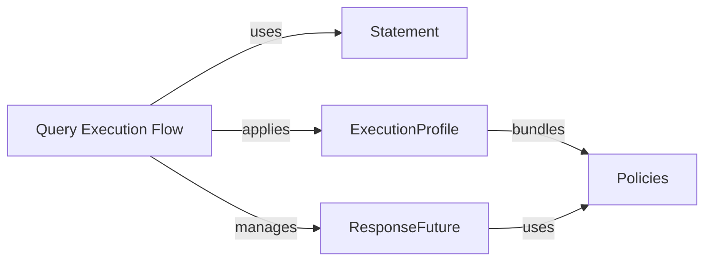

## Component Details

The Query Processing & Execution Policies component orchestrates the entire lifecycle of a query, from its initial definition to its final execution and result retrieval. It integrates various policies, such as load balancing, retry mechanisms, and speculative execution, to ensure optimal performance, resilience, and efficient resource utilization within the Cassandra cluster interactions.

### Query Execution Flow
This component represents the end-to-end process of executing a query, from its initial construction and preparation to the application of various execution policies (load balancing, retries, speculative execution) and the eventual retrieval of results. It orchestrates the interaction between statements, execution profiles, and response handling.

**Related Classes/Methods**:

- <a href="https://github.com/datastax/python-driver/blob/master/cassandra/query.py#L212-L375" target="_blank" rel="noopener noreferrer">`cassandra.query.Statement` (212:375)</a>
- <a href="https://github.com/datastax/python-driver/blob/master/cassandra/cluster.py#L4361-L5197" target="_blank" rel="noopener noreferrer">`cassandra.cluster.ResponseFuture` (4361:5197)</a>
- <a href="https://github.com/datastax/python-driver/blob/master/cassandra/cluster.py#L337-L439" target="_blank" rel="noopener noreferrer">`cassandra.cluster.ExecutionProfile` (337:439)</a>
- <a href="https://github.com/datastax/python-driver/blob/master/cassandra/policies.py#L93-L150" target="_blank" rel="noopener noreferrer">`cassandra.policies.LoadBalancingPolicy` (93:150)</a>
- <a href="https://github.com/datastax/python-driver/blob/master/cassandra/policies.py#L712-L873" target="_blank" rel="noopener noreferrer">`cassandra.policies.RetryPolicy` (712:873)</a>
- <a href="https://github.com/datastax/python-driver/blob/master/cassandra/policies.py#L1050-L1063" target="_blank" rel="noopener noreferrer">`python-driver.cassandra.policies.SpeculativeExecutionPolicy` (1050:1063)</a>
- <a href="https://github.com/datastax/python-driver/blob/master/cassandra/policies.py#L608-L623" target="_blank" rel="noopener noreferrer">`python-driver.cassandra.policies.ReconnectionPolicy` (608:623)</a>

### Statement
Abstract base class for all CQL statements. It defines common attributes and methods for different types of queries, including simple, prepared, bound, and batch statements. Subclasses implement specific behaviors for each query type.

**Related Classes/Methods**:

- <a href="https://github.com/datastax/python-driver/blob/master/cassandra/query.py#L212-L375" target="_blank" rel="noopener noreferrer">`python-driver.cassandra.query.Statement` (212:375)</a>

### ResponseFuture
Represents the asynchronous result of a query execution. It allows for non-blocking retrieval of results through callbacks or blocking via the result() method. It manages query timeouts, speculative executions, and applies retry policies.

**Related Classes/Methods**:

- <a href="https://github.com/datastax/python-driver/blob/master/cassandra/cluster.py#L4361-L5197" target="_blank" rel="noopener noreferrer">`python-driver.cassandra.cluster.ResponseFuture` (4361:5197)</a>

### ExecutionProfile
Defines a set of execution options and policies (load balancing, retry, speculative execution) that can be applied to queries. It allows for flexible configuration of query behavior without modifying individual query objects.

**Related Classes/Methods**:

- <a href="https://github.com/datastax/python-driver/blob/master/cassandra/cluster.py#L337-L439" target="_blank" rel="noopener noreferrer">`python-driver.cassandra.cluster.ExecutionProfile` (337:439)</a>

### Policies
A set of classes that define the driver's configurable behaviors, including load balancing (how queries are routed to hosts), reconnection (how the driver attempts to reconnect to downed hosts), retry (how the driver handles query failures), and speculative execution (sending multiple requests for a single query).

**Related Classes/Methods**:

- <a href="https://github.com/datastax/python-driver/blob/master/cassandra/policies.py#L93-L150" target="_blank" rel="noopener noreferrer">`python-driver.cassandra.policies.LoadBalancingPolicy` (93:150)</a>
- <a href="https://github.com/datastax/python-driver/blob/master/cassandra/policies.py#L712-L873" target="_blank" rel="noopener noreferrer">`python-driver.cassandra.policies.RetryPolicy` (712:873)</a>
- <a href="https://github.com/datastax/python-driver/blob/master/cassandra/policies.py#L1050-L1063" target="_blank" rel="noopener noreferrer">`python-driver.cassandra.policies.SpeculativeExecutionPolicy` (1050:1063)</a>
- <a href="https://github.com/datastax/python-driver/blob/master/cassandra/policies.py#L608-L623" target="_blank" rel="noopener noreferrer">`python-driver.cassandra.policies.ReconnectionPolicy` (608:623)</a>

### [FAQ](https://github.com/CodeBoarding/GeneratedOnBoardings/tree/main?tab=readme-ov-file#faq)