```mermaid
graph LR
    UDT_Management["UDT Management"]
    Schema_Metadata["Schema Metadata"]
    Keyspace_Metadata["Keyspace Metadata"]
    Table_Metadata["Table Metadata"]
    Schema_Parsers["Schema Parsers"]
    CQL_Engine_Models["CQL Engine Models"]
    CQL_Engine_QuerySet["CQL Engine QuerySet"]
    CQL_Engine_DML["CQL Engine DML"]
    Schema_Management["Schema Management"]
    Core_CQL_Types["Core CQL Types"]
    Protocol_Query_Utilities["Protocol & Query Utilities"]
    Connection_Management["Connection Management"]
    Token_Mapping["Token Mapping"]
    Metadata_Utilities["Metadata Utilities"]
    Schema_Metadata -- "invokes" --> Schema_Parsers
    Schema_Metadata -- "updates/drops" --> Keyspace_Metadata
    Schema_Metadata -- "manages" --> Token_Mapping
    Keyspace_Metadata -- "queries" --> UDT_Management
    Keyspace_Metadata -- "formats using" --> Metadata_Utilities
    Keyspace_Metadata -- "uses" --> Core_CQL_Types
    UDT_Management -- "creates" --> UDT_Management
    UDT_Management -- "formats using" --> Metadata_Utilities
    Table_Metadata -- "formats using" --> Metadata_Utilities
    Schema_Parsers -- "invokes" --> Protocol_Query_Utilities
    Schema_Parsers -- "uses" --> Core_CQL_Types
    Schema_Parsers -- "formats using" --> Metadata_Utilities
    Schema_Parsers -- "builds" --> Keyspace_Metadata
    Schema_Parsers -- "builds" --> Table_Metadata
    Schema_Parsers -- "builds" --> UDT_Management
    CQL_Engine_Models -- "persists via" --> CQL_Engine_DML
    CQL_Engine_Models -- "validates with" --> CQL_Engine_Models
    CQL_Engine_Models -- "generates name with" --> Metadata_Utilities
    CQL_Engine_Models -- "uses" --> Core_CQL_Types
    CQL_Engine_QuerySet -- "executes via" --> Connection_Management
    CQL_Engine_QuerySet -- "builds with" --> Protocol_Query_Utilities
    CQL_Engine_QuerySet -- "parses with" --> CQL_Engine_QuerySet
    CQL_Engine_DML -- "executes via" --> Connection_Management
    CQL_Engine_DML -- "builds with" --> Protocol_Query_Utilities
    Schema_Management -- "manages schema with" --> Connection_Management
    Schema_Management -- "uses" --> CQL_Engine_QuerySet
    Schema_Management -- "uses" --> Core_CQL_Types
    Schema_Management -- "uses" --> Keyspace_Metadata
    Schema_Management -- "uses" --> Table_Metadata
    Schema_Management -- "uses" --> UDT_Management
    Schema_Management -- "formats using" --> Metadata_Utilities
    Core_CQL_Types -- "used by" --> UDT_Management
    Core_CQL_Types -- "used by" --> Schema_Parsers
    Core_CQL_Types -- "used by" --> CQL_Engine_Models
    Core_CQL_Types -- "used by" --> CQL_Engine_QuerySet
    Core_CQL_Types -- "used by" --> Schema_Management
    Protocol_Query_Utilities -- "used by" --> Schema_Parsers
    Protocol_Query_Utilities -- "used by" --> CQL_Engine_QuerySet
    Protocol_Query_Utilities -- "used by" --> CQL_Engine_DML
    Connection_Management -- "used by" --> Schema_Metadata
    Connection_Management -- "used by" --> Schema_Parsers
    Connection_Management -- "used by" --> CQL_Engine_QuerySet
    Connection_Management -- "used by" --> CQL_Engine_DML
    Connection_Management -- "used by" --> Schema_Management
    Token_Mapping -- "used by" --> Schema_Metadata
    Metadata_Utilities -- "used by" --> Keyspace_Metadata
    Metadata_Utilities -- "used by" --> Table_Metadata
    Metadata_Utilities -- "used by" --> Schema_Parsers
    Metadata_Utilities -- "used by" --> CQL_Engine_Models
    Metadata_Utilities -- "used by" --> Schema_Management
```

## Component Details

This component manages the Cassandra schema metadata and provides an Object-Relational Mapper (ORM) for Python objects to CQL tables, simplifying data interaction and schema synchronization.

### UDT Management
Manages the creation, application of parameters, and serialization/deserialization of User Defined Types (UDTs) within the driver. It handles the mapping between Cassandra's internal UDT representation and Python objects.

**Related Classes/Methods**:

- <a href="https://github.com/datastax/python-driver/blob/master/cassandra/cqltypes.py#L984-L997" target="_blank" rel="noopener noreferrer">`cassandra.cqltypes.UserType.make_udt_class` (984:997)</a>
- <a href="https://github.com/datastax/python-driver/blob/master/cassandra/cqltypes.py#L1007-L1011" target="_blank" rel="noopener noreferrer">`cassandra.cqltypes.UserType.apply_parameters` (1007:1011)</a>
- <a href="https://github.com/datastax/python-driver/blob/master/cassandra/cqltypes.py#L1049-L1057" target="_blank" rel="noopener noreferrer">`cassandra.cqltypes.UserType._make_registered_udt_namedtuple` (1049:1057)</a>
- <a href="https://github.com/datastax/python-driver/blob/master/cassandra/cqltypes.py#L67-L69" target="_blank" rel="noopener noreferrer">`cassandra.cqltypes._name_from_hex_string` (67:69)</a>
- <a href="https://github.com/datastax/python-driver/blob/master/cassandra/cqlengine/usertype.py#L200-L227" target="_blank" rel="noopener noreferrer">`cassandra.cqlengine.usertype.UserType` (200:227)</a>

### Schema Metadata
Central repository for the cluster's schema and topology information. It provides methods to refresh the schema, retrieve host information, and manage keyspace, table, type, function, and aggregate metadata. It also manages the TokenMap.

**Related Classes/Methods**:

- <a href="https://github.com/datastax/python-driver/blob/master/cassandra/metadata.py#L133-L159" target="_blank" rel="noopener noreferrer">`cassandra.metadata.Metadata.refresh` (133:159)</a>
- <a href="https://github.com/datastax/python-driver/blob/master/cassandra/metadata.py#L161-L178" target="_blank" rel="noopener noreferrer">`cassandra.metadata.Metadata._rebuild_all` (161:178)</a>
- <a href="https://github.com/datastax/python-driver/blob/master/cassandra/metadata.py#L180-L194" target="_blank" rel="noopener noreferrer">`cassandra.metadata.Metadata._update_keyspace` (180:194)</a>
- <a href="https://github.com/datastax/python-driver/blob/master/cassandra/metadata.py#L196-L198" target="_blank" rel="noopener noreferrer">`cassandra.metadata.Metadata._drop_keyspace` (196:198)</a>
- <a href="https://github.com/datastax/python-driver/blob/master/cassandra/metadata.py#L262-L264" target="_blank" rel="noopener noreferrer">`cassandra.metadata.Metadata._keyspace_added` (262:264)</a>
- <a href="https://github.com/datastax/python-driver/blob/master/cassandra/metadata.py#L266-L268" target="_blank" rel="noopener noreferrer">`cassandra.metadata.Metadata._keyspace_updated` (266:268)</a>
- <a href="https://github.com/datastax/python-driver/blob/master/cassandra/metadata.py#L270-L272" target="_blank" rel="noopener noreferrer">`cassandra.metadata.Metadata._keyspace_removed` (270:272)</a>
- <a href="https://github.com/datastax/python-driver/blob/master/cassandra/metadata.py#L274-L301" target="_blank" rel="noopener noreferrer">`cassandra.metadata.Metadata.rebuild_token_map` (274:301)</a>
- <a href="https://github.com/datastax/python-driver/blob/master/cassandra/metadata.py#L303-L314" target="_blank" rel="noopener noreferrer">`cassandra.metadata.Metadata.get_replicas` (303:314)</a>
- <a href="https://github.com/datastax/python-driver/blob/master/cassandra/metadata.py#L339-L348" target="_blank" rel="noopener noreferrer">`cassandra.metadata.Metadata.get_host` (339:348)</a>
- <a href="https://github.com/datastax/python-driver/blob/master/cassandra/metadata.py#L350-L356" target="_blank" rel="noopener noreferrer">`cassandra.metadata.Metadata._get_host_by_address` (350:356)</a>

### Keyspace Metadata
Represents the schema details for a single Cassandra keyspace, including its name, durable writes setting, replication strategy, and collections of tables, indexes, user types, functions, aggregates, and views within that keyspace. It can export its definition as a CQL query string.

**Related Classes/Methods**:

- <a href="https://github.com/datastax/python-driver/blob/master/cassandra/metadata.py#L780-L809" target="_blank" rel="noopener noreferrer">`cassandra.metadata.KeyspaceMetadata.export_as_string` (780:809)</a>
- <a href="https://github.com/datastax/python-driver/blob/master/cassandra/metadata.py#L811-L824" target="_blank" rel="noopener noreferrer">`cassandra.metadata.KeyspaceMetadata.as_cql_query` (811:824)</a>
- <a href="https://github.com/datastax/python-driver/blob/master/cassandra/metadata.py#L826-L833" target="_blank" rel="noopener noreferrer">`cassandra.metadata.KeyspaceMetadata.user_type_strings` (826:833)</a>
- <a href="https://github.com/datastax/python-driver/blob/master/cassandra/metadata.py#L835-L841" target="_blank" rel="noopener noreferrer">`cassandra.metadata.KeyspaceMetadata.resolve_user_types` (835:841)</a>
- <a href="https://github.com/datastax/python-driver/blob/master/cassandra/metadata.py#L843-L860" target="_blank" rel="noopener noreferrer">`cassandra.metadata.KeyspaceMetadata._add_table_metadata` (843:860)</a>
- <a href="https://github.com/datastax/python-driver/blob/master/cassandra/metadata.py#L862-L877" target="_blank" rel="noopener noreferrer">`cassandra.metadata.KeyspaceMetadata._drop_table_metadata` (862:877)</a>
- <a href="https://github.com/datastax/python-driver/blob/master/cassandra/metadata.py#L879-L884" target="_blank" rel="noopener noreferrer">`cassandra.metadata.KeyspaceMetadata._add_view_metadata` (879:884)</a>

### Table Metadata
Encapsulates the schema definition of a Cassandra table, including its name, keyspace, primary key components (partition and clustering keys), columns, indexes, triggers, and table options. It supports generating CQL CREATE TABLE statements.

**Related Classes/Methods**:

- <a href="https://github.com/datastax/python-driver/blob/master/cassandra/metadata.py#L1298-L1324" target="_blank" rel="noopener noreferrer">`cassandra.metadata.TableMetadata.export_as_string` (1298:1324)</a>
- <a href="https://github.com/datastax/python-driver/blob/master/cassandra/metadata.py#L1326-L1347" target="_blank" rel="noopener noreferrer">`cassandra.metadata.TableMetadata._all_as_cql` (1326:1347)</a>
- <a href="https://github.com/datastax/python-driver/blob/master/cassandra/metadata.py#L1349-L1395" target="_blank" rel="noopener noreferrer">`cassandra.metadata.TableMetadata.as_cql_query` (1349:1395)</a>
- <a href="https://github.com/datastax/python-driver/blob/master/cassandra/metadata.py#L1398-L1417" target="_blank" rel="noopener noreferrer">`cassandra.metadata.TableMetadata._property_string` (1398:1417)</a>
- <a href="https://github.com/datastax/python-driver/blob/master/cassandra/metadata.py#L1420-L1446" target="_blank" rel="noopener noreferrer">`cassandra.metadata.TableMetadata._make_option_strings` (1420:1446)</a>
- <a href="https://github.com/datastax/python-driver/blob/master/cassandra/metadata.py#L1466-L1483" target="_blank" rel="noopener noreferrer">`cassandra.metadata.TableMetadataV3._make_option_strings` (1466:1483)</a>
- <a href="https://github.com/datastax/python-driver/blob/master/cassandra/metadata.py#L1494-L1513" target="_blank" rel="noopener noreferrer">`cassandra.metadata.TableMetadataDSE68.as_cql_query` (1494:1513)</a>
- <a href="https://github.com/datastax/python-driver/blob/master/cassandra/metadata.py#L1516-L1529" target="_blank" rel="noopener noreferrer">`cassandra.metadata.TableMetadataDSE68._export_edge_as_cql` (1516:1529)</a>

### Schema Parsers
A family of classes responsible for querying Cassandra's system tables to retrieve and parse schema information (keyspaces, tables, columns, types, functions, aggregates, views, vertices, edges) for different Cassandra and DSE versions. They build the corresponding metadata objects.

**Related Classes/Methods**:

- <a href="https://github.com/datastax/python-driver/blob/master/cassandra/metadata.py#L1923-L1949" target="_blank" rel="noopener noreferrer">`cassandra.metadata._SchemaParser._handle_results` (1923:1949)</a>
- <a href="https://github.com/datastax/python-driver/blob/master/cassandra/metadata.py#L1951-L1953" target="_blank" rel="noopener noreferrer">`cassandra.metadata._SchemaParser._query_build_row` (1951:1953)</a>
- <a href="https://github.com/datastax/python-driver/blob/master/cassandra/metadata.py#L1955-L1966" target="_blank" rel="noopener noreferrer">`cassandra.metadata._SchemaParser._query_build_rows` (1955:1966)</a>
- <a href="https://github.com/datastax/python-driver/blob/master/cassandra/metadata.py#L2009-L2024" target="_blank" rel="noopener noreferrer">`cassandra.metadata.SchemaParserV22.__init__` (2009:2024)</a>
- <a href="https://github.com/datastax/python-driver/blob/master/cassandra/metadata.py#L2026-L2052" target="_blank" rel="noopener noreferrer">`cassandra.metadata.SchemaParserV22.get_all_keyspaces` (2026:2052)</a>
- <a href="https://github.com/datastax/python-driver/blob/master/cassandra/metadata.py#L2054-L2070" target="_blank" rel="noopener noreferrer">`cassandra.metadata.SchemaParserV22.get_table` (2054:2070)</a>
- <a href="https://github.com/datastax/python-driver/blob/master/cassandra/metadata.py#L2072-L2074" target="_blank" rel="noopener noreferrer">`cassandra.metadata.SchemaParserV22.get_type` (2072:2074)</a>
- <a href="https://github.com/datastax/python-driver/blob/master/cassandra/metadata.py#L2076-L2079" target="_blank" rel="noopener noreferrer">`cassandra.metadata.SchemaParserV22.get_types_map` (2076:2079)</a>
- <a href="https://github.com/datastax/python-driver/blob/master/cassandra/metadata.py#L2081-L2084" target="_blank" rel="noopener noreferrer">`cassandra.metadata.SchemaParserV22.get_function` (2081:2084)</a>
- <a href="https://github.com/datastax/python-driver/blob/master/cassandra/metadata.py#L2086-L2090" target="_blank" rel="noopener noreferrer">`cassandra.metadata.SchemaParserV22.get_aggregate` (2086:2090)</a>
- <a href="https://github.com/datastax/python-driver/blob/master/cassandra/metadata.py#L2092-L2094" target="_blank" rel="noopener noreferrer">`cassandra.metadata.SchemaParserV22.get_keyspace` (2092:2094)</a>
- <a href="https://github.com/datastax/python-driver/blob/master/cassandra/metadata.py#L2097-L2105" target="_blank" rel="noopener noreferrer">`cassandra.metadata.SchemaParserV22._build_keyspace_metadata` (2097:2105)</a>
- <a href="https://github.com/datastax/python-driver/blob/master/cassandra/metadata.py#L2108-L2113" target="_blank" rel="noopener noreferrer">`cassandra.metadata.SchemaParserV22._build_keyspace_metadata_internal` (2108:2113)</a>
- <a href="https://github.com/datastax/python-driver/blob/master/cassandra/metadata.py#L2116-L2119" target="_blank" rel="noopener noreferrer">`cassandra.metadata.SchemaParserV22._build_user_type` (2116:2119)</a>
- <a href="https://github.com/datastax/python-driver/blob/master/cassandra/metadata.py#L2122-L2131" target="_blank" rel="noopener noreferrer">`cassandra.metadata.SchemaParserV22._build_function` (2122:2131)</a>
- <a href="https://github.com/datastax/python-driver/blob/master/cassandra/metadata.py#L2134-L2144" target="_blank" rel="noopener noreferrer">`cassandra.metadata.SchemaParserV22._build_aggregate` (2134:2144)</a>
- <a href="https://github.com/datastax/python-driver/blob/master/cassandra/metadata.py#L2146-L2304" target="_blank" rel="noopener noreferrer">`cassandra.metadata.SchemaParserV22._build_table_metadata` (2146:2304)</a>
- <a href="https://github.com/datastax/python-driver/blob/master/cassandra/metadata.py#L2322-L2331" target="_blank" rel="noopener noreferrer">`cassandra.metadata.SchemaParserV22._build_column_metadata` (2322:2331)</a>
- <a href="https://github.com/datastax/python-driver/blob/master/cassandra/metadata.py#L2334-L2361" target="_blank" rel="noopener noreferrer">`cassandra.metadata.SchemaParserV22._build_index_metadata` (2334:2361)</a>
- <a href="https://github.com/datastax/python-driver/blob/master/cassandra/metadata.py#L2364-L2368" target="_blank" rel="noopener noreferrer">`cassandra.metadata.SchemaParserV22._build_trigger_metadata` (2364:2368)</a>
- <a href="https://github.com/datastax/python-driver/blob/master/cassandra/metadata.py#L2370-L2437" target="_blank" rel="noopener noreferrer">`cassandra.metadata.SchemaParserV22._query_all` (2370:2437)</a>
- <a href="https://github.com/datastax/python-driver/blob/master/cassandra/metadata.py#L2469-L2471" target="_blank" rel="noopener noreferrer">`cassandra.metadata.SchemaParserV22._schema_type_to_cql` (2469:2471)</a>
- <a href="https://github.com/datastax/python-driver/blob/master/cassandra/metadata.py#L2511-L2515" target="_blank" rel="noopener noreferrer">`cassandra.metadata.SchemaParserV3.__init__` (2511:2515)</a>
- <a href="https://github.com/datastax/python-driver/blob/master/cassandra/metadata.py#L2517-L2522" target="_blank" rel="noopener noreferrer">`cassandra.metadata.SchemaParserV3.get_all_keyspaces` (2517:2522)</a>
- <a href="https://github.com/datastax/python-driver/blob/master/cassandra/metadata.py#L2524-L2552" target="_blank" rel="noopener noreferrer">`cassandra.metadata.SchemaParserV3.get_table` (2524:2552)</a>
- <a href="https://github.com/datastax/python-driver/blob/master/cassandra/metadata.py#L2555-L2560" target="_blank" rel="noopener noreferrer">`cassandra.metadata.SchemaParserV3._build_keyspace_metadata_internal` (2555:2560)</a>
- <a href="https://github.com/datastax/python-driver/blob/master/cassandra/metadata.py#L2563-L2567" target="_blank" rel="noopener noreferrer">`cassandra.metadata.SchemaParserV3._build_aggregate` (2563:2567)</a>
- <a href="https://github.com/datastax/python-driver/blob/master/cassandra/metadata.py#L2569-L2610" target="_blank" rel="noopener noreferrer">`cassandra.metadata.SchemaParserV3._build_table_metadata` (2569:2610)</a>
- <a href="https://github.com/datastax/python-driver/blob/master/cassandra/metadata.py#L2616-L2651" target="_blank" rel="noopener noreferrer">`cassandra.metadata.SchemaParserV3._build_table_columns` (2616:2651)</a>
- <a href="https://github.com/datastax/python-driver/blob/master/cassandra/metadata.py#L2653-L2665" target="_blank" rel="noopener noreferrer">`cassandra.metadata.SchemaParserV3._build_view_metadata` (2653:2665)</a>
- <a href="https://github.com/datastax/python-driver/blob/master/cassandra/metadata.py#L2668-L2674" target="_blank" rel="noopener noreferrer">`cassandra.metadata.SchemaParserV3._build_column_metadata` (2668:2674)</a>
- <a href="https://github.com/datastax/python-driver/blob/master/cassandra/metadata.py#L2677-L2684" target="_blank" rel="noopener noreferrer">`cassandra.metadata.SchemaParserV3._build_index_metadata` (2677:2684)</a>
- <a href="https://github.com/datastax/python-driver/blob/master/cassandra/metadata.py#L2687-L2691" target="_blank" rel="noopener noreferrer">`cassandra.metadata.SchemaParserV3._build_trigger_metadata` (2687:2691)</a>
- <a href="https://github.com/datastax/python-driver/blob/master/cassandra/metadata.py#L2693-L2729" target="_blank" rel="noopener noreferrer">`cassandra.metadata.SchemaParserV3._query_all` (2693:2729)</a>
- <a href="https://github.com/datastax/python-driver/blob/master/cassandra/metadata.py#L2731-L2742" target="_blank" rel="noopener noreferrer">`cassandra.metadata.SchemaParserV3._aggregate_results` (2731:2742)</a>
- <a href="https://github.com/datastax/python-driver/blob/master/cassandra/metadata.py#L2780-L2784" target="_blank" rel="noopener noreferrer">`cassandra.metadata.SchemaParserV4.__init__` (2780:2784)</a>
- <a href="https://github.com/datastax/python-driver/blob/master/cassandra/metadata.py#L2786-L2852" target="_blank" rel="noopener noreferrer">`cassandra.metadata.SchemaParserV4._query_all` (2786:2852)</a>
- <a href="https://github.com/datastax/python-driver/blob/master/cassandra/metadata.py#L2854-L2865" target="_blank" rel="noopener noreferrer">`cassandra.metadata.SchemaParserV4._aggregate_results` (2854:2865)</a>
- <a href="https://github.com/datastax/python-driver/blob/master/cassandra/metadata.py#L2867-L2885" target="_blank" rel="noopener noreferrer">`cassandra.metadata.SchemaParserV4.get_all_keyspaces` (2867:2885)</a>
- <a href="https://github.com/datastax/python-driver/blob/master/cassandra/metadata.py#L2914-L2917" target="_blank" rel="noopener noreferrer">`cassandra.metadata.SchemaParserDSE68.__init__` (2914:2917)</a>
- <a href="https://github.com/datastax/python-driver/blob/master/cassandra/metadata.py#L2919-L2922" target="_blank" rel="noopener noreferrer">`cassandra.metadata.SchemaParserDSE68.get_all_keyspaces` (2919:2922)</a>
- <a href="https://github.com/datastax/python-driver/blob/master/cassandra/metadata.py#L2924-L2947" target="_blank" rel="noopener noreferrer">`cassandra.metadata.SchemaParserDSE68.get_table` (2924:2947)</a>
- <a href="https://github.com/datastax/python-driver/blob/master/cassandra/metadata.py#L2950-L2956" target="_blank" rel="noopener noreferrer">`cassandra.metadata.SchemaParserDSE68._build_keyspace_metadata_internal` (2950:2956)</a>
- <a href="https://github.com/datastax/python-driver/blob/master/cassandra/metadata.py#L2958-L2982" target="_blank" rel="noopener noreferrer">`cassandra.metadata.SchemaParserDSE68._build_graph_metadata` (2958:2982)</a>
- <a href="https://github.com/datastax/python-driver/blob/master/cassandra/metadata.py#L2985-L2987" target="_blank" rel="noopener noreferrer">`cassandra.metadata.SchemaParserDSE68._build_table_vertex_metadata` (2985:2987)</a>
- <a href="https://github.com/datastax/python-driver/blob/master/cassandra/metadata.py#L2990-L3004" target="_blank" rel="noopener noreferrer">`cassandra.metadata.SchemaParserDSE68._build_table_edge_metadata` (2990:3004)</a>
- <a href="https://github.com/datastax/python-driver/blob/master/cassandra/metadata.py#L3006-L3078" target="_blank" rel="noopener noreferrer">`cassandra.metadata.SchemaParserDSE68._query_all` (3006:3078)</a>
- <a href="https://github.com/datastax/python-driver/blob/master/cassandra/metadata.py#L3080-L3093" target="_blank" rel="noopener noreferrer">`cassandra.metadata.SchemaParserDSE68._aggregate_results` (3080:3093)</a>
- <a href="https://github.com/datastax/python-driver/blob/master/cassandra/metadata.py#L3280-L3298" target="_blank" rel="noopener noreferrer">`cassandra.metadata.get_schema_parser` (3280:3298)</a>

### CQL Engine Models
Provides an Object-Relational Mapper (ORM) for Cassandra. BaseModel is the foundation for defining data models, handling object creation, validation, persistence (save, update, delete), and querying. ModelMetaClass is responsible for processing column definitions and setting up model-specific attributes during class creation.

**Related Classes/Methods**:

- <a href="https://github.com/datastax/python-driver/blob/master/cassandra/cqlengine/models.py#L88-L103" target="_blank" rel="noopener noreferrer">`cassandra.cqlengine.models.QuerySetDescriptor:__get__` (88:103)</a>
- <a href="https://github.com/datastax/python-driver/blob/master/cassandra/cqlengine/models.py#L289-L296" target="_blank" rel="noopener noreferrer">`cassandra.cqlengine.models.ColumnDescriptor:__init__` (289:296)</a>
- <a href="https://github.com/datastax/python-driver/blob/master/cassandra/cqlengine/models.py#L429-L438" target="_blank" rel="noopener noreferrer">`cassandra.cqlengine.models.BaseModel:_discover_polymorphic_submodels` (429:438)</a>
- <a href="https://github.com/datastax/python-driver/blob/master/cassandra/cqlengine/models.py#L441-L444" target="_blank" rel="noopener noreferrer">`cassandra.cqlengine.models.BaseModel:_get_model_by_discriminator_value` (441:444)</a>
- <a href="https://github.com/datastax/python-driver/blob/master/cassandra/cqlengine/models.py#L447-L487" target="_blank" rel="noopener noreferrer">`cassandra.cqlengine.models.BaseModel:_construct_instance` (447:487)</a>
- <a href="https://github.com/datastax/python-driver/blob/master/cassandra/cqlengine/models.py#L545-L546" target="_blank" rel="noopener noreferrer">`cassandra.cqlengine.models.BaseModel:__ne__` (545:546)</a>
- <a href="https://github.com/datastax/python-driver/blob/master/cassandra/cqlengine/models.py#L549-L561" target="_blank" rel="noopener noreferrer">`cassandra.cqlengine.models.BaseModel:column_family_name` (549:561)</a>
- <a href="https://github.com/datastax/python-driver/blob/master/cassandra/cqlengine/models.py#L565-L591" target="_blank" rel="noopener noreferrer">`cassandra.cqlengine.models.BaseModel:_raw_column_family_name` (565:591)</a>
- <a href="https://github.com/datastax/python-driver/blob/master/cassandra/cqlengine/models.py#L597-L606" target="_blank" rel="noopener noreferrer">`cassandra.cqlengine.models.BaseModel:validate` (597:606)</a>
- <a href="https://github.com/datastax/python-driver/blob/master/cassandra/cqlengine/models.py#L660-L672" target="_blank" rel="noopener noreferrer">`cassandra.cqlengine.models.BaseModel:create` (660:672)</a>
- <a href="https://github.com/datastax/python-driver/blob/master/cassandra/cqlengine/models.py#L710-L744" target="_blank" rel="noopener noreferrer">`cassandra.cqlengine.models.BaseModel:save` (710:744)</a>
- <a href="https://github.com/datastax/python-driver/blob/master/cassandra/cqlengine/models.py#L746-L797" target="_blank" rel="noopener noreferrer">`cassandra.cqlengine.models.BaseModel.update` (746:797)</a>
- <a href="https://github.com/datastax/python-driver/blob/master/cassandra/cqlengine/models.py#L799-L809" target="_blank" rel="noopener noreferrer">`cassandra.cqlengine.models.BaseModel.delete` (799:809)</a>
- <a href="https://github.com/datastax/python-driver/blob/master/cassandra/cqlengine/models.py#L821-L826" target="_blank" rel="noopener noreferrer">`cassandra.cqlengine.models.BaseModel._inst_batch` (821:826)</a>
- <a href="https://github.com/datastax/python-driver/blob/master/cassandra/cqlengine/models.py#L842-L1041" target="_blank" rel="noopener noreferrer">`cassandra.cqlengine.models.ModelMetaClass:__new__` (842:1041)</a>

### CQL Engine QuerySet
Provides an interface for building and executing read queries (SELECT statements) against Cassandra. It supports filtering, ordering, limiting, and fetching data, and manages a result cache.

**Related Classes/Methods**:

- <a href="https://github.com/datastax/python-driver/blob/master/cassandra/cqlengine/query.py#L300-L328" target="_blank" rel="noopener noreferrer">`cassandra.cqlengine.query.ContextQuery:__init__` (300:328)</a>
- <a href="https://github.com/datastax/python-driver/blob/master/cassandra/cqlengine/query.py#L398-L406" target="_blank" rel="noopener noreferrer">`cassandra.cqlengine.query.AbstractQuerySet._execute` (398:406)</a>
- <a href="https://github.com/datastax/python-driver/blob/master/cassandra/cqlengine/query.py#L408-L409" target="_blank" rel="noopener noreferrer">`cassandra.cqlengine.query.AbstractQuerySet:__unicode__` (408:409)</a>
- <a href="https://github.com/datastax/python-driver/blob/master/cassandra/cqlengine/query.py#L411-L412" target="_blank" rel="noopener noreferrer">`cassandra.cqlengine.query.AbstractQuerySet:__str__` (411:412)</a>
- <a href="https://github.com/datastax/python-driver/blob/master/cassandra/cqlengine/query.py#L414-L415" target="_blank" rel="noopener noreferrer">`cassandra.cqlengine.query.AbstractQuerySet:__call__` (414:415)</a>
- <a href="https://github.com/datastax/python-driver/blob/master/cassandra/cqlengine/query.py#L417-L433" target="_blank" rel="noopener noreferrer">`cassandra.cqlengine.query.AbstractQuerySet:__deepcopy__` (417:433)</a>
- <a href="https://github.com/datastax/python-driver/blob/master/cassandra/cqlengine/query.py#L435-L437" target="_blank" rel="noopener noreferrer">`cassandra.cqlengine.query.AbstractQuerySet:__len__` (435:437)</a>
- <a href="https://github.com/datastax/python-driver/blob/master/cassandra/cqlengine/query.py#L448-L463" target="_blank" rel="noopener noreferrer">`cassandra.cqlengine.query.AbstractQuerySet._select_query` (448:463)</a>
- <a href="https://github.com/datastax/python-driver/blob/master/cassandra/cqlengine/query.py#L467-L478" target="_blank" rel="noopener noreferrer">`cassandra.cqlengine.query.AbstractQuerySet._execute_query` (467:478)</a>
- <a href="https://github.com/datastax/python-driver/blob/master/cassandra/cqlengine/query.py#L480-L493" target="_blank" rel="noopener noreferrer">`cassandra.cqlengine.query.AbstractQuerySet._fill_result_cache` (480:493)</a>
- <a href="https://github.com/datastax/python-driver/blob/master/cassandra/cqlengine/query.py#L495-L511" target="_blank" rel="noopener noreferrer">`cassandra.cqlengine.query.AbstractQuerySet._fill_result_cache_to_idx` (495:511)</a>
- <a href="https://github.com/datastax/python-driver/blob/master/cassandra/cqlengine/query.py#L513-L529" target="_blank" rel="noopener noreferrer">`cassandra.cqlengine.query.AbstractQuerySet:__iter__` (513:529)</a>
- <a href="https://github.com/datastax/python-driver/blob/master/cassandra/cqlengine/query.py#L531-L572" target="_blank" rel="noopener noreferrer">`cassandra.cqlengine.query.AbstractQuerySet:__getitem__` (531:572)</a>
- <a href="https://github.com/datastax/python-driver/blob/master/cassandra/cqlengine/query.py#L589-L602" target="_blank" rel="noopener noreferrer">`cassandra.cqlengine.query.AbstractQuerySet:batch` (589:602)</a>
- <a href="https://github.com/datastax/python-driver/blob/master/cassandra/cqlengine/query.py#L634-L646" target="_blank" rel="noopener noreferrer">`cassandra.cqlengine.query.AbstractQuerySet._parse_filter_arg` (634:646)</a>
- <a href="https://github.com/datastax/python-driver/blob/master/cassandra/cqlengine/query.py#L648-L678" target="_blank" rel="noopener noreferrer">`cassandra.cqlengine.query.AbstractQuerySet:iff` (648:678)</a>
- <a href="https://github.com/datastax/python-driver/blob/master/cassandra/cqlengine/query.py#L680-L743" target="_blank" rel="noopener noreferrer">`cassandra.cqlengine.query.AbstractQuerySet:filter` (680:743)</a>
- <a href="https://github.com/datastax/python-driver/blob/master/cassandra/cqlengine/query.py#L745-L778" target="_blank" rel="noopener noreferrer">`cassandra.cqlengine.query.AbstractQuerySet:get` (745:778)</a>
- <a href="https://github.com/datastax/python-driver/blob/master/cassandra/cqlengine/query.py#L786-L828" target="_blank" rel="noopener noreferrer">`cassandra.cqlengine.query.AbstractQuerySet:order_by` (786:828)</a>
- <a href="https://github.com/datastax/python-driver/blob/master/cassandra/cqlengine/query.py#L830-L845" target="_blank" rel="noopener noreferrer">`cassandra.cqlengine.query.AbstractQuerySet:count` (830:845)</a>
- <a href="https://github.com/datastax/python-driver/blob/master/cassandra/cqlengine/query.py#L883-L913" target="_blank" rel="noopener noreferrer">`cassandra.cqlengine.query.AbstractQuerySet:limit` (883:913)</a>
- <a href="https://github.com/datastax/python-driver/blob/master/cassandra/cqlengine/query.py#L915-L937" target="_blank" rel="noopener noreferrer">`cassandra.cqlengine.query.AbstractQuerySet:fetch_size` (915:937)</a>
- <a href="https://github.com/datastax/python-driver/blob/master/cassandra/cqlengine/query.py#L947-L969" target="_blank" rel="noopener noreferrer">`cassandra.cqlengine.query.AbstractQuerySet._only_or_defer` (947:969)</a>
- <a href="https://github.com/datastax/python-driver/blob/master/cassandra/cqlengine/query.py#L971-L973" target="_blank" rel="noopener noreferrer">`cassandra.cqlengine.query.AbstractQuerySet:only` (971:973)</a>
- <a href="https://github.com/datastax/python-driver/blob/master/cassandra/cqlengine/query.py#L975-L977" target="_blank" rel="noopener noreferrer">`cassandra.cqlengine.query.AbstractQuerySet:defer` (975:977)</a>
- <a href="https://github.com/datastax/python-driver/blob/master/cassandra/cqlengine/query.py#L990-L1006" target="_blank" rel="noopener noreferrer">`cassandra.cqlengine.query.AbstractQuerySet:delete` (990:1006)</a>
- <a href="https://github.com/datastax/python-driver/blob/master/cassandra/cqlengine/query.py#L1025-L1041" target="_blank" rel="noopener noreferrer">`cassandra.cqlengine.query.AbstractQuerySet:using` (1025:1041)</a>
- <a href="https://github.com/datastax/python-driver/blob/master/cassandra/cqlengine/query.py#L1071-L1099" target="_blank" rel="noopener noreferrer">`cassandra.cqlengine.query.ModelQuerySet._validate_select_where` (1071:1099)</a>
- <a href="https://github.com/datastax/python-driver/blob/master/cassandra/cqlengine/query.py#L1101-L1115" target="_blank" rel="noopener noreferrer">`cassandra.cqlengine.query.ModelQuerySet._select_fields` (1101:1115)</a>
- <a href="https://github.com/datastax/python-driver/blob/master/cassandra/cqlengine/query.py#L1127-L1144" target="_blank" rel="noopener noreferrer">`cassandra.cqlengine.query.ModelQuerySet._get_ordering_condition` (1127:1144)</a>
- <a href="https://github.com/datastax/python-driver/blob/master/cassandra/cqlengine/query.py#L1146-L1157" target="_blank" rel="noopener noreferrer">`cassandra.cqlengine.query.ModelQuerySet.values_list` (1146:1157)</a>
- <a href="https://github.com/datastax/python-driver/blob/master/cassandra/cqlengine/query.py#L1177-L1187" target="_blank" rel="noopener noreferrer">`cassandra.cqlengine.query.ModelQuerySet.if_not_exists` (1177:1187)</a>
- <a href="https://github.com/datastax/python-driver/blob/master/cassandra/cqlengine/query.py#L1189-L1199" target="_blank" rel="noopener noreferrer">`cassandra.cqlengine.query.ModelQuerySet.if_exists` (1189:1199)</a>
- <a href="https://github.com/datastax/python-driver/blob/master/cassandra/cqlengine/query.py#L1201-L1332" target="_blank" rel="noopener noreferrer">`cassandra.cqlengine.query.ModelQuerySet.update` (1201:1332)</a>

### CQL Engine DML
Handles Data Manipulation Language (DML) operations (INSERT, UPDATE, DELETE) for CQL Engine models. It constructs and executes the appropriate CQL statements based on model changes and query parameters.

**Related Classes/Methods**:

- <a href="https://github.com/datastax/python-driver/blob/master/cassandra/cqlengine/query.py#L1363-L1378" target="_blank" rel="noopener noreferrer">`cassandra.cqlengine.query.DMLQuery._execute` (1363:1378)</a>
- <a href="https://github.com/datastax/python-driver/blob/master/cassandra/cqlengine/query.py#L1380-L1384" target="_blank" rel="noopener noreferrer">`cassandra.cqlengine.query.DMLQuery.batch` (1380:1384)</a>
- <a href="https://github.com/datastax/python-driver/blob/master/cassandra/cqlengine/query.py#L1386-L1410" target="_blank" rel="noopener noreferrer">`cassandra.cqlengine.query.DMLQuery._delete_null_columns` (1386:1410)</a>
- <a href="https://github.com/datastax/python-driver/blob/master/cassandra/cqlengine/query.py#L1412-L1461" target="_blank" rel="noopener noreferrer">`cassandra.cqlengine.query.DMLQuery.update` (1412:1461)</a>
- <a href="https://github.com/datastax/python-driver/blob/master/cassandra/cqlengine/query.py#L1463-L1504" target="_blank" rel="noopener noreferrer">`cassandra.cqlengine.query.DMLQuery.save` (1463:1504)</a>
- <a href="https://github.com/datastax/python-driver/blob/master/cassandra/cqlengine/query.py#L1506-L1517" target="_blank" rel="noopener noreferrer">`cassandra.cqlengine.query.DMLQuery.delete` (1506:1517)</a>

### Schema Management
Provides functions for managing Cassandra schema objects (keyspaces, tables, user types) programmatically. This includes creating, dropping, and synchronizing schema definitions with CQL Engine models.

**Related Classes/Methods**:

- <a href="https://github.com/datastax/python-driver/blob/master/cassandra/cqlengine/management.py#L163-L189" target="_blank" rel="noopener noreferrer">`cassandra.cqlengine.management.sync_table` (163:189)</a>
- <a href="https://github.com/datastax/python-driver/blob/master/cassandra/cqlengine/management.py#L192-L287" target="_blank" rel="noopener noreferrer">`cassandra.cqlengine.management._sync_table` (192:287)</a>
- <a href="https://github.com/datastax/python-driver/blob/master/cassandra/cqlengine/management.py#L40-L54" target="_blank" rel="noopener noreferrer">`cassandra.cqlengine.management._get_context` (40:54)</a>
- <a href="https://github.com/datastax/python-driver/blob/master/cassandra/cqlengine/management.py#L541-L547" target="_blank" rel="noopener noreferrer">`cassandra.cqlengine.management._allow_schema_modification` (541:547)</a>
- <a href="https://github.com/datastax/python-driver/blob/master/cassandra/cqlengine/management.py#L388-L423" target="_blank" rel="noopener noreferrer">`cassandra.cqlengine.management._get_create_table` (388:423)</a>
- <a href="https://github.com/datastax/python-driver/blob/master/cassandra/cqlengine/management.py#L290-L303" target="_blank" rel="noopener noreferrer">`cassandra.cqlengine.management._validate_pk` (290:303)</a>
- <a href="https://github.com/datastax/python-driver/blob/master/cassandra/cqlengine/management.py#L450-L497" target="_blank" rel="noopener noreferrer">`cassandra.cqlengine.management._update_options` (450:497)</a>
- <a href="https://github.com/datastax/python-driver/blob/master/cassandra/cqlengine/management.py#L151-L160" target="_blank" rel="noopener noreferrer">`cassandra.cqlengine.management._get_index_name_by_column` (151:160)</a>
- <a href="https://github.com/datastax/python-driver/blob/master/cassandra/cqlengine/management.py#L306-L324" target="_blank" rel="noopener noreferrer">`cassandra.cqlengine.management.sync_type` (306:324)</a>
- <a href="https://github.com/datastax/python-driver/blob/master/cassandra/cqlengine/management.py#L327-L377" target="_blank" rel="noopener noreferrer">`cassandra.cqlengine.management._sync_type` (327:377)</a>
- <a href="https://github.com/datastax/python-driver/blob/master/cassandra/cqlengine/management.py#L380-L385" target="_blank" rel="noopener noreferrer">`cassandra.cqlengine.management.get_create_type` (380:385)</a>
- <a href="https://github.com/datastax/python-driver/blob/master/cassandra/cqlengine/management.py#L426-L432" target="_blank" rel="noopener noreferrer">`cassandra.cqlengine.management._get_table_metadata` (426:432)</a>
- <a href="https://github.com/datastax/python-driver/blob/master/cassandra/cqlengine/management.py#L435-L447" target="_blank" rel="noopener noreferrer">`cassandra.cqlengine.management._options_map_from_strings` (435:447)</a>
- <a href="https://github.com/datastax/python-driver/blob/master/cassandra/cqlengine/management.py#L500-L519" target="_blank" rel="noopener noreferrer">`cassandra.cqlengine.management.drop_table` (500:519)</a>
- <a href="https://github.com/datastax/python-driver/blob/master/cassandra/cqlengine/management.py#L522-L538" target="_blank" rel="noopener noreferrer">`cassandra.cqlengine.management._drop_table` (522:538)</a>

### Core CQL Types
Defines the mapping between Cassandra CQL data types and Python types, including serialization and deserialization logic.

**Related Classes/Methods**:

- <a href="https://github.com/datastax/python-driver/blob/master/cassandra/cqltypes.py#L89-L90" target="_blank" rel="noopener noreferrer">`cassandra.cqltypes.cql_types_from_string` (89:90)</a>
- <a href="https://github.com/datastax/python-driver/blob/master/cassandra/cqltypes.py#L238-L255" target="_blank" rel="noopener noreferrer">`cassandra.cqltypes.lookup_casstype` (238:255)</a>
- <a href="https://github.com/datastax/python-driver/blob/master/cassandra/cqltypes.py#L258-L259" target="_blank" rel="noopener noreferrer">`cassandra.cqltypes.is_reversed_casstype` (258:259)</a>

### Protocol & Query Utilities
Provides low-level functionalities for interacting with the Cassandra wire protocol (e.g., QueryMessage) and utilities for binding parameters, handling results, and encoding data for CQL queries.

**Related Classes/Methods**:

- <a href="https://github.com/datastax/python-driver/blob/master/cassandra/protocol.py#L622-L634" target="_blank" rel="noopener noreferrer">`cassandra.protocol.QueryMessage` (622:634)</a>
- <a href="https://github.com/datastax/python-driver/blob/master/cassandra/query.py#L179-L195" target="_blank" rel="noopener noreferrer">`cassandra.query.dict_factory` (179:195)</a>
- <a href="https://github.com/datastax/python-driver/blob/master/cassandra/query.py#L901-L905" target="_blank" rel="noopener noreferrer">`cassandra.query.bind_params` (901:905)</a>
- <a href="https://github.com/datastax/python-driver/blob/master/cassandra/encoder.py#L206-L214" target="_blank" rel="noopener noreferrer">`cassandra.encoder.Encoder.cql_encode_all_types` (206:214)</a>

### Connection Management
Handles establishing and managing connections to the Cassandra cluster.

**Related Classes/Methods**:

- <a href="https://github.com/datastax/python-driver/blob/master/cassandra/cqlengine/connection.py#L362-L366" target="_blank" rel="noopener noreferrer">`cassandra.cqlengine.connection.get_cluster` (362:366)</a>
- <a href="https://github.com/datastax/python-driver/blob/master/cassandra/cqlengine/connection.py#L43-L51" target="_blank" rel="noopener noreferrer">`cassandra.cqlengine.connection.format_log_context` (43:51)</a>
- <a href="https://github.com/datastax/python-driver/blob/master/cassandra/cqlengine/connection.py#L336-L354" target="_blank" rel="noopener noreferrer">`cassandra.cqlengine.connection.execute` (336:354)</a>

### Token Mapping
Manages the mapping of tokens to hosts in the Cassandra ring, used for determining data replicas and routing queries.

**Related Classes/Methods**:

- <a href="https://github.com/datastax/python-driver/blob/master/cassandra/metadata.py#L1740-L1753" target="_blank" rel="noopener noreferrer">`cassandra.metadata.TokenMap.rebuild_keyspace` (1740:1753)</a>
- <a href="https://github.com/datastax/python-driver/blob/master/cassandra/metadata.py#L1762-L1763" target="_blank" rel="noopener noreferrer">`cassandra.metadata.TokenMap.remove_keyspace` (1762:1763)</a>
- <a href="https://github.com/datastax/python-driver/blob/master/cassandra/metadata.py#L1765-L1783" target="_blank" rel="noopener noreferrer">`cassandra.metadata.TokenMap.get_replicas` (1765:1783)</a>

### Metadata Utilities
Helper functions for handling CQL identifiers and values, ensuring proper escaping and formatting.

**Related Classes/Methods**:

- <a href="https://github.com/datastax/python-driver/blob/master/cassandra/metadata.py#L1567-L1568" target="_blank" rel="noopener noreferrer">`cassandra.metadata.protect_name` (1567:1568)</a>
- <a href="https://github.com/datastax/python-driver/blob/master/cassandra/metadata.py#L1575-L1580" target="_blank" rel="noopener noreferrer">`cassandra.metadata.protect_value` (1575:1580)</a>
- <a href="https://github.com/datastax/python-driver/blob/master/cassandra/metadata.py#L3301-L3309" target="_blank" rel="noopener noreferrer">`cassandra.metadata._cql_from_cass_type` (3301:3309)</a>

### [FAQ](https://github.com/CodeBoarding/GeneratedOnBoardings/tree/main?tab=readme-ov-file#faq)