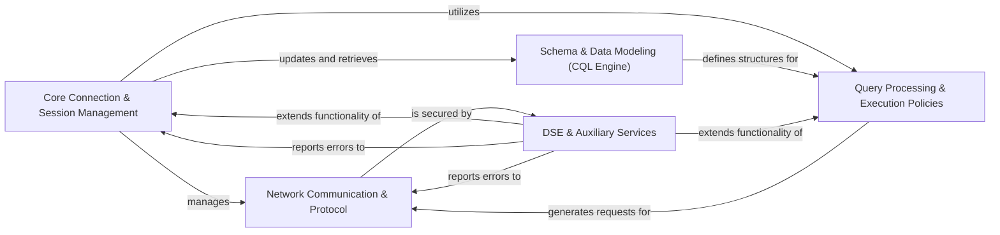

## Component Details

The `python-driver` provides a comprehensive interface for interacting with Cassandra and DataStax Enterprise clusters. Its core functionality revolves around managing connections, executing CQL queries, and handling data modeling. The architecture is modular, separating concerns such as network communication, query execution policies, schema management, and DSE-specific features. The main flow involves a user initiating a query through a Session, which leverages connection pools and execution policies to send the request over the network. The driver then handles protocol-level details, processes responses, and updates its internal metadata model, while also providing ORM capabilities for higher-level data manipulation.

### Core Connection & Session Management
This component is the heart of the driver, responsible for establishing and maintaining connections to the Cassandra cluster, managing sessions for query execution, and handling connection pooling. It also includes the control connection for cluster topology and schema updates.

**Related Classes/Methods**:

- <a href="https://github.com/datastax/python-driver/blob/master/cassandra/cluster.py#L596-L2350" target="_blank" rel="noopener noreferrer">`cassandra.cluster.Cluster` (596:2350)</a>
- <a href="https://github.com/datastax/python-driver/blob/master/cassandra/cluster.py#L2353-L3504" target="_blank" rel="noopener noreferrer">`cassandra.cluster.Session` (2353:3504)</a>
- <a href="https://github.com/datastax/python-driver/blob/master/cassandra/cluster.py#L3562-L4257" target="_blank" rel="noopener noreferrer">`cassandra.cluster.ControlConnection` (3562:4257)</a>
- <a href="https://github.com/datastax/python-driver/blob/master/cassandra/pool.py#L584-L933" target="_blank" rel="noopener noreferrer">`cassandra.pool.HostConnectionPool` (584:933)</a>
- <a href="https://github.com/datastax/python-driver/blob/master/cassandra/cqlengine/connection.py#L58-L148" target="_blank" rel="noopener noreferrer">`cassandra.cqlengine.connection.Connection` (58:148)</a>

### Network Communication & Protocol
This component handles the low-level network interactions, including socket operations, data serialization/deserialization according to the Cassandra native protocol, and the underlying asynchronous I/O event loops.

**Related Classes/Methods**:

- <a href="https://github.com/datastax/python-driver/blob/master/cassandra/connection.py#L661-L1588" target="_blank" rel="noopener noreferrer">`cassandra.connection.Connection` (661:1588)</a>
- <a href="https://github.com/datastax/python-driver/blob/master/cassandra/protocol.py#L1087-L1212" target="_blank" rel="noopener noreferrer">`cassandra.protocol._ProtocolHandler` (1087:1212)</a>
- <a href="https://github.com/datastax/python-driver/blob/master/cassandra/marshal.py#L59-L74" target="_blank" rel="noopener noreferrer">`cassandra.marshal.varint_pack` (59:74)</a>
- <a href="https://github.com/datastax/python-driver/blob/master/cassandra/io/asyncorereactor.py#L312-L476" target="_blank" rel="noopener noreferrer">`cassandra.io.asyncorereactor.AsyncoreConnection` (312:476)</a>

### Query Processing & Execution Policies
This component defines how queries are constructed, prepared, and executed, incorporating various policies for load balancing, retries, reconnections, and speculative execution to optimize performance and resilience.

**Related Classes/Methods**:

- <a href="https://github.com/datastax/python-driver/blob/master/cassandra/query.py#L212-L375" target="_blank" rel="noopener noreferrer">`cassandra.query.Statement` (212:375)</a>
- <a href="https://github.com/datastax/python-driver/blob/master/cassandra/cluster.py#L4361-L5197" target="_blank" rel="noopener noreferrer">`cassandra.cluster.ResponseFuture` (4361:5197)</a>
- <a href="https://github.com/datastax/python-driver/blob/master/cassandra/cluster.py#L337-L439" target="_blank" rel="noopener noreferrer">`cassandra.cluster.ExecutionProfile` (337:439)</a>
- <a href="https://github.com/datastax/python-driver/blob/master/cassandra/policies.py#L93-L150" target="_blank" rel="noopener noreferrer">`cassandra.policies.LoadBalancingPolicy` (93:150)</a>
- <a href="https://github.com/datastax/python-driver/blob/master/cassandra/policies.py#L712-L873" target="_blank" rel="noopener noreferrer">`cassandra.policies.RetryPolicy` (712:873)</a>

### Schema & Data Modeling (CQL Engine)
This component manages the Cassandra schema metadata and provides an Object-Relational Mapper (ORM) for Python objects to CQL tables, simplifying data interaction and schema synchronization.

**Related Classes/Methods**:

- <a href="https://github.com/datastax/python-driver/blob/master/cassandra/metadata.py#L96-L363" target="_blank" rel="noopener noreferrer">`cassandra.metadata.Metadata` (96:363)</a>
- <a href="https://github.com/datastax/python-driver/blob/master/cassandra/metadata.py#L1917-L1966" target="_blank" rel="noopener noreferrer">`cassandra.metadata._SchemaParser` (1917:1966)</a>
- <a href="https://github.com/datastax/python-driver/blob/master/cassandra/cqlengine/models.py#L332-L837" target="_blank" rel="noopener noreferrer">`cassandra.cqlengine.models.BaseModel` (332:837)</a>
- <a href="https://github.com/datastax/python-driver/blob/master/cassandra/cqlengine/query.py#L339-L1041" target="_blank" rel="noopener noreferrer">`cassandra.cqlengine.query.AbstractQuerySet` (339:1041)</a>
- <a href="https://github.com/datastax/python-driver/blob/master/cassandra/cqlengine/management.py#L163-L189" target="_blank" rel="noopener noreferrer">`cassandra.cqlengine.management.sync_table` (163:189)</a>

### DSE & Auxiliary Services
This component encompasses specialized integrations for DataStax Enterprise features (like Graph and Insights), authentication mechanisms, and general utility functions and error handling.

**Related Classes/Methods**:

- <a href="https://github.com/datastax/python-driver/blob/master/cassandra/datastax/graph/types.py#L18-L41" target="_blank" rel="noopener noreferrer">`cassandra.datastax.graph.types.Element` (18:41)</a>
- <a href="https://github.com/datastax/python-driver/blob/master/cassandra/datastax/insights/reporter.py#L36-L221" target="_blank" rel="noopener noreferrer">`cassandra.datastax.insights.reporter.MonitorReporter` (36:221)</a>
- `cassandra.datastax.cloud.CloudConfig` (full file reference)
- <a href="https://github.com/datastax/python-driver/blob/master/cassandra/auth.py#L115-L136" target="_blank" rel="noopener noreferrer">`cassandra.auth.PlainTextAuthProvider` (115:136)</a>
- <a href="https://github.com/datastax/python-driver/blob/master/cassandra/cluster.py#L197-L212" target="_blank" rel="noopener noreferrer">`cassandra.cluster.NoHostAvailable` (197:212)</a>
- <a href="https://github.com/datastax/python-driver/blob/master/cassandra/util.py#L97-L104" target="_blank" rel="noopener noreferrer">`cassandra.util.datetime_from_uuid1` (97:104)</a>

### [FAQ](https://github.com/CodeBoarding/GeneratedOnBoardings/tree/main?tab=readme-ov-file#faq)