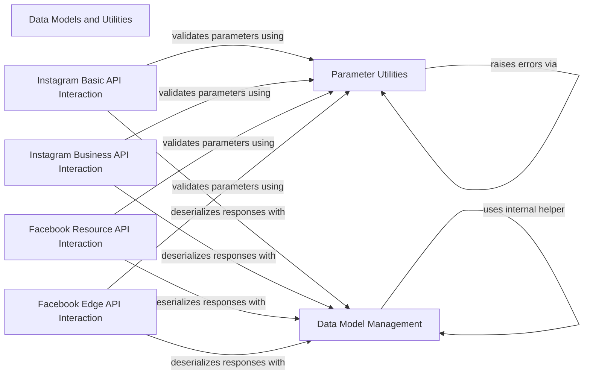

## Component Details

This architecture overview details the core components of the `pyfacebook` library, focusing on data modeling, utility functions for parameter handling, and interactions with various Facebook and Instagram APIs. The system is designed to ensure consistent data serialization/deserialization and robust API request construction, with clear separation of concerns for different API functionalities.

### Data Models and Utilities
Provides the base classes for data serialization/deserialization from JSON and common utility functions for parameter validation and formatting across the library, ensuring data consistency and correct API request construction.

**Related Classes/Methods**:

- <a href="https://github.com/sns-sdks/python-facebook/blob/master/pyfacebook/models/base.py#L23-L51" target="_blank" rel="noopener noreferrer">`pyfacebook.models.base.BaseModel` (23:51)</a>
- <a href="https://github.com/sns-sdks/python-facebook/blob/master/pyfacebook/utils/params_utils.py#L10-L45" target="_blank" rel="noopener noreferrer">`pyfacebook.utils.params_utils:enf_comma_separated` (10:45)</a>

### Parameter Utilities
This component is responsible for validating and formatting input parameters, specifically ensuring that values are correctly handled as comma-separated strings or lists/tuples. It raises `LibraryError` for invalid parameter types.

**Related Classes/Methods**:

- <a href="https://github.com/sns-sdks/python-facebook/blob/master/pyfacebook/utils/params_utils.py#L10-L45" target="_blank" rel="noopener noreferrer">`pyfacebook.utils.params_utils:enf_comma_separated` (10:45)</a>
- <a href="https://github.com/sns-sdks/python-facebook/blob/master/pyfacebook/exceptions.py#L12-L30" target="_blank" rel="noopener noreferrer">`pyfacebook.exceptions.LibraryError` (12:30)</a>

### Data Model Management
This component provides the foundational `BaseModel` for data representation and includes methods for creating model instances from JSON dictionaries (`new_from_json_dict`) and converting model instances back to dictionaries (`to_dict`, `dict_minus_none_values`).

**Related Classes/Methods**:

- <a href="https://github.com/sns-sdks/python-facebook/blob/master/pyfacebook/models/base.py#L23-L51" target="_blank" rel="noopener noreferrer">`pyfacebook.models.base.BaseModel` (23:51)</a>
- <a href="https://github.com/sns-sdks/python-facebook/blob/master/pyfacebook/models/base.py#L25-L39" target="_blank" rel="noopener noreferrer">`pyfacebook.models.base.BaseModel.new_from_json_dict` (25:39)</a>
- `pyfacebook.models.base:to_dict` (full file reference)
- <a href="https://github.com/sns-sdks/python-facebook/blob/master/pyfacebook/models/base.py#L54-L72" target="_blank" rel="noopener noreferrer">`pyfacebook.models.base:dict_minus_none_values` (54:72)</a>

### Instagram Basic API Interaction
This component encapsulates the logic for interacting with the Instagram Basic Display API, allowing retrieval of media and user information.

**Related Classes/Methods**:

- <a href="https://github.com/sns-sdks/python-facebook/blob/master/pyfacebook/api/instagram_basic/resource/media.py#L14-L42" target="_blank" rel="noopener noreferrer">`pyfacebook.api.instagram_basic.resource.media.IGBasicMedia:get_info` (14:42)</a>
- <a href="https://github.com/sns-sdks/python-facebook/blob/master/pyfacebook/api/instagram_basic/resource/media.py#L44-L73" target="_blank" rel="noopener noreferrer">`pyfacebook.api.instagram_basic.resource.media.IGBasicMedia:get_batch` (44:73)</a>
- <a href="https://github.com/sns-sdks/python-facebook/blob/master/pyfacebook/api/instagram_basic/resource/media.py#L75-L103" target="_blank" rel="noopener noreferrer">`pyfacebook.api.instagram_basic.resource.media.IGBasicMedia:get_children` (75:103)</a>
- <a href="https://github.com/sns-sdks/python-facebook/blob/master/pyfacebook/api/instagram_basic/resource/user.py#L14-L40" target="_blank" rel="noopener noreferrer">`pyfacebook.api.instagram_basic.resource.user.IGBasicUser:get_info` (14:40)</a>
- <a href="https://github.com/sns-sdks/python-facebook/blob/master/pyfacebook/api/instagram_basic/resource/user.py#L42-L82" target="_blank" rel="noopener noreferrer">`pyfacebook.api.instagram_basic.resource.user.IGBasicUser:get_media` (42:82)</a>

### Instagram Business API Interaction
This component manages all interactions with the Instagram Business API, including operations on comments, media, containers, hashtags, and business user data, along with insights and product tagging.

**Related Classes/Methods**:

- <a href="https://github.com/sns-sdks/python-facebook/blob/master/pyfacebook/api/instagram_business/resource/comment.py#L14-L40" target="_blank" rel="noopener noreferrer">`pyfacebook.api.instagram_business.resource.comment.IGBusinessComment:get_info` (14:40)</a>
- <a href="https://github.com/sns-sdks/python-facebook/blob/master/pyfacebook/api/instagram_business/resource/comment.py#L42-L72" target="_blank" rel="noopener noreferrer">`pyfacebook.api.instagram_business.resource.comment.IGBusinessComment:get_batch` (42:72)</a>
- <a href="https://github.com/sns-sdks/python-facebook/blob/master/pyfacebook/api/instagram_business/resource/comment.py#L74-L109" target="_blank" rel="noopener noreferrer">`pyfacebook.api.instagram_business.resource.comment.IGBusinessComment:get_replies` (74:109)</a>
- <a href="https://github.com/sns-sdks/python-facebook/blob/master/pyfacebook/api/instagram_business/resource/comment.py#L113-L139" target="_blank" rel="noopener noreferrer">`pyfacebook.api.instagram_business.resource.comment.IGBusinessReply:get_info` (113:139)</a>
- <a href="https://github.com/sns-sdks/python-facebook/blob/master/pyfacebook/api/instagram_business/resource/comment.py#L141-L171" target="_blank" rel="noopener noreferrer">`pyfacebook.api.instagram_business.resource.comment.IGBusinessReply:get_batch` (141:171)</a>
- <a href="https://github.com/sns-sdks/python-facebook/blob/master/pyfacebook/api/instagram_business/resource/media.py#L20-L46" target="_blank" rel="noopener noreferrer">`pyfacebook.api.instagram_business.resource.media.IGBusinessMedia:get_info` (20:46)</a>
- <a href="https://github.com/sns-sdks/python-facebook/blob/master/pyfacebook/api/instagram_business/resource/media.py#L48-L78" target="_blank" rel="noopener noreferrer">`pyfacebook.api.instagram_business.resource.media.IGBusinessMedia:get_batch` (48:78)</a>
- <a href="https://github.com/sns-sdks/python-facebook/blob/master/pyfacebook/api/instagram_business/resource/media.py#L80-L115" target="_blank" rel="noopener noreferrer">`pyfacebook.api.instagram_business.resource.media.IGBusinessMedia:get_comments` (80:115)</a>
- <a href="https://github.com/sns-sdks/python-facebook/blob/master/pyfacebook/api/instagram_business/resource/media.py#L117-L145" target="_blank" rel="noopener noreferrer">`pyfacebook.api.instagram_business.resource.media.IGBusinessMedia:get_children` (117:145)</a>
- <a href="https://github.com/sns-sdks/python-facebook/blob/master/pyfacebook/api/instagram_business/resource/media.py#L147-L178" target="_blank" rel="noopener noreferrer">`pyfacebook.api.instagram_business.resource.media.IGBusinessMedia:get_insights` (147:178)</a>
- <a href="https://github.com/sns-sdks/python-facebook/blob/master/pyfacebook/api/instagram_business/resource/media.py#L180-L198" target="_blank" rel="noopener noreferrer">`pyfacebook.api.instagram_business.resource.media.IGBusinessMedia:get_product_tags` (180:198)</a>
- <a href="https://github.com/sns-sdks/python-facebook/blob/master/pyfacebook/api/instagram_business/resource/container.py#L14-L40" target="_blank" rel="noopener noreferrer">`pyfacebook.api.instagram_business.resource.container.IGBusinessContainer:get_info` (14:40)</a>
- <a href="https://github.com/sns-sdks/python-facebook/blob/master/pyfacebook/api/instagram_business/resource/container.py#L42-L72" target="_blank" rel="noopener noreferrer">`pyfacebook.api.instagram_business.resource.container.IGBusinessContainer:get_batch` (42:72)</a>
- <a href="https://github.com/sns-sdks/python-facebook/blob/master/pyfacebook/api/instagram_business/resource/hashtag.py#L14-L40" target="_blank" rel="noopener noreferrer">`pyfacebook.api.instagram_business.resource.hashtag.IGBusinessHashtag:get_info` (14:40)</a>
- <a href="https://github.com/sns-sdks/python-facebook/blob/master/pyfacebook/api/instagram_business/resource/hashtag.py#L42-L72" target="_blank" rel="noopener noreferrer">`pyfacebook.api.instagram_business.resource.hashtag.IGBusinessHashtag:get_batch` (42:72)</a>
- <a href="https://github.com/sns-sdks/python-facebook/blob/master/pyfacebook/api/instagram_business/resource/hashtag.py#L74-L111" target="_blank" rel="noopener noreferrer">`pyfacebook.api.instagram_business.resource.hashtag.IGBusinessHashtag:get_top_media` (74:111)</a>
- <a href="https://github.com/sns-sdks/python-facebook/blob/master/pyfacebook/api/instagram_business/resource/hashtag.py#L113-L150" target="_blank" rel="noopener noreferrer">`pyfacebook.api.instagram_business.resource.hashtag.IGBusinessHashtag:get_recent_media` (113:150)</a>
- <a href="https://github.com/sns-sdks/python-facebook/blob/master/pyfacebook/api/instagram_business/resource/user.py#L27-L55" target="_blank" rel="noopener noreferrer">`pyfacebook.api.instagram_business.resource.user.IGBusinessUser:get_info` (27:55)</a>
- <a href="https://github.com/sns-sdks/python-facebook/blob/master/pyfacebook/api/instagram_business/resource/user.py#L57-L86" target="_blank" rel="noopener noreferrer">`pyfacebook.api.instagram_business.resource.user.IGBusinessUser:discovery_user` (57:86)</a>
- <a href="https://github.com/sns-sdks/python-facebook/blob/master/pyfacebook/api/instagram_business/resource/user.py#L88-L137" target="_blank" rel="noopener noreferrer">`pyfacebook.api.instagram_business.resource.user.IGBusinessUser:discovery_user_medias` (88:137)</a>
- <a href="https://github.com/sns-sdks/python-facebook/blob/master/pyfacebook/api/instagram_business/resource/user.py#L139-L165" target="_blank" rel="noopener noreferrer">`pyfacebook.api.instagram_business.resource.user.IGBusinessUser:get_content_publishing_limit` (139:165)</a>
- <a href="https://github.com/sns-sdks/python-facebook/blob/master/pyfacebook/api/instagram_business/resource/user.py#L167-L229" target="_blank" rel="noopener noreferrer">`pyfacebook.api.instagram_business.resource.user.IGBusinessUser:get_insights` (167:229)</a>
- <a href="https://github.com/sns-sdks/python-facebook/blob/master/pyfacebook/api/instagram_business/resource/user.py#L231-L270" target="_blank" rel="noopener noreferrer">`pyfacebook.api.instagram_business.resource.user.IGBusinessUser:get_media` (231:270)</a>
- <a href="https://github.com/sns-sdks/python-facebook/blob/master/pyfacebook/api/instagram_business/resource/user.py#L272-L312" target="_blank" rel="noopener noreferrer">`pyfacebook.api.instagram_business.resource.user.IGBusinessUser:get_live_media` (272:312)</a>
- <a href="https://github.com/sns-sdks/python-facebook/blob/master/pyfacebook/api/instagram_business/resource/user.py#L314-L343" target="_blank" rel="noopener noreferrer">`pyfacebook.api.instagram_business.resource.user.IGBusinessUser:get_mentioned_comment` (314:343)</a>
- <a href="https://github.com/sns-sdks/python-facebook/blob/master/pyfacebook/api/instagram_business/resource/user.py#L345-L373" target="_blank" rel="noopener noreferrer">`pyfacebook.api.instagram_business.resource.user.IGBusinessUser:get_mentioned_media` (345:373)</a>
- <a href="https://github.com/sns-sdks/python-facebook/blob/master/pyfacebook/api/instagram_business/resource/user.py#L375-L399" target="_blank" rel="noopener noreferrer">`pyfacebook.api.instagram_business.resource.user.IGBusinessUser:get_hashtag_search` (375:399)</a>
- <a href="https://github.com/sns-sdks/python-facebook/blob/master/pyfacebook/api/instagram_business/resource/user.py#L401-L433" target="_blank" rel="noopener noreferrer">`pyfacebook.api.instagram_business.resource.user.IGBusinessUser:get_recently_searched_hashtags` (401:433)</a>
- <a href="https://github.com/sns-sdks/python-facebook/blob/master/pyfacebook/api/instagram_business/resource/user.py#L435-L468" target="_blank" rel="noopener noreferrer">`pyfacebook.api.instagram_business.resource.user.IGBusinessUser:get_stories` (435:468)</a>
- <a href="https://github.com/sns-sdks/python-facebook/blob/master/pyfacebook/api/instagram_business/resource/user.py#L470-L503" target="_blank" rel="noopener noreferrer">`pyfacebook.api.instagram_business.resource.user.IGBusinessUser:get_tagged_media` (470:503)</a>
- <a href="https://github.com/sns-sdks/python-facebook/blob/master/pyfacebook/api/instagram_business/resource/user.py#L505-L523" target="_blank" rel="noopener noreferrer">`pyfacebook.api.instagram_business.resource.user.IGBusinessUser:get_available_catalogs` (505:523)</a>
- <a href="https://github.com/sns-sdks/python-facebook/blob/master/pyfacebook/api/instagram_business/resource/user.py#L525-L558" target="_blank" rel="noopener noreferrer">`pyfacebook.api.instagram_business.resource.user.IGBusinessUser:get_catalog_product_search` (525:558)</a>
- <a href="https://github.com/sns-sdks/python-facebook/blob/master/pyfacebook/api/instagram_business/resource/user.py#L560-L582" target="_blank" rel="noopener noreferrer">`pyfacebook.api.instagram_business.resource.user.IGBusinessUser:get_product_appeal` (560:582)</a>

### Facebook Resource API Interaction
This component provides a comprehensive set of clients for managing various Facebook Graph API resources, including conversations, videos, comments, posts, live videos, albums, pages, photos, businesses, messages, groups, applications, events, and user profiles.

**Related Classes/Methods**:

- <a href="https://github.com/sns-sdks/python-facebook/blob/master/pyfacebook/api/facebook/resource/conversation.py#L14-L41" target="_blank" rel="noopener noreferrer">`pyfacebook.api.facebook.resource.conversation.FacebookConversation:get_info` (14:41)</a>
- <a href="https://github.com/sns-sdks/python-facebook/blob/master/pyfacebook/api/facebook/resource/conversation.py#L43-L75" target="_blank" rel="noopener noreferrer">`pyfacebook.api.facebook.resource.conversation.FacebookConversation:get_batch` (43:75)</a>
- <a href="https://github.com/sns-sdks/python-facebook/blob/master/pyfacebook/api/facebook/resource/video.py#L15-L40" target="_blank" rel="noopener noreferrer">`pyfacebook.api.facebook.resource.video.FacebookVideo:get_info` (15:40)</a>
- <a href="https://github.com/sns-sdks/python-facebook/blob/master/pyfacebook/api/facebook/resource/video.py#L42-L74" target="_blank" rel="noopener noreferrer">`pyfacebook.api.facebook.resource.video.FacebookVideo:get_batch` (42:74)</a>
- <a href="https://github.com/sns-sdks/python-facebook/blob/master/pyfacebook/api/facebook/resource/comment.py#L15-L42" target="_blank" rel="noopener noreferrer">`pyfacebook.api.facebook.resource.comment.FacebookComment:get_info` (15:42)</a>
- <a href="https://github.com/sns-sdks/python-facebook/blob/master/pyfacebook/api/facebook/resource/comment.py#L44-L76" target="_blank" rel="noopener noreferrer">`pyfacebook.api.facebook.resource.comment.FacebookComment:get_batch` (44:76)</a>
- <a href="https://github.com/sns-sdks/python-facebook/blob/master/pyfacebook/api/facebook/resource/comment.py#L78-L130" target="_blank" rel="noopener noreferrer">`pyfacebook.api.facebook.resource.comment.FacebookComment:create` (78:130)</a>
- <a href="https://github.com/sns-sdks/python-facebook/blob/master/pyfacebook/api/facebook/resource/comment.py#L132-L188" target="_blank" rel="noopener noreferrer">`pyfacebook.api.facebook.resource.comment.FacebookComment:update` (132:188)</a>
- <a href="https://github.com/sns-sdks/python-facebook/blob/master/pyfacebook/api/facebook/resource/post.py#L15-L41" target="_blank" rel="noopener noreferrer">`pyfacebook.api.facebook.resource.post.FacebookPost:get_info` (15:41)</a>
- <a href="https://github.com/sns-sdks/python-facebook/blob/master/pyfacebook/api/facebook/resource/post.py#L43-L73" target="_blank" rel="noopener noreferrer">`pyfacebook.api.facebook.resource.post.FacebookPost:get_batch` (43:73)</a>
- <a href="https://github.com/sns-sdks/python-facebook/blob/master/pyfacebook/api/facebook/resource/live_video.py#L15-L42" target="_blank" rel="noopener noreferrer">`pyfacebook.api.facebook.resource.live_video.FacebookLiveVideo:get_info` (15:42)</a>
- <a href="https://github.com/sns-sdks/python-facebook/blob/master/pyfacebook/api/facebook/resource/live_video.py#L44-L76" target="_blank" rel="noopener noreferrer">`pyfacebook.api.facebook.resource.live_video.FacebookLiveVideo:get_batch` (44:76)</a>
- <a href="https://github.com/sns-sdks/python-facebook/blob/master/pyfacebook/api/facebook/resource/album.py#L15-L42" target="_blank" rel="noopener noreferrer">`pyfacebook.api.facebook.resource.album.FacebookAlbum:get_info` (15:42)</a>
- <a href="https://github.com/sns-sdks/python-facebook/blob/master/pyfacebook/api/facebook/resource/album.py#L44-L75" target="_blank" rel="noopener noreferrer">`pyfacebook.api.facebook.resource.album.FacebookAlbum:get_batch` (44:75)</a>
- <a href="https://github.com/sns-sdks/python-facebook/blob/master/pyfacebook/api/facebook/resource/page.py#L34-L71" target="_blank" rel="noopener noreferrer">`pyfacebook.api.facebook.resource.page.FacebookPage:get_info` (34:71)</a>
- <a href="https://github.com/sns-sdks/python-facebook/blob/master/pyfacebook/api/facebook/resource/page.py#L73-L103" target="_blank" rel="noopener noreferrer">`pyfacebook.api.facebook.resource.page.FacebookPage:get_batch` (73:103)</a>
- <a href="https://github.com/sns-sdks/python-facebook/blob/master/pyfacebook/api/facebook/resource/page.py#L213-L248" target="_blank" rel="noopener noreferrer">`pyfacebook.api.facebook.resource.page.FacebookPage:search` (213:248)</a>
- <a href="https://github.com/sns-sdks/python-facebook/blob/master/pyfacebook/api/facebook/resource/photo.py#L15-L42" target="_blank" rel="noopener noreferrer">`pyfacebook.api.facebook.resource.photo.FacebookPhoto:get_info` (15:42)</a>
- <a href="https://github.com/sns-sdks/python-facebook/blob/master/pyfacebook/api/facebook/resource/photo.py#L44-L76" target="_blank" rel="noopener noreferrer">`pyfacebook.api.facebook.resource.photo.FacebookPhoto:get_batch` (44:76)</a>
- <a href="https://github.com/sns-sdks/python-facebook/blob/master/pyfacebook/api/facebook/resource/business.py#L14-L40" target="_blank" rel="noopener noreferrer">`pyfacebook.api.facebook.resource.business.FacebookBusiness:get_info` (14:40)</a>
- <a href="https://github.com/sns-sdks/python-facebook/blob/master/pyfacebook/api/facebook/resource/business.py#L42-L73" target="_blank" rel="noopener noreferrer">`pyfacebook.api.facebook.resource.business.FacebookBusiness:get_batch` (42:73)</a>
- <a href="https://github.com/sns-sdks/python-facebook/blob/master/pyfacebook/api/facebook/resource/message.py#L14-L41" target="_blank" rel="noopener noreferrer">`pyfacebook.api.facebook.resource.message.FacebookMessage:get_info` (14:41)</a>
- <a href="https://github.com/sns-sdks/python-facebook/blob/master/pyfacebook/api/facebook/resource/message.py#L43-L75" target="_blank" rel="noopener noreferrer">`pyfacebook.api.facebook.resource.message.FacebookMessage:get_batch` (43:75)</a>
- <a href="https://github.com/sns-sdks/python-facebook/blob/master/pyfacebook/api/facebook/resource/group.py#L27-L51" target="_blank" rel="noopener noreferrer">`pyfacebook.api.facebook.resource.group.FacebookGroup:get_info` (27:51)</a>
- <a href="https://github.com/sns-sdks/python-facebook/blob/master/pyfacebook/api/facebook/resource/group.py#L53-L83" target="_blank" rel="noopener noreferrer">`pyfacebook.api.facebook.resource.group.FacebookGroup:get_batch` (53:83)</a>
- <a href="https://github.com/sns-sdks/python-facebook/blob/master/pyfacebook/api/facebook/resource/application.py#L14-L38" target="_blank" rel="noopener noreferrer">`pyfacebook.api.facebook.resource.application.FacebookApplication:get_info` (14:38)</a>
- <a href="https://github.com/sns-sdks/python-facebook/blob/master/pyfacebook/api/facebook/resource/application.py#L40-L73" target="_blank" rel="noopener noreferrer">`pyfacebook.api.facebook.resource.application.FacebookApplication:get_accounts` (40:73)</a>
- <a href="https://github.com/sns-sdks/python-facebook/blob/master/pyfacebook/api/facebook/resource/event.py#L15-L42" target="_blank" rel="noopener noreferrer">`pyfacebook.api.facebook.resource.event.FacebookEvent:get_info` (15:42)</a>
- <a href="https://github.com/sns-sdks/python-facebook/blob/master/pyfacebook/api/facebook/resource/event.py#L44-L76" target="_blank" rel="noopener noreferrer">`pyfacebook.api.facebook.resource.event.FacebookEvent:get_batch` (44:76)</a>
- <a href="https://github.com/sns-sdks/python-facebook/blob/master/pyfacebook/api/facebook/resource/user.py#L33-L59" target="_blank" rel="noopener noreferrer">`pyfacebook.api.facebook.resource.user.FacebookUser:get_info` (33:59)</a>
- <a href="https://github.com/sns-sdks/python-facebook/blob/master/pyfacebook/api/facebook/resource/user.py#L61-L90" target="_blank" rel="noopener noreferrer">`pyfacebook.api.facebook.resource.user.FacebookUser:get_batch` (61:90)</a>
- <a href="https://github.com/sns-sdks/python-facebook/blob/master/pyfacebook/api/facebook/resource/user.py#L92-L135" target="_blank" rel="noopener noreferrer">`pyfacebook.api.facebook.resource.user.FacebookUser:get_accounts` (92:135)</a>
- <a href="https://github.com/sns-sdks/python-facebook/blob/master/pyfacebook/api/facebook/resource/user.py#L173-L208" target="_blank" rel="noopener noreferrer">`pyfacebook.api.facebook.resource.user.FacebookUser:get_businesses` (173:208)</a>

### Facebook Edge API Interaction
This component handles interactions with common edge connections within the Facebook Graph API, such as retrieving feeds, live videos, albums, comments, photos, likes, and videos.

**Related Classes/Methods**:

- <a href="https://github.com/sns-sdks/python-facebook/blob/master/pyfacebook/api/facebook/common_edges/feed.py#L19-L65" target="_blank" rel="noopener noreferrer">`pyfacebook.api.facebook.common_edges.feed.FeedEdge:_get_feed` (19:65)</a>
- <a href="https://github.com/sns-sdks/python-facebook/blob/master/pyfacebook/api/facebook/common_edges/live_videos.py#L15-L59" target="_blank" rel="noopener noreferrer">`pyfacebook.api.facebook.common_edges.live_videos.LiveVideosEdge:get_live_videos` (15:59)</a>
- <a href="https://github.com/sns-sdks/python-facebook/blob/master/pyfacebook/api/facebook/common_edges/albums.py#L15-L60" target="_blank" rel="noopener noreferrer">`pyfacebook.api.facebook.common_edges.albums.AlbumsEdge:get_albums` (15:60)</a>
- <a href="https://github.com/sns-sdks/python-facebook/blob/master/pyfacebook/api/facebook/common_edges/comments.py#L15-L69" target="_blank" rel="noopener noreferrer">`pyfacebook.api.facebook.common_edges.comments.CommentsEdge:get_comments` (15:69)</a>
- <a href="https://github.com/sns-sdks/python-facebook/blob/master/pyfacebook/api/facebook/common_edges/photos.py#L15-L60" target="_blank" rel="noopener noreferrer">`pyfacebook.api.facebook.common_edges.photos.PhotosEdge:get_photos` (15:60)</a>
- <a href="https://github.com/sns-sdks/python-facebook/blob/master/pyfacebook/api/facebook/common_edges/likes.py#L17-L52" target="_blank" rel="noopener noreferrer">`pyfacebook.api.facebook.common_edges.likes.LikesEdge:get_likes` (17:52)</a>
- <a href="https://github.com/sns-sdks/python-facebook/blob/master/pyfacebook/api/facebook/common_edges/videos.py#L15-L60" target="_blank" rel="noopener noreferrer">`pyfacebook.api.facebook.common_edges.videos.VideosEdge:get_videos` (15:60)</a>

### [FAQ](https://github.com/CodeBoarding/GeneratedOnBoardings/tree/main?tab=readme-ov-file#faq)