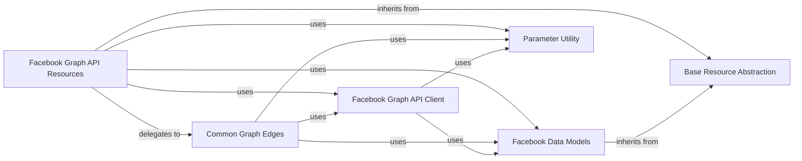

## Component Details

This architecture overview describes the key components involved in interacting with the Facebook Graph API. It highlights the core client for API communication, specialized resource interfaces for various Graph API objects, foundational abstractions for consistent resource handling, common utilities for data retrieval from API edges, structured data models for API responses, and parameter validation utilities. The main flow involves resource components utilizing the API client to fetch data, which is then mapped to data models, often leveraging common edge functionalities and parameter utilities.

### Facebook Graph API Resources
A collection of resource interfaces for various Facebook Graph API objects, including Pages, Users, Posts, Comments, Photos, and Videos. These resources provide methods for retrieving information, batch processing, and sometimes creating or updating specific resource types, utilizing the core Graph API client and common edge functionalities.

**Related Classes/Methods**:

- <a href="https://github.com/sns-sdks/python-facebook/blob/master/pyfacebook/api/facebook/resource/page.py#L24-L248" target="_blank" rel="noopener noreferrer">`pyfacebook.api.facebook.resource.page.FacebookPage` (24:248)</a>
- <a href="https://github.com/sns-sdks/python-facebook/blob/master/pyfacebook/api/facebook/resource/user.py#L24-L208" target="_blank" rel="noopener noreferrer">`pyfacebook.api.facebook.resource.user.FacebookUser` (24:208)</a>
- <a href="https://github.com/sns-sdks/python-facebook/blob/master/pyfacebook/api/facebook/common_edges/feed.py#L12-L103" target="_blank" rel="noopener noreferrer">`pyfacebook.api.facebook.common_edges.feed.FeedEdge` (12:103)</a>
- <a href="https://github.com/sns-sdks/python-facebook/blob/master/pyfacebook/api/facebook/resource/comment.py#L14-L198" target="_blank" rel="noopener noreferrer">`pyfacebook.api.facebook.resource.comment.FacebookComment` (14:198)</a>
- <a href="https://github.com/sns-sdks/python-facebook/blob/master/pyfacebook/api/facebook/resource/post.py#L14-L73" target="_blank" rel="noopener noreferrer">`pyfacebook.api.facebook.resource.post.FacebookPost` (14:73)</a>
- <a href="https://github.com/sns-sdks/python-facebook/blob/master/pyfacebook/api/facebook/resource/photo.py#L14-L76" target="_blank" rel="noopener noreferrer">`pyfacebook.api.facebook.resource.photo.FacebookPhoto` (14:76)</a>
- <a href="https://github.com/sns-sdks/python-facebook/blob/master/pyfacebook/api/facebook/resource/video.py#L14-L74" target="_blank" rel="noopener noreferrer">`pyfacebook.api.facebook.resource.video.FacebookVideo` (14:74)</a>

### Facebook Graph API Client
This component provides the core client functionality for authenticating and making requests to the Facebook Graph API. It handles the low-level HTTP communication and response parsing.

**Related Classes/Methods**:

- <a href="https://github.com/sns-sdks/python-facebook/blob/master/pyfacebook/api/facebook/client.py#L9-L27" target="_blank" rel="noopener noreferrer">`pyfacebook.api.facebook.client.FacebookApi` (9:27)</a>
- <a href="https://github.com/sns-sdks/python-facebook/blob/master/pyfacebook/api/base_client.py#L15-L23" target="_blank" rel="noopener noreferrer">`pyfacebook.api.base_client.BaseApi` (15:23)</a>
- <a href="https://github.com/sns-sdks/python-facebook/blob/master/pyfacebook/api/graph.py#L24-L735" target="_blank" rel="noopener noreferrer">`pyfacebook.api.graph.GraphAPI` (24:735)</a>

### Base Resource Abstraction
This foundational component defines the common interface and base functionalities for all specific Facebook Graph API resource classes. It provides a consistent structure for interacting with different Graph API objects.

**Related Classes/Methods**:

- <a href="https://github.com/sns-sdks/python-facebook/blob/master/pyfacebook/api/base_resource.py#L8-L28" target="_blank" rel="noopener noreferrer">`pyfacebook.api.base_resource.BaseResource` (8:28)</a>

### Common Graph Edges
This component encapsulates common logic for retrieving data from various Facebook Graph API edges, such as feeds, comments, likes, albums, photos, and videos. It provides reusable methods for accessing related objects for different resource types.

**Related Classes/Methods**:

- <a href="https://github.com/sns-sdks/python-facebook/blob/master/pyfacebook/api/facebook/common_edges/feed.py#L12-L103" target="_blank" rel="noopener noreferrer">`pyfacebook.api.facebook.common_edges.feed.FeedEdge` (12:103)</a>
- <a href="https://github.com/sns-sdks/python-facebook/blob/master/pyfacebook/api/facebook/common_edges/albums.py#L12-L60" target="_blank" rel="noopener noreferrer">`pyfacebook.api.facebook.common_edges.albums.AlbumsEdge` (12:60)</a>
- <a href="https://github.com/sns-sdks/python-facebook/blob/master/pyfacebook/api/facebook/common_edges/comments.py#L12-L69" target="_blank" rel="noopener noreferrer">`pyfacebook.api.facebook.common_edges.comments.CommentsEdge` (12:69)</a>
- <a href="https://github.com/sns-sdks/python-facebook/blob/master/pyfacebook/api/facebook/common_edges/likes.py#L14-L78" target="_blank" rel="noopener noreferrer">`pyfacebook.api.facebook.common_edges.likes.LikesEdge` (14:78)</a>
- <a href="https://github.com/sns-sdks/python-facebook/blob/master/pyfacebook/api/facebook/common_edges/live_videos.py#L12-L59" target="_blank" rel="noopener noreferrer">`pyfacebook.api.facebook.common_edges.live_videos.LiveVideosEdge` (12:59)</a>
- <a href="https://github.com/sns-sdks/python-facebook/blob/master/pyfacebook/api/facebook/common_edges/photos.py#L12-L60" target="_blank" rel="noopener noreferrer">`pyfacebook.api.facebook.common_edges.photos.PhotosEdge` (12:60)</a>
- <a href="https://github.com/sns-sdks/python-facebook/blob/master/pyfacebook/api/facebook/common_edges/videos.py#L12-L60" target="_blank" rel="noopener noreferrer">`pyfacebook.api.facebook.common_edges.videos.VideosEdge` (12:60)</a>

### Facebook Data Models
This component defines the Python data structures that represent various objects returned by the Facebook Graph API. It includes base models and specific models for entities like Pages, Users, Posts, Comments, Photos, and Videos, facilitating structured data handling.

**Related Classes/Methods**:

- <a href="https://github.com/sns-sdks/python-facebook/blob/master/pyfacebook/models/base.py#L23-L51" target="_blank" rel="noopener noreferrer">`pyfacebook.models.base.BaseModel` (23:51)</a>
- <a href="https://github.com/sns-sdks/python-facebook/blob/master/pyfacebook/models/base.py#L25-L39" target="_blank" rel="noopener noreferrer">`pyfacebook.models.base.BaseModel.new_from_json_dict` (25:39)</a>
- <a href="https://github.com/sns-sdks/python-facebook/blob/master/pyfacebook/models/album.py#L17-L44" target="_blank" rel="noopener noreferrer">`pyfacebook.models.album.Album` (17:44)</a>
- <a href="https://github.com/sns-sdks/python-facebook/blob/master/pyfacebook/models/comment.py#L31-L55" target="_blank" rel="noopener noreferrer">`pyfacebook.models.comment.Comment` (31:55)</a>
- <a href="https://github.com/sns-sdks/python-facebook/blob/master/pyfacebook/models/post.py#L51-L130" target="_blank" rel="noopener noreferrer">`pyfacebook.models.post.Post` (51:130)</a>
- <a href="https://github.com/sns-sdks/python-facebook/blob/master/pyfacebook/models/page.py#L153-L302" target="_blank" rel="noopener noreferrer">`pyfacebook.models.page.Page` (153:302)</a>
- <a href="https://github.com/sns-sdks/python-facebook/blob/master/pyfacebook/models/photo.py#L31-L67" target="_blank" rel="noopener noreferrer">`pyfacebook.models.photo.Photo` (31:67)</a>
- <a href="https://github.com/sns-sdks/python-facebook/blob/master/pyfacebook/models/user.py#L45-L86" target="_blank" rel="noopener noreferrer">`pyfacebook.models.user.User` (45:86)</a>
- <a href="https://github.com/sns-sdks/python-facebook/blob/master/pyfacebook/models/video.py#L44-L88" target="_blank" rel="noopener noreferrer">`pyfacebook.models.video.Video` (44:88)</a>
- <a href="https://github.com/sns-sdks/python-facebook/blob/master/pyfacebook/models/extensions.py#L39-L47" target="_blank" rel="noopener noreferrer">`pyfacebook.models.extensions.Paging` (39:47)</a>

### Parameter Utility
This component provides utility functions for validating and formatting input parameters required by the Facebook Graph API, ensuring data consistency and correct API request construction.

**Related Classes/Methods**:

- <a href="https://github.com/sns-sdks/python-facebook/blob/master/pyfacebook/utils/params_utils.py#L10-L45" target="_blank" rel="noopener noreferrer">`pyfacebook.utils.params_utils.enf_comma_separated` (10:45)</a>

### [FAQ](https://github.com/CodeBoarding/GeneratedOnBoardings/tree/main?tab=readme-ov-file#faq)