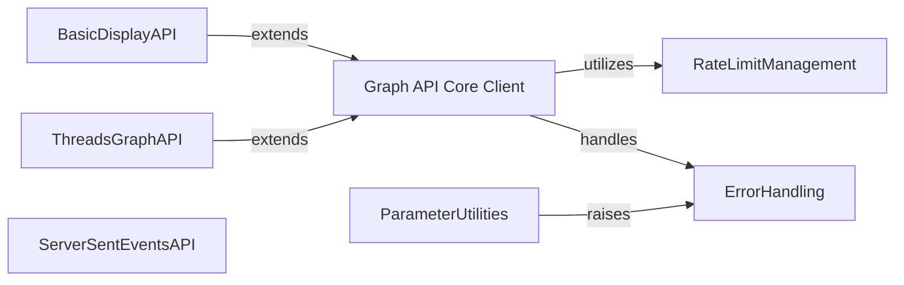

## Component Details

This graph represents the core components of the pyfacebook library for interacting with the Facebook Graph API. The main flow involves the Graph API Core Client handling various API requests, utilizing RateLimitManagement to adhere to API limits, and employing ErrorHandling for robust error management. Specialized clients like BasicDisplayAPI and ThreadsGraphAPI extend the core client's functionality for specific API versions or platforms. ParameterUtilities assist in preparing request parameters, and ServerSentEventsAPI manages real-time data streams.

### Graph API Core Client
The primary client for interacting with the Facebook Graph API. It handles various operations like fetching objects, managing connections, posting data, and token exchanges, incorporating rate limiting and error handling.

**Related Classes/Methods**:

- <a href="https://github.com/sns-sdks/python-facebook/blob/master/pyfacebook/api/graph.py#L24-L735" target="_blank" rel="noopener noreferrer">`pyfacebook.api.graph.GraphAPI` (24:735)</a>
- <a href="https://github.com/sns-sdks/python-facebook/blob/master/pyfacebook/api/graph.py#L42-L117" target="_blank" rel="noopener noreferrer">`pyfacebook.api.graph.GraphAPI:__init__` (42:117)</a>
- <a href="https://github.com/sns-sdks/python-facebook/blob/master/pyfacebook/api/graph.py#L120-L134" target="_blank" rel="noopener noreferrer">`pyfacebook.api.graph.GraphAPI:_build_sleep_seconds_resource` (120:134)</a>
- <a href="https://github.com/sns-sdks/python-facebook/blob/master/pyfacebook/api/graph.py#L157-L172" target="_blank" rel="noopener noreferrer">`pyfacebook.api.graph.GraphAPI:_append_token` (157:172)</a>
- <a href="https://github.com/sns-sdks/python-facebook/blob/master/pyfacebook/api/graph.py#L174-L226" target="_blank" rel="noopener noreferrer">`pyfacebook.api.graph.GraphAPI:_request` (174:226)</a>
- <a href="https://github.com/sns-sdks/python-facebook/blob/master/pyfacebook/api/graph.py#L228-L246" target="_blank" rel="noopener noreferrer">`pyfacebook.api.graph.GraphAPI:_parse_response` (228:246)</a>
- <a href="https://github.com/sns-sdks/python-facebook/blob/master/pyfacebook/api/graph.py#L249-L254" target="_blank" rel="noopener noreferrer">`pyfacebook.api.graph.GraphAPI:_check_graph_error` (249:254)</a>
- <a href="https://github.com/sns-sdks/python-facebook/blob/master/pyfacebook/api/graph.py#L256-L269" target="_blank" rel="noopener noreferrer">`pyfacebook.api.graph.GraphAPI:get` (256:269)</a>
- <a href="https://github.com/sns-sdks/python-facebook/blob/master/pyfacebook/api/graph.py#L271-L289" target="_blank" rel="noopener noreferrer">`pyfacebook.api.graph.GraphAPI:get_object` (271:289)</a>
- <a href="https://github.com/sns-sdks/python-facebook/blob/master/pyfacebook/api/graph.py#L291-L306" target="_blank" rel="noopener noreferrer">`pyfacebook.api.graph.GraphAPI:get_objects` (291:306)</a>
- <a href="https://github.com/sns-sdks/python-facebook/blob/master/pyfacebook/api/graph.py#L308-L326" target="_blank" rel="noopener noreferrer">`pyfacebook.api.graph.GraphAPI:get_connection` (308:326)</a>
- <a href="https://github.com/sns-sdks/python-facebook/blob/master/pyfacebook/api/graph.py#L328-L376" target="_blank" rel="noopener noreferrer">`pyfacebook.api.graph.GraphAPI:get_full_connections` (328:376)</a>
- <a href="https://github.com/sns-sdks/python-facebook/blob/master/pyfacebook/api/graph.py#L378-L441" target="_blank" rel="noopener noreferrer">`pyfacebook.api.graph.GraphAPI:discovery_user_media` (378:441)</a>
- <a href="https://github.com/sns-sdks/python-facebook/blob/master/pyfacebook/api/graph.py#L443-L477" target="_blank" rel="noopener noreferrer">`pyfacebook.api.graph.GraphAPI:post_object` (443:477)</a>
- <a href="https://github.com/sns-sdks/python-facebook/blob/master/pyfacebook/api/graph.py#L479-L503" target="_blank" rel="noopener noreferrer">`pyfacebook.api.graph.GraphAPI:delete_object` (479:503)</a>
- <a href="https://github.com/sns-sdks/python-facebook/blob/master/pyfacebook/api/graph.py#L505-L538" target="_blank" rel="noopener noreferrer">`pyfacebook.api.graph.GraphAPI:_get_oauth_session` (505:538)</a>
- <a href="https://github.com/sns-sdks/python-facebook/blob/master/pyfacebook/api/graph.py#L540-L567" target="_blank" rel="noopener noreferrer">`pyfacebook.api.graph.GraphAPI:get_authorization_url` (540:567)</a>
- <a href="https://github.com/sns-sdks/python-facebook/blob/master/pyfacebook/api/graph.py#L569-L596" target="_blank" rel="noopener noreferrer">`pyfacebook.api.graph.GraphAPI:exchange_user_access_token` (569:596)</a>
- <a href="https://github.com/sns-sdks/python-facebook/blob/master/pyfacebook/api/graph.py#L598-L630" target="_blank" rel="noopener noreferrer">`pyfacebook.api.graph.GraphAPI:exchange_page_access_token` (598:630)</a>
- <a href="https://github.com/sns-sdks/python-facebook/blob/master/pyfacebook/api/graph.py#L632-L654" target="_blank" rel="noopener noreferrer">`pyfacebook.api.graph.GraphAPI:exchange_long_lived_user_access_token` (632:654)</a>
- <a href="https://github.com/sns-sdks/python-facebook/blob/master/pyfacebook/api/graph.py#L656-L672" target="_blank" rel="noopener noreferrer">`pyfacebook.api.graph.GraphAPI:exchange_long_lived_page_access_token` (656:672)</a>
- <a href="https://github.com/sns-sdks/python-facebook/blob/master/pyfacebook/api/graph.py#L674-L705" target="_blank" rel="noopener noreferrer">`pyfacebook.api.graph.GraphAPI:get_app_token` (674:705)</a>
- <a href="https://github.com/sns-sdks/python-facebook/blob/master/pyfacebook/api/graph.py#L707-L735" target="_blank" rel="noopener noreferrer">`pyfacebook.api.graph.GraphAPI:debug_token` (707:735)</a>

### RateLimitManagement
Manages and applies rate limiting rules for Facebook API calls, parsing rate limit headers from responses and calculating appropriate sleep durations to prevent exceeding API limits.

**Related Classes/Methods**:

- <a href="https://github.com/sns-sdks/python-facebook/blob/master/pyfacebook/ratelimit.py#L59-L202" target="_blank" rel="noopener noreferrer">`pyfacebook.ratelimit.RateLimit` (59:202)</a>
- <a href="https://github.com/sns-sdks/python-facebook/blob/master/pyfacebook/ratelimit.py#L67-L108" target="_blank" rel="noopener noreferrer">`pyfacebook.ratelimit.RateLimit:__init__` (67:108)</a>
- <a href="https://github.com/sns-sdks/python-facebook/blob/master/pyfacebook/ratelimit.py#L130-L150" target="_blank" rel="noopener noreferrer">`pyfacebook.ratelimit.RateLimit:set_limit` (130:150)</a>
- <a href="https://github.com/sns-sdks/python-facebook/blob/master/pyfacebook/ratelimit.py#L173-L177" target="_blank" rel="noopener noreferrer">`pyfacebook.ratelimit.RateLimit:get_max_percent` (173:177)</a>
- <a href="https://github.com/sns-sdks/python-facebook/blob/master/pyfacebook/ratelimit.py#L179-L202" target="_blank" rel="noopener noreferrer">`pyfacebook.ratelimit.RateLimit:get_sleep_seconds` (179:202)</a>
- <a href="https://github.com/sns-sdks/python-facebook/blob/master/pyfacebook/ratelimit.py#L111-L128" target="_blank" rel="noopener noreferrer">`pyfacebook.ratelimit.RateLimit.parse_headers` (111:128)</a>
- <a href="https://github.com/sns-sdks/python-facebook/blob/master/pyfacebook/ratelimit.py#L25-L56" target="_blank" rel="noopener noreferrer">`pyfacebook.ratelimit.RateLimitHeader` (25:56)</a>
- <a href="https://github.com/sns-sdks/python-facebook/blob/master/pyfacebook/ratelimit.py#L14-L21" target="_blank" rel="noopener noreferrer">`pyfacebook.ratelimit.PercentSecond` (14:21)</a>

### ErrorHandling
Provides a structured way to handle errors originating from the pyfacebook library itself (LibraryError) and specific errors returned by the Facebook Graph API (FacebookError), ensuring consistent error reporting.

**Related Classes/Methods**:

- <a href="https://github.com/sns-sdks/python-facebook/blob/master/pyfacebook/exceptions.py#L12-L30" target="_blank" rel="noopener noreferrer">`pyfacebook.exceptions.LibraryError` (12:30)</a>
- <a href="https://github.com/sns-sdks/python-facebook/blob/master/pyfacebook/exceptions.py#L33-L44" target="_blank" rel="noopener noreferrer">`pyfacebook.exceptions.FacebookError` (33:44)</a>
- <a href="https://github.com/sns-sdks/python-facebook/blob/master/pyfacebook/exceptions.py#L29-L30" target="_blank" rel="noopener noreferrer">`pyfacebook.exceptions.LibraryError:__str__` (29:30)</a>
- <a href="https://github.com/sns-sdks/python-facebook/blob/master/pyfacebook/exceptions.py#L23-L27" target="_blank" rel="noopener noreferrer">`pyfacebook.exceptions.LibraryError.__repr__` (23:27)</a>
- <a href="https://github.com/sns-sdks/python-facebook/blob/master/pyfacebook/exceptions.py#L17-L21" target="_blank" rel="noopener noreferrer">`pyfacebook.exceptions.LibraryError:__init__` (17:21)</a>
- <a href="https://github.com/sns-sdks/python-facebook/blob/master/pyfacebook/exceptions.py#L41-L44" target="_blank" rel="noopener noreferrer">`pyfacebook.exceptions.FacebookError:__init__` (41:44)</a>

### ParameterUtilities
Offers utility functions to validate and format input parameters for API calls, such as converting lists or tuples into comma-separated strings, and raising LibraryError for invalid inputs.

**Related Classes/Methods**:

- <a href="https://github.com/sns-sdks/python-facebook/blob/master/pyfacebook/utils/params_utils.py#L10-L45" target="_blank" rel="noopener noreferrer">`pyfacebook.utils.params_utils:enf_comma_separated` (10:45)</a>

### BasicDisplayAPI
A specialized client for the Facebook Basic Display API, designed for Instagram content and user data. It extends the core Graph API functionalities with specific behaviors or restrictions relevant to the Basic Display API.

**Related Classes/Methods**:

- <a href="https://github.com/sns-sdks/python-facebook/blob/master/pyfacebook/api/graph.py#L745-L775" target="_blank" rel="noopener noreferrer">`pyfacebook.api.graph.BasicDisplayAPI:__init__` (745:775)</a>
- <a href="https://github.com/sns-sdks/python-facebook/blob/master/pyfacebook/api/graph.py#L788-L816" target="_blank" rel="noopener noreferrer">`pyfacebook.api.graph.BasicDisplayAPI:exchange_user_access_token` (788:816)</a>
- <a href="https://github.com/sns-sdks/python-facebook/blob/master/pyfacebook/api/graph.py#L818-L838" target="_blank" rel="noopener noreferrer">`pyfacebook.api.graph.BasicDisplayAPI:exchange_long_lived_user_access_token` (818:838)</a>
- <a href="https://github.com/sns-sdks/python-facebook/blob/master/pyfacebook/api/graph.py#L840-L851" target="_blank" rel="noopener noreferrer">`pyfacebook.api.graph.BasicDisplayAPI:refresh_access_token` (840:851)</a>
- <a href="https://github.com/sns-sdks/python-facebook/blob/master/pyfacebook/api/graph.py#L853-L856" target="_blank" rel="noopener noreferrer">`pyfacebook.api.graph.BasicDisplayAPI:exchange_page_access_token` (853:856)</a>
- <a href="https://github.com/sns-sdks/python-facebook/blob/master/pyfacebook/api/graph.py#L858-L861" target="_blank" rel="noopener noreferrer">`pyfacebook.api.graph.BasicDisplayAPI:exchange_long_lived_page_access_token` (858:861)</a>
- <a href="https://github.com/sns-sdks/python-facebook/blob/master/pyfacebook/api/graph.py#L863-L866" target="_blank" rel="noopener noreferrer">`pyfacebook.api.graph.BasicDisplayAPI:get_app_token` (863:866)</a>
- <a href="https://github.com/sns-sdks/python-facebook/blob/master/pyfacebook/api/graph.py#L868-L869" target="_blank" rel="noopener noreferrer">`pyfacebook.api.graph.BasicDisplayAPI:debug_token` (868:869)</a>

### ThreadsGraphAPI
A client specifically for the Threads Graph API, providing functionalities to interact with Threads-related data. It builds upon the general Graph API client, potentially adding Threads-specific scope handling.

**Related Classes/Methods**:

- <a href="https://github.com/sns-sdks/python-facebook/blob/master/pyfacebook/api/graph.py#L890-L921" target="_blank" rel="noopener noreferrer">`pyfacebook.api.graph.ThreadsGraphAPI:get_authorization_url` (890:921)</a>
- <a href="https://github.com/sns-sdks/python-facebook/blob/master/pyfacebook/api/graph.py#L923-L955" target="_blank" rel="noopener noreferrer">`pyfacebook.api.graph.ThreadsGraphAPI:exchange_user_access_token` (923:955)</a>
- <a href="https://github.com/sns-sdks/python-facebook/blob/master/pyfacebook/api/graph.py#L957-L979" target="_blank" rel="noopener noreferrer">`pyfacebook.api.graph.ThreadsGraphAPI:exchange_long_lived_user_access_token` (957:979)</a>
- <a href="https://github.com/sns-sdks/python-facebook/blob/master/pyfacebook/api/graph.py#L981-L992" target="_blank" rel="noopener noreferrer">`pyfacebook.api.graph.ThreadsGraphAPI:refresh_access_token` (981:992)</a>
- <a href="https://github.com/sns-sdks/python-facebook/blob/master/pyfacebook/api/graph.py#L881-L888" target="_blank" rel="noopener noreferrer">`pyfacebook.api.graph.ThreadsGraphAPI.fix_scope` (881:888)</a>

### ServerSentEventsAPI
Manages real-time streaming of data from Facebook, such as live comments and reactions, using Server-Sent Events (SSE). It handles the persistent connection, processes incoming data, and manages connection lifecycle events.

**Related Classes/Methods**:

- `pyfacebook.api.graph.ServerSentEventAPI:_connect` (full file reference)
- `pyfacebook.api.graph.ServerSentEventAPI:on_data` (full file reference)
- `pyfacebook.api.graph.ServerSentEventAPI:on_keep_live` (full file reference)
- `pyfacebook.api.graph.ServerSentEventAPI:on_closed` (full file reference)
- `pyfacebook.api.graph.ServerSentEventAPI:on_request_error` (full file reference)
- `pyfacebook.api.graph.ServerSentEventAPI:disconnect` (full file reference)
- `pyfacebook.api.graph.ServerSentEventAPI:live_comments` (full file reference)
- `pyfacebook.api.graph.ServerSentEventAPI:live_reactions` (full file reference)

### [FAQ](https://github.com/CodeBoarding/GeneratedOnBoardings/tree/main?tab=readme-ov-file#faq)