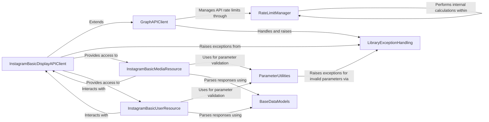

## Component Details

Client and resource interfaces for accessing user and media data through the Instagram Basic Display API. It extends the core Graph API client for its underlying request mechanisms and utilizes data models and utilities.

### InstagramBasicDisplayAPIClient
This component serves as the primary client for interacting with the Instagram Basic Display API. It handles user access token management (exchange and refresh) and acts as an entry point for accessing Instagram Basic Display resources like media and user data. It extends the core Graph API client for underlying request mechanisms.

**Related Classes/Methods**:

- <a href="https://github.com/sns-sdks/python-facebook/blob/master/pyfacebook/api/graph.py#L738-L869" target="_blank" rel="noopener noreferrer">`pyfacebook.api.graph.BasicDisplayAPI` (738:869)</a>
- <a href="https://github.com/sns-sdks/python-facebook/blob/master/pyfacebook/api/graph.py#L745-L775" target="_blank" rel="noopener noreferrer">`pyfacebook.api.graph.BasicDisplayAPI:__init__` (745:775)</a>
- <a href="https://github.com/sns-sdks/python-facebook/blob/master/pyfacebook/api/graph.py#L788-L816" target="_blank" rel="noopener noreferrer">`pyfacebook.api.graph.BasicDisplayAPI:exchange_user_access_token` (788:816)</a>
- <a href="https://github.com/sns-sdks/python-facebook/blob/master/pyfacebook/api/graph.py#L818-L838" target="_blank" rel="noopener noreferrer">`pyfacebook.api.graph.BasicDisplayAPI:exchange_long_lived_user_access_token` (818:838)</a>
- <a href="https://github.com/sns-sdks/python-facebook/blob/master/pyfacebook/api/graph.py#L840-L851" target="_blank" rel="noopener noreferrer">`pyfacebook.api.graph.BasicDisplayAPI:refresh_access_token` (840:851)</a>
- <a href="https://github.com/sns-sdks/python-facebook/blob/master/pyfacebook/api/graph.py#L853-L856" target="_blank" rel="noopener noreferrer">`pyfacebook.api.graph.BasicDisplayAPI:exchange_page_access_token` (853:856)</a>
- <a href="https://github.com/sns-sdks/python-facebook/blob/master/pyfacebook/api/graph.py#L858-L861" target="_blank" rel="noopener noreferrer">`pyfacebook.api.graph.BasicDisplayAPI:exchange_long_lived_page_access_token` (858:861)</a>
- <a href="https://github.com/sns-sdks/python-facebook/blob/master/pyfacebook/api/graph.py#L863-L866" target="_blank" rel="noopener noreferrer">`pyfacebook.api.graph.BasicDisplayAPI:get_app_token` (863:866)</a>
- <a href="https://github.com/sns-sdks/python-facebook/blob/master/pyfacebook/api/graph.py#L868-L869" target="_blank" rel="noopener noreferrer">`pyfacebook.api.graph.BasicDisplayAPI:debug_token` (868:869)</a>

### GraphAPIClient
This component provides the fundamental functionalities for interacting with the Facebook Graph API. It manages HTTP requests, handles rate limiting, parses API responses, and deals with common API errors. It serves as a base for other API-specific clients, including the Instagram Basic Display API client.

**Related Classes/Methods**:

- <a href="https://github.com/sns-sdks/python-facebook/blob/master/pyfacebook/api/graph.py#L24-L735" target="_blank" rel="noopener noreferrer">`pyfacebook.api.graph.GraphAPI` (24:735)</a>
- <a href="https://github.com/sns-sdks/python-facebook/blob/master/pyfacebook/api/graph.py#L42-L117" target="_blank" rel="noopener noreferrer">`pyfacebook.api.graph.GraphAPI:__init__` (42:117)</a>
- <a href="https://github.com/sns-sdks/python-facebook/blob/master/pyfacebook/api/graph.py#L174-L226" target="_blank" rel="noopener noreferrer">`pyfacebook.api.graph.GraphAPI:_request` (174:226)</a>
- <a href="https://github.com/sns-sdks/python-facebook/blob/master/pyfacebook/api/graph.py#L228-L246" target="_blank" rel="noopener noreferrer">`pyfacebook.api.graph.GraphAPI:_parse_response` (228:246)</a>
- <a href="https://github.com/sns-sdks/python-facebook/blob/master/pyfacebook/api/graph.py#L505-L538" target="_blank" rel="noopener noreferrer">`pyfacebook.api.graph.GraphAPI:_get_oauth_session` (505:538)</a>
- <a href="https://github.com/sns-sdks/python-facebook/blob/master/pyfacebook/api/graph.py#L674-L705" target="_blank" rel="noopener noreferrer">`pyfacebook.api.graph.GraphAPI:get_app_token` (674:705)</a>

### InstagramBasicMediaResource
This component represents the resource interface for media-related operations within the Instagram Basic Display API. It provides methods to retrieve media information, handle batch requests for media, and get children media. It relies on the Instagram Basic Display API client for making requests and uses data models for parsing responses.

**Related Classes/Methods**:

- <a href="https://github.com/sns-sdks/python-facebook/blob/master/pyfacebook/api/instagram_basic/resource/media.py#L13-L103" target="_blank" rel="noopener noreferrer">`pyfacebook.api.instagram_basic.resource.media.IGBasicMedia` (13:103)</a>
- <a href="https://github.com/sns-sdks/python-facebook/blob/master/pyfacebook/api/instagram_basic/resource/media.py#L14-L42" target="_blank" rel="noopener noreferrer">`pyfacebook.api.instagram_basic.resource.media.IGBasicMedia:get_info` (14:42)</a>
- <a href="https://github.com/sns-sdks/python-facebook/blob/master/pyfacebook/api/instagram_basic/resource/media.py#L44-L73" target="_blank" rel="noopener noreferrer">`pyfacebook.api.instagram_basic.resource.media.IGBasicMedia:get_batch` (44:73)</a>
- <a href="https://github.com/sns-sdks/python-facebook/blob/master/pyfacebook/api/instagram_basic/resource/media.py#L75-L103" target="_blank" rel="noopener noreferrer">`pyfacebook.api.instagram_basic.resource.media.IGBasicMedia:get_children` (75:103)</a>

### InstagramBasicUserResource
This component represents the resource interface for user-related operations within the Instagram Basic Display API. It allows fetching user information and retrieving media associated with a user. Similar to media operations, it relies on the Instagram Basic Display API client for making requests and uses data models for parsing responses.

**Related Classes/Methods**:

- <a href="https://github.com/sns-sdks/python-facebook/blob/master/pyfacebook/api/instagram_basic/resource/user.py#L13-L82" target="_blank" rel="noopener noreferrer">`pyfacebook.api.instagram_basic.resource.user.IGBasicUser` (13:82)</a>
- <a href="https://github.com/sns-sdks/python-facebook/blob/master/pyfacebook/api/instagram_basic/resource/user.py#L14-L40" target="_blank" rel="noopener noreferrer">`pyfacebook.api.instagram_basic.resource.user.IGBasicUser:get_info` (14:40)</a>
- <a href="https://github.com/sns-sdks/python-facebook/blob/master/pyfacebook/api/instagram_basic/resource/user.py#L42-L82" target="_blank" rel="noopener noreferrer">`pyfacebook.api.instagram_basic.resource.user.IGBasicUser:get_media` (42:82)</a>

### LibraryExceptionHandling
This component defines and manages custom exceptions specific to the `pyfacebook` library. It provides a structured way to handle and represent errors that occur during API interactions or internal library operations.

**Related Classes/Methods**:

- <a href="https://github.com/sns-sdks/python-facebook/blob/master/pyfacebook/exceptions.py#L12-L30" target="_blank" rel="noopener noreferrer">`pyfacebook.exceptions.LibraryError` (12:30)</a>
- <a href="https://github.com/sns-sdks/python-facebook/blob/master/pyfacebook/exceptions.py#L29-L30" target="_blank" rel="noopener noreferrer">`pyfacebook.exceptions.LibraryError:__str__` (29:30)</a>
- <a href="https://github.com/sns-sdks/python-facebook/blob/master/pyfacebook/exceptions.py#L33-L44" target="_blank" rel="noopener noreferrer">`pyfacebook.exceptions.FacebookError` (33:44)</a>
- <a href="https://github.com/sns-sdks/python-facebook/blob/master/pyfacebook/exceptions.py#L6-L9" target="_blank" rel="noopener noreferrer">`pyfacebook.exceptions.PyFacebookException` (6:9)</a>

### ParameterUtilities
This component provides various utility functions that support the core functionalities of the library. Specifically, it includes functions for enforcing parameter formats, such as comma-separated values, which are crucial for correct API request construction.

**Related Classes/Methods**:

- <a href="https://github.com/sns-sdks/python-facebook/blob/master/pyfacebook/utils/params_utils.py#L10-L45" target="_blank" rel="noopener noreferrer">`pyfacebook.utils.params_utils:enf_comma_separated` (10:45)</a>

### BaseDataModels
This component is responsible for managing the base data models used throughout the library. It provides a base class for creating new model instances from JSON dictionaries, facilitating the conversion of API responses into structured Python objects. It also includes specific models for Instagram Basic Display API responses.

**Related Classes/Methods**:

- <a href="https://github.com/sns-sdks/python-facebook/blob/master/pyfacebook/models/base.py#L23-L51" target="_blank" rel="noopener noreferrer">`pyfacebook.models.base.BaseModel` (23:51)</a>
- <a href="https://github.com/sns-sdks/python-facebook/blob/master/pyfacebook/models/base.py#L25-L39" target="_blank" rel="noopener noreferrer">`pyfacebook.models.base.BaseModel:new_from_json_dict` (25:39)</a>
- <a href="https://github.com/sns-sdks/python-facebook/blob/master/pyfacebook/models/ig_basic_models.py#L56-L63" target="_blank" rel="noopener noreferrer">`pyfacebook.models.ig_basic_models.IgBasicMedia` (56:63)</a>
- <a href="https://github.com/sns-sdks/python-facebook/blob/master/pyfacebook/models/ig_basic_models.py#L27-L40" target="_blank" rel="noopener noreferrer">`pyfacebook.models.ig_basic_models.IgBasicMediaChild` (27:40)</a>
- <a href="https://github.com/sns-sdks/python-facebook/blob/master/pyfacebook/models/ig_basic_models.py#L13-L23" target="_blank" rel="noopener noreferrer">`pyfacebook.models.ig_basic_models.IgBasicUser` (13:23)</a>

### RateLimitManager
This component is dedicated to handling API rate limits imposed by Facebook. It includes functionalities to set and retrieve rate limit information, parse rate limit headers from responses, and calculate appropriate sleep times to avoid exceeding limits.

**Related Classes/Methods**:

- <a href="https://github.com/sns-sdks/python-facebook/blob/master/pyfacebook/ratelimit.py#L59-L202" target="_blank" rel="noopener noreferrer">`pyfacebook.ratelimit.RateLimit` (59:202)</a>
- <a href="https://github.com/sns-sdks/python-facebook/blob/master/pyfacebook/ratelimit.py#L130-L150" target="_blank" rel="noopener noreferrer">`pyfacebook.ratelimit.RateLimit:set_limit` (130:150)</a>
- <a href="https://github.com/sns-sdks/python-facebook/blob/master/pyfacebook/ratelimit.py#L179-L202" target="_blank" rel="noopener noreferrer">`pyfacebook.ratelimit.RateLimit:get_sleep_seconds` (179:202)</a>
- <a href="https://github.com/sns-sdks/python-facebook/blob/master/pyfacebook/ratelimit.py#L111-L128" target="_blank" rel="noopener noreferrer">`pyfacebook.ratelimit.RateLimit.parse_headers` (111:128)</a>
- <a href="https://github.com/sns-sdks/python-facebook/blob/master/pyfacebook/ratelimit.py#L25-L56" target="_blank" rel="noopener noreferrer">`pyfacebook.ratelimit.RateLimitHeader` (25:56)</a>

### [FAQ](https://github.com/CodeBoarding/GeneratedOnBoardings/tree/main?tab=readme-ov-file#faq)