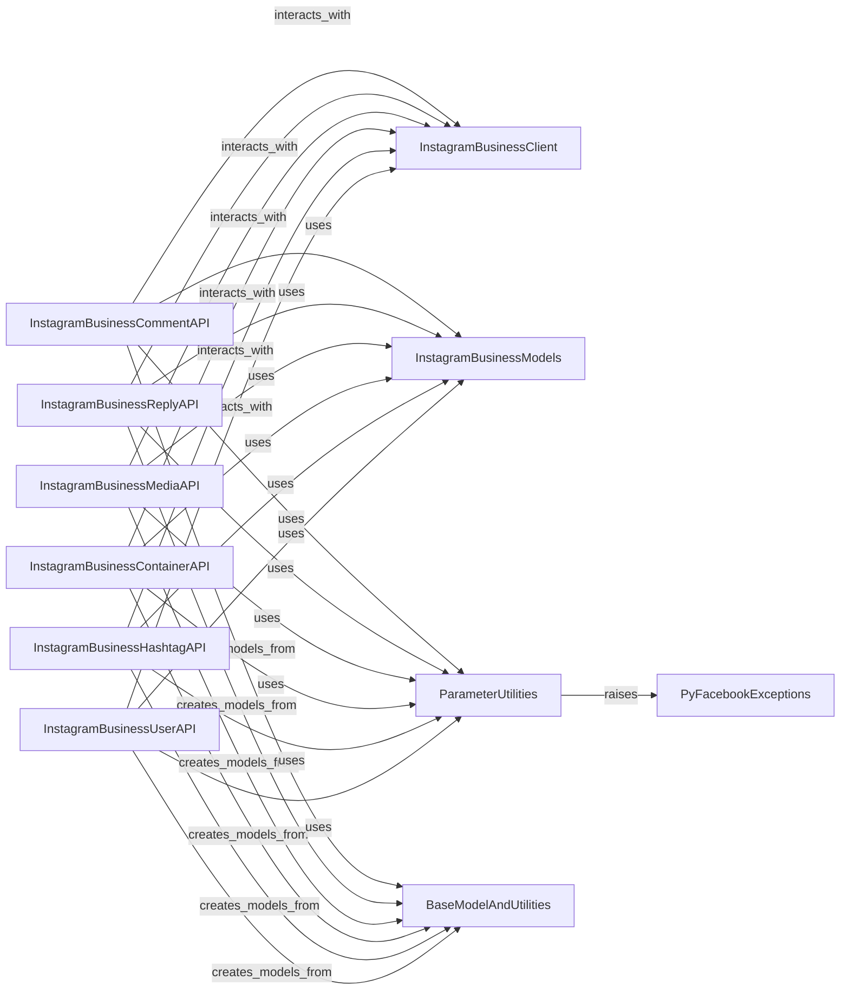

## Component Details

The Instagram Business API subsystem provides comprehensive client and resource interfaces for interacting with the Instagram Business API, covering comments, media, users, containers, and hashtags. It builds upon the core Graph API client and utilizes data models and utilities for structured data exchange and parameter handling.

### InstagramBusinessClient
The core client for interacting with the Instagram Business API, providing the base for all resource-specific API interactions.

**Related Classes/Methods**:

- <a href="https://github.com/sns-sdks/python-facebook/blob/master/pyfacebook/api/instagram_business/client.py#L9-L19" target="_blank" rel="noopener noreferrer">`pyfacebook.api.instagram_business.client.IGBusinessApi` (9:19)</a>

### InstagramBusinessCommentAPI
Handles interactions with Instagram Business comments, including retrieving comment information, batch retrieval, and fetching replies.

**Related Classes/Methods**:

- <a href="https://github.com/sns-sdks/python-facebook/blob/master/pyfacebook/api/instagram_business/resource/comment.py#L13-L109" target="_blank" rel="noopener noreferrer">`pyfacebook.api.instagram_business.resource.comment.IGBusinessComment` (13:109)</a>
- <a href="https://github.com/sns-sdks/python-facebook/blob/master/pyfacebook/api/instagram_business/resource/comment.py#L14-L40" target="_blank" rel="noopener noreferrer">`pyfacebook.api.instagram_business.resource.comment.IGBusinessComment:get_info` (14:40)</a>
- <a href="https://github.com/sns-sdks/python-facebook/blob/master/pyfacebook/api/instagram_business/resource/comment.py#L42-L72" target="_blank" rel="noopener noreferrer">`pyfacebook.api.instagram_business.resource.comment.IGBusinessComment:get_batch` (42:72)</a>
- <a href="https://github.com/sns-sdks/python-facebook/blob/master/pyfacebook/api/instagram_business/resource/comment.py#L74-L109" target="_blank" rel="noopener noreferrer">`pyfacebook.api.instagram_business.resource.comment.IGBusinessComment:get_replies` (74:109)</a>

### InstagramBusinessReplyAPI
Manages interactions with Instagram Business replies, providing functionalities to get reply information and batch replies.

**Related Classes/Methods**:

- <a href="https://github.com/sns-sdks/python-facebook/blob/master/pyfacebook/api/instagram_business/resource/comment.py#L112-L171" target="_blank" rel="noopener noreferrer">`pyfacebook.api.instagram_business.resource.comment.IGBusinessReply` (112:171)</a>
- <a href="https://github.com/sns-sdks/python-facebook/blob/master/pyfacebook/api/instagram_business/resource/comment.py#L113-L139" target="_blank" rel="noopener noreferrer">`pyfacebook.api.instagram_business.resource.comment.IGBusinessReply:get_info` (113:139)</a>
- <a href="https://github.com/sns-sdks/python-facebook/blob/master/pyfacebook/api/instagram_business/resource/comment.py#L141-L171" target="_blank" rel="noopener noreferrer">`pyfacebook.api.instagram_business.resource.comment.IGBusinessReply:get_batch` (141:171)</a>

### InstagramBusinessMediaAPI
Provides methods for interacting with Instagram Business media, such as getting media information, batch retrieval, comments, children, insights, and product tags.

**Related Classes/Methods**:

- <a href="https://github.com/sns-sdks/python-facebook/blob/master/pyfacebook/api/instagram_business/resource/media.py#L19-L198" target="_blank" rel="noopener noreferrer">`pyfacebook.api.instagram_business.resource.media.IGBusinessMedia` (19:198)</a>
- <a href="https://github.com/sns-sdks/python-facebook/blob/master/pyfacebook/api/instagram_business/resource/media.py#L20-L46" target="_blank" rel="noopener noreferrer">`pyfacebook.api.instagram_business.resource.media.IGBusinessMedia:get_info` (20:46)</a>
- <a href="https://github.com/sns-sdks/python-facebook/blob/master/pyfacebook/api/instagram_business/resource/media.py#L48-L78" target="_blank" rel="noopener noreferrer">`pyfacebook.api.instagram_business.resource.media.IGBusinessMedia:get_batch` (48:78)</a>
- <a href="https://github.com/sns-sdks/python-facebook/blob/master/pyfacebook/api/instagram_business/resource/media.py#L80-L115" target="_blank" rel="noopener noreferrer">`pyfacebook.api.instagram_business.resource.media.IGBusinessMedia:get_comments` (80:115)</a>
- <a href="https://github.com/sns-sdks/python-facebook/blob/master/pyfacebook/api/instagram_business/resource/media.py#L117-L145" target="_blank" rel="noopener noreferrer">`pyfacebook.api.instagram_business.resource.media.IGBusinessMedia:get_children` (117:145)</a>
- <a href="https://github.com/sns-sdks/python-facebook/blob/master/pyfacebook/api/instagram_business/resource/media.py#L147-L178" target="_blank" rel="noopener noreferrer">`pyfacebook.api.instagram_business.resource.media.IGBusinessMedia:get_insights` (147:178)</a>
- <a href="https://github.com/sns-sdks/python-facebook/blob/master/pyfacebook/api/instagram_business/resource/media.py#L180-L198" target="_blank" rel="noopener noreferrer">`pyfacebook.api.instagram_business.resource.media.IGBusinessMedia:get_product_tags` (180:198)</a>

### InstagramBusinessContainerAPI
Facilitates interactions with Instagram Business containers, allowing retrieval of container information and batch containers.

**Related Classes/Methods**:

- <a href="https://github.com/sns-sdks/python-facebook/blob/master/pyfacebook/api/instagram_business/resource/container.py#L13-L72" target="_blank" rel="noopener noreferrer">`pyfacebook.api.instagram_business.resource.container.IGBusinessContainer` (13:72)</a>
- <a href="https://github.com/sns-sdks/python-facebook/blob/master/pyfacebook/api/instagram_business/resource/container.py#L14-L40" target="_blank" rel="noopener noreferrer">`pyfacebook.api.instagram_business.resource.container.IGBusinessContainer:get_info` (14:40)</a>
- <a href="https://github.com/sns-sdks/python-facebook/blob/master/pyfacebook/api/instagram_business/resource/container.py#L42-L72" target="_blank" rel="noopener noreferrer">`pyfacebook.api.instagram_business.resource.container.IGBusinessContainer:get_batch` (42:72)</a>

### InstagramBusinessHashtagAPI
Manages interactions with Instagram Business hashtags, including getting hashtag information, batch retrieval, top media, and recent media.

**Related Classes/Methods**:

- <a href="https://github.com/sns-sdks/python-facebook/blob/master/pyfacebook/api/instagram_business/resource/hashtag.py#L13-L150" target="_blank" rel="noopener noreferrer">`pyfacebook.api.instagram_business.resource.hashtag.IGBusinessHashtag` (13:150)</a>
- <a href="https://github.com/sns-sdks/python-facebook/blob/master/pyfacebook/api/instagram_business/resource/hashtag.py#L14-L40" target="_blank" rel="noopener noreferrer">`pyfacebook.api.instagram_business.resource.hashtag.IGBusinessHashtag:get_info` (14:40)</a>
- <a href="https://github.com/sns-sdks/python-facebook/blob/master/pyfacebook/api/instagram_business/resource/hashtag.py#L42-L72" target="_blank" rel="noopener noreferrer">`pyfacebook.api.instagram_business.resource.hashtag.IGBusinessHashtag:get_batch` (42:72)</a>
- <a href="https://github.com/sns-sdks/python-facebook/blob/master/pyfacebook/api/instagram_business/resource/hashtag.py#L74-L111" target="_blank" rel="noopener noreferrer">`pyfacebook.api.instagram_business.resource.hashtag.IGBusinessHashtag:get_top_media` (74:111)</a>
- <a href="https://github.com/sns-sdks/python-facebook/blob/master/pyfacebook/api/instagram_business/resource/hashtag.py#L113-L150" target="_blank" rel="noopener noreferrer">`pyfacebook.api.instagram_business.resource.hashtag.IGBusinessHashtag:get_recent_media` (113:150)</a>

### InstagramBusinessUserAPI
Provides comprehensive functionalities for interacting with Instagram Business users, such as getting user information, discovering users and their media, content publishing limits, insights, media, live media, mentioned comments/media, hashtag search, recently searched hashtags, stories, tagged media, available catalogs, catalog product search, and product appeals.

**Related Classes/Methods**:

- <a href="https://github.com/sns-sdks/python-facebook/blob/master/pyfacebook/api/instagram_business/resource/user.py#L26-L582" target="_blank" rel="noopener noreferrer">`pyfacebook.api.instagram_business.resource.user.IGBusinessUser` (26:582)</a>
- <a href="https://github.com/sns-sdks/python-facebook/blob/master/pyfacebook/api/instagram_business/resource/user.py#L27-L55" target="_blank" rel="noopener noreferrer">`pyfacebook.api.instagram_business.resource.user.IGBusinessUser:get_info` (27:55)</a>
- <a href="https://github.com/sns-sdks/python-facebook/blob/master/pyfacebook/api/instagram_business/resource/user.py#L57-L86" target="_blank" rel="noopener noreferrer">`pyfacebook.api.instagram_business.resource.user.IGBusinessUser:discovery_user` (57:86)</a>
- <a href="https://github.com/sns-sdks/python-facebook/blob/master/pyfacebook/api/instagram_business/resource/user.py#L88-L137" target="_blank" rel="noopener noreferrer">`pyfacebook.api.instagram_business.resource.user.IGBusinessUser:discovery_user_medias` (88:137)</a>
- <a href="https://github.com/sns-sdks/python-facebook/blob/master/pyfacebook/api/instagram_business/resource/user.py#L139-L165" target="_blank" rel="noopener noreferrer">`pyfacebook.api.instagram_business.resource.user.IGBusinessUser:get_content_publishing_limit` (139:165)</a>
- <a href="https://github.com/sns-sdks/python-facebook/blob/master/pyfacebook/api/instagram_business/resource/user.py#L167-L229" target="_blank" rel="noopener noreferrer">`pyfacebook.api.instagram_business.resource.user.IGBusinessUser:get_insights` (167:229)</a>
- <a href="https://github.com/sns-sdks/python-facebook/blob/master/pyfacebook/api/instagram_business/resource/user.py#L231-L270" target="_blank" rel="noopener noreferrer">`pyfacebook.api.instagram_business.resource.user.IGBusinessUser:get_media` (231:270)</a>
- <a href="https://github.com/sns-sdks/python-facebook/blob/master/pyfacebook/api/instagram_business/resource/user.py#L272-L312" target="_blank" rel="noopener noreferrer">`pyfacebook.api.instagram_business.resource.user.IGBusinessUser:get_live_media` (272:312)</a>
- <a href="https://github.com/sns-sdks/python-facebook/blob/master/pyfacebook/api/instagram_business/resource/user.py#L314-L343" target="_blank" rel="noopener noreferrer">`pyfacebook.api.instagram_business.resource.user.IGBusinessUser:get_mentioned_comment` (314:343)</a>
- <a href="https://github.com/sns-sdks/python-facebook/blob/master/pyfacebook/api/instagram_business/resource/user.py#L345-L373" target="_blank" rel="noopener noreferrer">`pyfacebook.api.instagram_business.resource.user.IGBusinessUser:get_mentioned_media` (345:373)</a>
- <a href="https://github.com/sns-sdks/python-facebook/blob/master/pyfacebook/api/instagram_business/resource/user.py#L375-L399" target="_blank" rel="noopener noreferrer">`pyfacebook.api.instagram_business.resource.user.IGBusinessUser:get_hashtag_search` (375:399)</a>
- <a href="https://github.com/sns-sdks/python-facebook/blob/master/pyfacebook/api/instagram_business/resource/user.py#L401-L433" target="_blank" rel="noopener noreferrer">`pyfacebook.api.instagram_business.resource.user.IGBusinessUser:get_recently_searched_hashtags` (401:433)</a>
- <a href="https://github.com/sns-sdks/python-facebook/blob/master/pyfacebook/api/instagram_business/resource/user.py#L435-L468" target="_blank" rel="noopener noreferrer">`pyfacebook.api.instagram_business.resource.user.IGBusinessUser:get_stories` (435:468)</a>
- <a href="https://github.com/sns-sdks/python-facebook/blob/master/pyfacebook/api/instagram_business/resource/user.py#L470-L503" target="_blank" rel="noopener noreferrer">`pyfacebook.api.instagram_business.resource.user.IGBusinessUser:get_tagged_media` (470:503)</a>
- <a href="https://github.com/sns-sdks/python-facebook/blob/master/pyfacebook/api/instagram_business/resource/user.py#L505-L523" target="_blank" rel="noopener noreferrer">`pyfacebook.api.instagram_business.resource.user.IGBusinessUser:get_available_catalogs` (505:523)</a>
- <a href="https://github.com/sns-sdks/python-facebook/blob/master/pyfacebook/api/instagram_business/resource/user.py#L525-L558" target="_blank" rel="noopener noreferrer">`pyfacebook.api.instagram_business.resource.user.IGBusinessUser:get_catalog_product_search` (525:558)</a>
- <a href="https://github.com/sns-sdks/python-facebook/blob/master/pyfacebook/api/instagram_business/resource/user.py#L560-L582" target="_blank" rel="noopener noreferrer">`pyfacebook.api.instagram_business.resource.user.IGBusinessUser:get_product_appeal` (560:582)</a>

### InstagramBusinessModels
Contains data models specific to the Instagram Business API, used for structuring data received from and sent to the API.

**Related Classes/Methods**:

- `pyfacebook.models.ig_business_models` (full file reference)
- <a href="https://github.com/sns-sdks/python-facebook/blob/master/pyfacebook/models/ig_business_models.py#L134-L141" target="_blank" rel="noopener noreferrer">`pyfacebook.models.ig_business_models.IgBusComment` (134:141)</a>
- <a href="https://github.com/sns-sdks/python-facebook/blob/master/pyfacebook/models/ig_business_models.py#L106-L119" target="_blank" rel="noopener noreferrer">`pyfacebook.models.ig_business_models.IgBusReply` (106:119)</a>
- <a href="https://github.com/sns-sdks/python-facebook/blob/master/pyfacebook/models/ig_business_models.py#L65-L90" target="_blank" rel="noopener noreferrer">`pyfacebook.models.ig_business_models.IgBusMedia` (65:90)</a>
- <a href="https://github.com/sns-sdks/python-facebook/blob/master/pyfacebook/models/ig_business_models.py#L169-L178" target="_blank" rel="noopener noreferrer">`pyfacebook.models.ig_business_models.IgBusContainer` (169:178)</a>
- <a href="https://github.com/sns-sdks/python-facebook/blob/master/pyfacebook/models/ig_business_models.py#L157-L165" target="_blank" rel="noopener noreferrer">`pyfacebook.models.ig_business_models.IgBusHashtag` (157:165)</a>
- <a href="https://github.com/sns-sdks/python-facebook/blob/master/pyfacebook/models/ig_business_models.py#L15-L32" target="_blank" rel="noopener noreferrer">`pyfacebook.models.ig_business_models.IgBusUser` (15:32)</a>

### ParameterUtilities
Provides utility functions for handling and enforcing parameter formats, specifically for comma-separated values.

**Related Classes/Methods**:

- <a href="https://github.com/sns-sdks/python-facebook/blob/master/pyfacebook/utils/params_utils.py#L10-L45" target="_blank" rel="noopener noreferrer">`pyfacebook.utils.params_utils.enf_comma_separated` (10:45)</a>
- `pyfacebook.utils.params_utils` (full file reference)

### BaseModelAndUtilities
Contains the base model for data structures and utility functions for converting model data to dictionaries, specifically handling the removal of None values.

**Related Classes/Methods**:

- <a href="https://github.com/sns-sdks/python-facebook/blob/master/pyfacebook/models/base.py#L23-L51" target="_blank" rel="noopener noreferrer">`pyfacebook.models.base.BaseModel` (23:51)</a>
- <a href="https://github.com/sns-sdks/python-facebook/blob/master/pyfacebook/models/base.py#L25-L39" target="_blank" rel="noopener noreferrer">`pyfacebook.models.base.BaseModel.new_from_json_dict` (25:39)</a>
- <a href="https://github.com/sns-sdks/python-facebook/blob/master/pyfacebook/models/base.py#L41-L51" target="_blank" rel="noopener noreferrer">`pyfacebook.models.base.BaseModel.to_dict` (41:51)</a>
- <a href="https://github.com/sns-sdks/python-facebook/blob/master/pyfacebook/models/base.py#L54-L72" target="_blank" rel="noopener noreferrer">`pyfacebook.models.base.dict_minus_none_values` (54:72)</a>

### PyFacebookExceptions
Contains custom exception classes used within the pyfacebook library, specifically LibraryError for handling various library-specific errors.

**Related Classes/Methods**:

- <a href="https://github.com/sns-sdks/python-facebook/blob/master/pyfacebook/exceptions.py#L12-L30" target="_blank" rel="noopener noreferrer">`pyfacebook.exceptions.LibraryError` (12:30)</a>

### [FAQ](https://github.com/CodeBoarding/GeneratedOnBoardings/tree/main?tab=readme-ov-file#faq)