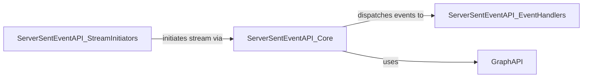

## Component Details

Manages real-time data streams from Facebook Graph API using Server-Sent Events (SSE) for live comments and reactions. It utilizes the core Graph API client for its connection mechanisms and data models and utilities.

### ServerSentEventAPI_Core
This component encapsulates the fundamental logic for establishing and maintaining a persistent connection to the Facebook Streaming Graph API. It manages the connection lifecycle, including retries, and is responsible for iterating through the incoming stream data and dispatching it to appropriate handlers based on the content received. It relies on the `GraphAPI` for its core connection capabilities.

**Related Classes/Methods**:

- <a href="https://github.com/sns-sdks/python-facebook/blob/master/pyfacebook/api/graph.py#L995-L1000" target="_blank" rel="noopener noreferrer">`pyfacebook.api.graph.ServerSentEventAPI` (995:1000)</a>
- <a href="https://github.com/sns-sdks/python-facebook/blob/master/pyfacebook/api/graph.py#L24-L735" target="_blank" rel="noopener noreferrer">`pyfacebook.api.graph.GraphAPI` (24:735)</a>

### ServerSentEventAPI_EventHandlers
This component provides a set of callback methods designed to process various events occurring during the streaming session. These methods handle incoming data, acknowledge keep-alive signals, manage the graceful closure of the connection, and report any errors encountered during the request.

**Related Classes/Methods**:

- <a href="https://github.com/sns-sdks/python-facebook/blob/master/pyfacebook/api/graph.py#L995-L1000" target="_blank" rel="noopener noreferrer">`pyfacebook.api.graph.ServerSentEventAPI` (995:1000)</a>

### ServerSentEventAPI_StreamInitiators
This component offers high-level interfaces for initiating specific types of live data streams from the Facebook platform. It abstracts the details of constructing the correct API endpoint and parameters, allowing users to easily start streaming live comments or reactions for a given live video ID.

**Related Classes/Methods**:

- <a href="https://github.com/sns-sdks/python-facebook/blob/master/pyfacebook/api/graph.py#L995-L1000" target="_blank" rel="noopener noreferrer">`pyfacebook.api.graph.ServerSentEventAPI` (995:1000)</a>

### [FAQ](https://github.com/CodeBoarding/GeneratedOnBoardings/tree/main?tab=readme-ov-file#faq)