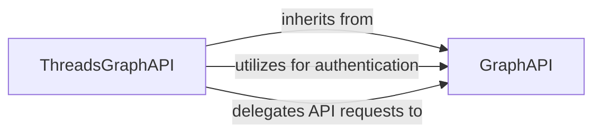

## Component Details

This graph illustrates the interaction between the specialized Threads Graph API Client and the core Graph API Client. The ThreadsGraphAPI extends the functionalities of the GraphAPI to handle Threads-specific authorization and API interactions, while leveraging the fundamental request and response handling mechanisms provided by the base GraphAPI component.

### ThreadsGraphAPI
A specialized client for interacting with the Threads Graph API, handling Threads-specific authorization and token exchange. It inherits from the core Graph API client and uses data models and utilities.

**Related Classes/Methods**:

- <a href="https://github.com/sns-sdks/python-facebook/blob/master/pyfacebook/api/graph.py#L872-L992" target="_blank" rel="noopener noreferrer">`pyfacebook.api.graph.ThreadsGraphAPI` (872:992)</a>
- <a href="https://github.com/sns-sdks/python-facebook/blob/master/pyfacebook/api/graph.py#L890-L921" target="_blank" rel="noopener noreferrer">`pyfacebook.api.graph.ThreadsGraphAPI:get_authorization_url` (890:921)</a>
- <a href="https://github.com/sns-sdks/python-facebook/blob/master/pyfacebook/api/graph.py#L923-L955" target="_blank" rel="noopener noreferrer">`pyfacebook.api.graph.ThreadsGraphAPI:exchange_user_access_token` (923:955)</a>
- <a href="https://github.com/sns-sdks/python-facebook/blob/master/pyfacebook/api/graph.py#L957-L979" target="_blank" rel="noopener noreferrer">`pyfacebook.api.graph.ThreadsGraphAPI:exchange_long_lived_user_access_token` (957:979)</a>
- <a href="https://github.com/sns-sdks/python-facebook/blob/master/pyfacebook/api/graph.py#L981-L992" target="_blank" rel="noopener noreferrer">`pyfacebook.api.graph.ThreadsGraphAPI:refresh_access_token` (981:992)</a>
- <a href="https://github.com/sns-sdks/python-facebook/blob/master/pyfacebook/api/graph.py#L881-L888" target="_blank" rel="noopener noreferrer">`pyfacebook.api.graph.ThreadsGraphAPI.fix_scope` (881:888)</a>

### GraphAPI
This component provides core functionalities for interacting with the Facebook Graph API. It handles fundamental operations such as managing OAuth sessions, executing HTTP requests to the API endpoints, and parsing the responses received from the Graph API. It serves as a base class for specialized Graph API clients like ThreadsGraphAPI.

**Related Classes/Methods**:

- <a href="https://github.com/sns-sdks/python-facebook/blob/master/pyfacebook/api/graph.py#L24-L735" target="_blank" rel="noopener noreferrer">`pyfacebook.api.graph.GraphAPI` (24:735)</a>
- <a href="https://github.com/sns-sdks/python-facebook/blob/master/pyfacebook/api/graph.py#L505-L538" target="_blank" rel="noopener noreferrer">`pyfacebook.api.graph.GraphAPI._get_oauth_session` (505:538)</a>
- <a href="https://github.com/sns-sdks/python-facebook/blob/master/pyfacebook/api/graph.py#L174-L226" target="_blank" rel="noopener noreferrer">`pyfacebook.api.graph.GraphAPI._request` (174:226)</a>
- <a href="https://github.com/sns-sdks/python-facebook/blob/master/pyfacebook/api/graph.py#L228-L246" target="_blank" rel="noopener noreferrer">`pyfacebook.api.graph.GraphAPI._parse_response` (228:246)</a>

### [FAQ](https://github.com/CodeBoarding/GeneratedOnBoardings/tree/main?tab=readme-ov-file#faq)