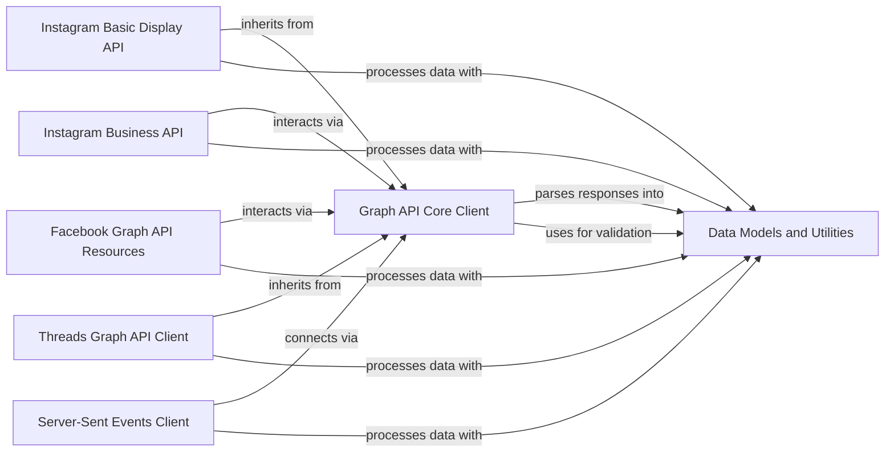

## Component Details

The `python-facebook` project provides a comprehensive Python client for interacting with various Facebook Graph APIs, including Facebook, Instagram Basic Display, Instagram Business, and Threads. The core functionality revolves around a central Graph API client that handles requests, responses, authentication, rate limiting, and error handling. Specialized API clients and resource components extend this core client to provide interfaces for specific platforms and data types. Data consistency and proper API request construction are ensured through a dedicated component for data models and utility functions, which is utilized across all API interactions.

### Graph API Core Client
The foundational client for interacting with the Facebook Graph API, managing HTTP requests, responses, authentication tokens, rate limiting, and error handling. It serves as the base for other API clients.

**Related Classes/Methods**:

- <a href="https://github.com/sns-sdks/python-facebook/blob/master/pyfacebook/api/graph.py#L24-L735" target="_blank" rel="noopener noreferrer">`pyfacebook.api.graph.GraphAPI` (24:735)</a>
- <a href="https://github.com/sns-sdks/python-facebook/blob/master/pyfacebook/ratelimit.py#L59-L202" target="_blank" rel="noopener noreferrer">`pyfacebook.ratelimit.RateLimit` (59:202)</a>
- <a href="https://github.com/sns-sdks/python-facebook/blob/master/pyfacebook/exceptions.py#L12-L30" target="_blank" rel="noopener noreferrer">`pyfacebook.exceptions.LibraryError` (12:30)</a>
- <a href="https://github.com/sns-sdks/python-facebook/blob/master/pyfacebook/exceptions.py#L33-L44" target="_blank" rel="noopener noreferrer">`pyfacebook.exceptions.FacebookError` (33:44)</a>

### Data Models and Utilities
Provides the base classes for data serialization/deserialization from JSON and common utility functions for parameter validation and formatting across the library, ensuring data consistency and correct API request construction.

**Related Classes/Methods**:

- <a href="https://github.com/sns-sdks/python-facebook/blob/master/pyfacebook/models/base.py#L23-L51" target="_blank" rel="noopener noreferrer">`pyfacebook.models.base.BaseModel` (23:51)</a>
- <a href="https://github.com/sns-sdks/python-facebook/blob/master/pyfacebook/utils/params_utils.py#L10-L45" target="_blank" rel="noopener noreferrer">`pyfacebook.utils.params_utils:enf_comma_separated` (10:45)</a>

### Instagram Basic Display API
Client and resource interfaces for accessing user and media data through the Instagram Basic Display API. It extends the core Graph API client for its underlying request mechanisms and utilizes data models and utilities.

**Related Classes/Methods**:

- <a href="https://github.com/sns-sdks/python-facebook/blob/master/pyfacebook/api/graph.py#L738-L869" target="_blank" rel="noopener noreferrer">`pyfacebook.api.graph.BasicDisplayAPI` (738:869)</a>
- <a href="https://github.com/sns-sdks/python-facebook/blob/master/pyfacebook/api/instagram_basic/resource/media.py#L13-L103" target="_blank" rel="noopener noreferrer">`pyfacebook.api.instagram_basic.resource.media.IGBasicMedia` (13:103)</a>
- <a href="https://github.com/sns-sdks/python-facebook/blob/master/pyfacebook/api/instagram_basic/resource/user.py#L13-L82" target="_blank" rel="noopener noreferrer">`pyfacebook.api.instagram_basic.resource.user.IGBasicUser` (13:82)</a>

### Instagram Business API
Comprehensive client and resource interfaces for interacting with the Instagram Business API, covering comments, media, users, containers, and hashtags. It builds upon the core Graph API client and utilizes data models and utilities.

**Related Classes/Methods**:

- <a href="https://github.com/sns-sdks/python-facebook/blob/master/pyfacebook/api/instagram_business/resource/comment.py#L13-L109" target="_blank" rel="noopener noreferrer">`pyfacebook.api.instagram_business.resource.comment.IGBusinessComment` (13:109)</a>
- <a href="https://github.com/sns-sdks/python-facebook/blob/master/pyfacebook/api/instagram_business/resource/media.py#L19-L198" target="_blank" rel="noopener noreferrer">`pyfacebook.api.instagram_business.resource.media.IGBusinessMedia` (19:198)</a>
- <a href="https://github.com/sns-sdks/python-facebook/blob/master/pyfacebook/api/instagram_business/resource/user.py#L26-L582" target="_blank" rel="noopener noreferrer">`pyfacebook.api.instagram_business.resource.user.IGBusinessUser` (26:582)</a>
- <a href="https://github.com/sns-sdks/python-facebook/blob/master/pyfacebook/api/instagram_business/resource/container.py#L13-L72" target="_blank" rel="noopener noreferrer">`pyfacebook.api.instagram_business.resource.container.IGBusinessContainer` (13:72)</a>
- <a href="https://github.com/sns-sdks/python-facebook/blob/master/pyfacebook/api/instagram_business/resource/hashtag.py#L13-L150" target="_blank" rel="noopener noreferrer">`pyfacebook.api.instagram_business.resource.hashtag.IGBusinessHashtag` (13:150)</a>

### Facebook Graph API Resources
A collection of resource interfaces for various Facebook Graph API objects, including Pages, Users, Posts, Comments, Photos, and Videos, and common feed edge functionalities. These resources utilize the core Graph API client and data models and utilities.

**Related Classes/Methods**:

- <a href="https://github.com/sns-sdks/python-facebook/blob/master/pyfacebook/api/facebook/resource/page.py#L24-L248" target="_blank" rel="noopener noreferrer">`pyfacebook.api.facebook.resource.page.FacebookPage` (24:248)</a>
- <a href="https://github.com/sns-sdks/python-facebook/blob/master/pyfacebook/api/facebook/resource/user.py#L24-L208" target="_blank" rel="noopener noreferrer">`pyfacebook.api.facebook.resource.user.FacebookUser` (24:208)</a>
- <a href="https://github.com/sns-sdks/python-facebook/blob/master/pyfacebook/api/facebook/common_edges/feed.py#L12-L103" target="_blank" rel="noopener noreferrer">`pyfacebook.api.facebook.common_edges.feed.FeedEdge` (12:103)</a>
- <a href="https://github.com/sns-sdks/python-facebook/blob/master/pyfacebook/api/facebook/resource/comment.py#L14-L198" target="_blank" rel="noopener noreferrer">`pyfacebook.api.facebook.resource.comment.FacebookComment` (14:198)</a>
- <a href="https://github.com/sns-sdks/python-facebook/blob/master/pyfacebook/api/facebook/resource/post.py#L14-L73" target="_blank" rel="noopener noreferrer">`pyfacebook.api.facebook.resource.post.FacebookPost` (14:73)</a>
- <a href="https://github.com/sns-sdks/python-facebook/blob/master/pyfacebook/api/facebook/resource/photo.py#L14-L76" target="_blank" rel="noopener noreferrer">`pyfacebook.api.facebook.resource.photo.FacebookPhoto` (14:76)</a>
- <a href="https://github.com/sns-sdks/python-facebook/blob/master/pyfacebook/api/facebook/resource/video.py#L14-L74" target="_blank" rel="noopener noreferrer">`pyfacebook.api.facebook.resource.video.FacebookVideo` (14:74)</a>

### Threads Graph API Client
A specialized client for interacting with the Threads Graph API, handling Threads-specific authorization and token exchange. It inherits from the core Graph API client and uses data models and utilities.

**Related Classes/Methods**:

- <a href="https://github.com/sns-sdks/python-facebook/blob/master/pyfacebook/api/graph.py#L872-L992" target="_blank" rel="noopener noreferrer">`pyfacebook.api.graph.ThreadsGraphAPI` (872:992)</a>

### Server-Sent Events Client
Manages real-time data streams from Facebook Graph API using Server-Sent Events (SSE) for live comments and reactions. It utilizes the core Graph API client for its connection mechanisms and data models and utilities.

**Related Classes/Methods**:

- <a href="https://github.com/sns-sdks/python-facebook/blob/master/pyfacebook/api/graph.py#L995-L1000" target="_blank" rel="noopener noreferrer">`pyfacebook.api.graph.ServerSentEventAPI` (995:1000)</a>

### [FAQ](https://github.com/CodeBoarding/GeneratedOnBoardings/tree/main?tab=readme-ov-file#faq)