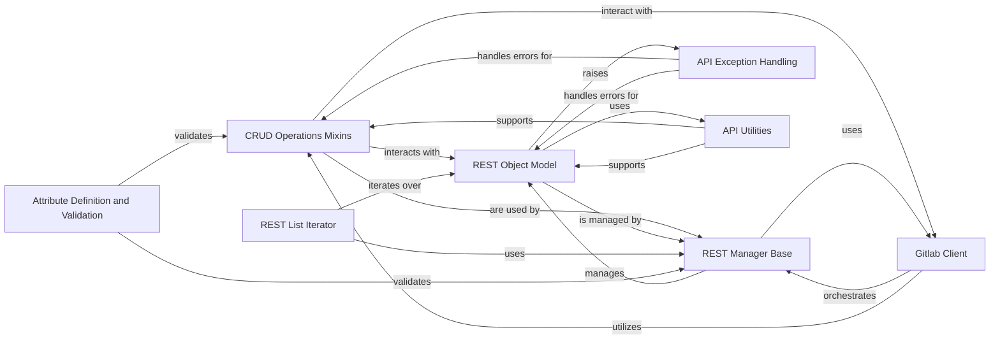

## Component Details

This graph illustrates the core components of the API Resource Abstractions subsystem within the python-gitlab library. It details how API resources are modeled, managed, and interacted with, encompassing fundamental operations like CRUD, error handling, and data validation. The system is designed to provide a robust and extensible framework for interacting with the GitLab API.

### CRUD Operations Mixins
Provides the core Create, Read, Update, and Delete functionalities for interacting with the GitLab API. These mixins handle specific HTTP methods and data transformations, acting as the primary interface for resource manipulation.

**Related Classes/Methods**:

- <a href="https://github.com/python-gitlab/python-gitlab/blob/master/gitlab/mixins.py#L46-L68" target="_blank" rel="noopener noreferrer">`gitlab.mixins.HeadMixin` (46:68)</a>
- <a href="https://github.com/python-gitlab/python-gitlab/blob/master/gitlab/mixins.py#L71-L102" target="_blank" rel="noopener noreferrer">`gitlab.mixins.GetMixin` (71:102)</a>
- <a href="https://github.com/python-gitlab/python-gitlab/blob/master/gitlab/mixins.py#L161-L224" target="_blank" rel="noopener noreferrer">`gitlab.mixins.ListMixin` (161:224)</a>
- <a href="https://github.com/python-gitlab/python-gitlab/blob/master/gitlab/mixins.py#L230-L261" target="_blank" rel="noopener noreferrer">`gitlab.mixins.CreateMixin` (230:261)</a>
- <a href="https://github.com/python-gitlab/python-gitlab/blob/master/gitlab/mixins.py#L271-L330" target="_blank" rel="noopener noreferrer">`gitlab.mixins.UpdateMixin` (271:330)</a>
- <a href="https://github.com/python-gitlab/python-gitlab/blob/master/gitlab/mixins.py#L358-L376" target="_blank" rel="noopener noreferrer">`gitlab.mixins.DeleteMixin` (358:376)</a>
- <a href="https://github.com/python-gitlab/python-gitlab/blob/master/gitlab/mixins.py#L396-L442" target="_blank" rel="noopener noreferrer">`gitlab.mixins.SaveMixin` (396:442)</a>
- <a href="https://github.com/python-gitlab/python-gitlab/blob/master/gitlab/mixins.py#L379-L385" target="_blank" rel="noopener noreferrer">`gitlab.mixins.CRUDMixin` (379:385)</a>

### REST Object Model
Represents a single GitLab API resource, managing its attributes, handling serialization/deserialization, and providing methods for accessing and manipulating its data. It's the fundamental data structure for API responses.

**Related Classes/Methods**:

- <a href="https://github.com/python-gitlab/python-gitlab/blob/master/gitlab/base.py#L27-L252" target="_blank" rel="noopener noreferrer">`gitlab.base.RESTObject` (27:252)</a>
- <a href="https://github.com/python-gitlab/python-gitlab/blob/master/gitlab/base.py#L52-L77" target="_blank" rel="noopener noreferrer">`gitlab.base.RESTObject:__init__` (52:77)</a>
- <a href="https://github.com/python-gitlab/python-gitlab/blob/master/gitlab/base.py#L147-L148" target="_blank" rel="noopener noreferrer">`gitlab.base.RESTObject:attributes` (147:148)</a>
- <a href="https://github.com/python-gitlab/python-gitlab/blob/master/gitlab/base.py#L150-L151" target="_blank" rel="noopener noreferrer">`gitlab.base.RESTObject:to_json` (150:151)</a>
- <a href="https://github.com/python-gitlab/python-gitlab/blob/master/gitlab/base.py#L153-L154" target="_blank" rel="noopener noreferrer">`gitlab.base.RESTObject:__str__` (153:154)</a>
- <a href="https://github.com/python-gitlab/python-gitlab/blob/master/gitlab/base.py#L156-L157" target="_blank" rel="noopener noreferrer">`gitlab.base.RESTObject:pformat` (156:157)</a>
- <a href="https://github.com/python-gitlab/python-gitlab/blob/master/gitlab/base.py#L159-L160" target="_blank" rel="noopener noreferrer">`gitlab.base.RESTObject:pprint` (159:160)</a>
- <a href="https://github.com/python-gitlab/python-gitlab/blob/master/gitlab/base.py#L162-L175" target="_blank" rel="noopener noreferrer">`gitlab.base.RESTObject:__repr__` (162:175)</a>
- <a href="https://github.com/python-gitlab/python-gitlab/blob/master/gitlab/base.py#L177-L182" target="_blank" rel="noopener noreferrer">`gitlab.base.RESTObject:__eq__` (177:182)</a>
- <a href="https://github.com/python-gitlab/python-gitlab/blob/master/gitlab/base.py#L184-L189" target="_blank" rel="noopener noreferrer">`gitlab.base.RESTObject:__ne__` (184:189)</a>
- <a href="https://github.com/python-gitlab/python-gitlab/blob/master/gitlab/base.py#L194-L197" target="_blank" rel="noopener noreferrer">`gitlab.base.RESTObject:__hash__` (194:197)</a>
- <a href="https://github.com/python-gitlab/python-gitlab/blob/master/gitlab/base.py#L246-L252" target="_blank" rel="noopener noreferrer">`gitlab.base.RESTObject:encoded_id` (246:252)</a>
- <a href="https://github.com/python-gitlab/python-gitlab/blob/master/gitlab/base.py#L199-L220" target="_blank" rel="noopener noreferrer">`gitlab.base.RESTObject._create_managers` (199:220)</a>
- <a href="https://github.com/python-gitlab/python-gitlab/blob/master/gitlab/base.py#L222-L224" target="_blank" rel="noopener noreferrer">`gitlab.base.RESTObject._update_attrs` (222:224)</a>
- <a href="https://github.com/python-gitlab/python-gitlab/blob/master/gitlab/base.py#L226-L233" target="_blank" rel="noopener noreferrer">`gitlab.base.RESTObject.get_id` (226:233)</a>

### REST List Iterator
A specialized generator for iterating over collections of RESTObject's, designed to efficiently handle GitLab API pagination and provide access to individual resources within a list.

**Related Classes/Methods**:

- <a href="https://github.com/python-gitlab/python-gitlab/blob/master/gitlab/base.py#L258-L337" target="_blank" rel="noopener noreferrer">`gitlab.base.RESTObjectList` (258:337)</a>
- <a href="https://github.com/python-gitlab/python-gitlab/blob/master/gitlab/base.py#L296-L297" target="_blank" rel="noopener noreferrer">`gitlab.base.RESTObjectList:__next__` (296:297)</a>
- <a href="https://github.com/python-gitlab/python-gitlab/blob/master/gitlab/base.py#L299-L301" target="_blank" rel="noopener noreferrer">`gitlab.base.RESTObjectList.next` (299:301)</a>

### REST Manager Base
The foundational class for managing collections of RESTObject's. It defines the base URL path for API requests and orchestrates the creation and interaction with individual API resources.

**Related Classes/Methods**:

- <a href="https://github.com/python-gitlab/python-gitlab/blob/master/gitlab/base.py#L340-L394" target="_blank" rel="noopener noreferrer">`gitlab.base.RESTManager` (340:394)</a>
- <a href="https://github.com/python-gitlab/python-gitlab/blob/master/gitlab/base.py#L361-L370" target="_blank" rel="noopener noreferrer">`gitlab.base.RESTManager:__init__` (361:370)</a>
- <a href="https://github.com/python-gitlab/python-gitlab/blob/master/gitlab/base.py#L376-L390" target="_blank" rel="noopener noreferrer">`gitlab.base.RESTManager:_compute_path` (376:390)</a>

### API Exception Handling
Provides a structured approach to error management within the python-gitlab library. It defines a hierarchy of custom exceptions for various GitLab API errors and includes a decorator to simplify error handling in API interactions.

**Related Classes/Methods**:

- <a href="https://github.com/python-gitlab/python-gitlab/blob/master/gitlab/exceptions.py#L332-L352" target="_blank" rel="noopener noreferrer">`gitlab.exceptions.on_http_error` (332:352)</a>
- <a href="https://github.com/python-gitlab/python-gitlab/blob/master/gitlab/exceptions.py#L45-L46" target="_blank" rel="noopener noreferrer">`gitlab.exceptions.GitlabParsingError` (45:46)</a>
- <a href="https://github.com/python-gitlab/python-gitlab/blob/master/gitlab/exceptions.py#L7-L34" target="_blank" rel="noopener noreferrer">`gitlab.exceptions.GitlabError` (7:34)</a>
- <a href="https://github.com/python-gitlab/python-gitlab/blob/master/gitlab/exceptions.py#L61-L62" target="_blank" rel="noopener noreferrer">`gitlab.exceptions.GitlabHttpError` (61:62)</a>
- <a href="https://github.com/python-gitlab/python-gitlab/blob/master/gitlab/exceptions.py#L37-L38" target="_blank" rel="noopener noreferrer">`gitlab.exceptions.GitlabAuthenticationError` (37:38)</a>
- <a href="https://github.com/python-gitlab/python-gitlab/blob/master/gitlab/exceptions.py#L53-L54" target="_blank" rel="noopener noreferrer">`gitlab.exceptions.GitlabConnectionError` (53:54)</a>
- <a href="https://github.com/python-gitlab/python-gitlab/blob/master/gitlab/exceptions.py#L57-L58" target="_blank" rel="noopener noreferrer">`gitlab.exceptions.GitlabOperationError` (57:58)</a>

### API Utilities
A collection of helper functions that provide essential utilities for data manipulation, ID encoding, and request retry mechanisms, supporting the core API interaction logic.

**Related Classes/Methods**:

- <a href="https://github.com/python-gitlab/python-gitlab/blob/master/gitlab/utils.py#L227-L250" target="_blank" rel="noopener noreferrer">`gitlab.utils.EncodedId` (227:250)</a>
- <a href="https://github.com/python-gitlab/python-gitlab/blob/master/gitlab/utils.py#L155-L210" target="_blank" rel="noopener noreferrer">`gitlab.utils._transform_types` (155:210)</a>

### Attribute Definition and Validation
Defines mechanisms for validating attributes of API resources and handling custom data types. This ensures data integrity and proper formatting before API requests.

**Related Classes/Methods**:

- <a href="https://github.com/python-gitlab/python-gitlab/blob/master/gitlab/types.py#L8-L35" target="_blank" rel="noopener noreferrer">`gitlab.types.RequiredOptional` (8:35)</a>
- <a href="https://github.com/python-gitlab/python-gitlab/blob/master/gitlab/types.py#L38-L49" target="_blank" rel="noopener noreferrer">`gitlab.types.GitlabAttribute` (38:49)</a>

### Gitlab Client
The main client class for interacting with the GitLab API, responsible for managing connections, authentication, and dispatching requests.

**Related Classes/Methods**:

- <a href="https://github.com/python-gitlab/python-gitlab/blob/master/gitlab/client.py#L100-L1000" target="_blank" rel="noopener noreferrer">`gitlab.client.Gitlab` (100:1000)</a>
- <a href="https://github.com/python-gitlab/python-gitlab/blob/master/gitlab/client.py#L20-L97" target="_blank" rel="noopener noreferrer">`gitlab.client.GitlabList` (20:97)</a>

### [FAQ](https://github.com/CodeBoarding/GeneratedOnBoardings/tree/main?tab=readme-ov-file#faq)