```mermaid
graph LR
    CLI_Interface["CLI Interface"]
    CLI_Core["CLI Core"]
    CLI_v4_Specifics["CLI v4 Specifics"]
    API_Mixins["API Mixins"]
    Exception_Handling["Exception Handling"]
    Base_API_Objects["Base API Objects"]
    Utility_Functions["Utility Functions"]
    GitLab_Client["GitLab Client"]
    Configuration_Management["Configuration Management"]
    GitLab_API_v4_Objects["GitLab API v4 Objects"]
    CLI_Core -- "loads configuration from" --> Configuration_Management
    CLI_Core -- "initializes" --> GitLab_Client
    CLI_Core -- "delegates command execution to" --> CLI_v4_Specifics
    CLI_v4_Specifics -- "orchestrates operations on" --> Base_API_Objects
    CLI_v4_Specifics -- "catches and handles" --> Exception_Handling
    API_Mixins -- "extends functionality of" --> Base_API_Objects
    Exception_Handling -- "is raised by" --> GitLab_Client
    Exception_Handling -- "decorates methods for" --> API_Mixins
    Base_API_Objects -- "performs HTTP requests through" --> GitLab_Client
    Base_API_Objects -- "serves as base for" --> GitLab_API_v4_Objects
    Utility_Functions -- "provides data transformation for" --> Base_API_Objects
    Utility_Functions -- "assists with network operations for" --> GitLab_Client
    GitLab_Client -- "leverages" --> Utility_Functions
    Configuration_Management -- "supplies settings to" --> GitLab_Client
    GitLab_API_v4_Objects -- "inherits behaviors from" --> API_Mixins
    GitLab_API_v4_Objects -- "is exposed via" --> CLI_v4_Specifics
```

## Component Details

This component overview describes the architecture of the `python-gitlab` library, focusing on its command-line interface and its interaction with the GitLab API. The main flow starts with the `CLI Core` parsing arguments and loading configurations, then delegating to `CLI v4 Specifics` for API version-specific operations. These operations interact with `Base API Objects` and `GitLab API v4 Objects`, which in turn use the `GitLab Client` for HTTP communication. `API Mixins` extend the functionality of API objects, while `Exception Handling` ensures robust error management. `Utility Functions` provide common helpers, and `Configuration Management` handles settings.

### CLI Interface
This component provides the command-line interface for interacting with the GitLab API. It handles argument parsing, registers custom actions, and executes commands to perform various GitLab operations, acting as the entry point for CLI usage.

**Related Classes/Methods**:

- `gitlab.cli` (full file reference)
- <a href="https://github.com/python-gitlab/python-gitlab/blob/master/gitlab/v4/cli.py#L16-L202" target="_blank" rel="noopener noreferrer">`gitlab.v4.cli.GitlabCLI` (16:202)</a>
- <a href="https://github.com/python-gitlab/python-gitlab/blob/master/gitlab/v4/cli.py#L440-L451" target="_blank" rel="noopener noreferrer">`gitlab.v4.cli.JSONPrinter` (440:451)</a>
- <a href="https://github.com/python-gitlab/python-gitlab/blob/master/gitlab/v4/cli.py#L454-L487" target="_blank" rel="noopener noreferrer">`gitlab.v4.cli.YAMLPrinter` (454:487)</a>
- <a href="https://github.com/python-gitlab/python-gitlab/blob/master/gitlab/v4/cli.py#L490-L560" target="_blank" rel="noopener noreferrer">`gitlab.v4.cli.LegacyPrinter` (490:560)</a>

### CLI Core
This component serves as the main entry point for the command-line interface. It handles initial argument parsing, loads the appropriate API version's CLI, and manages global CLI options such as configuration files, debug mode, and output format.

**Related Classes/Methods**:

- <a href="https://github.com/python-gitlab/python-gitlab/blob/master/gitlab/cli.py#L327-L410" target="_blank" rel="noopener noreferrer">`gitlab.cli:main` (327:410)</a>
- <a href="https://github.com/python-gitlab/python-gitlab/blob/master/gitlab/cli.py#L116-L283" target="_blank" rel="noopener noreferrer">`gitlab.cli:_get_base_parser` (116:283)</a>
- <a href="https://github.com/python-gitlab/python-gitlab/blob/master/gitlab/cli.py#L316-L324" target="_blank" rel="noopener noreferrer">`gitlab.cli:docs` (316:324)</a>
- <a href="https://github.com/python-gitlab/python-gitlab/blob/master/gitlab/cli.py#L295-L313" target="_blank" rel="noopener noreferrer">`gitlab.cli:_parse_value` (295:313)</a>
- <a href="https://github.com/python-gitlab/python-gitlab/blob/master/gitlab/cli.py#L91-L95" target="_blank" rel="noopener noreferrer">`gitlab.cli:die` (91:95)</a>
- <a href="https://github.com/python-gitlab/python-gitlab/blob/master/gitlab/cli.py#L48-L88" target="_blank" rel="noopener noreferrer">`gitlab.cli:register_custom_action` (48:88)</a>
- <a href="https://github.com/python-gitlab/python-gitlab/blob/master/gitlab/cli.py#L98-L107" target="_blank" rel="noopener noreferrer">`gitlab.cli:gitlab_resource_to_cls` (98:107)</a>
- <a href="https://github.com/python-gitlab/python-gitlab/blob/master/gitlab/cli.py#L110-L113" target="_blank" rel="noopener noreferrer">`gitlab.cli:cls_to_gitlab_resource` (110:113)</a>

### CLI v4 Specifics
This component extends the base command-line interface with functionalities specific to GitLab API v4. It is responsible for parsing resource-specific arguments, dispatching actions to the correct API object methods, and formatting the output for display.

**Related Classes/Methods**:

- <a href="https://github.com/python-gitlab/python-gitlab/blob/master/gitlab/v4/cli.py#L16-L202" target="_blank" rel="noopener noreferrer">`gitlab.v4.cli.GitlabCLI` (16:202)</a>
- <a href="https://github.com/python-gitlab/python-gitlab/blob/master/gitlab/v4/cli.py#L388-L426" target="_blank" rel="noopener noreferrer">`gitlab.v4.cli:extend_parser` (388:426)</a>
- <a href="https://github.com/python-gitlab/python-gitlab/blob/master/gitlab/v4/cli.py#L570-L602" target="_blank" rel="noopener noreferrer">`gitlab.v4.cli:run` (570:602)</a>
- <a href="https://github.com/python-gitlab/python-gitlab/blob/master/gitlab/v4/cli.py#L212-L385" target="_blank" rel="noopener noreferrer">`gitlab.v4.cli:_populate_sub_parser_by_class` (212:385)</a>
- <a href="https://github.com/python-gitlab/python-gitlab/blob/master/gitlab/v4/cli.py#L440-L451" target="_blank" rel="noopener noreferrer">`gitlab.v4.cli.JSONPrinter` (440:451)</a>
- <a href="https://github.com/python-gitlab/python-gitlab/blob/master/gitlab/v4/cli.py#L454-L487" target="_blank" rel="noopener noreferrer">`gitlab.v4.cli.YAMLPrinter` (454:487)</a>
- <a href="https://github.com/python-gitlab/python-gitlab/blob/master/gitlab/v4/cli.py#L490-L560" target="_blank" rel="noopener noreferrer">`gitlab.v4.cli.LegacyPrinter` (490:560)</a>
- <a href="https://github.com/python-gitlab/python-gitlab/blob/master/gitlab/v4/cli.py#L429-L437" target="_blank" rel="noopener noreferrer">`gitlab.v4.cli:get_dict` (429:437)</a>

### API Mixins
This component provides a collection of reusable methods that can be inherited by GitLab API object classes (RESTObject and RESTManager subclasses). These mixins encapsulate common functionalities like uploading files, approving requests, downloading content, or managing time tracking, reducing code duplication across various API resources.

**Related Classes/Methods**:

- <a href="https://github.com/python-gitlab/python-gitlab/blob/master/gitlab/mixins.py#L471-L495" target="_blank" rel="noopener noreferrer">`gitlab.mixins.UserAgentDetailMixin` (471:495)</a>
- <a href="https://github.com/python-gitlab/python-gitlab/blob/master/gitlab/mixins.py#L498-L530" target="_blank" rel="noopener noreferrer">`gitlab.mixins.AccessRequestMixin` (498:530)</a>
- <a href="https://github.com/python-gitlab/python-gitlab/blob/master/gitlab/mixins.py#L533-L613" target="_blank" rel="noopener noreferrer">`gitlab.mixins.DownloadMixin` (533:613)</a>
- <a href="https://github.com/python-gitlab/python-gitlab/blob/master/gitlab/mixins.py#L616-L647" target="_blank" rel="noopener noreferrer">`gitlab.mixins.RotateMixin` (616:647)</a>
- <a href="https://github.com/python-gitlab/python-gitlab/blob/master/gitlab/mixins.py#L650-L680" target="_blank" rel="noopener noreferrer">`gitlab.mixins.ObjectRotateMixin` (650:680)</a>
- <a href="https://github.com/python-gitlab/python-gitlab/blob/master/gitlab/mixins.py#L683-L729" target="_blank" rel="noopener noreferrer">`gitlab.mixins.SubscribableMixin` (683:729)</a>
- <a href="https://github.com/python-gitlab/python-gitlab/blob/master/gitlab/mixins.py#L732-L753" target="_blank" rel="noopener noreferrer">`gitlab.mixins.TodoMixin` (732:753)</a>
- <a href="https://github.com/python-gitlab/python-gitlab/blob/master/gitlab/mixins.py#L756-L868" target="_blank" rel="noopener noreferrer">`gitlab.mixins.TimeTrackingMixin` (756:868)</a>
- <a href="https://github.com/python-gitlab/python-gitlab/blob/master/gitlab/mixins.py#L871-L904" target="_blank" rel="noopener noreferrer">`gitlab.mixins.ParticipantsMixin` (871:904)</a>
- <a href="https://github.com/python-gitlab/python-gitlab/blob/master/gitlab/mixins.py#L907-L933" target="_blank" rel="noopener noreferrer">`gitlab.mixins.BadgeRenderMixin` (907:933)</a>
- <a href="https://github.com/python-gitlab/python-gitlab/blob/master/gitlab/mixins.py#L981-L999" target="_blank" rel="noopener noreferrer">`gitlab.mixins.UploadMixin` (981:999)</a>
- <a href="https://github.com/python-gitlab/python-gitlab/blob/master/gitlab/mixins.py#L232-L261" target="_blank" rel="noopener noreferrer">`gitlab.mixins.CreateMixin.create` (232:261)</a>

### Exception Handling
This component defines a comprehensive hierarchy of custom exception classes tailored for various GitLab API errors. It also includes a decorator, on_http_error, which simplifies error management by catching generic HTTP errors and re-raising them as more specific, descriptive exceptions.

**Related Classes/Methods**:

- <a href="https://github.com/python-gitlab/python-gitlab/blob/master/gitlab/exceptions.py#L332-L352" target="_blank" rel="noopener noreferrer">`gitlab.exceptions.on_http_error` (332:352)</a>
- <a href="https://github.com/python-gitlab/python-gitlab/blob/master/gitlab/exceptions.py#L233-L234" target="_blank" rel="noopener noreferrer">`gitlab.exceptions.GitlabUploadError` (233:234)</a>
- <a href="https://github.com/python-gitlab/python-gitlab/blob/master/gitlab/exceptions.py#L49-L50" target="_blank" rel="noopener noreferrer">`gitlab.exceptions.GitlabCiLintError` (49:50)</a>
- <a href="https://github.com/python-gitlab/python-gitlab/blob/master/gitlab/exceptions.py#L7-L34" target="_blank" rel="noopener noreferrer">`gitlab.exceptions.GitlabError` (7:34)</a>
- <a href="https://github.com/python-gitlab/python-gitlab/blob/master/gitlab/exceptions.py#L37-L38" target="_blank" rel="noopener noreferrer">`gitlab.exceptions.GitlabAuthenticationError` (37:38)</a>
- <a href="https://github.com/python-gitlab/python-gitlab/blob/master/gitlab/exceptions.py#L41-L42" target="_blank" rel="noopener noreferrer">`gitlab.exceptions.RedirectError` (41:42)</a>
- <a href="https://github.com/python-gitlab/python-gitlab/blob/master/gitlab/exceptions.py#L45-L46" target="_blank" rel="noopener noreferrer">`gitlab.exceptions.GitlabParsingError` (45:46)</a>
- <a href="https://github.com/python-gitlab/python-gitlab/blob/master/gitlab/exceptions.py#L53-L54" target="_blank" rel="noopener noreferrer">`gitlab.exceptions.GitlabConnectionError` (53:54)</a>
- <a href="https://github.com/python-gitlab/python-gitlab/blob/master/gitlab/exceptions.py#L57-L58" target="_blank" rel="noopener noreferrer">`gitlab.exceptions.GitlabOperationError` (57:58)</a>
- <a href="https://github.com/python-gitlab/python-gitlab/blob/master/gitlab/exceptions.py#L61-L62" target="_blank" rel="noopener noreferrer">`gitlab.exceptions.GitlabHttpError` (61:62)</a>
- <a href="https://github.com/python-gitlab/python-gitlab/blob/master/gitlab/exceptions.py#L65-L66" target="_blank" rel="noopener noreferrer">`gitlab.exceptions.GitlabListError` (65:66)</a>
- <a href="https://github.com/python-gitlab/python-gitlab/blob/master/gitlab/exceptions.py#L69-L70" target="_blank" rel="noopener noreferrer">`gitlab.exceptions.GitlabGetError` (69:70)</a>
- <a href="https://github.com/python-gitlab/python-gitlab/blob/master/gitlab/exceptions.py#L73-L74" target="_blank" rel="noopener noreferrer">`gitlab.exceptions.GitlabHeadError` (73:74)</a>
- <a href="https://github.com/python-gitlab/python-gitlab/blob/master/gitlab/exceptions.py#L77-L78" target="_blank" rel="noopener noreferrer">`gitlab.exceptions.GitlabCreateError` (77:78)</a>
- <a href="https://github.com/python-gitlab/python-gitlab/blob/master/gitlab/exceptions.py#L81-L82" target="_blank" rel="noopener noreferrer">`gitlab.exceptions.GitlabUpdateError` (81:82)</a>
- <a href="https://github.com/python-gitlab/python-gitlab/blob/master/gitlab/exceptions.py#L85-L86" target="_blank" rel="noopener noreferrer">`gitlab.exceptions.GitlabDeleteError` (85:86)</a>
- <a href="https://github.com/python-gitlab/python-gitlab/blob/master/gitlab/exceptions.py#L89-L90" target="_blank" rel="noopener noreferrer">`gitlab.exceptions.GitlabSetError` (89:90)</a>
- <a href="https://github.com/python-gitlab/python-gitlab/blob/master/gitlab/exceptions.py#L93-L94" target="_blank" rel="noopener noreferrer">`gitlab.exceptions.GitlabProtectError` (93:94)</a>
- <a href="https://github.com/python-gitlab/python-gitlab/blob/master/gitlab/exceptions.py#L97-L98" target="_blank" rel="noopener noreferrer">`gitlab.exceptions.GitlabTransferProjectError` (97:98)</a>
- <a href="https://github.com/python-gitlab/python-gitlab/blob/master/gitlab/exceptions.py#L101-L102" target="_blank" rel="noopener noreferrer">`gitlab.exceptions.GitlabGroupTransferError` (101:102)</a>
- <a href="https://github.com/python-gitlab/python-gitlab/blob/master/gitlab/exceptions.py#L105-L106" target="_blank" rel="noopener noreferrer">`gitlab.exceptions.GitlabProjectDeployKeyError` (105:106)</a>
- <a href="https://github.com/python-gitlab/python-gitlab/blob/master/gitlab/exceptions.py#L109-L110" target="_blank" rel="noopener noreferrer">`gitlab.exceptions.GitlabPromoteError` (109:110)</a>
- <a href="https://github.com/python-gitlab/python-gitlab/blob/master/gitlab/exceptions.py#L113-L114" target="_blank" rel="noopener noreferrer">`gitlab.exceptions.GitlabCancelError` (113:114)</a>
- <a href="https://github.com/python-gitlab/python-gitlab/blob/master/gitlab/exceptions.py#L117-L118" target="_blank" rel="noopener noreferrer">`gitlab.exceptions.GitlabPipelineCancelError` (117:118)</a>
- <a href="https://github.com/python-gitlab/python-gitlab/blob/master/gitlab/exceptions.py#L121-L122" target="_blank" rel="noopener noreferrer">`gitlab.exceptions.GitlabRetryError` (121:122)</a>
- <a href="https://github.com/python-gitlab/python-gitlab/blob/master/gitlab/exceptions.py#L125-L126" target="_blank" rel="noopener noreferrer">`gitlab.exceptions.GitlabBuildCancelError` (125:126)</a>
- <a href="https://github.com/python-gitlab/python-gitlab/blob/master/gitlab/exceptions.py#L129-L130" target="_blank" rel="noopener noreferrer">`gitlab.exceptions.GitlabBuildRetryError` (129:130)</a>
- <a href="https://github.com/python-gitlab/python-gitlab/blob/master/gitlab/exceptions.py#L133-L134" target="_blank" rel="noopener noreferrer">`gitlab.exceptions.GitlabBuildPlayError` (133:134)</a>
- <a href="https://github.com/python-gitlab/python-gitlab/blob/master/gitlab/exceptions.py#L137-L138" target="_blank" rel="noopener noreferrer">`gitlab.exceptions.GitlabBuildEraseError` (137:138)</a>
- <a href="https://github.com/python-gitlab/python-gitlab/blob/master/gitlab/exceptions.py#L141-L142" target="_blank" rel="noopener noreferrer">`gitlab.exceptions.GitlabJobCancelError` (141:142)</a>
- <a href="https://github.com/python-gitlab/python-gitlab/blob/master/gitlab/exceptions.py#L145-L146" target="_blank" rel="noopener noreferrer">`gitlab.exceptions.GitlabJobRetryError` (145:146)</a>
- <a href="https://github.com/python-gitlab/python-gitlab/blob/master/gitlab/exceptions.py#L149-L150" target="_blank" rel="noopener noreferrer">`gitlab.exceptions.GitlabJobPlayError` (149:150)</a>
- <a href="https://github.com/python-gitlab/python-gitlab/blob/master/gitlab/exceptions.py#L153-L154" target="_blank" rel="noopener noreferrer">`gitlab.exceptions.GitlabJobEraseError` (153:154)</a>
- <a href="https://github.com/python-gitlab/python-gitlab/blob/master/gitlab/exceptions.py#L157-L158" target="_blank" rel="noopener noreferrer">`gitlab.exceptions.GitlabPipelinePlayError` (157:158)</a>
- <a href="https://github.com/python-gitlab/python-gitlab/blob/master/gitlab/exceptions.py#L161-L162" target="_blank" rel="noopener noreferrer">`gitlab.exceptions.GitlabPipelineRetryError` (161:162)</a>
- <a href="https://github.com/python-gitlab/python-gitlab/blob/master/gitlab/exceptions.py#L165-L166" target="_blank" rel="noopener noreferrer">`gitlab.exceptions.GitlabBlockError` (165:166)</a>
- <a href="https://github.com/python-gitlab/python-gitlab/blob/master/gitlab/exceptions.py#L169-L170" target="_blank" rel="noopener noreferrer">`gitlab.exceptions.GitlabUnblockError` (169:170)</a>
- <a href="https://github.com/python-gitlab/python-gitlab/blob/master/gitlab/exceptions.py#L173-L174" target="_blank" rel="noopener noreferrer">`gitlab.exceptions.GitlabDeactivateError` (173:174)</a>
- <a href="https://github.com/python-gitlab/python-gitlab/blob/master/gitlab/exceptions.py#L177-L178" target="_blank" rel="noopener noreferrer">`gitlab.exceptions.GitlabActivateError` (177:178)</a>
- <a href="https://github.com/python-gitlab/python-gitlab/blob/master/gitlab/exceptions.py#L181-L182" target="_blank" rel="noopener noreferrer">`gitlab.exceptions.GitlabBanError` (181:182)</a>
- <a href="https://github.com/python-gitlab/python-gitlab/blob/master/gitlab/exceptions.py#L185-L186" target="_blank" rel="noopener noreferrer">`gitlab.exceptions.GitlabUnbanError` (185:186)</a>
- <a href="https://github.com/python-gitlab/python-gitlab/blob/master/gitlab/exceptions.py#L189-L190" target="_blank" rel="noopener noreferrer">`gitlab.exceptions.GitlabSubscribeError` (189:190)</a>
- <a href="https://github.com/python-gitlab/python-gitlab/blob/master/gitlab/exceptions.py#L193-L194" target="_blank" rel="noopener noreferrer">`gitlab.exceptions.GitlabUnsubscribeError` (193:194)</a>
- <a href="https://github.com/python-gitlab/python-gitlab/blob/master/gitlab/exceptions.py#L197-L198" target="_blank" rel="noopener noreferrer">`gitlab.exceptions.GitlabMRForbiddenError` (197:198)</a>
- <a href="https://github.com/python-gitlab/python-gitlab/blob/master/gitlab/exceptions.py#L201-L202" target="_blank" rel="noopener noreferrer">`gitlab.exceptions.GitlabMRApprovalError` (201:202)</a>
- <a href="https://github.com/python-gitlab/python-gitlab/blob/master/gitlab/exceptions.py#L205-L206" target="_blank" rel="noopener noreferrer">`gitlab.exceptions.GitlabMRRebaseError` (205:206)</a>
- <a href="https://github.com/python-gitlab/python-gitlab/blob/master/gitlab/exceptions.py#L209-L210" target="_blank" rel="noopener noreferrer">`gitlab.exceptions.GitlabMRResetApprovalError` (209:210)</a>
- <a href="https://github.com/python-gitlab/python-gitlab/blob/master/gitlab/exceptions.py#L213-L214" target="_blank" rel="noopener noreferrer">`gitlab.exceptions.GitlabMRClosedError` (213:214)</a>
- <a href="https://github.com/python-gitlab/python-gitlab/blob/master/gitlab/exceptions.py#L217-L218" target="_blank" rel="noopener noreferrer">`gitlab.exceptions.GitlabMROnBuildSuccessError` (217:218)</a>
- <a href="https://github.com/python-gitlab/python-gitlab/blob/master/gitlab/exceptions.py#L221-L222" target="_blank" rel="noopener noreferrer">`gitlab.exceptions.GitlabTodoError` (221:222)</a>
- <a href="https://github.com/python-gitlab/python-gitlab/blob/master/gitlab/exceptions.py#L225-L226" target="_blank" rel="noopener noreferrer">`gitlab.exceptions.GitlabTopicMergeError` (225:226)</a>
- <a href="https://github.com/python-gitlab/python-gitlab/blob/master/gitlab/exceptions.py#L229-L230" target="_blank" rel="noopener noreferrer">`gitlab.exceptions.GitlabTimeTrackingError` (229:230)</a>
- <a href="https://github.com/python-gitlab/python-gitlab/blob/master/gitlab/exceptions.py#L237-L238" target="_blank" rel="noopener noreferrer">`gitlab.exceptions.GitlabAttachFileError` (237:238)</a>
- <a href="https://github.com/python-gitlab/python-gitlab/blob/master/gitlab/exceptions.py#L241-L242" target="_blank" rel="noopener noreferrer">`gitlab.exceptions.GitlabImportError` (241:242)</a>
- <a href="https://github.com/python-gitlab/python-gitlab/blob/master/gitlab/exceptions.py#L245-L246" target="_blank" rel="noopener noreferrer">`gitlab.exceptions.GitlabInvitationError` (245:246)</a>
- <a href="https://github.com/python-gitlab/python-gitlab/blob/master/gitlab/exceptions.py#L249-L250" target="_blank" rel="noopener noreferrer">`gitlab.exceptions.GitlabCherryPickError` (249:250)</a>
- <a href="https://github.com/python-gitlab/python-gitlab/blob/master/gitlab/exceptions.py#L253-L254" target="_blank" rel="noopener noreferrer">`gitlab.exceptions.GitlabHousekeepingError` (253:254)</a>
- <a href="https://github.com/python-gitlab/python-gitlab/blob/master/gitlab/exceptions.py#L257-L258" target="_blank" rel="noopener noreferrer">`gitlab.exceptions.GitlabOwnershipError` (257:258)</a>
- <a href="https://github.com/python-gitlab/python-gitlab/blob/master/gitlab/exceptions.py#L261-L262" target="_blank" rel="noopener noreferrer">`gitlab.exceptions.GitlabSearchError` (261:262)</a>
- <a href="https://github.com/python-gitlab/python-gitlab/blob/master/gitlab/exceptions.py#L265-L266" target="_blank" rel="noopener noreferrer">`gitlab.exceptions.GitlabStopError` (265:266)</a>
- <a href="https://github.com/python-gitlab/python-gitlab/blob/master/gitlab/exceptions.py#L269-L270" target="_blank" rel="noopener noreferrer">`gitlab.exceptions.GitlabMarkdownError` (269:270)</a>
- <a href="https://github.com/python-gitlab/python-gitlab/blob/master/gitlab/exceptions.py#L273-L274" target="_blank" rel="noopener noreferrer">`gitlab.exceptions.GitlabVerifyError` (273:274)</a>
- <a href="https://github.com/python-gitlab/python-gitlab/blob/master/gitlab/exceptions.py#L277-L278" target="_blank" rel="noopener noreferrer">`gitlab.exceptions.GitlabRenderError` (277:278)</a>
- <a href="https://github.com/python-gitlab/python-gitlab/blob/master/gitlab/exceptions.py#L281-L282" target="_blank" rel="noopener noreferrer">`gitlab.exceptions.GitlabRepairError` (281:282)</a>
- <a href="https://github.com/python-gitlab/python-gitlab/blob/master/gitlab/exceptions.py#L285-L286" target="_blank" rel="noopener noreferrer">`gitlab.exceptions.GitlabRestoreError` (285:286)</a>
- <a href="https://github.com/python-gitlab/python-gitlab/blob/master/gitlab/exceptions.py#L289-L290" target="_blank" rel="noopener noreferrer">`gitlab.exceptions.GitlabRevertError` (289:290)</a>
- <a href="https://github.com/python-gitlab/python-gitlab/blob/master/gitlab/exceptions.py#L293-L294" target="_blank" rel="noopener noreferrer">`gitlab.exceptions.GitlabRotateError` (293:294)</a>
- <a href="https://github.com/python-gitlab/python-gitlab/blob/master/gitlab/exceptions.py#L297-L298" target="_blank" rel="noopener noreferrer">`gitlab.exceptions.GitlabLicenseError` (297:298)</a>
- <a href="https://github.com/python-gitlab/python-gitlab/blob/master/gitlab/exceptions.py#L301-L302" target="_blank" rel="noopener noreferrer">`gitlab.exceptions.GitlabFollowError` (301:302)</a>
- <a href="https://github.com/python-gitlab/python-gitlab/blob/master/gitlab/exceptions.py#L305-L306" target="_blank" rel="noopener noreferrer">`gitlab.exceptions.GitlabUnfollowError` (305:306)</a>
- <a href="https://github.com/python-gitlab/python-gitlab/blob/master/gitlab/exceptions.py#L309-L310" target="_blank" rel="noopener noreferrer">`gitlab.exceptions.GitlabUserApproveError` (309:310)</a>
- <a href="https://github.com/python-gitlab/python-gitlab/blob/master/gitlab/exceptions.py#L313-L314" target="_blank" rel="noopener noreferrer">`gitlab.exceptions.GitlabUserRejectError` (313:314)</a>
- <a href="https://github.com/python-gitlab/python-gitlab/blob/master/gitlab/exceptions.py#L317-L318" target="_blank" rel="noopener noreferrer">`gitlab.exceptions.GitlabDeploymentApprovalError` (317:318)</a>
- <a href="https://github.com/python-gitlab/python-gitlab/blob/master/gitlab/exceptions.py#L321-L322" target="_blank" rel="noopener noreferrer">`gitlab.exceptions.GitlabHookTestError` (321:322)</a>

### Base API Objects
This component provides the foundational classes for interacting with the GitLab API. It includes RESTObject for representing individual GitLab resources, RESTManager for performing CRUD operations on collections of resources, and RESTObjectList for handling paginated API responses.

**Related Classes/Methods**:

- <a href="https://github.com/python-gitlab/python-gitlab/blob/master/gitlab/base.py#L27-L252" target="_blank" rel="noopener noreferrer">`gitlab.base.RESTObject` (27:252)</a>
- <a href="https://github.com/python-gitlab/python-gitlab/blob/master/gitlab/base.py#L222-L224" target="_blank" rel="noopener noreferrer">`gitlab.base.RESTObject._update_attrs` (222:224)</a>
- <a href="https://github.com/python-gitlab/python-gitlab/blob/master/gitlab/base.py#L258-L337" target="_blank" rel="noopener noreferrer">`gitlab.base.RESTObjectList` (258:337)</a>
- <a href="https://github.com/python-gitlab/python-gitlab/blob/master/gitlab/base.py#L340-L394" target="_blank" rel="noopener noreferrer">`gitlab.base.RESTManager` (340:394)</a>

### Utility Functions
This component offers a set of general-purpose helper functions that support various operations across the `python-gitlab` library. These utilities include functions for URL encoding IDs, handling HTTP response content streams, managing warning messages, and implementing retry mechanisms for network requests.

**Related Classes/Methods**:

- <a href="https://github.com/python-gitlab/python-gitlab/blob/master/gitlab/utils.py#L69-L89" target="_blank" rel="noopener noreferrer">`gitlab.utils.response_content` (69:89)</a>
- <a href="https://github.com/python-gitlab/python-gitlab/blob/master/gitlab/utils.py#L227-L250" target="_blank" rel="noopener noreferrer">`gitlab.utils.EncodedId` (227:250)</a>
- <a href="https://github.com/python-gitlab/python-gitlab/blob/master/gitlab/utils.py#L290-L292" target="_blank" rel="noopener noreferrer">`gitlab.utils.WarnMessageData` (290:292)</a>
- <a href="https://github.com/python-gitlab/python-gitlab/blob/master/gitlab/utils.py#L257-L286" target="_blank" rel="noopener noreferrer">`gitlab.utils.warn` (257:286)</a>
- <a href="https://github.com/python-gitlab/python-gitlab/blob/master/gitlab/utils.py#L155-L210" target="_blank" rel="noopener noreferrer">`gitlab.utils._transform_types` (155:210)</a>

### GitLab Client
This component is responsible for managing the low-level HTTP communication with the GitLab API. It handles authentication, constructs and sends HTTP requests, parses API responses, and manages paginated results through GitlabList. It also incorporates retry logic and debug capabilities.

**Related Classes/Methods**:

- `gitlab.client.Gitlab` (full file reference)
- `gitlab.client.Gitlab.merge_config` (full file reference)
- `gitlab.client.Gitlab.enable_debug` (full file reference)
- `gitlab.client.Gitlab.auth` (full file reference)
- `gitlab.client.GitlabList` (full file reference)
- `gitlab.client.Gitlab.http_list` (full file reference)
- `gitlab.client.Gitlab.http_post` (full file reference)

### Configuration Management
This component is dedicated to parsing and managing configuration settings for the GitLab client. It reads configuration from various sources, including system-wide files, user-specific files, and environment variables, ensuring the client is properly initialized with the necessary API credentials and settings.

**Related Classes/Methods**:

- <a href="https://github.com/python-gitlab/python-gitlab/blob/master/gitlab/config.py#L90-L286" target="_blank" rel="noopener noreferrer">`gitlab.config.GitlabConfigParser` (90:286)</a>
- <a href="https://github.com/python-gitlab/python-gitlab/blob/master/gitlab/config.py#L70-L71" target="_blank" rel="noopener noreferrer">`gitlab.config.ConfigError` (70:71)</a>

### GitLab API v4 Objects
This extensive component comprises numerous Python classes that directly map to specific GitLab API v4 resources, such as projects, users, issues, and pipelines. Each class encapsulates the data structure and available actions for its corresponding GitLab entity, inheriting core functionalities from Base API Objects and API Mixins.

**Related Classes/Methods**:

- <a href="https://github.com/python-gitlab/python-gitlab/blob/master/gitlab/v4/objects/merge_requests.py#L149-L445" target="_blank" rel="noopener noreferrer">`gitlab.v4.objects.merge_requests.ProjectMergeRequest` (149:445)</a>
- <a href="https://github.com/python-gitlab/python-gitlab/blob/master/gitlab/v4/objects/issues.py#L229-L281" target="_blank" rel="noopener noreferrer">`gitlab.v4.objects.issues.ProjectIssueManager` (229:281)</a>
- <a href="https://github.com/python-gitlab/python-gitlab/blob/master/gitlab/v4/objects/commits.py#L170-L188" target="_blank" rel="noopener noreferrer">`gitlab.v4.objects.commits.ProjectCommitManager` (170:188)</a>
- <a href="https://github.com/python-gitlab/python-gitlab/blob/master/gitlab/v4/objects/pipelines.py#L60-L95" target="_blank" rel="noopener noreferrer">`gitlab.v4.objects.pipelines.ProjectPipeline` (60:95)</a>
- <a href="https://github.com/python-gitlab/python-gitlab/blob/master/gitlab/v4/objects/pipelines.py#L221-L261" target="_blank" rel="noopener noreferrer">`gitlab.v4.objects.pipelines.ProjectPipelineSchedule` (221:261)</a>
- <a href="https://github.com/python-gitlab/python-gitlab/blob/master/gitlab/v4/objects/packages.py#L38-L206" target="_blank" rel="noopener noreferrer">`gitlab.v4.objects.packages.GenericPackageManager` (38:206)</a>
- <a href="https://github.com/python-gitlab/python-gitlab/blob/master/gitlab/v4/objects/packages.py#L34-L35" target="_blank" rel="noopener noreferrer">`gitlab.v4.objects.packages.GenericPackage` (34:35)</a>
- `gitlab.v4.objects.projects.Project` (full file reference)
- <a href="https://github.com/python-gitlab/python-gitlab/blob/master/gitlab/v4/objects/namespaces.py#L16-L43" target="_blank" rel="noopener noreferrer">`gitlab.v4.objects.namespaces.NamespaceManager` (16:43)</a>
- <a href="https://github.com/python-gitlab/python-gitlab/blob/master/gitlab/v4/objects/namespaces.py#L12-L13" target="_blank" rel="noopener noreferrer">`gitlab.v4.objects.namespaces.Namespace` (12:13)</a>
- <a href="https://github.com/python-gitlab/python-gitlab/blob/master/gitlab/v4/objects/jobs.py#L17-L342" target="_blank" rel="noopener noreferrer">`gitlab.v4.objects.jobs.ProjectJob` (17:342)</a>
- <a href="https://github.com/python-gitlab/python-gitlab/blob/master/gitlab/v4/objects/runners.py#L49-L123" target="_blank" rel="noopener noreferrer">`gitlab.v4.objects.runners.RunnerManager` (49:123)</a>
- <a href="https://github.com/python-gitlab/python-gitlab/blob/master/gitlab/v4/objects/artifacts.py#L26-L230" target="_blank" rel="noopener noreferrer">`gitlab.v4.objects.artifacts.ProjectArtifactManager` (26:230)</a>
- <a href="https://github.com/python-gitlab/python-gitlab/blob/master/gitlab/v4/objects/users.py#L172-L395" target="_blank" rel="noopener noreferrer">`gitlab.v4.objects.users.User` (172:395)</a>
- <a href="https://github.com/python-gitlab/python-gitlab/blob/master/gitlab/v4/objects/deploy_keys.py#L38-L69" target="_blank" rel="noopener noreferrer">`gitlab.v4.objects.deploy_keys.ProjectKeyManager` (38:69)</a>
- <a href="https://github.com/python-gitlab/python-gitlab/blob/master/gitlab/v4/objects/container_registry.py#L43-L75" target="_blank" rel="noopener noreferrer">`gitlab.v4.objects.container_registry.ProjectRegistryTagManager` (43:75)</a>
- <a href="https://github.com/python-gitlab/python-gitlab/blob/master/gitlab/v4/objects/snippets.py#L21-L96" target="_blank" rel="noopener noreferrer">`gitlab.v4.objects.snippets.Snippet` (21:96)</a>
- <a href="https://github.com/python-gitlab/python-gitlab/blob/master/gitlab/v4/objects/snippets.py#L99-L230" target="_blank" rel="noopener noreferrer">`gitlab.v4.objects.snippets.SnippetManager` (99:230)</a>
- <a href="https://github.com/python-gitlab/python-gitlab/blob/master/gitlab/v4/objects/snippets.py#L233-L313" target="_blank" rel="noopener noreferrer">`gitlab.v4.objects.snippets.ProjectSnippet` (233:313)</a>
- <a href="https://github.com/python-gitlab/python-gitlab/blob/master/gitlab/v4/objects/groups.py#L73-L259" target="_blank" rel="noopener noreferrer">`gitlab.v4.objects.groups.Group` (73:259)</a>
- <a href="https://github.com/python-gitlab/python-gitlab/blob/master/gitlab/v4/objects/milestones.py#L33-L89" target="_blank" rel="noopener noreferrer">`gitlab.v4.objects.milestones.GroupMilestone` (33:89)</a>
- <a href="https://github.com/python-gitlab/python-gitlab/blob/master/gitlab/v4/objects/milestones.py#L106-L163" target="_blank" rel="noopener noreferrer">`gitlab.v4.objects.milestones.ProjectMilestone` (106:163)</a>
- <a href="https://github.com/python-gitlab/python-gitlab/blob/master/gitlab/v4/objects/commits.py#L26-L167" target="_blank" rel="noopener noreferrer">`gitlab.v4.objects.commits.ProjectCommit` (26:167)</a>
- <a href="https://github.com/python-gitlab/python-gitlab/blob/master/gitlab/v4/objects/geo_nodes.py#L18-L56" target="_blank" rel="noopener noreferrer">`gitlab.v4.objects.geo_nodes.GeoNode` (18:56)</a>
- <a href="https://github.com/python-gitlab/python-gitlab/blob/master/gitlab/v4/objects/geo_nodes.py#L59-L106" target="_blank" rel="noopener noreferrer">`gitlab.v4.objects.geo_nodes.GeoNodeManager` (59:106)</a>
- <a href="https://github.com/python-gitlab/python-gitlab/blob/master/gitlab/v4/objects/files.py#L87-L382" target="_blank" rel="noopener noreferrer">`gitlab.v4.objects.files.ProjectFileManager` (87:382)</a>
- <a href="https://github.com/python-gitlab/python-gitlab/blob/master/gitlab/v4/objects/files.py#L24-L84" target="_blank" rel="noopener noreferrer">`gitlab.v4.objects.files.ProjectFile` (24:84)</a>
- <a href="https://github.com/python-gitlab/python-gitlab/blob/master/gitlab/v4/objects/topics.py#L19-L58" target="_blank" rel="noopener noreferrer">`gitlab.v4.objects.topics.TopicManager` (19:58)</a>
- <a href="https://github.com/python-gitlab/python-gitlab/blob/master/gitlab/v4/objects/ci_lint.py#L21-L41" target="_blank" rel="noopener noreferrer">`gitlab.v4.objects.ci_lint.CiLintManager` (21:41)</a>
- <a href="https://github.com/python-gitlab/python-gitlab/blob/master/gitlab/v4/objects/ci_lint.py#L48-L72" target="_blank" rel="noopener noreferrer">`gitlab.v4.objects.ci_lint.ProjectCiLintManager` (48:72)</a>
- <a href="https://github.com/python-gitlab/python-gitlab/blob/master/gitlab/v4/objects/secure_files.py#L22-L94" target="_blank" rel="noopener noreferrer">`gitlab.v4.objects.secure_files.ProjectSecureFile` (22:94)</a>
- <a href="https://github.com/python-gitlab/python-gitlab/blob/master/gitlab/v4/objects/integrations.py#L31-L276" target="_blank" rel="noopener noreferrer">`gitlab.v4.objects.integrations.ProjectIntegrationManager` (31:276)</a>
- <a href="https://github.com/python-gitlab/python-gitlab/blob/master/gitlab/v4/objects/issues.py#L107-L226" target="_blank" rel="noopener noreferrer">`gitlab.v4.objects.issues.ProjectIssue` (107:226)</a>
- <a href="https://github.com/python-gitlab/python-gitlab/blob/master/gitlab/v4/objects/environments.py#L28-L45" target="_blank" rel="noopener noreferrer">`gitlab.v4.objects.environments.ProjectEnvironment` (28:45)</a>
- <a href="https://github.com/python-gitlab/python-gitlab/blob/master/gitlab/v4/objects/todos.py#L11-L32" target="_blank" rel="noopener noreferrer">`gitlab.v4.objects.todos.Todo` (11:32)</a>
- <a href="https://github.com/python-gitlab/python-gitlab/blob/master/gitlab/v4/objects/todos.py#L35-L55" target="_blank" rel="noopener noreferrer">`gitlab.v4.objects.todos.TodoManager` (35:55)</a>
- <a href="https://github.com/python-gitlab/python-gitlab/blob/master/gitlab/v4/objects/sidekiq.py#L14-L90" target="_blank" rel="noopener noreferrer">`gitlab.v4.objects.sidekiq.SidekiqManager` (14:90)</a>

### [FAQ](https://github.com/CodeBoarding/GeneratedOnBoardings/tree/main?tab=readme-ov-file#faq)