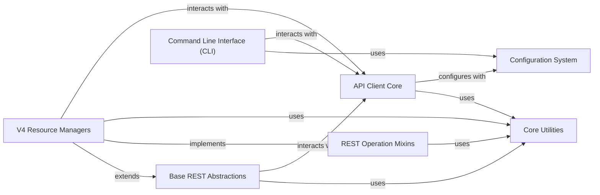

## Component Details

The python-gitlab library provides a comprehensive Pythonic interface for interacting with the GitLab API. The architecture is designed around a clear separation of concerns, with core utilities providing foundational helper functions, a dedicated configuration system for managing settings, and a robust API client for handling HTTP and GraphQL communications. REST abstractions and mixins establish a flexible framework for representing and managing GitLab resources, which are then specialized by V4 resource managers for specific API endpoints. The command-line interface offers a direct way for users to leverage the library's capabilities.

### Core Utilities
This component provides fundamental helper functions for various operations within the python-gitlab library, including URL encoding for IDs, handling HTTP response content streaming, implementing retry mechanisms for network requests, masking sensitive information in logs, and generating user-friendly warnings.

**Related Classes/Methods**:

- <a href="https://github.com/python-gitlab/python-gitlab/blob/master/gitlab/utils.py#L227-L250" target="_blank" rel="noopener noreferrer">`gitlab.utils.EncodedId` (227:250)</a>
- <a href="https://github.com/python-gitlab/python-gitlab/blob/master/gitlab/utils.py#L69-L89" target="_blank" rel="noopener noreferrer">`gitlab.utils.response_content` (69:89)</a>
- <a href="https://github.com/python-gitlab/python-gitlab/blob/master/gitlab/utils.py#L44-L66" target="_blank" rel="noopener noreferrer">`gitlab.utils.MaskingFormatter` (44:66)</a>
- <a href="https://github.com/python-gitlab/python-gitlab/blob/master/gitlab/utils.py#L92-L152" target="_blank" rel="noopener noreferrer">`gitlab.utils.Retry` (92:152)</a>
- <a href="https://github.com/python-gitlab/python-gitlab/blob/master/gitlab/utils.py#L257-L286" target="_blank" rel="noopener noreferrer">`gitlab.utils.warn` (257:286)</a>
- <a href="https://github.com/python-gitlab/python-gitlab/blob/master/gitlab/utils.py#L19-L21" target="_blank" rel="noopener noreferrer">`gitlab.utils._StdoutStream` (19:21)</a>
- <a href="https://github.com/python-gitlab/python-gitlab/blob/master/gitlab/utils.py#L143-L152" target="_blank" rel="noopener noreferrer">`gitlab.utils.Retry.handle_retry` (143:152)</a>
- <a href="https://github.com/python-gitlab/python-gitlab/blob/master/gitlab/utils.py#L117-L141" target="_blank" rel="noopener noreferrer">`gitlab.utils.Retry.handle_retry_on_status` (117:141)</a>
- <a href="https://github.com/python-gitlab/python-gitlab/blob/master/gitlab/utils.py#L104-L115" target="_blank" rel="noopener noreferrer">`gitlab.utils.Retry._retryable_status_code` (104:115)</a>
- <a href="https://github.com/python-gitlab/python-gitlab/blob/master/gitlab/utils.py#L58-L62" target="_blank" rel="noopener noreferrer">`gitlab.utils.MaskingFormatter._filter` (58:62)</a>
- <a href="https://github.com/python-gitlab/python-gitlab/blob/master/gitlab/utils.py#L290-L292" target="_blank" rel="noopener noreferrer">`gitlab.utils.WarnMessageData` (290:292)</a>

### Configuration System
This component is responsible for parsing and managing the configuration settings for the python-gitlab library. It handles reading configuration from files, environment variables, and resolving potential errors related to missing or malformed configuration data.

**Related Classes/Methods**:

- <a href="https://github.com/python-gitlab/python-gitlab/blob/master/gitlab/config.py#L90-L286" target="_blank" rel="noopener noreferrer">`gitlab.config.GitlabConfigParser` (90:286)</a>
- <a href="https://github.com/python-gitlab/python-gitlab/blob/master/gitlab/config.py#L29-L67" target="_blank" rel="noopener noreferrer">`gitlab.config._get_config_files` (29:67)</a>
- <a href="https://github.com/python-gitlab/python-gitlab/blob/master/gitlab/config.py#L82-L83" target="_blank" rel="noopener noreferrer">`gitlab.config.GitlabConfigMissingError` (82:83)</a>
- <a href="https://github.com/python-gitlab/python-gitlab/blob/master/gitlab/config.py#L78-L79" target="_blank" rel="noopener noreferrer">`gitlab.config.GitlabDataError` (78:79)</a>
- <a href="https://github.com/python-gitlab/python-gitlab/blob/master/gitlab/config.py#L74-L75" target="_blank" rel="noopener noreferrer">`gitlab.config.GitlabIDError` (74:75)</a>
- <a href="https://github.com/python-gitlab/python-gitlab/blob/master/gitlab/config.py#L86-L87" target="_blank" rel="noopener noreferrer">`gitlab.config.GitlabConfigHelperError` (86:87)</a>
- <a href="https://github.com/python-gitlab/python-gitlab/blob/master/gitlab/config.py#L91-L119" target="_blank" rel="noopener noreferrer">`gitlab.config.GitlabConfigParser.__init__` (91:119)</a>
- <a href="https://github.com/python-gitlab/python-gitlab/blob/master/gitlab/config.py#L121-L258" target="_blank" rel="noopener noreferrer">`gitlab.config.GitlabConfigParser._parse_config` (121:258)</a>
- <a href="https://github.com/python-gitlab/python-gitlab/blob/master/gitlab/config.py#L260-L286" target="_blank" rel="noopener noreferrer">`gitlab.config.GitlabConfigParser._get_values_from_helper` (260:286)</a>

### API Client Core
This component forms the central communication layer with the GitLab API. It manages HTTP requests (GET, POST, PUT, DELETE, PATCH) and GraphQL execution, incorporating retry logic and handling various response types and errors.

**Related Classes/Methods**:

- `gitlab.client.Gitlab` (full file reference)
- `gitlab.client.GraphQL` (full file reference)
- `gitlab.client.AsyncGraphQL` (full file reference)
- `gitlab.client.GitlabList` (full file reference)
- `gitlab.client.Gitlab:from_config` (full file reference)
- `gitlab.client.Gitlab:merge_config` (full file reference)
- `gitlab.client.Gitlab:enable_debug` (full file reference)
- `gitlab.client.Gitlab:_check_url` (full file reference)
- `gitlab.client.Gitlab:http_request` (full file reference)
- `gitlab.client.Gitlab:http_list` (full file reference)
- `gitlab.client.GraphQL:execute` (full file reference)
- `gitlab.client.AsyncGraphQL:execute` (full file reference)

### Base REST Abstractions
This component provides the foundational classes for representing GitLab API resources as Python objects (RESTObject) and for managing common CRUD (Create, Read, Update, Delete) operations on these resources (RESTManager). It defines the basic structure and behavior for interacting with any GitLab REST endpoint.

**Related Classes/Methods**:

- <a href="https://github.com/python-gitlab/python-gitlab/blob/master/gitlab/base.py#L27-L252" target="_blank" rel="noopener noreferrer">`gitlab.base.RESTObject` (27:252)</a>
- <a href="https://github.com/python-gitlab/python-gitlab/blob/master/gitlab/base.py#L340-L394" target="_blank" rel="noopener noreferrer">`gitlab.base.RESTManager` (340:394)</a>
- <a href="https://github.com/python-gitlab/python-gitlab/blob/master/gitlab/base.py#L258-L337" target="_blank" rel="noopener noreferrer">`gitlab.base.RESTObjectList` (258:337)</a>
- <a href="https://github.com/python-gitlab/python-gitlab/blob/master/gitlab/base.py#L246-L252" target="_blank" rel="noopener noreferrer">`gitlab.base.RESTObject:encoded_id` (246:252)</a>
- <a href="https://github.com/python-gitlab/python-gitlab/blob/master/gitlab/base.py#L376-L390" target="_blank" rel="noopener noreferrer">`gitlab.base.RESTManager:_compute_path` (376:390)</a>

### REST Operation Mixins
This component consists of reusable mixin classes that provide common API operations like getting, updating, deleting, downloading, and rotating resources. These mixins are designed to be inherited by specific resource managers to reduce code duplication and enforce consistent behavior across different GitLab API endpoints.

**Related Classes/Methods**:

- <a href="https://github.com/python-gitlab/python-gitlab/blob/master/gitlab/mixins.py#L48-L68" target="_blank" rel="noopener noreferrer">`gitlab.mixins.HeadMixin:head` (48:68)</a>
- <a href="https://github.com/python-gitlab/python-gitlab/blob/master/gitlab/mixins.py#L75-L102" target="_blank" rel="noopener noreferrer">`gitlab.mixins.GetMixin:get` (75:102)</a>
- <a href="https://github.com/python-gitlab/python-gitlab/blob/master/gitlab/mixins.py#L291-L330" target="_blank" rel="noopener noreferrer">`gitlab.mixins.UpdateMixin:update` (291:330)</a>
- <a href="https://github.com/python-gitlab/python-gitlab/blob/master/gitlab/mixins.py#L335-L355" target="_blank" rel="noopener noreferrer">`gitlab.mixins.SetMixin:set` (335:355)</a>
- <a href="https://github.com/python-gitlab/python-gitlab/blob/master/gitlab/mixins.py#L360-L376" target="_blank" rel="noopener noreferrer">`gitlab.mixins.DeleteMixin:delete` (360:376)</a>
- <a href="https://github.com/python-gitlab/python-gitlab/blob/master/gitlab/mixins.py#L542-L550" target="_blank" rel="noopener noreferrer">`gitlab.mixins.DownloadMixin:download` (542:550)</a>
- <a href="https://github.com/python-gitlab/python-gitlab/blob/master/gitlab/mixins.py#L626-L647" target="_blank" rel="noopener noreferrer">`gitlab.mixins.RotateMixin:rotate` (626:647)</a>

### V4 Resource Managers
This component comprises specific managers for various GitLab API v4 resources (e.g., projects, files, packages, issues). These managers extend the Base REST Abstractions and implement REST Operation Mixins to provide tailored functionality for interacting with their respective GitLab API endpoints.

**Related Classes/Methods**:

- <a href="https://github.com/python-gitlab/python-gitlab/blob/master/gitlab/v4/objects/packages.py#L119-L130" target="_blank" rel="noopener noreferrer">`gitlab.v4.objects.packages.GenericPackageManager:download` (119:130)</a>
- `gitlab.v4.objects.projects.Project:snapshot` (full file reference)
- `gitlab.v4.objects.projects.Project:mirror_pull` (full file reference)
- `gitlab.v4.objects.projects.Project:mirror_pull_details` (full file reference)
- <a href="https://github.com/python-gitlab/python-gitlab/blob/master/gitlab/v4/objects/namespaces.py#L25-L43" target="_blank" rel="noopener noreferrer">`gitlab.v4.objects.namespaces.NamespaceManager:exists` (25:43)</a>
- <a href="https://github.com/python-gitlab/python-gitlab/blob/master/gitlab/v4/objects/jobs.py#L118-L126" target="_blank" rel="noopener noreferrer">`gitlab.v4.objects.jobs.ProjectJob:artifacts` (118:126)</a>
- <a href="https://github.com/python-gitlab/python-gitlab/blob/master/gitlab/v4/objects/jobs.py#L192-L201" target="_blank" rel="noopener noreferrer">`gitlab.v4.objects.jobs.ProjectJob:artifact` (192:201)</a>
- <a href="https://github.com/python-gitlab/python-gitlab/blob/master/gitlab/v4/objects/jobs.py#L271-L279" target="_blank" rel="noopener noreferrer">`gitlab.v4.objects.jobs.ProjectJob:trace` (271:279)</a>
- <a href="https://github.com/python-gitlab/python-gitlab/blob/master/gitlab/v4/objects/artifacts.py#L49-L59" target="_blank" rel="noopener noreferrer">`gitlab.v4.objects.artifacts.ProjectArtifactManager:download` (49:59)</a>
- <a href="https://github.com/python-gitlab/python-gitlab/blob/master/gitlab/v4/objects/artifacts.py#L139-L150" target="_blank" rel="noopener noreferrer">`gitlab.v4.objects.artifacts.ProjectArtifactManager:raw` (139:150)</a>
- <a href="https://github.com/python-gitlab/python-gitlab/blob/master/gitlab/v4/objects/snippets.py#L25-L33" target="_blank" rel="noopener noreferrer">`gitlab.v4.objects.snippets.Snippet:content` (25:33)</a>
- <a href="https://github.com/python-gitlab/python-gitlab/blob/master/gitlab/v4/objects/snippets.py#L242-L250" target="_blank" rel="noopener noreferrer">`gitlab.v4.objects.snippets.ProjectSnippet:content` (242:250)</a>
- <a href="https://github.com/python-gitlab/python-gitlab/blob/master/gitlab/v4/objects/features.py#L27-L68" target="_blank" rel="noopener noreferrer">`gitlab.v4.objects.features.FeatureManager:set` (27:68)</a>
- <a href="https://github.com/python-gitlab/python-gitlab/blob/master/gitlab/v4/objects/files.py#L43-L62" target="_blank" rel="noopener noreferrer">`gitlab.v4.objects.files.ProjectFile:save` (43:62)</a>
- <a href="https://github.com/python-gitlab/python-gitlab/blob/master/gitlab/v4/objects/files.py#L120-L142" target="_blank" rel="noopener noreferrer">`gitlab.v4.objects.files.ProjectFileManager:get` (120:142)</a>
- <a href="https://github.com/python-gitlab/python-gitlab/blob/master/gitlab/v4/objects/files.py#L145-L166" target="_blank" rel="noopener noreferrer">`gitlab.v4.objects.files.ProjectFileManager:head` (145:166)</a>
- <a href="https://github.com/python-gitlab/python-gitlab/blob/master/gitlab/v4/objects/files.py#L180-L206" target="_blank" rel="noopener noreferrer">`gitlab.v4.objects.files.ProjectFileManager:create` (180:206)</a>
- <a href="https://github.com/python-gitlab/python-gitlab/blob/master/gitlab/v4/objects/files.py#L211-L237" target="_blank" rel="noopener noreferrer">`gitlab.v4.objects.files.ProjectFileManager:update` (211:237)</a>
- <a href="https://github.com/python-gitlab/python-gitlab/blob/master/gitlab/v4/objects/files.py#L246-L264" target="_blank" rel="noopener noreferrer">`gitlab.v4.objects.files.ProjectFileManager:delete` (246:264)</a>
- <a href="https://github.com/python-gitlab/python-gitlab/blob/master/gitlab/v4/objects/files.py#L267-L277" target="_blank" rel="noopener noreferrer">`gitlab.v4.objects.files.ProjectFileManager:raw` (267:277)</a>
- <a href="https://github.com/python-gitlab/python-gitlab/blob/master/gitlab/v4/objects/files.py#L361-L382" target="_blank" rel="noopener noreferrer">`gitlab.v4.objects.files.ProjectFileManager:blame` (361:382)</a>
- <a href="https://github.com/python-gitlab/python-gitlab/blob/master/gitlab/v4/objects/secure_files.py#L24-L32" target="_blank" rel="noopener noreferrer">`gitlab.v4.objects.secure_files.ProjectSecureFile:download` (24:32)</a>
- <a href="https://github.com/python-gitlab/python-gitlab/blob/master/gitlab/v4/objects/issues.py#L301-L325" target="_blank" rel="noopener noreferrer">`gitlab.v4.objects.issues.ProjectIssueLinkManager:create` (301:325)</a>
- <a href="https://github.com/python-gitlab/python-gitlab/blob/master/gitlab/v4/objects/keys.py#L19-L31" target="_blank" rel="noopener noreferrer">`gitlab.v4.objects.keys.KeyManager:get` (19:31)</a>

### Command Line Interface (CLI)
This component provides the command-line interface for interacting with the python-gitlab library, allowing users to perform GitLab operations directly from the terminal. It leverages the configuration system and API client to execute commands.

**Related Classes/Methods**:

- <a href="https://github.com/python-gitlab/python-gitlab/blob/master/gitlab/cli.py#L327-L410" target="_blank" rel="noopener noreferrer">`gitlab.cli:main` (327:410)</a>
- <a href="https://github.com/python-gitlab/python-gitlab/blob/master/gitlab/v4/cli.py#L51-L61" target="_blank" rel="noopener noreferrer">`gitlab.v4.cli.GitlabCLI:_process_from_parent_attrs` (51:61)</a>
- <a href="https://github.com/python-gitlab/python-gitlab/blob/master/gitlab/v4/cli.py#L136-L153" target="_blank" rel="noopener noreferrer">`gitlab.v4.cli.GitlabCLI:do_list` (136:153)</a>

### [FAQ](https://github.com/CodeBoarding/GeneratedOnBoardings/tree/main?tab=readme-ov-file#faq)