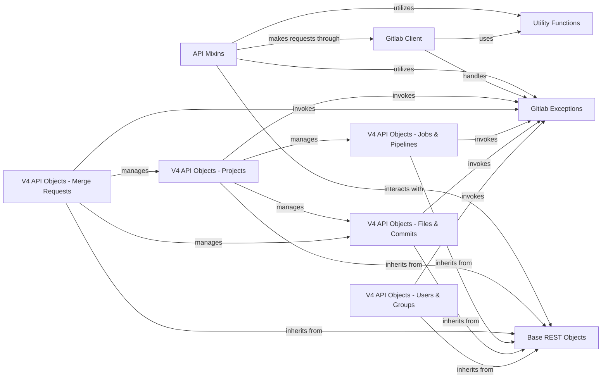

## Component Details

This graph illustrates the core components and their interactions within the `python-gitlab` library, focusing on how API operations, client functionalities, base object structures, exception handling, and utility functions are organized and related. It also details the specific API v4 object components for Projects, Merge Requests, Jobs & Pipelines, Files & Commits, and Users & Groups, showing their inheritance from base objects and their interactions with exception handling and other related components.

### API Mixins
This component provides a set of reusable mixin classes that encapsulate common API operations such as retrieving, listing, creating, updating, and deleting resources. It handles basic HTTP interactions and integrates with exception handling and utility functions.

**Related Classes/Methods**:

- <a href="https://github.com/python-gitlab/python-gitlab/blob/master/gitlab/mixins.py#L46-L68" target="_blank" rel="noopener noreferrer">`gitlab.mixins.HeadMixin` (46:68)</a>
- <a href="https://github.com/python-gitlab/python-gitlab/blob/master/gitlab/mixins.py#L71-L102" target="_blank" rel="noopener noreferrer">`gitlab.mixins.GetMixin` (71:102)</a>
- <a href="https://github.com/python-gitlab/python-gitlab/blob/master/gitlab/mixins.py#L105-L125" target="_blank" rel="noopener noreferrer">`gitlab.mixins.GetWithoutIdMixin` (105:125)</a>
- <a href="https://github.com/python-gitlab/python-gitlab/blob/master/gitlab/mixins.py#L128-L158" target="_blank" rel="noopener noreferrer">`gitlab.mixins.RefreshMixin` (128:158)</a>
- <a href="https://github.com/python-gitlab/python-gitlab/blob/master/gitlab/mixins.py#L161-L224" target="_blank" rel="noopener noreferrer">`gitlab.mixins.ListMixin` (161:224)</a>
- <a href="https://github.com/python-gitlab/python-gitlab/blob/master/gitlab/mixins.py#L230-L261" target="_blank" rel="noopener noreferrer">`gitlab.mixins.CreateMixin` (230:261)</a>
- <a href="https://github.com/python-gitlab/python-gitlab/blob/master/gitlab/mixins.py#L271-L330" target="_blank" rel="noopener noreferrer">`gitlab.mixins.UpdateMixin` (271:330)</a>
- <a href="https://github.com/python-gitlab/python-gitlab/blob/master/gitlab/mixins.py#L333-L355" target="_blank" rel="noopener noreferrer">`gitlab.mixins.SetMixin` (333:355)</a>
- <a href="https://github.com/python-gitlab/python-gitlab/blob/master/gitlab/mixins.py#L358-L376" target="_blank" rel="noopener noreferrer">`gitlab.mixins.DeleteMixin` (358:376)</a>
- <a href="https://github.com/python-gitlab/python-gitlab/blob/master/gitlab/mixins.py#L471-L495" target="_blank" rel="noopener noreferrer">`gitlab.mixins.UserAgentDetailMixin` (471:495)</a>
- <a href="https://github.com/python-gitlab/python-gitlab/blob/master/gitlab/mixins.py#L498-L530" target="_blank" rel="noopener noreferrer">`gitlab.mixins.AccessRequestMixin` (498:530)</a>
- <a href="https://github.com/python-gitlab/python-gitlab/blob/master/gitlab/mixins.py#L533-L613" target="_blank" rel="noopener noreferrer">`gitlab.mixins.DownloadMixin` (533:613)</a>
- <a href="https://github.com/python-gitlab/python-gitlab/blob/master/gitlab/mixins.py#L616-L647" target="_blank" rel="noopener noreferrer">`gitlab.mixins.RotateMixin` (616:647)</a>
- <a href="https://github.com/python-gitlab/python-gitlab/blob/master/gitlab/mixins.py#L650-L680" target="_blank" rel="noopener noreferrer">`gitlab.mixins.ObjectRotateMixin` (650:680)</a>
- <a href="https://github.com/python-gitlab/python-gitlab/blob/master/gitlab/mixins.py#L683-L729" target="_blank" rel="noopener noreferrer">`gitlab.mixins.SubscribableMixin` (683:729)</a>
- <a href="https://github.com/python-gitlab/python-gitlab/blob/master/gitlab/mixins.py#L732-L753" target="_blank" rel="noopener noreferrer">`gitlab.mixins.TodoMixin` (732:753)</a>
- <a href="https://github.com/python-gitlab/python-gitlab/blob/master/gitlab/mixins.py#L756-L868" target="_blank" rel="noopener noreferrer">`gitlab.mixins.TimeTrackingMixin` (756:868)</a>
- <a href="https://github.com/python-gitlab/python-gitlab/blob/master/gitlab/mixins.py#L871-L904" target="_blank" rel="noopener noreferrer">`gitlab.mixins.ParticipantsMixin` (871:904)</a>
- <a href="https://github.com/python-gitlab/python-gitlab/blob/master/gitlab/mixins.py#L907-L933" target="_blank" rel="noopener noreferrer">`gitlab.mixins.BadgeRenderMixin` (907:933)</a>
- <a href="https://github.com/python-gitlab/python-gitlab/blob/master/gitlab/mixins.py#L936-L978" target="_blank" rel="noopener noreferrer">`gitlab.mixins.PromoteMixin` (936:978)</a>
- <a href="https://github.com/python-gitlab/python-gitlab/blob/master/gitlab/mixins.py#L981-L999" target="_blank" rel="noopener noreferrer">`gitlab.mixins.UploadMixin` (981:999)</a>

### Gitlab Client
The core client component responsible for making HTTP requests to the GitLab API. It manages sessions, builds URLs, handles retries, and processes HTTP responses, including error handling and parsing.

**Related Classes/Methods**:

- `gitlab.client.Gitlab` (full file reference)
- `gitlab.client.GitlabList` (full file reference)
- `gitlab.client.GraphQL` (full file reference)
- `gitlab.client.AsyncGraphQL` (full file reference)

### Base REST Objects
This component defines the fundamental structure for all GitLab API resources (RESTObjects) and their managers. It provides mechanisms for attribute updates and manager creation, forming the basis for specific API object implementations.

**Related Classes/Methods**:

- <a href="https://github.com/python-gitlab/python-gitlab/blob/master/gitlab/base.py#L27-L252" target="_blank" rel="noopener noreferrer">`gitlab.base.RESTObject` (27:252)</a>
- <a href="https://github.com/python-gitlab/python-gitlab/blob/master/gitlab/base.py#L258-L337" target="_blank" rel="noopener noreferrer">`gitlab.base.RESTObjectList` (258:337)</a>
- <a href="https://github.com/python-gitlab/python-gitlab/blob/master/gitlab/base.py#L340-L394" target="_blank" rel="noopener noreferrer">`gitlab.base.RESTManager` (340:394)</a>

### Gitlab Exceptions
This component centralizes all custom exception classes used throughout the `python-gitlab` library. It provides specific error types for various API interaction failures, such as HTTP errors, authentication issues, parsing errors, and upload failures, facilitating robust error handling.

**Related Classes/Methods**:

- <a href="https://github.com/python-gitlab/python-gitlab/blob/master/gitlab/exceptions.py#L332-L352" target="_blank" rel="noopener noreferrer">`gitlab.exceptions.on_http_error` (332:352)</a>
- <a href="https://github.com/python-gitlab/python-gitlab/blob/master/gitlab/exceptions.py#L233-L234" target="_blank" rel="noopener noreferrer">`gitlab.exceptions.GitlabUploadError` (233:234)</a>
- <a href="https://github.com/python-gitlab/python-gitlab/blob/master/gitlab/exceptions.py#L45-L46" target="_blank" rel="noopener noreferrer">`gitlab.exceptions.GitlabParsingError` (45:46)</a>
- <a href="https://github.com/python-gitlab/python-gitlab/blob/master/gitlab/exceptions.py#L41-L42" target="_blank" rel="noopener noreferrer">`gitlab.exceptions.RedirectError` (41:42)</a>
- <a href="https://github.com/python-gitlab/python-gitlab/blob/master/gitlab/exceptions.py#L37-L38" target="_blank" rel="noopener noreferrer">`gitlab.exceptions.GitlabAuthenticationError` (37:38)</a>
- <a href="https://github.com/python-gitlab/python-gitlab/blob/master/gitlab/exceptions.py#L61-L62" target="_blank" rel="noopener noreferrer">`gitlab.exceptions.GitlabHttpError` (61:62)</a>
- <a href="https://github.com/python-gitlab/python-gitlab/blob/master/gitlab/exceptions.py#L49-L50" target="_blank" rel="noopener noreferrer">`gitlab.exceptions.GitlabCiLintError` (49:50)</a>
- <a href="https://github.com/python-gitlab/python-gitlab/blob/master/gitlab/exceptions.py#L245-L246" target="_blank" rel="noopener noreferrer">`gitlab.exceptions.GitlabInvitationError` (245:246)</a>

### Utility Functions
A collection of helper functions that provide common utilities such as ID encoding, type transformations, dictionary manipulation, response content handling, and retry mechanisms for API calls.

**Related Classes/Methods**:

- <a href="https://github.com/python-gitlab/python-gitlab/blob/master/gitlab/utils.py#L227-L250" target="_blank" rel="noopener noreferrer">`gitlab.utils.EncodedId` (227:250)</a>
- <a href="https://github.com/python-gitlab/python-gitlab/blob/master/gitlab/utils.py#L155-L210" target="_blank" rel="noopener noreferrer">`gitlab.utils._transform_types` (155:210)</a>
- <a href="https://github.com/python-gitlab/python-gitlab/blob/master/gitlab/utils.py#L69-L89" target="_blank" rel="noopener noreferrer">`gitlab.utils.response_content` (69:89)</a>
- <a href="https://github.com/python-gitlab/python-gitlab/blob/master/gitlab/utils.py#L213-L224" target="_blank" rel="noopener noreferrer">`gitlab.utils.copy_dict` (213:224)</a>
- <a href="https://github.com/python-gitlab/python-gitlab/blob/master/gitlab/utils.py#L92-L152" target="_blank" rel="noopener noreferrer">`gitlab.utils.Retry` (92:152)</a>
- <a href="https://github.com/python-gitlab/python-gitlab/blob/master/gitlab/utils.py#L143-L152" target="_blank" rel="noopener noreferrer">`gitlab.utils.Retry.handle_retry` (143:152)</a>
- <a href="https://github.com/python-gitlab/python-gitlab/blob/master/gitlab/utils.py#L117-L141" target="_blank" rel="noopener noreferrer">`gitlab.utils.Retry.handle_retry_on_status` (117:141)</a>
- <a href="https://github.com/python-gitlab/python-gitlab/blob/master/gitlab/utils.py#L36-L41" target="_blank" rel="noopener noreferrer">`gitlab.utils.get_content_type` (36:41)</a>
- <a href="https://github.com/python-gitlab/python-gitlab/blob/master/gitlab/utils.py#L257-L286" target="_blank" rel="noopener noreferrer">`gitlab.utils.warn` (257:286)</a>
- <a href="https://github.com/python-gitlab/python-gitlab/blob/master/gitlab/utils.py#L253-L254" target="_blank" rel="noopener noreferrer">`gitlab.utils.remove_none_from_dict` (253:254)</a>

### V4 API Objects - Projects
This component encompasses the classes and managers related to GitLab projects in API v4. It provides functionalities for project-specific operations like creating, deleting, managing forks, languages, starring, archiving, sharing, triggering pipelines, and handling imports.

**Related Classes/Methods**:

- `gitlab.v4.objects.projects.Project` (full file reference)
- `gitlab.v4.objects.projects.ProjectManager` (full file reference)
- `gitlab.v4.objects.projects.ProjectPullMirrorManager` (full file reference)
- `gitlab.v4.objects.projects.ProjectPullMirror` (full file reference)

### V4 API Objects - Merge Requests
This component handles all operations related to merge requests within GitLab API v4. It includes functionalities for canceling merges, retrieving related issues and commits, viewing changes, approving/unapproving, rebasing, resetting approvals, and performing merges.

**Related Classes/Methods**:

- <a href="https://github.com/python-gitlab/python-gitlab/blob/master/gitlab/v4/objects/merge_requests.py#L149-L445" target="_blank" rel="noopener noreferrer">`gitlab.v4.objects.merge_requests.ProjectMergeRequest` (149:445)</a>
- <a href="https://github.com/python-gitlab/python-gitlab/blob/master/gitlab/v4/objects/merge_requests.py#L116-L146" target="_blank" rel="noopener noreferrer">`gitlab.v4.objects.merge_requests.GroupMergeRequestManager` (116:146)</a>

### V4 API Objects - Jobs & Pipelines
This component manages GitLab CI/CD jobs and pipelines in API v4. It provides methods for canceling, retrying, playing, erasing, and managing artifacts for jobs, as well as controlling pipeline schedules.

**Related Classes/Methods**:

- <a href="https://github.com/python-gitlab/python-gitlab/blob/master/gitlab/v4/objects/pipelines.py#L60-L95" target="_blank" rel="noopener noreferrer">`gitlab.v4.objects.pipelines.ProjectPipeline` (60:95)</a>
- <a href="https://github.com/python-gitlab/python-gitlab/blob/master/gitlab/v4/objects/pipelines.py#L221-L261" target="_blank" rel="noopener noreferrer">`gitlab.v4.objects.pipelines.ProjectPipelineSchedule` (221:261)</a>
- <a href="https://github.com/python-gitlab/python-gitlab/blob/master/gitlab/v4/objects/jobs.py#L17-L342" target="_blank" rel="noopener noreferrer">`gitlab.v4.objects.jobs.ProjectJob` (17:342)</a>

### V4 API Objects - Files & Commits
This component deals with file and commit operations in GitLab API v4. It includes functionalities for getting, creating, updating, deleting, and retrieving raw content or blame information for files, as well as managing commit-related actions like diffs, cherry-picks, and status updates.

**Related Classes/Methods**:

- <a href="https://github.com/python-gitlab/python-gitlab/blob/master/gitlab/v4/objects/files.py#L24-L84" target="_blank" rel="noopener noreferrer">`gitlab.v4.objects.files.ProjectFile` (24:84)</a>
- <a href="https://github.com/python-gitlab/python-gitlab/blob/master/gitlab/v4/objects/files.py#L87-L382" target="_blank" rel="noopener noreferrer">`gitlab.v4.objects.files.ProjectFileManager` (87:382)</a>
- <a href="https://github.com/python-gitlab/python-gitlab/blob/master/gitlab/v4/objects/commits.py#L26-L167" target="_blank" rel="noopener noreferrer">`gitlab.v4.objects.commits.ProjectCommit` (26:167)</a>
- <a href="https://github.com/python-gitlab/python-gitlab/blob/master/gitlab/v4/objects/commits.py#L211-L253" target="_blank" rel="noopener noreferrer">`gitlab.v4.objects.commits.ProjectCommitStatusManager` (211:253)</a>

### V4 API Objects - Users & Groups
This component manages user and group related operations in GitLab API v4. It provides functionalities for blocking, following, activating, approving, banning users, and for groups, it handles project transfers, sharing, LDAP sync, and imports.

**Related Classes/Methods**:

- <a href="https://github.com/python-gitlab/python-gitlab/blob/master/gitlab/v4/objects/users.py#L172-L395" target="_blank" rel="noopener noreferrer">`gitlab.v4.objects.users.User` (172:395)</a>
- <a href="https://github.com/python-gitlab/python-gitlab/blob/master/gitlab/v4/objects/groups.py#L73-L259" target="_blank" rel="noopener noreferrer">`gitlab.v4.objects.groups.Group` (73:259)</a>
- <a href="https://github.com/python-gitlab/python-gitlab/blob/master/gitlab/v4/objects/groups.py#L262-L361" target="_blank" rel="noopener noreferrer">`gitlab.v4.objects.groups.GroupManager` (262:361)</a>

### [FAQ](https://github.com/CodeBoarding/GeneratedOnBoardings/tree/main?tab=readme-ov-file#faq)