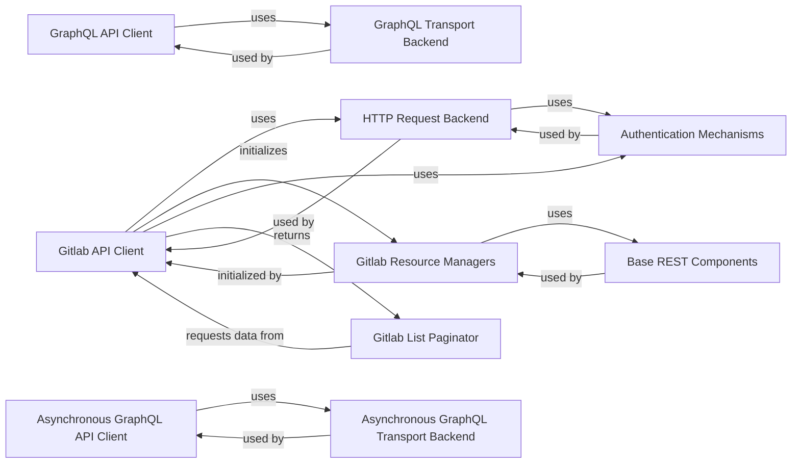

## Component Details

This component overview describes the core functionalities of the GitLab client, focusing on how it establishes connections, handles various types of API requests (REST and GraphQL), manages authentication, and processes responses including pagination. It outlines the key components responsible for low-level HTTP communication, high-level resource management, and the underlying transport mechanisms for both synchronous and asynchronous API interactions.

### Gitlab API Client
The core client for interacting with the GitLab REST API, handling initialization, authentication, and dispatching HTTP requests to various GitLab object managers.

**Related Classes/Methods**:

- `gitlab.client.Gitlab` (full file reference)

### Gitlab List Paginator
Manages the pagination of results from GitLab API list endpoints, fetching subsequent pages as needed to provide a complete list of resources.

**Related Classes/Methods**:

- `gitlab.client.GitlabList` (full file reference)

### GraphQL API Client
Provides a synchronous interface for interacting with the GitLab GraphQL API, handling query execution and response processing.

**Related Classes/Methods**:

- `gitlab.client.GraphQL` (full file reference)
- `gitlab.client._BaseGraphQL` (full file reference)

### Asynchronous GraphQL API Client
Provides an asynchronous interface for interacting with the GitLab GraphQL API, enabling non-blocking query execution.

**Related Classes/Methods**:

- `gitlab.client.AsyncGraphQL` (full file reference)
- `gitlab.client._BaseGraphQL` (full file reference)

### HTTP Request Backend
The low-level component responsible for sending HTTP requests and processing raw responses, acting as the communication layer with the GitLab server.

**Related Classes/Methods**:

- <a href="https://github.com/python-gitlab/python-gitlab/blob/master/gitlab/_backends/requests_backend.py#L86-L168" target="_blank" rel="noopener noreferrer">`gitlab._backends.requests_backend.RequestsBackend` (86:168)</a>

### GraphQL Transport Backend
Handles the underlying transport for synchronous GraphQL API requests.

**Related Classes/Methods**:

- <a href="https://github.com/python-gitlab/python-gitlab/blob/master/gitlab/_backends/graphql.py#L7-L24" target="_blank" rel="noopener noreferrer">`gitlab._backends.graphql.GitlabTransport` (7:24)</a>

### Asynchronous GraphQL Transport Backend
Handles the underlying transport for asynchronous GraphQL API requests.

**Related Classes/Methods**:

- <a href="https://github.com/python-gitlab/python-gitlab/blob/master/gitlab/_backends/graphql.py#L27-L44" target="_blank" rel="noopener noreferrer">`gitlab._backends.graphql.GitlabAsyncTransport` (27:44)</a>

### Authentication Mechanisms
Handles different methods of authenticating with the GitLab API, such as private tokens, OAuth tokens, and job tokens.

**Related Classes/Methods**:

- <a href="https://github.com/python-gitlab/python-gitlab/blob/master/gitlab/_backends/requests_backend.py#L28-L33" target="_blank" rel="noopener noreferrer">`gitlab._backends.requests_backend.PrivateTokenAuth` (28:33)</a>
- <a href="https://github.com/python-gitlab/python-gitlab/blob/master/gitlab/_backends/requests_backend.py#L20-L25" target="_blank" rel="noopener noreferrer">`gitlab._backends.requests_backend.OAuthTokenAuth` (20:25)</a>
- <a href="https://github.com/python-gitlab/python-gitlab/blob/master/gitlab/_backends/requests_backend.py#L36-L41" target="_blank" rel="noopener noreferrer">`gitlab._backends.requests_backend.JobTokenAuth` (36:41)</a>

### Gitlab Resource Managers
A collection of classes that provide high-level interfaces for managing specific GitLab API resources, such as projects, users, groups, and issues.

**Related Classes/Methods**:

- `gitlab.v4.objects` (full file reference)

### Base REST Components
Fundamental base classes for all GitLab API resources and their managers, providing common properties and methods for object representation and management.

**Related Classes/Methods**:

- <a href="https://github.com/python-gitlab/python-gitlab/blob/master/gitlab/base.py#L27-L252" target="_blank" rel="noopener noreferrer">`gitlab.base.RESTObject` (27:252)</a>
- <a href="https://github.com/python-gitlab/python-gitlab/blob/master/gitlab/base.py#L340-L394" target="_blank" rel="noopener noreferrer">`gitlab.base.RESTManager` (340:394)</a>

### [FAQ](https://github.com/CodeBoarding/GeneratedOnBoardings/tree/main?tab=readme-ov-file#faq)