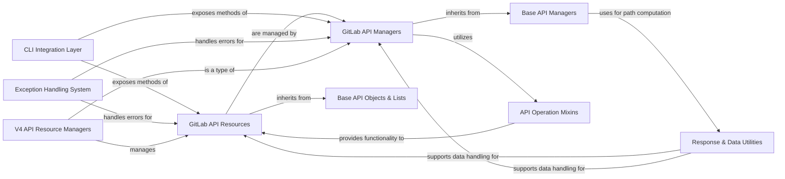

## Component Details

The V4 API Resource Managers component provides high-level, object-oriented interfaces for interacting with various GitLab entities. It leverages the GitLab API Resources for data encapsulation and the GitLab API Managers for collection management. This component inherits core functionalities from Base API Managers and Base API Objects & Lists, and utilizes API Operation Mixins for common API behaviors. Error handling is managed by the Exception Handling System, and data processing is supported by Response & Data Utilities. The CLI Integration Layer exposes the functionalities of these managers and resources to the command-line interface.

### V4 API Resource Managers
This component encompasses all specific GitLab API resource managers for version 4 of the API. These managers provide high-level, object-oriented interfaces for interacting with various GitLab entities such as Projects, Merge Requests, Users, Groups, Issues, Files, Pipelines, Jobs, and more, abstracting the underlying API calls.

**Related Classes/Methods**:

- <a href="https://github.com/python-gitlab/python-gitlab/blob/master/gitlab/v4/objects/merge_requests.py#L149-L445" target="_blank" rel="noopener noreferrer">`gitlab.v4.objects.merge_requests.ProjectMergeRequest` (149:445)</a>
- `gitlab.v4.objects.projects.Project` (full file reference)
- <a href="https://github.com/python-gitlab/python-gitlab/blob/master/gitlab/v4/objects/pipelines.py#L60-L95" target="_blank" rel="noopener noreferrer">`gitlab.v4.objects.pipelines.ProjectPipeline` (60:95)</a>
- <a href="https://github.com/python-gitlab/python-gitlab/blob/master/gitlab/v4/objects/jobs.py#L17-L342" target="_blank" rel="noopener noreferrer">`gitlab.v4.objects.jobs.ProjectJob` (17:342)</a>
- <a href="https://github.com/python-gitlab/python-gitlab/blob/master/gitlab/v4/objects/users.py#L172-L395" target="_blank" rel="noopener noreferrer">`gitlab.v4.objects.users.User` (172:395)</a>
- <a href="https://github.com/python-gitlab/python-gitlab/blob/master/gitlab/v4/objects/groups.py#L73-L259" target="_blank" rel="noopener noreferrer">`gitlab.v4.objects.groups.Group` (73:259)</a>
- <a href="https://github.com/python-gitlab/python-gitlab/blob/master/gitlab/v4/objects/issues.py#L107-L226" target="_blank" rel="noopener noreferrer">`gitlab.v4.objects.issues.ProjectIssue` (107:226)</a>
- <a href="https://github.com/python-gitlab/python-gitlab/blob/master/gitlab/v4/objects/files.py#L24-L84" target="_blank" rel="noopener noreferrer">`gitlab.v4.objects.files.ProjectFile` (24:84)</a>
- <a href="https://github.com/python-gitlab/python-gitlab/blob/master/gitlab/v4/objects/artifacts.py#L26-L230" target="_blank" rel="noopener noreferrer">`gitlab.v4.objects.artifacts.ProjectArtifactManager` (26:230)</a>
- <a href="https://github.com/python-gitlab/python-gitlab/blob/master/gitlab/v4/objects/snippets.py#L21-L96" target="_blank" rel="noopener noreferrer">`gitlab.v4.objects.snippets.Snippet` (21:96)</a>
- <a href="https://github.com/python-gitlab/python-gitlab/blob/master/gitlab/v4/objects/labels.py#L22-L44" target="_blank" rel="noopener noreferrer">`gitlab.v4.objects.labels.GroupLabel` (22:44)</a>
- <a href="https://github.com/python-gitlab/python-gitlab/blob/master/gitlab/v4/objects/milestones.py#L33-L89" target="_blank" rel="noopener noreferrer">`gitlab.v4.objects.milestones.GroupMilestone` (33:89)</a>
- <a href="https://github.com/python-gitlab/python-gitlab/blob/master/gitlab/v4/objects/ci_lint.py#L21-L41" target="_blank" rel="noopener noreferrer">`gitlab.v4.objects.ci_lint.CiLintManager` (21:41)</a>
- <a href="https://github.com/python-gitlab/python-gitlab/blob/master/gitlab/v4/objects/deployments.py#L21-L66" target="_blank" rel="noopener noreferrer">`gitlab.v4.objects.deployments.ProjectDeployment` (21:66)</a>
- <a href="https://github.com/python-gitlab/python-gitlab/blob/master/gitlab/v4/objects/runners.py#L49-L123" target="_blank" rel="noopener noreferrer">`gitlab.v4.objects.runners.RunnerManager` (49:123)</a>

### GitLab API Resources
This component represents individual GitLab entities such as Merge Requests, Projects, Users, and Issues. These objects encapsulate the data of a specific resource and provide methods for performing actions directly on that resource, often interacting with the GitLab API.

**Related Classes/Methods**:

- <a href="https://github.com/python-gitlab/python-gitlab/blob/master/gitlab/v4/objects/merge_requests.py#L149-L445" target="_blank" rel="noopener noreferrer">`gitlab.v4.objects.merge_requests.ProjectMergeRequest` (149:445)</a>
- `gitlab.v4.objects.projects.Project` (full file reference)
- <a href="https://github.com/python-gitlab/python-gitlab/blob/master/gitlab/v4/objects/pipelines.py#L60-L95" target="_blank" rel="noopener noreferrer">`gitlab.v4.objects.pipelines.ProjectPipeline` (60:95)</a>
- <a href="https://github.com/python-gitlab/python-gitlab/blob/master/gitlab/v4/objects/jobs.py#L17-L342" target="_blank" rel="noopener noreferrer">`gitlab.v4.objects.jobs.ProjectJob` (17:342)</a>
- <a href="https://github.com/python-gitlab/python-gitlab/blob/master/gitlab/v4/objects/users.py#L172-L395" target="_blank" rel="noopener noreferrer">`gitlab.v4.objects.users.User` (172:395)</a>
- <a href="https://github.com/python-gitlab/python-gitlab/blob/master/gitlab/v4/objects/groups.py#L73-L259" target="_blank" rel="noopener noreferrer">`gitlab.v4.objects.groups.Group` (73:259)</a>
- <a href="https://github.com/python-gitlab/python-gitlab/blob/master/gitlab/v4/objects/issues.py#L107-L226" target="_blank" rel="noopener noreferrer">`gitlab.v4.objects.issues.ProjectIssue` (107:226)</a>
- <a href="https://github.com/python-gitlab/python-gitlab/blob/master/gitlab/v4/objects/files.py#L24-L84" target="_blank" rel="noopener noreferrer">`gitlab.v4.objects.files.ProjectFile` (24:84)</a>
- <a href="https://github.com/python-gitlab/python-gitlab/blob/master/gitlab/v4/objects/snippets.py#L21-L96" target="_blank" rel="noopener noreferrer">`gitlab.v4.objects.snippets.Snippet` (21:96)</a>
- <a href="https://github.com/python-gitlab/python-gitlab/blob/master/gitlab/v4/objects/labels.py#L22-L44" target="_blank" rel="noopener noreferrer">`gitlab.v4.objects.labels.GroupLabel` (22:44)</a>
- <a href="https://github.com/python-gitlab/python-gitlab/blob/master/gitlab/v4/objects/milestones.py#L33-L89" target="_blank" rel="noopener noreferrer">`gitlab.v4.objects.milestones.GroupMilestone` (33:89)</a>
- <a href="https://github.com/python-gitlab/python-gitlab/blob/master/gitlab/v4/objects/deployments.py#L21-L66" target="_blank" rel="noopener noreferrer">`gitlab.v4.objects.deployments.ProjectDeployment` (21:66)</a>

### GitLab API Managers
This component is responsible for managing collections of GitLab API Resources. It provides methods for listing, creating, retrieving, and deleting resources of a specific type, acting as an interface to the API endpoints for resource collections.

**Related Classes/Methods**:

- <a href="https://github.com/python-gitlab/python-gitlab/blob/master/gitlab/v4/objects/merge_requests.py#L448-L518" target="_blank" rel="noopener noreferrer">`gitlab.v4.objects.merge_requests.ProjectMergeRequestManager` (448:518)</a>
- <a href="https://github.com/python-gitlab/python-gitlab/blob/master/gitlab/v4/objects/pipelines.py#L98-L157" target="_blank" rel="noopener noreferrer">`gitlab.v4.objects.pipelines.ProjectPipelineManager` (98:157)</a>
- <a href="https://github.com/python-gitlab/python-gitlab/blob/master/gitlab/v4/objects/issues.py#L229-L281" target="_blank" rel="noopener noreferrer">`gitlab.v4.objects.issues.ProjectIssueManager` (229:281)</a>
- <a href="https://github.com/python-gitlab/python-gitlab/blob/master/gitlab/v4/objects/commits.py#L170-L188" target="_blank" rel="noopener noreferrer">`gitlab.v4.objects.commits.ProjectCommitManager` (170:188)</a>
- <a href="https://github.com/python-gitlab/python-gitlab/blob/master/gitlab/v4/objects/artifacts.py#L26-L230" target="_blank" rel="noopener noreferrer">`gitlab.v4.objects.artifacts.ProjectArtifactManager` (26:230)</a>
- <a href="https://github.com/python-gitlab/python-gitlab/blob/master/gitlab/v4/objects/runners.py#L49-L123" target="_blank" rel="noopener noreferrer">`gitlab.v4.objects.runners.RunnerManager` (49:123)</a>
- <a href="https://github.com/python-gitlab/python-gitlab/blob/master/gitlab/v4/objects/snippets.py#L99-L230" target="_blank" rel="noopener noreferrer">`gitlab.v4.objects.snippets.SnippetManager` (99:230)</a>
- <a href="https://github.com/python-gitlab/python-gitlab/blob/master/gitlab/v4/objects/files.py#L87-L382" target="_blank" rel="noopener noreferrer">`gitlab.v4.objects.files.ProjectFileManager` (87:382)</a>
- <a href="https://github.com/python-gitlab/python-gitlab/blob/master/gitlab/v4/objects/ci_lint.py#L21-L41" target="_blank" rel="noopener noreferrer">`gitlab.v4.objects.ci_lint.CiLintManager` (21:41)</a>
- <a href="https://github.com/python-gitlab/python-gitlab/blob/master/gitlab/v4/objects/issues.py#L83-L104" target="_blank" rel="noopener noreferrer">`gitlab.v4.objects.issues.GroupIssueManager` (83:104)</a>
- <a href="https://github.com/python-gitlab/python-gitlab/blob/master/gitlab/v4/objects/merge_requests.py#L116-L146" target="_blank" rel="noopener noreferrer">`gitlab.v4.objects.merge_requests.GroupMergeRequestManager` (116:146)</a>

### Base API Objects & Lists
This foundational component provides the core structure for all GitLab API resources (RESTObject) and handles the representation and iteration of paginated lists of these resources (RESTObjectList). It defines common attributes and behaviors for API entities.

**Related Classes/Methods**:

- <a href="https://github.com/python-gitlab/python-gitlab/blob/master/gitlab/base.py#L27-L252" target="_blank" rel="noopener noreferrer">`gitlab.base.RESTObject` (27:252)</a>
- <a href="https://github.com/python-gitlab/python-gitlab/blob/master/gitlab/base.py#L258-L337" target="_blank" rel="noopener noreferrer">`gitlab.base.RESTObjectList` (258:337)</a>

### Base API Managers
This abstract base class serves as the foundation for all specific GitLab API managers. It defines common functionalities and properties required for interacting with the GitLab API, such as computing API paths and managing parent-child relationships.

**Related Classes/Methods**:

- <a href="https://github.com/python-gitlab/python-gitlab/blob/master/gitlab/base.py#L340-L394" target="_blank" rel="noopener noreferrer">`gitlab.base.RESTManager` (340:394)</a>

### CLI Integration Layer
This component is responsible for bridging the Python API client methods to the command-line interface. It uses decorators to register specific API methods as custom CLI actions, making them accessible via the `python-gitlab` command-line tool.

**Related Classes/Methods**:

- `gitlab.cli.GitlabCLI` (full file reference)

### Exception Handling System
This system provides a centralized mechanism for managing and categorizing errors that occur during interactions with the GitLab API. It uses decorators to catch generic HTTP errors and re-raise them as more specific, informative exceptions, improving error diagnosis.

**Related Classes/Methods**:

- <a href="https://github.com/python-gitlab/python-gitlab/blob/master/gitlab/exceptions.py#L332-L352" target="_blank" rel="noopener noreferrer">`gitlab.exceptions.on_http_error` (332:352)</a>
- <a href="https://github.com/python-gitlab/python-gitlab/blob/master/gitlab/exceptions.py#L7-L34" target="_blank" rel="noopener noreferrer">`gitlab.exceptions.GitlabError` (7:34)</a>
- <a href="https://github.com/python-gitlab/python-gitlab/blob/master/gitlab/exceptions.py#L65-L66" target="_blank" rel="noopener noreferrer">`gitlab.exceptions.GitlabListError` (65:66)</a>
- <a href="https://github.com/python-gitlab/python-gitlab/blob/master/gitlab/exceptions.py#L201-L202" target="_blank" rel="noopener noreferrer">`gitlab.exceptions.GitlabMRApprovalError` (201:202)</a>
- <a href="https://github.com/python-gitlab/python-gitlab/blob/master/gitlab/exceptions.py#L205-L206" target="_blank" rel="noopener noreferrer">`gitlab.exceptions.GitlabMRRebaseError` (205:206)</a>
- <a href="https://github.com/python-gitlab/python-gitlab/blob/master/gitlab/exceptions.py#L209-L210" target="_blank" rel="noopener noreferrer">`gitlab.exceptions.GitlabMRResetApprovalError` (209:210)</a>
- <a href="https://github.com/python-gitlab/python-gitlab/blob/master/gitlab/exceptions.py#L69-L70" target="_blank" rel="noopener noreferrer">`gitlab.exceptions.GitlabGetError` (69:70)</a>
- <a href="https://github.com/python-gitlab/python-gitlab/blob/master/gitlab/exceptions.py#L213-L214" target="_blank" rel="noopener noreferrer">`gitlab.exceptions.GitlabMRClosedError` (213:214)</a>
- <a href="https://github.com/python-gitlab/python-gitlab/blob/master/gitlab/exceptions.py#L217-L218" target="_blank" rel="noopener noreferrer">`gitlab.exceptions.GitlabMROnBuildSuccessError` (217:218)</a>
- <a href="https://github.com/python-gitlab/python-gitlab/blob/master/gitlab/exceptions.py#L49-L50" target="_blank" rel="noopener noreferrer">`gitlab.exceptions.GitlabCiLintError` (49:50)</a>
- <a href="https://github.com/python-gitlab/python-gitlab/blob/master/gitlab/exceptions.py#L233-L234" target="_blank" rel="noopener noreferrer">`gitlab.exceptions.GitlabUploadError` (233:234)</a>

### API Operation Mixins
This component consists of reusable classes (mixins) that provide common API operation functionalities. These mixins can be composed into GitLab API Resource and Manager classes to add behaviors like creating, saving, deleting, or other specific interactions without duplicating code.

**Related Classes/Methods**:

- <a href="https://github.com/python-gitlab/python-gitlab/blob/master/gitlab/mixins.py#L379-L385" target="_blank" rel="noopener noreferrer">`gitlab.mixins.CRUDMixin` (379:385)</a>
- <a href="https://github.com/python-gitlab/python-gitlab/blob/master/gitlab/mixins.py#L230-L261" target="_blank" rel="noopener noreferrer">`gitlab.mixins.CreateMixin` (230:261)</a>
- <a href="https://github.com/python-gitlab/python-gitlab/blob/master/gitlab/mixins.py#L396-L442" target="_blank" rel="noopener noreferrer">`gitlab.mixins.SaveMixin` (396:442)</a>
- <a href="https://github.com/python-gitlab/python-gitlab/blob/master/gitlab/mixins.py#L358-L376" target="_blank" rel="noopener noreferrer">`gitlab.mixins.DeleteMixin` (358:376)</a>
- <a href="https://github.com/python-gitlab/python-gitlab/blob/master/gitlab/mixins.py#L161-L224" target="_blank" rel="noopener noreferrer">`gitlab.mixins.ListMixin` (161:224)</a>
- <a href="https://github.com/python-gitlab/python-gitlab/blob/master/gitlab/mixins.py#L71-L102" target="_blank" rel="noopener noreferrer">`gitlab.mixins.GetMixin` (71:102)</a>
- <a href="https://github.com/python-gitlab/python-gitlab/blob/master/gitlab/mixins.py#L271-L330" target="_blank" rel="noopener noreferrer">`gitlab.mixins.UpdateMixin` (271:330)</a>

### Response & Data Utilities
This component provides a collection of helper functions and classes for various utility tasks, including processing HTTP response content (e.g., streaming, raw data), encoding IDs for URL paths, issuing warnings, and validating required/optional attributes for API requests.

**Related Classes/Methods**:

- <a href="https://github.com/python-gitlab/python-gitlab/blob/master/gitlab/utils.py#L69-L89" target="_blank" rel="noopener noreferrer">`gitlab.utils.response_content` (69:89)</a>
- <a href="https://github.com/python-gitlab/python-gitlab/blob/master/gitlab/utils.py#L227-L250" target="_blank" rel="noopener noreferrer">`gitlab.utils.EncodedId` (227:250)</a>
- <a href="https://github.com/python-gitlab/python-gitlab/blob/master/gitlab/utils.py#L257-L286" target="_blank" rel="noopener noreferrer">`gitlab.utils.warn` (257:286)</a>
- <a href="https://github.com/python-gitlab/python-gitlab/blob/master/gitlab/types.py#L8-L35" target="_blank" rel="noopener noreferrer">`gitlab.types.RequiredOptional` (8:35)</a>

### [FAQ](https://github.com/CodeBoarding/GeneratedOnBoardings/tree/main?tab=readme-ov-file#faq)