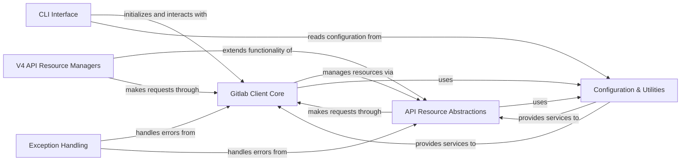

## Component Details

The `python-gitlab` library provides a comprehensive Python interface for the GitLab API. Its core functionality revolves around the `Gitlab Client Core` which handles all HTTP communications. This core interacts with `API Resource Abstractions` that define the base structure and common operations for various GitLab entities. Specific `V4 API Resource Managers` extend these abstractions to provide high-level, object-oriented access to GitLab's v4 API resources. A `CLI Interface` allows command-line interaction, leveraging the core client and configuration. `Configuration & Utilities` manage settings and provide helper functions, while `Exception Handling` ensures robust error management across all components.

### Gitlab Client Core
This component is responsible for managing the connection to the GitLab API, handling all underlying HTTP requests (GET, POST, PUT, DELETE, etc.), and providing methods for interacting with the API at a low level. It also includes implementations for GraphQL client interactions and handles pagination for list results.

**Related Classes/Methods**:

- `python-gitlab.gitlab.client.Gitlab` (full file reference)
- `python-gitlab.gitlab.client.GitlabList` (full file reference)
- `python-gitlab.gitlab.client.GraphQL` (full file reference)
- `python-gitlab.gitlab.client.AsyncGraphQL` (full file reference)
- `python-gitlab.gitlab.client._BaseGraphQL` (full file reference)
- <a href="https://github.com/python-gitlab/python-gitlab/blob/master/gitlab/_backends/requests_backend.py#L86-L168" target="_blank" rel="noopener noreferrer">`python-gitlab.gitlab._backends.requests_backend.RequestsBackend` (86:168)</a>

### API Resource Abstractions
This component provides the foundational classes for all GitLab API resources (RESTObject for single resources, RESTObjectList for collections) and managers (RESTManager for common operations). It also includes reusable mixins that provide common API operations like fetching, listing, creating, updating, deleting, and saving, which are inherited by specific API resource classes.

**Related Classes/Methods**:

- <a href="https://github.com/python-gitlab/python-gitlab/blob/master/gitlab/base.py#L27-L252" target="_blank" rel="noopener noreferrer">`python-gitlab.gitlab.base.RESTObject` (27:252)</a>
- <a href="https://github.com/python-gitlab/python-gitlab/blob/master/gitlab/base.py#L258-L337" target="_blank" rel="noopener noreferrer">`python-gitlab.gitlab.base.RESTObjectList` (258:337)</a>
- <a href="https://github.com/python-gitlab/python-gitlab/blob/master/gitlab/base.py#L340-L394" target="_blank" rel="noopener noreferrer">`python-gitlab.gitlab.base.RESTManager` (340:394)</a>
- <a href="https://github.com/python-gitlab/python-gitlab/blob/master/gitlab/mixins.py#L46-L68" target="_blank" rel="noopener noreferrer">`python-gitlab.gitlab.mixins.HeadMixin` (46:68)</a>
- <a href="https://github.com/python-gitlab/python-gitlab/blob/master/gitlab/mixins.py#L71-L102" target="_blank" rel="noopener noreferrer">`python-gitlab.gitlab.mixins.GetMixin` (71:102)</a>
- <a href="https://github.com/python-gitlab/python-gitlab/blob/master/gitlab/mixins.py#L161-L224" target="_blank" rel="noopener noreferrer">`python-gitlab.gitlab.mixins.ListMixin` (161:224)</a>
- <a href="https://github.com/python-gitlab/python-gitlab/blob/master/gitlab/mixins.py#L230-L261" target="_blank" rel="noopener noreferrer">`python-gitlab.gitlab.mixins.CreateMixin` (230:261)</a>
- <a href="https://github.com/python-gitlab/python-gitlab/blob/master/gitlab/mixins.py#L271-L330" target="_blank" rel="noopener noreferrer">`python-gitlab.gitlab.mixins.UpdateMixin` (271:330)</a>
- <a href="https://github.com/python-gitlab/python-gitlab/blob/master/gitlab/mixins.py#L358-L376" target="_blank" rel="noopener noreferrer">`python-gitlab.gitlab.mixins.DeleteMixin` (358:376)</a>
- <a href="https://github.com/python-gitlab/python-gitlab/blob/master/gitlab/mixins.py#L396-L442" target="_blank" rel="noopener noreferrer">`python-gitlab.gitlab.mixins.SaveMixin` (396:442)</a>

### CLI Interface
This component provides the command-line interface for interacting with the GitLab API. It handles argument parsing, registers custom actions, and executes commands to perform various GitLab operations, acting as the entry point for CLI usage.

**Related Classes/Methods**:

- `python-gitlab.gitlab.cli` (full file reference)
- <a href="https://github.com/python-gitlab/python-gitlab/blob/master/gitlab/v4/cli.py#L16-L202" target="_blank" rel="noopener noreferrer">`python-gitlab.gitlab.v4.cli.GitlabCLI` (16:202)</a>
- <a href="https://github.com/python-gitlab/python-gitlab/blob/master/gitlab/v4/cli.py#L440-L451" target="_blank" rel="noopener noreferrer">`python-gitlab.gitlab.v4.cli.JSONPrinter` (440:451)</a>
- <a href="https://github.com/python-gitlab/python-gitlab/blob/master/gitlab/v4/cli.py#L454-L487" target="_blank" rel="noopener noreferrer">`python-gitlab.gitlab.v4.cli.YAMLPrinter` (454:487)</a>
- <a href="https://github.com/python-gitlab/python-gitlab/blob/master/gitlab/v4/cli.py#L490-L560" target="_blank" rel="noopener noreferrer">`python-gitlab.gitlab.v4.cli.LegacyPrinter` (490:560)</a>

### Configuration & Utilities
This component is responsible for parsing and managing configuration files for python-gitlab, including locating files and handling parsing errors. It also provides a collection of various helper functions used across the library for tasks like data transformation, response content handling, logging, retrying operations, and warning management.

**Related Classes/Methods**:

- <a href="https://github.com/python-gitlab/python-gitlab/blob/master/gitlab/config.py#L90-L286" target="_blank" rel="noopener noreferrer">`python-gitlab.gitlab.config.GitlabConfigParser` (90:286)</a>
- <a href="https://github.com/python-gitlab/python-gitlab/blob/master/gitlab/utils.py#L227-L250" target="_blank" rel="noopener noreferrer">`gitlab.utils.EncodedId` (227:250)</a>
- <a href="https://github.com/python-gitlab/python-gitlab/blob/master/gitlab/utils.py#L69-L89" target="_blank" rel="noopener noreferrer">`gitlab.utils.response_content` (69:89)</a>
- <a href="https://github.com/python-gitlab/python-gitlab/blob/master/gitlab/utils.py#L44-L66" target="_blank" rel="noopener noreferrer">`gitlab.utils.MaskingFormatter` (44:66)</a>
- <a href="https://github.com/python-gitlab/python-gitlab/blob/master/gitlab/utils.py#L92-L152" target="_blank" rel="noopener noreferrer">`gitlab.utils.Retry` (92:152)</a>
- <a href="https://github.com/python-gitlab/python-gitlab/blob/master/gitlab/utils.py#L257-L286" target="_blank" rel="noopener noreferrer">`gitlab.utils.warn` (257:286)</a>

### Exception Handling
This component defines and manages custom exceptions specific to GitLab API interactions. It provides mechanisms to handle various errors such as HTTP errors, parsing errors, authentication errors, and upload errors, ensuring robust error management throughout the application.

**Related Classes/Methods**:

- <a href="https://github.com/python-gitlab/python-gitlab/blob/master/gitlab/exceptions.py#L332-L352" target="_blank" rel="noopener noreferrer">`gitlab.exceptions.on_http_error` (332:352)</a>
- <a href="https://github.com/python-gitlab/python-gitlab/blob/master/gitlab/exceptions.py#L233-L234" target="_blank" rel="noopener noreferrer">`gitlab.exceptions.GitlabUploadError` (233:234)</a>
- <a href="https://github.com/python-gitlab/python-gitlab/blob/master/gitlab/exceptions.py#L45-L46" target="_blank" rel="noopener noreferrer">`gitlab.exceptions.GitlabParsingError` (45:46)</a>
- <a href="https://github.com/python-gitlab/python-gitlab/blob/master/gitlab/exceptions.py#L37-L38" target="_blank" rel="noopener noreferrer">`gitlab.exceptions.GitlabAuthenticationError` (37:38)</a>
- <a href="https://github.com/python-gitlab/python-gitlab/blob/master/gitlab/exceptions.py#L61-L62" target="_blank" rel="noopener noreferrer">`gitlab.exceptions.GitlabHttpError` (61:62)</a>

### V4 API Resource Managers
This component encompasses all specific GitLab API resource managers for version 4 of the API. These managers provide high-level, object-oriented interfaces for interacting with various GitLab entities such as Projects, Merge Requests, Users, Groups, Issues, Files, Pipelines, Jobs, and more, abstracting the underlying API calls.

**Related Classes/Methods**:

- <a href="https://github.com/python-gitlab/python-gitlab/blob/master/gitlab/v4/objects/merge_requests.py#L149-L445" target="_blank" rel="noopener noreferrer">`python-gitlab.gitlab.v4.objects.merge_requests.ProjectMergeRequest` (149:445)</a>
- `python-gitlab.gitlab.v4.objects.projects.Project` (full file reference)
- <a href="https://github.com/python-gitlab/python-gitlab/blob/master/gitlab/v4/objects/pipelines.py#L60-L95" target="_blank" rel="noopener noreferrer">`python-gitlab.gitlab.v4.objects.pipelines.ProjectPipeline` (60:95)</a>
- <a href="https://github.com/python-gitlab/python-gitlab/blob/master/gitlab/v4/objects/jobs.py#L17-L342" target="_blank" rel="noopener noreferrer">`python-gitlab.gitlab.v4.objects.jobs.ProjectJob` (17:342)</a>
- <a href="https://github.com/python-gitlab/python-gitlab/blob/master/gitlab/v4/objects/users.py#L172-L395" target="_blank" rel="noopener noreferrer">`python-gitlab.gitlab.v4.objects.users.User` (172:395)</a>
- <a href="https://github.com/python-gitlab/python-gitlab/blob/master/gitlab/v4/objects/groups.py#L73-L259" target="_blank" rel="noopener noreferrer">`python-gitlab.gitlab.v4.objects.groups.Group` (73:259)</a>
- <a href="https://github.com/python-gitlab/python-gitlab/blob/master/gitlab/v4/objects/issues.py#L107-L226" target="_blank" rel="noopener noreferrer">`python-gitlab.gitlab.v4.objects.issues.ProjectIssue` (107:226)</a>
- <a href="https://github.com/python-gitlab/python-gitlab/blob/master/gitlab/v4/objects/files.py#L24-L84" target="_blank" rel="noopener noreferrer">`python-gitlab.gitlab.v4.objects.files.ProjectFile` (24:84)</a>
- <a href="https://github.com/python-gitlab/python-gitlab/blob/master/gitlab/v4/objects/artifacts.py#L26-L230" target="_blank" rel="noopener noreferrer">`python-gitlab.gitlab.v4.objects.artifacts.ProjectArtifactManager` (26:230)</a>
- <a href="https://github.com/python-gitlab/python-gitlab/blob/master/gitlab/v4/objects/snippets.py#L21-L96" target="_blank" rel="noopener noreferrer">`python-gitlab.gitlab.v4.objects.snippets.Snippet` (21:96)</a>
- <a href="https://github.com/python-gitlab/python-gitlab/blob/master/gitlab/v4/objects/labels.py#L22-L44" target="_blank" rel="noopener noreferrer">`python-gitlab.gitlab.v4.objects.labels.GroupLabel` (22:44)</a>
- <a href="https://github.com/python-gitlab/python-gitlab/blob/master/gitlab/v4/objects/milestones.py#L33-L89" target="_blank" rel="noopener noreferrer">`python-gitlab.gitlab.v4.objects.milestones.GroupMilestone` (33:89)</a>
- <a href="https://github.com/python-gitlab/python-gitlab/blob/master/gitlab/v4/objects/ci_lint.py#L21-L41" target="_blank" rel="noopener noreferrer">`python-gitlab.gitlab.v4.objects.ci_lint.CiLintManager` (21:41)</a>
- <a href="https://github.com/python-gitlab/python-gitlab/blob/master/gitlab/v4/objects/deployments.py#L21-L66" target="_blank" rel="noopener noreferrer">`python-gitlab.gitlab.v4.objects.deployments.ProjectDeployment` (21:66)</a>
- <a href="https://github.com/python-gitlab/python-gitlab/blob/master/gitlab/v4/objects/runners.py#L49-L123" target="_blank" rel="noopener noreferrer">`python-gitlab.gitlab.v4.objects.runners.RunnerManager` (49:123)</a>

### [FAQ](https://github.com/CodeBoarding/GeneratedOnBoardings/tree/main?tab=readme-ov-file#faq)