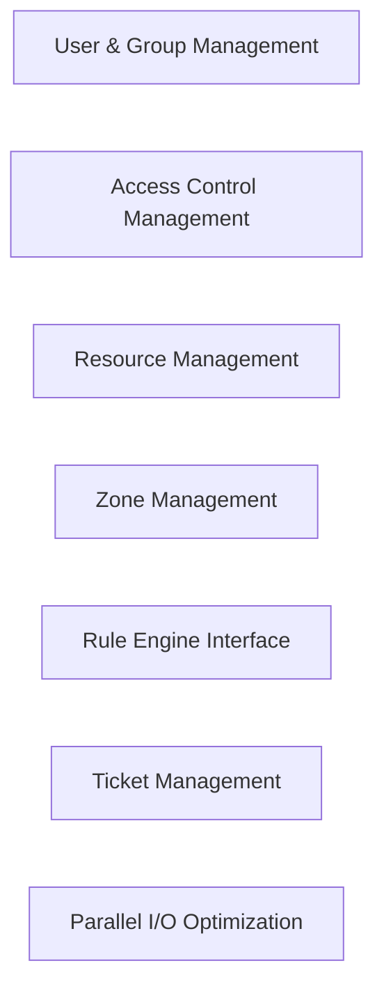

## Details

The Administrative & Specialized Operations subsystem of python-irodsclient focuses on managing core iRODS administrative entities and providing specialized functionalities for advanced data operations.

### User & Group Management
Manages the lifecycle of iRODS user accounts and group memberships (creation, modification, deletion). It also provides the data model for iRODS user and group entities, encapsulating their attributes.

**Related Classes/Methods**:

- <a href="https://github.com/irods/python-irodsclient/blob/main/irods/manager/user_manager.py" target="_blank" rel="noopener noreferrer">`irods/manager/user_manager.py`</a>
- <a href="https://github.com/irods/python-irodsclient/blob/main/irods/user.py" target="_blank" rel="noopener noreferrer">`irods/user.py`</a>

### Access Control Management
Retrieves and modifies Access Control Lists (ACLs) for iRODS collections and data objects. This component also serves as the data model for iRODS access permissions, representing ACL information.

**Related Classes/Methods**:

- <a href="https://github.com/irods/python-irodsclient/blob/main/irods/manager/access_manager.py" target="_blank" rel="noopener noreferrer">`irods/manager/access_manager.py`</a>
- <a href="https://github.com/irods/python-irodsclient/blob/main/irods/access.py" target="_blank" rel="noopener noreferrer">`irods/access.py`</a>

### Resource Management
Creates and modifies iRODS storage resources. It also provides the data model for iRODS resource entities, including their hierarchy.

**Related Classes/Methods**:

- <a href="https://github.com/irods/python-irodsclient/blob/main/irods/manager/resource_manager.py" target="_blank" rel="noopener noreferrer">`irods/manager/resource_manager.py`</a>
- <a href="https://github.com/irods/python-irodsclient/blob/main/irods/resource.py" target="_blank" rel="noopener noreferrer">`irods/resource.py`</a>

### Zone Management
Handles administrative operations related to iRODS zones, primarily zone creation.

**Related Classes/Methods**:

- <a href="https://github.com/irods/python-irodsclient/blob/main/irods/manager/zone_manager.py" target="_blank" rel="noopener noreferrer">`irods/manager/zone_manager.py`</a>

### Rule Engine Interface
Provides an interface for interacting with the iRODS Rule Engine, enabling operations such as loading and removing rule definitions.

**Related Classes/Methods**:

- <a href="https://github.com/irods/python-irodsclient/blob/main/irods/rule.py" target="_blank" rel="noopener noreferrer">`irods/rule.py`</a>

### Ticket Management
Manages temporary access tickets for iRODS data objects and collections, including issuing, modifying, supplying, and deleting tickets.

**Related Classes/Methods**:

- <a href="https://github.com/irods/python-irodsclient/blob/main/irods/ticket.py" target="_blank" rel="noopener noreferrer">`irods/ticket.py`</a>

### Parallel I/O Optimization
Optimizes large data transfers (get/put) by managing parallel I/O operations, including thread management and progress tracking to enhance performance.

**Related Classes/Methods**:

- <a href="https://github.com/irods/python-irodsclient/blob/main/irods/parallel.py" target="_blank" rel="noopener noreferrer">`irods/parallel.py`</a>

### [FAQ](https://github.com/CodeBoarding/GeneratedOnBoardings/tree/main?tab=readme-ov-file#faq)