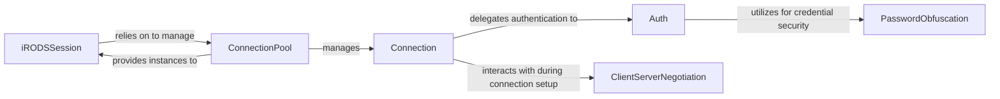

## Details

This subsystem is responsible for establishing and maintaining secure, persistent connections with the iRODS server, encompassing all aspects of user authentication and efficient session management.

### iRODSSession
The primary high-level interface for client applications. It orchestrates the overall session lifecycle, manages configuration, and handles account details. It serves as the main entry point for users to initiate and manage their interactions with the iRODS server.

**Related Classes/Methods**:

- <a href="https://github.com/irods/python-irodsclient/blob/main/irods/session.py#L74-L526" target="_blank" rel="noopener noreferrer">`iRODSSession`:74-526</a>

### ConnectionPool
Manages a pool of `Connection` instances to optimize performance and resource utilization. It ensures efficient reuse of established connections, reducing overhead for repeated server interactions.

**Related Classes/Methods**:

- <a href="https://github.com/irods/python-irodsclient/blob/main/irods/pool.py" target="_blank" rel="noopener noreferrer">`ConnectionPool`</a>

### Connection
Handles low-level network communication, including establishing TCP/IP connections, performing SSL/GSI handshakes, and managing raw data transfer with the iRODS server. It is responsible for the physical link to the server.

**Related Classes/Methods**:

- <a href="https://github.com/irods/python-irodsclient/blob/main/irods/pool.py#L88-L140" target="_blank" rel="noopener noreferrer">`Connection`:88-140</a>

### Auth
Encapsulates various authentication mechanisms (Native, PAM, GSI). It manages the authentication handshake process and handles credential management, ensuring secure client identification to the iRODS server.

**Related Classes/Methods**:

- <a href="https://github.com/irods/python-irodsclient/blob/main/irods/pool.py" target="_blank" rel="noopener noreferrer">`Auth`</a>

### ClientServerNegotiation
Responsible for the initial negotiation of capabilities and authentication mechanisms between the client and the iRODS server. This ensures compatibility and proper setup for secure communication.

**Related Classes/Methods**:

- <a href="https://github.com/irods/python-irodsclient/blob/main/irods/message/__init__.py#L453-L456" target="_blank" rel="noopener noreferrer">`ClientServerNegotiation`:453-456</a>

### PasswordObfuscation
Provides utilities for securing password data through encoding, decoding, scrambling, and unscrambling operations. It supports the `Auth` component in handling sensitive credentials.

**Related Classes/Methods**:

- <a href="https://github.com/irods/python-irodsclient/blob/main/irods/password_obfuscation.py" target="_blank" rel="noopener noreferrer">`PasswordObfuscation`</a>

### [FAQ](https://github.com/CodeBoarding/GeneratedOnBoardings/tree/main?tab=readme-ov-file#faq)