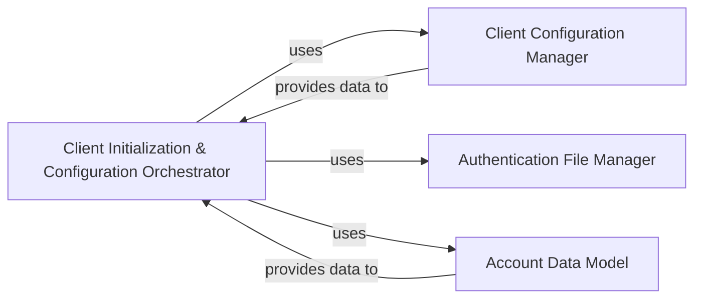

## Details

The iRODS client initialization subsystem is orchestrated by the `Client Initialization & Configuration Orchestrator`, which serves as the central control point for establishing an iRODS session. This orchestrator relies on the `Client Configuration Manager` to load and manage client-specific settings, ensuring the client is properly configured for connection. Concurrently, the `Authentication File Manager` handles the secure creation and encoding of authentication credentials, which are vital for user verification. All necessary user and connection details are structured and provided by the `Account Data Model`. This integrated approach ensures a robust and secure initialization process, preparing the client for seamless interaction with the iRODS server.

### Client Initialization & Configuration Orchestrator
This component acts as the central coordinator for the subsystem. It orchestrates the loading of client configurations, manages the authentication file lifecycle, and prepares the iRODS account details for session establishment. It is crucial for initiating any client-server interaction.

**Related Classes/Methods**:

- <a href="https://github.com/irods/python-irodsclient/blob/main/irods/client_init.py" target="_blank" rel="noopener noreferrer">`irods/client_init.py`</a>

### Client Configuration Manager
This component is dedicated to managing all aspects of client configuration. It handles the loading, parsing, and persistence of settings required for the iRODS client to operate correctly, such as host, port, and user information.

**Related Classes/Methods**:

- <a href="https://github.com/irods/python-irodsclient/blob/main/irods/client_configuration/__init__.py" target="_blank" rel="noopener noreferrer">`irods/client_configuration.py`</a>

### Authentication File Manager
This component is responsible for the secure handling of iRODS authentication files. It manages the creation, writing, and encoding of sensitive authentication credentials, ensuring they are correctly formatted and secured for the iRODS authentication process.

**Related Classes/Methods**:

- <a href="https://github.com/irods/python-irodsclient/blob/main/irods/client_init.py" target="_blank" rel="noopener noreferrer">`irods/client_init.py`</a>

### Account Data Model
This component defines and provides the structured data representation for iRODS user account details. It encapsulates information such as username, zone, and other attributes necessary for authentication and session context.

**Related Classes/Methods**:

- <a href="https://github.com/irods/python-irodsclient/blob/main/irods/account.py" target="_blank" rel="noopener noreferrer">`irods/account.py`</a>

### [FAQ](https://github.com/CodeBoarding/GeneratedOnBoardings/tree/main?tab=readme-ov-file#faq)