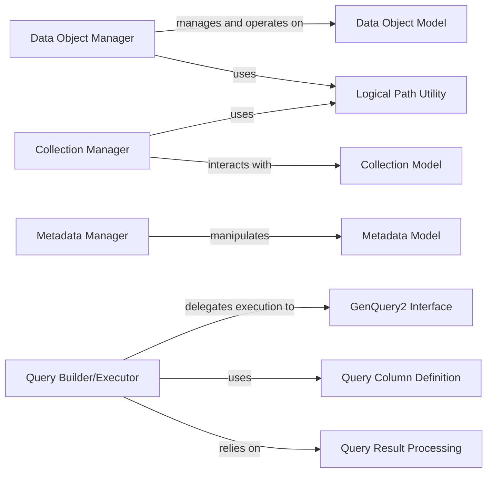

## Details

The `python-irodsclient` project is structured around core managers for interacting with iRODS data objects, collections, and metadata. The `Data Object Manager`, `Collection Manager`, and `Metadata Manager` provide high-level APIs for common iRODS operations, each interacting with their respective data models (`Data Object Model`, `Collection Model`, `Metadata Model`). Querying iRODS is handled by the `Query Builder/Executor`, which provides a fluent interface for constructing queries. This component delegates the actual execution to the `GenQuery2 Interface`, which is responsible for low-level interactions with the iRODS catalog. The `Query Builder/Executor` also leverages `Query Column Definition` for defining query parameters and `Query Result Processing` for handling and formatting the query output. Additionally, both `Data Object Manager` and `Collection Manager` utilize the `Logical Path Utility` for consistent path handling. This modular design separates concerns, allowing for clear responsibilities and interactions between components.

### Data Object Manager
Provides high-level operations for managing iRODS data objects, including creation, retrieval (get/download), storage (put), checksum verification, and unregistration. It orchestrates data transfers and progress updates.

**Related Classes/Methods**:

- <a href="https://github.com/irods/python-irodsclient/blob/main/irods/manager/data_object_manager.py" target="_blank" rel="noopener noreferrer">`irods/manager/data_object_manager.py`</a>

### Collection Manager
Manages iRODS collections (directories), handling operations such as creation, unregistration, and checking for existence.

**Related Classes/Methods**:

- <a href="https://github.com/irods/python-irodsclient/blob/main/irods/manager/collection_manager.py" target="_blank" rel="noopener noreferrer">`irods/manager/collection_manager.py`</a>

### Metadata Manager
Orchestrates Attribute-Value-Unit (AVU) metadata operations for various iRODS entities, including retrieval, addition, removal, and atomic updates.

**Related Classes/Methods**:

- <a href="https://github.com/irods/python-irodsclient/blob/main/irods/manager/metadata_manager.py" target="_blank" rel="noopener noreferrer">`irods/manager/metadata_manager.py`</a>

### Query Builder/Executor
Offers a fluent, Pythonic interface for constructing complex iRODS queries, applying filters, ordering, limits, and executing them against the iRODS catalog.

**Related Classes/Methods**:

- <a href="https://github.com/irods/python-irodsclient/blob/main/irods/query.py" target="_blank" rel="noopener noreferrer">`irods/query.py`</a>

### Data Object Model
Represents iRODS data objects, serving as the fundamental data structure for holding information about files within iRODS.

**Related Classes/Methods**:

- <a href="https://github.com/irods/python-irodsclient/blob/main/irods/data_object.py" target="_blank" rel="noopener noreferrer">`irods/data_object.py`</a>

### Collection Model
Represents iRODS collections, serving as the fundamental data structure for holding information about directories within iRODS.

**Related Classes/Methods**:

- <a href="https://github.com/irods/python-irodsclient/blob/main/irods/collection.py" target="_blank" rel="noopener noreferrer">`irods/collection.py`</a>

### Metadata Model
Represents iRODS metadata (Attribute-Value-Unit), serving as the fundamental data structure for AVU information associated with iRODS entities.

**Related Classes/Methods**:

- <a href="https://github.com/irods/python-irodsclient/blob/main/irods/meta.py" target="_blank" rel="noopener noreferrer">`irods/meta.py`</a>

### GenQuery2 Interface
Handles low-level query execution against the iRODS catalog, acting as the direct interface for GenQuery2 operations.

**Related Classes/Methods**:

- <a href="https://github.com/irods/python-irodsclient/blob/main/irods/genquery2.py" target="_blank" rel="noopener noreferrer">`irods/genquery2.py`</a>

### Query Column Definition
A helper for defining columns in iRODS queries, including classes for defining query keys, criteria, and column types (Integer, String, DateTime).

**Related Classes/Methods**:

- <a href="https://github.com/irods/python-irodsclient/blob/main/irods/column.py" target="_blank" rel="noopener noreferrer">`irods/column.py`</a>

### Query Result Processing
A helper for structuring and formatting iRODS query output, including the ResultSet class for processing raw query results and SpecificQueryResultSet for handling specific query outputs.

**Related Classes/Methods**:

- <a href="https://github.com/irods/python-irodsclient/blob/main/irods/results.py" target="_blank" rel="noopener noreferrer">`irods/results.py`</a>

### Logical Path Utility
An internal helper for consistent path handling within iRODS, primarily used to determine if a given path refers to a collection.

**Related Classes/Methods**:

- <a href="https://github.com/irods/python-irodsclient/blob/main/irods/manager/_internal/_logical_path.py" target="_blank" rel="noopener noreferrer">`irods/manager/_internal/_logical_path.py`</a>

### [FAQ](https://github.com/CodeBoarding/GeneratedOnBoardings/tree/main?tab=readme-ov-file#faq)