```mermaid
graph LR
    Client_Initialization_Configuration["Client Initialization & Configuration"]
    Authentication_Session_Management["Authentication & Session Management"]
    iRODS_Protocol_Layer["iRODS Protocol Layer"]
    Core_Data_Metadata_Services["Core Data & Metadata Services"]
    Administrative_Specialized_Operations["Administrative & Specialized Operations"]
    Client_Initialization_Configuration -- "provides configuration to" --> Authentication_Session_Management
    Authentication_Session_Management -- "exchanges messages with" --> iRODS_Protocol_Layer
    iRODS_Protocol_Layer -- "exchanges messages with" --> Authentication_Session_Management
    Authentication_Session_Management -- "provides session to" --> Core_Data_Metadata_Services
    Authentication_Session_Management -- "provides session to" --> Administrative_Specialized_Operations
    iRODS_Protocol_Layer -- "formats/decodes requests/responses for" --> Core_Data_Metadata_Services
    Core_Data_Metadata_Services -- "formats/decodes requests/responses for" --> iRODS_Protocol_Layer
    Core_Data_Metadata_Services -- "delegates parallel transfers to" --> Administrative_Specialized_Operations
    Administrative_Specialized_Operations -- "interacts for authentication-related tasks" --> Authentication_Session_Management
    click Client_Initialization_Configuration href "https://github.com/CodeBoarding/GeneratedOnBoardings/blob/main/python-irodsclient/Client_Initialization_Configuration.md" "Details"
    click Authentication_Session_Management href "https://github.com/CodeBoarding/GeneratedOnBoardings/blob/main/python-irodsclient/Authentication_Session_Management.md" "Details"
    click Core_Data_Metadata_Services href "https://github.com/CodeBoarding/GeneratedOnBoardings/blob/main/python-irodsclient/Core_Data_Metadata_Services.md" "Details"
    click Administrative_Specialized_Operations href "https://github.com/CodeBoarding/GeneratedOnBoardings/blob/main/python-irodsclient/Administrative_Specialized_Operations.md" "Details"
```

## Details

The `python-irodsclient` project is structured into several key architectural components, designed to provide a robust and modular interface for interacting with the iRODS data management system. At its foundation, the **Client Initialization & Configuration** component handles the initial setup, loading necessary settings and orchestrating the client's connection. This configuration is then utilized by the **Authentication & Session Management** component, which is responsible for secure user authentication and maintaining persistent, efficient communication sessions with the iRODS server, often leveraging connection pooling.

All communication with the iRODS server is facilitated by the **iRODS Protocol Layer**. This crucial component manages the low-level serialization and deserialization of iRODS messages, translating Python objects into network-ready formats and parsing incoming server responses according to the iRODS protocol. Both the **Core Data & Metadata Services** and **Administrative & Specialized Operations** components rely heavily on this protocol layer to interact with the iRODS server.

The **Core Data & Metadata Services** component provides high-level interfaces for managing iRODS data objects, collections, and associated metadata (AVUs). It also offers powerful capabilities for constructing and executing queries against the iRODS catalog, encapsulating the primary data interaction functionalities. For specialized administrative tasks, the **Administrative & Specialized Operations** component manages iRODS user accounts, groups, access permissions, storage resources, and administrative zones. It also includes interfaces for the iRODS Rule Engine, temporary access tickets, and optimizes large data transfers through parallel I/O.

This architecture ensures a clear separation of concerns, with each component focusing on a specific set of responsibilities, leading to a maintainable and scalable client implementation.

### Client Initialization & Configuration [[Expand]](./Client_Initialization_Configuration.md)
Manages the initial setup of the iRODS client, including loading configuration settings, handling environment variables, and orchestrating the initial connection and authentication handshake. This component acts as the entry point for client-side operations.

**Related Classes/Methods**:

- <a href="https://github.com/irods/python-irodsclient/blob/main/irods/client_configuration" target="_blank" rel="noopener noreferrer">`irods.client_configuration`</a>
- <a href="https://github.com/irods/python-irodsclient/blob/main/irods/client_init.py" target="_blank" rel="noopener noreferrer">`irods.client_init`</a>
- <a href="https://github.com/irods/python-irodsclient/blob/main/irods/account.py" target="_blank" rel="noopener noreferrer">`irods.account`</a>

### Authentication & Session Management [[Expand]](./Authentication_Session_Management.md)
Handles all aspects of user authentication (Native, PAM, GSI) and establishes, maintains, and manages persistent connections and sessions with the iRODS server. It ensures secure communication and efficient resource utilization through connection pooling.

**Related Classes/Methods**:

- <a href="https://github.com/irods/python-irodsclient/blob/main/irods/auth" target="_blank" rel="noopener noreferrer">`irods.auth`</a>
- <a href="https://github.com/irods/python-irodsclient/blob/main/irods/session.py" target="_blank" rel="noopener noreferrer">`irods.session`</a>
- <a href="https://github.com/irods/python-irodsclient/blob/main/irods/connection.py" target="_blank" rel="noopener noreferrer">`irods.connection`</a>
- <a href="https://github.com/irods/python-irodsclient/blob/main/irods/pool.py" target="_blank" rel="noopener noreferrer">`irods.pool`</a>
- <a href="https://github.com/irods/python-irodsclient/blob/main/irods/client_server_negotiation.py" target="_blank" rel="noopener noreferrer">`irods.client_server_negotiation`</a>
- <a href="https://github.com/irods/python-irodsclient/blob/main/irods/password_obfuscation.py" target="_blank" rel="noopener noreferrer">`irods.password_obfuscation`</a>

### iRODS Protocol Layer
Responsible for the low-level serialization and deserialization of iRODS protocol messages. It translates Python objects into network-transmittable formats and parses incoming server responses, ensuring proper communication according to the iRODS protocol.

**Related Classes/Methods**:

- <a href="https://github.com/irods/python-irodsclient/blob/main/irods/message" target="_blank" rel="noopener noreferrer">`irods.message`</a>
- <a href="https://github.com/irods/python-irodsclient/blob/main/irods/message/quasixml.py" target="_blank" rel="noopener noreferrer">`irods.message.quasixml`</a>
- <a href="https://github.com/irods/python-irodsclient/blob/main/irods/api_number.py" target="_blank" rel="noopener noreferrer">`irods.api_number`</a>
- <a href="https://github.com/irods/python-irodsclient/blob/main/irods/keywords.py" target="_blank" rel="noopener noreferrer">`irods.keywords`</a>

### Core Data & Metadata Services [[Expand]](./Core_Data_Metadata_Services.md)
Provides high-level interfaces for managing iRODS data objects (files), collections (directories), and associated Attribute-Value-Unit (AVU) metadata. It also offers a flexible interface for constructing and executing queries against the iRODS catalog. This component encapsulates the primary data interaction functionalities.

**Related Classes/Methods**:

- <a href="https://github.com/irods/python-irodsclient/blob/main/irods/manager/data_object_manager.py" target="_blank" rel="noopener noreferrer">`irods.manager.data_object_manager`</a>
- <a href="https://github.com/irods/python-irodsclient/blob/main/irods/data_object.py" target="_blank" rel="noopener noreferrer">`irods.data_object`</a>
- <a href="https://github.com/irods/python-irodsclient/blob/main/irods/manager/collection_manager.py" target="_blank" rel="noopener noreferrer">`irods.manager.collection_manager`</a>
- <a href="https://github.com/irods/python-irodsclient/blob/main/irods/collection.py" target="_blank" rel="noopener noreferrer">`irods.collection`</a>
- <a href="https://github.com/irods/python-irodsclient/blob/main/irods/manager/metadata_manager.py" target="_blank" rel="noopener noreferrer">`irods.manager.metadata_manager`</a>
- <a href="https://github.com/irods/python-irodsclient/blob/main/irods/meta.py" target="_blank" rel="noopener noreferrer">`irods.meta`</a>
- <a href="https://github.com/irods/python-irodsclient/blob/main/irods/query.py" target="_blank" rel="noopener noreferrer">`irods.query`</a>
- <a href="https://github.com/irods/python-irodsclient/blob/main/irods/genquery2.py" target="_blank" rel="noopener noreferrer">`irods.genquery2`</a>
- <a href="https://github.com/irods/python-irodsclient/blob/main/irods/column.py" target="_blank" rel="noopener noreferrer">`irods.column`</a>
- <a href="https://github.com/irods/python-irodsclient/blob/main/irods/results.py" target="_blank" rel="noopener noreferrer">`irods.results`</a>
- <a href="https://github.com/irods/python-irodsclient/blob/main/irods/manager/_internal/_logical_path.py" target="_blank" rel="noopener noreferrer">`irods.manager._internal._logical_path`</a>

### Administrative & Specialized Operations [[Expand]](./Administrative_Specialized_Operations.md)
Manages iRODS user accounts, groups, access permissions (ACLs), storage resources, and administrative zones. It also provides interfaces for interacting with the iRODS Rule Engine and managing temporary access tickets, along with optimizing large data transfers through parallel I/O.

**Related Classes/Methods**:

- <a href="https://github.com/irods/python-irodsclient/blob/main/irods/manager/user_manager.py" target="_blank" rel="noopener noreferrer">`irods.manager.user_manager`</a>
- <a href="https://github.com/irods/python-irodsclient/blob/main/irods/user.py" target="_blank" rel="noopener noreferrer">`irods.user`</a>
- <a href="https://github.com/irods/python-irodsclient/blob/main/irods/manager/access_manager.py" target="_blank" rel="noopener noreferrer">`irods.manager.access_manager`</a>
- <a href="https://github.com/irods/python-irodsclient/blob/main/irods/access.py" target="_blank" rel="noopener noreferrer">`irods.access`</a>
- <a href="https://github.com/irods/python-irodsclient/blob/main/irods/manager/resource_manager.py" target="_blank" rel="noopener noreferrer">`irods.manager.resource_manager`</a>
- <a href="https://github.com/irods/python-irodsclient/blob/main/irods/resource.py" target="_blank" rel="noopener noreferrer">`irods.resource`</a>
- <a href="https://github.com/irods/python-irodsclient/blob/main/irods/manager/zone_manager.py" target="_blank" rel="noopener noreferrer">`irods.manager.zone_manager`</a>
- <a href="https://github.com/irods/python-irodsclient/blob/main/irods/rule.py" target="_blank" rel="noopener noreferrer">`irods.rule`</a>
- <a href="https://github.com/irods/python-irodsclient/blob/main/irods/ticket.py" target="_blank" rel="noopener noreferrer">`irods.ticket`</a>
- <a href="https://github.com/irods/python-irodsclient/blob/main/irods/parallel.py" target="_blank" rel="noopener noreferrer">`irods.parallel`</a>

### [FAQ](https://github.com/CodeBoarding/GeneratedOnBoardings/tree/main?tab=readme-ov-file#faq)