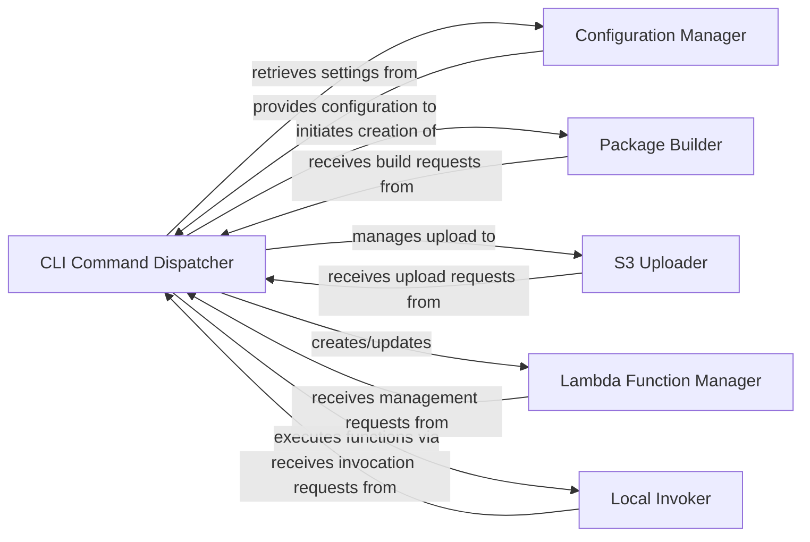

## Details

The `CLI Command Orchestrator` subsystem serves as the primary interface for users, translating command-line inputs into orchestrated actions for serverless development.

### CLI Command Dispatcher
This component is the core orchestrator, responsible for parsing command-line arguments and dispatching the execution flow to the appropriate underlying services for deployment, upload, or local invocation. It acts as the central coordinator for all major operations.

**Related Classes/Methods**:

- <a href="https://github.com/nficano/python-lambda/blob/master/aws_lambda/aws_lambda.py" target="_blank" rel="noopener noreferrer">`aws_lambda.aws_lambda:deploy`</a>
- <a href="https://github.com/nficano/python-lambda/blob/master/aws_lambda/aws_lambda.py" target="_blank" rel="noopener noreferrer">`aws_lambda.aws_lambda:upload`</a>
- <a href="https://github.com/nficano/python-lambda/blob/master/aws_lambda/aws_lambda.py" target="_blank" rel="noopener noreferrer">`aws_lambda.aws_lambda:invoke`</a>
- <a href="https://github.com/nficano/python-lambda/blob/master/aws_lambda/aws_lambda.py" target="_blank" rel="noopener noreferrer">`aws_lambda.aws_lambda:deploy_s3`</a>

### Configuration Manager
Provides configuration data to other components, ensuring that operations are performed with the correct settings for functions, AWS resources, and deployment parameters.

**Related Classes/Methods**:

- <a href="https://github.com/nficano/python-lambda/blob/master/aws_lambda/aws_lambda.py" target="_blank" rel="noopener noreferrer">`aws_lambda.aws_lambda:read_cfg`</a>
- <a href="https://github.com/nficano/python-lambda/blob/master/aws_lambda/aws_lambda.py" target="_blank" rel="noopener noreferrer">`aws_lambda.aws_lambda:get_function_config`</a>

### Package Builder [[Expand]](./Package_Builder.md)
Responsible for creating the deployable Lambda package, which typically involves zipping source code and dependencies into a format suitable for AWS Lambda.

**Related Classes/Methods**:

- <a href="https://github.com/nficano/python-lambda/blob/master/aws_lambda/aws_lambda.py" target="_blank" rel="noopener noreferrer">`aws_lambda.aws_lambda:build`</a>

### S3 Uploader
Handles the secure upload of deployment packages and other necessary files to AWS S3 buckets, often as an intermediary step before Lambda function creation or update.

**Related Classes/Methods**:

- <a href="https://github.com/nficano/python-lambda/blob/master/aws_lambda/aws_lambda.py" target="_blank" rel="noopener noreferrer">`aws_lambda.aws_lambda:upload_s3`</a>

### Lambda Function Manager
Manages the lifecycle of AWS Lambda functions, including their creation, updates, and potentially deletion, by interacting directly with the AWS Lambda API.

**Related Classes/Methods**:

- <a href="https://github.com/nficano/python-lambda/blob/master/aws_lambda/aws_lambda.py" target="_blank" rel="noopener noreferrer">`aws_lambda.aws_lambda:create_function`</a>
- <a href="https://github.com/nficano/python-lambda/blob/master/aws_lambda/aws_lambda.py" target="_blank" rel="noopener noreferrer">`aws_lambda.aws_lambda:update_function`</a>

### Local Invoker
Provides a mechanism to execute Lambda function handlers locally, enabling developers to test their functions without deploying them to AWS.

**Related Classes/Methods**:

- <a href="https://github.com/nficano/python-lambda/blob/master/aws_lambda/aws_lambda.py" target="_blank" rel="noopener noreferrer">`aws_lambda.aws_lambda:get_callable_handler_function`</a>

### [FAQ](https://github.com/CodeBoarding/GeneratedOnBoardings/tree/main?tab=readme-ov-file#faq)