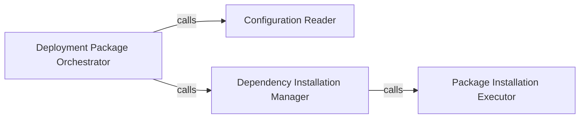

## Details

The `Deployment Package Builder` subsystem is responsible for preparing the AWS Lambda deployment package, encompassing dependency resolution, local package inclusion, and archiving into a deployable ZIP file.

### Deployment Package Orchestrator
The central component that orchestrates the entire process of preparing the AWS Lambda deployment package. It coordinates configuration reading, dependency management, and the final packaging steps.

**Related Classes/Methods**:

- <a href="https://github.com/nficano/python-lambda/blob/master/aws_lambda/aws_lambda.py#L313-L411" target="_blank" rel="noopener noreferrer">`aws_lambda.aws_lambda.build`:313-411</a>

### Configuration Reader
Responsible for reading and parsing configuration settings essential for the package building process, such as dependency lists, target directories, or other build-specific parameters.

**Related Classes/Methods**:

- <a href="https://github.com/nficano/python-lambda/blob/master/aws_lambda/aws_lambda.py#L841-L847" target="_blank" rel="noopener noreferrer">`aws_lambda.aws_lambda.read_cfg`:841-847</a>

### Dependency Installation Manager
Manages the high-level process of installing Python dependencies into a designated target directory, ensuring they are correctly resolved and placed for the Lambda function's runtime environment.

**Related Classes/Methods**:

- <a href="https://github.com/nficano/python-lambda/blob/master/aws_lambda/aws_lambda.py#L486-L521" target="_blank" rel="noopener noreferrer">`aws_lambda.aws_lambda.pip_install_to_target`:486-521</a>

### Package Installation Executor
Executes the specific commands or logic to install Python packages, likely interacting directly with `pip` or similar package management tools. This component handles the low-level details of package installation.

**Related Classes/Methods**:

- <a href="https://github.com/nficano/python-lambda/blob/master/aws_lambda/aws_lambda.py#L445-L483" target="_blank" rel="noopener noreferrer">`aws_lambda.aws_lambda._install_packages`:445-483</a>

### [FAQ](https://github.com/CodeBoarding/GeneratedOnBoardings/tree/main?tab=readme-ov-file#faq)