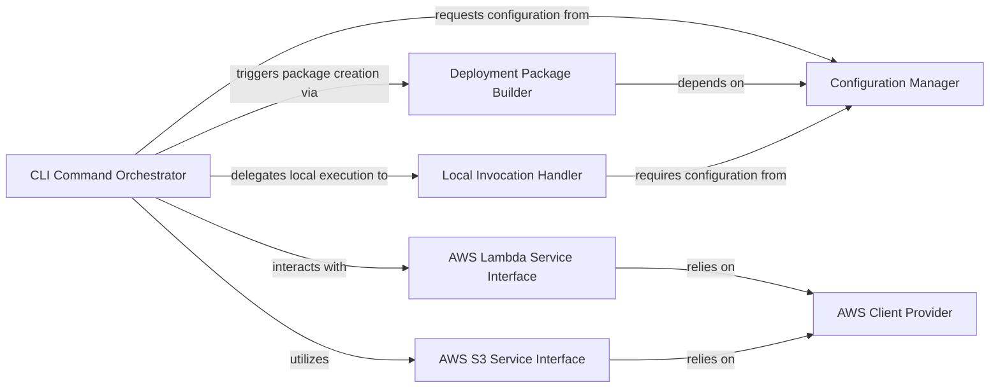

## Details

The python-lambda project is architected as a command-line tool designed to streamline the development and deployment of AWS Lambda functions. At its core, the CLI Command Orchestrator serves as the central control point, interpreting user commands and coordinating the overall workflow. This orchestrator relies on the Configuration Manager to load project-specific settings, which dictate how Lambda functions are built and deployed. For preparing the deployment artifact, the Deployment Package Builder handles dependency resolution and packaging. Once ready, the artifact is managed by either the AWS Lambda Service Interface for direct deployments or the AWS S3 Service Interface for larger packages requiring S3 staging. All interactions with AWS services are securely facilitated by the AWS Client Provider. Furthermore, the tool includes a Local Invocation Handler to enable rapid local testing of Lambda functions, mimicking the cloud environment. This modular design ensures clear separation of concerns, making the tool efficient, maintainable, and easy to understand for both developers and operations teams.

### CLI Command Orchestrator [[Expand]](./CLI_Command_Orchestrator.md)
The primary user interface, responsible for parsing command-line arguments and orchestrating the high-level execution flow for deployment, upload, and local invocation. It acts as the central coordinator for all major operations.

**Related Classes/Methods**:

- <a href="https://github.com/nficano/python-lambda/blob/master/aws_lambda/aws_lambda.py" target="_blank" rel="noopener noreferrer">`aws_lambda.aws_lambda.py:deploy`</a>
- <a href="https://github.com/nficano/python-lambda/blob/master/aws_lambda/aws_lambda.py" target="_blank" rel="noopener noreferrer">`aws_lambda.aws_lambda.py:upload`</a>
- <a href="https://github.com/nficano/python-lambda/blob/master/aws_lambda/aws_lambda.py" target="_blank" rel="noopener noreferrer">`aws_lambda.aws_lambda.py:invoke`</a>
- <a href="https://github.com/nficano/python-lambda/blob/master/aws_lambda/aws_lambda.py" target="_blank" rel="noopener noreferrer">`aws_lambda.aws_lambda.py:deploy_s3`</a>

### Configuration Manager
Handles the loading, parsing, and validation of project-specific configuration (e.g., config.yaml). It provides essential parameters and settings to other components for builds, deployments, and invocations.

**Related Classes/Methods**:

- <a href="https://github.com/nficano/python-lambda/blob/master/aws_lambda/aws_lambda.py" target="_blank" rel="noopener noreferrer">`aws_lambda.aws_lambda.py:read_cfg`</a>

### Deployment Package Builder [[Expand]](./Deployment_Package_Builder.md)
Responsible for preparing the AWS Lambda deployment package. This includes resolving and installing Python dependencies (e.g., via pip), incorporating local packages, and archiving the entire structure into a deployable ZIP file.

**Related Classes/Methods**:

- <a href="https://github.com/nficano/python-lambda/blob/master/aws_lambda/aws_lambda.py" target="_blank" rel="noopener noreferrer">`aws_lambda.aws_lambda.py:build`</a>
- <a href="https://github.com/nficano/python-lambda/blob/master/aws_lambda/aws_lambda.py" target="_blank" rel="noopener noreferrer">`aws_lambda.aws_lambda.py:pip_install_to_target`</a>

### AWS Lambda Service Interface
Encapsulates all direct interactions with the AWS Lambda API. This component is responsible for managing the lifecycle of Lambda functions, including creation, updates, retrieval of configurations, and potentially deletion.

**Related Classes/Methods**:

- <a href="https://github.com/nficano/python-lambda/blob/master/aws_lambda/aws_lambda.py" target="_blank" rel="noopener noreferrer">`aws_lambda.aws_lambda.py:create_function`</a>
- <a href="https://github.com/nficano/python-lambda/blob/master/aws_lambda/aws_lambda.py" target="_blank" rel="noopener noreferrer">`aws_lambda.aws_lambda.py:update_function`</a>
- <a href="https://github.com/nficano/python-lambda/blob/master/aws_lambda/aws_lambda.py" target="_blank" rel="noopener noreferrer">`aws_lambda.aws_lambda.py:get_function_config`</a>

### AWS S3 Service Interface
Manages interactions with AWS S3 for storing and retrieving Lambda deployment packages, especially for larger functions that exceed direct Lambda upload limits. It handles artifact staging and retrieval.

**Related Classes/Methods**:

- <a href="https://github.com/nficano/python-lambda/blob/master/aws_lambda/aws_lambda.py" target="_blank" rel="noopener noreferrer">`aws_lambda.aws_lambda.py:upload_s3`</a>

### AWS Client Provider
A foundational utility component responsible for initializing and providing authenticated Boto3 clients for various AWS services (e.g., Lambda, S3, IAM). It ensures secure and configured access to AWS APIs.

**Related Classes/Methods**:

- <a href="https://github.com/nficano/python-lambda/blob/master/aws_lambda/aws_lambda.py" target="_blank" rel="noopener noreferrer">`aws_lambda.aws_lambda.py:get_client`</a>

### Local Invocation Handler
Facilitates the local execution and testing of Lambda handler functions, mimicking the AWS Lambda runtime environment. This component is crucial for rapid development and debugging cycles.

**Related Classes/Methods**:

- <a href="https://github.com/nficano/python-lambda/blob/master/aws_lambda/aws_lambda.py" target="_blank" rel="noopener noreferrer">`aws_lambda.aws_lambda.py:invoke`</a>
- <a href="https://github.com/nficano/python-lambda/blob/master/aws_lambda/aws_lambda.py" target="_blank" rel="noopener noreferrer">`aws_lambda.aws_lambda.py:get_callable_handler_function`</a>

### [FAQ](https://github.com/CodeBoarding/GeneratedOnBoardings/tree/main?tab=readme-ov-file#faq)