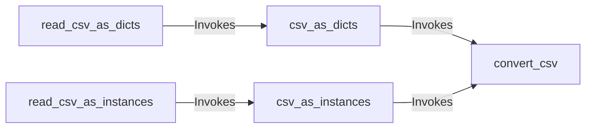

## Component Details

These components are fundamental because they collectively define the entire data ingestion and transformation pipeline for CSV data within the `structly` project. `convert_csv` is the bedrock, encapsulating the low-level logic for reading and converting individual CSV rows. Its flexibility in handling both dictionaries and `Structure` instances makes it the core of the reader. `csv_as_dicts` and `csv_as_instances` provide the primary programmatic interfaces for working with file-like objects, offering distinct output formats (dictionaries vs. `Structure` instances) while leveraging the efficiency of `convert_csv`. `read_csv_as_dicts` and `read_csv_as_instances` serve as user-friendly entry points, abstracting away the file opening and management, making it simple to read CSV data directly from a file path. Together, they form a cohesive and layered architecture that effectively separates concerns: file handling, core parsing/conversion, and user-facing convenience functions. This design promotes reusability and maintainability within the `Data Reader` component.

### convert_csv
This is the core utility function responsible for the actual parsing of CSV data. It takes a file-like object, a `Structure` class (optional), and an error logger. It iterates through the CSV rows, attempts to convert each row into either a dictionary or an instance of the provided `Structure` class, and logs errors for malformed rows. It acts as the central data transformation engine.

**Related Classes/Methods**:

- `convert_csv` (1:1)

### csv_as_dicts
This function serves as a high-level interface for reading CSV data from a file-like object and yielding each row as a dictionary. It internally utilizes `convert_csv` to perform the parsing and transformation.

**Related Classes/Methods**:

- `csv_as_dicts` (1:1)

### csv_as_instances
Similar to `csv_as_dicts`, this function provides a high-level interface for reading CSV data from a file-like object, but it yields each row as an instance of a specified `Structure` class. It also relies on `convert_csv` for the underlying parsing logic.

**Related Classes/Methods**:

- `csv_as_instances` (1:1)

### read_csv_as_dicts
This function is a convenience wrapper that handles opening a CSV file by its filename and then uses `csv_as_dicts` to read and yield data as dictionaries. It simplifies the process for users who provide a file path.

**Related Classes/Methods**:

- `read_csv_as_dicts` (1:1)

### read_csv_as_instances
Analogous to `read_csv_as_dicts`, this function opens a CSV file by its filename and then uses `csv_as_instances` to read and yield data as instances of a specified `Structure` class. It provides a straightforward way to ingest CSV data from a file path into structured objects.

**Related Classes/Methods**:

- `read_csv_as_instances` (1:1)

### [FAQ](https://github.com/CodeBoarding/GeneratedOnBoardings/tree/main?tab=readme-ov-file#faq)