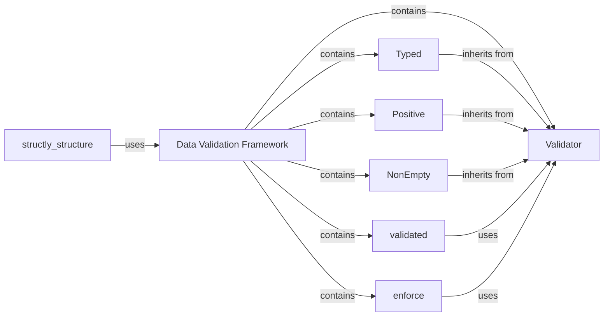

## Component Details

The `Data Validation Framework` in `structly` provides a robust, descriptor-based system for enforcing data integrity. It allows developers to define validation rules for class attributes and function arguments/return values, ensuring data conforms to predefined constraints at runtime. This framework is fundamental for building reliable and type-safe data structures.

### Data Validation Framework
The overarching component that encapsulates all validation logic within `structly`. It provides the infrastructure for defining, applying, and enforcing data integrity rules across various parts of the application.

**Related Classes/Methods**:

- <a href="https://github.com/dabeaz-course/python-mastery/blob/master/Solutions/9_2/structly/validate.py#L1-L135" target="_blank" rel="noopener noreferrer">`structly.validate` (1:135)</a>

### Validator
The abstract base class for all validation descriptors. It implements the descriptor protocol (`__set_name__`, `__set__`) and defines the `check` class method, which concrete validators override to implement specific validation logic. It acts as the core mechanism for attribute-level validation.

**Related Classes/Methods**:

- <a href="https://github.com/dabeaz-course/python-mastery/blob/master/Solutions/9_2/structly/validate.py#L2-L20" target="_blank" rel="noopener noreferrer">`structly.validate.Validator` (2:20)</a>

### Typed
A concrete `Validator` subclass that ensures an attribute's value is of a specific Python type. It's used for basic type checking, with specialized versions (e.g., `Integer`, `Float`, `String`) dynamically created from it.

**Related Classes/Methods**:

- <a href="https://github.com/dabeaz-course/python-mastery/blob/master/Solutions/9_2/structly/validate.py#L22-L28" target="_blank" rel="noopener noreferrer">`structly.validate.Typed` (22:28)</a>

### Positive
A concrete `Validator` subclass that ensures a numeric attribute's value is strictly greater than or equal to zero. It's used for enforcing non-negative numerical constraints.

**Related Classes/Methods**:

- <a href="https://github.com/dabeaz-course/python-mastery/blob/master/Solutions/9_2/structly/validate.py#L38-L43" target="_blank" rel="noopener noreferrer">`structly.validate.Positive` (38:43)</a>

### NonEmpty
A concrete `Validator` subclass that ensures a collection (e.g., string, list, tuple) is not empty. It's crucial for validating attributes that must contain data.

**Related Classes/Methods**:

- <a href="https://github.com/dabeaz-course/python-mastery/blob/master/Solutions/9_2/structly/validate.py#L45-L50" target="_blank" rel="noopener noreferrer">`structly.validate.NonEmpty` (45:50)</a>

### validated
A function decorator that applies validation to function arguments and return values based on type annotations. It inspects the function's signature and uses `Validator` instances (or `Validator` subclasses) specified in annotations to perform checks.

**Related Classes/Methods**:

- <a href="https://github.com/dabeaz-course/python-mastery/blob/master/Solutions/9_2/structly/validate.py#L67-L102" target="_blank" rel="noopener noreferrer">`structly.validate.validated` (67:102)</a>

### enforce
A function decorator similar to `validated`, but it allows explicit specification of validators for arguments and return values using keyword arguments, providing an alternative syntax for applying function-level validation.

**Related Classes/Methods**:

- <a href="https://github.com/dabeaz-course/python-mastery/blob/master/Solutions/9_2/structly/validate.py#L104-L134" target="_blank" rel="noopener noreferrer">`structly.validate.enforce` (104:134)</a>

### [FAQ](https://github.com/CodeBoarding/GeneratedOnBoardings/tree/main?tab=readme-ov-file#faq)