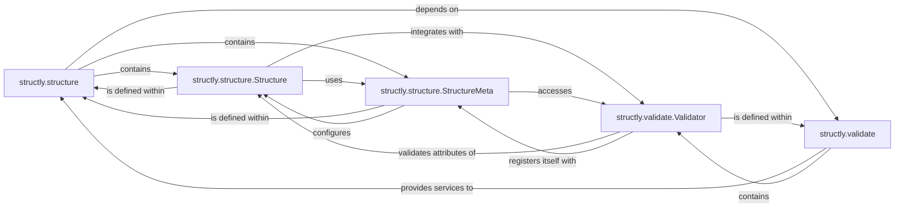

## Component Details

The `Structured Data Definition` component, primarily embodied by the `structly.structure` module, is fundamental to the `structly` library as it provides the core mechanism for defining and managing structured data. It leverages Python's metaclass capabilities to dynamically construct data structures with built-in validation, ensuring data integrity from the point of instance creation.

### structly.structure
This module serves as the core for defining structured data schemas within the `structly` library. It encapsulates the `Structure` base class and its `StructureMeta` metaclass, which together enable the dynamic generation of object initialization methods and facilitate integration with the `Data Validation Framework` to ensure data integrity.

**Related Classes/Methods**:

- <a href="https://github.com/dabeaz-course/python-mastery/blob/master/Solutions/9_2/structly/structure.py#L0-L0" target="_blank" rel="noopener noreferrer">`structly.structure` (0:0)</a>

### structly.structure.Structure
The foundational base class for all structured data definitions. It allows users to declare fields, provides standard object behaviors (representation, iteration, equality), and dynamically generates its `__init__` method. Crucially, its `__init_subclass__` method triggers the application of validation rules, and the `from_row` class method enables instance creation from iterable data.

**Related Classes/Methods**:

- <a href="https://github.com/dabeaz-course/python-mastery/blob/master/Solutions/9_2/structly/structure.py#L15-L57" target="_blank" rel="noopener noreferrer">`structly.structure.Structure` (15:57)</a>
- <a href="https://github.com/dabeaz-course/python-mastery/blob/master/Solutions/9_2/structly/structure.py#L0-L0" target="_blank" rel="noopener noreferrer">`structly.structure.Structure:__init__` (0:0)</a>
- <a href="https://github.com/dabeaz-course/python-mastery/blob/master/Solutions/9_2/structly/structure.py#L55-L57" target="_blank" rel="noopener noreferrer">`structly.structure.Structure:__init_subclass__` (55:57)</a>
- <a href="https://github.com/dabeaz-course/python-mastery/blob/master/Solutions/9_2/structly/structure.py#L37-L39" target="_blank" rel="noopener noreferrer">`structly.structure.Structure:from_row` (37:39)</a>

### structly.structure.StructureMeta
This metaclass is responsible for the dynamic construction of `Structure` classes. Its `__prepare__` method is key, as it merges the class's namespace with the `Validator.validators` dictionary, allowing validation rules to be directly defined as class attributes. This mechanism is central to how validation descriptors are integrated into `Structure` definitions.

**Related Classes/Methods**:

- <a href="https://github.com/dabeaz-course/python-mastery/blob/master/Solutions/9_2/structly/structure.py#L5-L13" target="_blank" rel="noopener noreferrer">`structly.structure.StructureMeta` (5:13)</a>
- <a href="https://github.com/dabeaz-course/python-mastery/blob/master/Solutions/9_2/structly/structure.py#L7-L8" target="_blank" rel="noopener noreferrer">`structly.structure.StructureMeta:__prepare__` (7:8)</a>

### structly.validate
This module constitutes the `Data Validation Framework` for the `structly` library. It defines the `Validator` base class and is designed to house various concrete validation rules. It is essential for applying constraints to `Structure` fields, thereby enforcing data quality and adherence to predefined schemas.

**Related Classes/Methods**:

- <a href="https://github.com/dabeaz-course/python-mastery/blob/master/Solutions/9_2/structly/validate.py#L0-L0" target="_blank" rel="noopener noreferrer">`structly.validate` (0:0)</a>

### structly.validate.Validator
The abstract base class for all data validation rules. Subclasses implement specific validation logic. Its `__set__` method intercepts attribute assignments to apply validation, and its `__init_subclass__` method automatically registers derived validator classes, making them discoverable and usable by `StructureMeta`.

**Related Classes/Methods**:

- <a href="https://github.com/dabeaz-course/python-mastery/blob/master/Solutions/9_2/structly/validate.py#L2-L20" target="_blank" rel="noopener noreferrer">`structly.validate.Validator` (2:20)</a>
- <a href="https://github.com/dabeaz-course/python-mastery/blob/master/Solutions/9_2/structly/validate.py#L13-L14" target="_blank" rel="noopener noreferrer">`structly.validate.Validator:__set__` (13:14)</a>
- <a href="https://github.com/dabeaz-course/python-mastery/blob/master/Solutions/9_2/structly/validate.py#L19-L20" target="_blank" rel="noopener noreferrer">`structly.validate.Validator:__init_subclass__` (19:20)</a>

### [FAQ](https://github.com/CodeBoarding/GeneratedOnBoardings/tree/main?tab=readme-ov-file#faq)