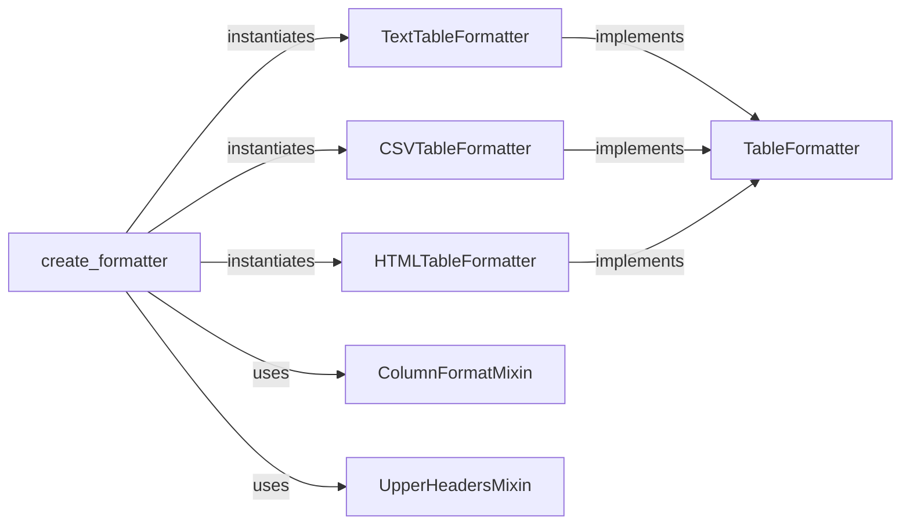

## Component Details

This subsystem is designed to present structured data in various tabular formats. It employs a factory pattern to dynamically create and configure formatters, supporting flexible output options and customizable formatting through mixins.

### TableFormatter
This is an abstract base class that defines the common interface for all table formatters. It mandates the implementation of `headings` and `row` methods, ensuring a consistent contract for how table data is presented, regardless of the output format. It is fundamental as it establishes the core behavior and allows for polymorphism among different formatter types.

**Related Classes/Methods**: _None_

### TextTableFormatter
A concrete implementation of `TableFormatter` that formats and prints table data as plain text. It ensures fixed-width columns for readability, making it suitable for console output. It's fundamental as it provides a basic, human-readable representation of tabular data.

**Related Classes/Methods**: _None_

### CSVTableFormatter
A concrete implementation of `TableFormatter` that formats and prints table data as comma-separated values (CSV). This makes the output easily consumable by spreadsheet applications and other data processing tools. It's fundamental for data interoperability.

**Related Classes/Methods**: _None_

### HTMLTableFormatter
A concrete implementation of `TableFormatter` that formats and prints table data as HTML table rows and headers. This is essential for displaying structured data within web pages or other HTML-based contexts. It's fundamental for web integration.

**Related Classes/Methods**: _None_

### ColumnFormatMixin
A mixin class that provides functionality to apply specific formatting to individual columns of the table. It overrides the `row` method to apply string formatting based on a `formats` attribute. It's fundamental because it offers a reusable and flexible way to extend the formatting capabilities of any `TableFormatter` without modifying its core logic.

**Related Classes/Methods**: _None_

### UpperHeadersMixin
A mixin class that modifies the `headings` method to convert all header strings to uppercase. This provides a simple, reusable way to alter header presentation. It's fundamental as it demonstrates how cross-cutting concerns (like header styling) can be injected into formatters.

**Related Classes/Methods**: _None_

### create_formatter
This is a factory function that serves as the primary entry point for obtaining `TableFormatter` instances. It dynamically selects the appropriate concrete formatter class (text, CSV, HTML) based on the `name` parameter and can apply `ColumnFormatMixin` and `UpperHeadersMixin` based on additional arguments. It's fundamental because it encapsulates the creation logic, decouples clients from concrete formatter classes, and enables dynamic composition of formatting features.

**Related Classes/Methods**: _None_

### [FAQ](https://github.com/CodeBoarding/GeneratedOnBoardings/tree/main?tab=readme-ov-file#faq)