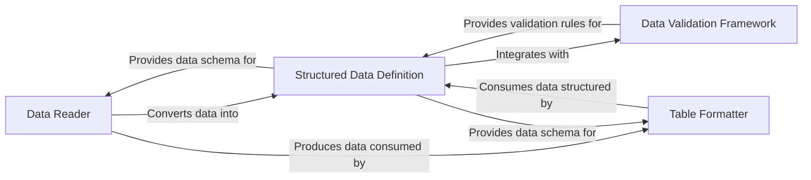

## Component Details

The `python-mastery` project is designed around a clear pipeline for handling structured data, from ingestion to validation and presentation. Based on the combined analysis of the Control Flow Graph (CFG) and source code, four core components emerge as fundamental to its architecture: `Data Reader`, `Structured Data Definition`, `Data Validation Framework`, and `Table Formatter`. These components represent the complete lifecycle and core functionalities of the `python-mastery` library, forming a cohesive and logical data processing pipeline: Read Data -> Structure & Validate Data -> Format Data. Each component has a distinct responsibility, yet they are highly interdependent, forming the essential backbone of the `python-mastery` library's architecture.

### Data Reader
This component is responsible for ingesting raw data, primarily from CSV files, and converting it into structured Python objects. It abstracts the complexities of file parsing and provides flexible mechanisms to transform data into either dictionaries or instances of `Structure` classes.

**Related Classes/Methods**:

- <a href="https://github.com/dabeaz-course/python-mastery/blob/master/Solutions/9_2/structly/reader.py#L0-L0" target="_blank" rel="noopener noreferrer">`structly.reader` (0:0)</a>

### Structured Data Definition
This is the foundational component for defining the schema and behavior of structured data within the `structly` library. It provides the `Structure` base class, which leverages a metaclass to dynamically generate initialization methods and integrates seamlessly with the `Data Validation Framework` to ensure data integrity. It also facilitates the creation of instances from row-like data.

**Related Classes/Methods**:

- <a href="https://github.com/dabeaz-course/python-mastery/blob/master/Solutions/9_2/structly/structure.py#L0-L0" target="_blank" rel="noopener noreferrer">`structly.structure` (0:0)</a>

### Data Validation Framework
This component offers a comprehensive, descriptor-based system for enforcing data integrity. It defines a `Validator` base class and various concrete validation types (e.g., `Typed`, `Positive`, `NonEmpty`) that can be applied to attributes of `Structure` classes, ensuring data conforms to predefined rules upon assignment or initialization.

**Related Classes/Methods**:

- <a href="https://github.com/dabeaz-course/python-mastery/blob/master/Solutions/9_2/structly/validate.py#L0-L0" target="_blank" rel="noopener noreferrer">`structly.validate` (0:0)</a>

### Table Formatter
This component is responsible for presenting structured data in various tabular formats, including plain text, CSV, and HTML. It utilizes a factory pattern to dynamically select and configure the appropriate formatter, supporting flexible output options and formatting customizations.

**Related Classes/Methods**:

- <a href="https://github.com/dabeaz-course/python-mastery/blob/master/Solutions/9_2/structly/tableformat.py#L0-L0" target="_blank" rel="noopener noreferrer">`structly.tableformat` (0:0)</a>

### [FAQ](https://github.com/CodeBoarding/GeneratedOnBoardings/tree/main?tab=readme-ov-file#faq)