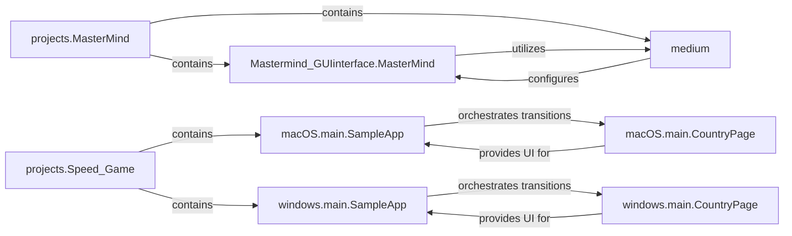

## Details

The `Interactive Games` subsystem, as part of a Code Examples Repository / Monorepo, is composed of two independent mini-projects: `projects.MasterMind` and `projects.Speed_Game`. Each mini-project encapsulates its specific game logic and graphical user interface components, demonstrating a clear separation of concerns at the project level.

### projects.MasterMind
Represents the self-contained MasterMind game application. It acts as the top-level container for all MasterMind-related functionalities, including its GUI and game logic.

**Related Classes/Methods**:

- `projects.MasterMind`

### Mastermind_GUIinterface.MasterMind
The core application class for the MasterMind game. It orchestrates the graphical user interface, manages the game state, processes user guesses, and provides hints based on game logic.

**Related Classes/Methods**:

- <a href="https://github.com/Python-World/python-mini-projects/blob/master/projects/MasterMind/Mastermind_GUIinterface.py#L21-L95" target="_blank" rel="noopener noreferrer">`projects.MasterMind.Mastermind_GUIinterface.MasterMind` (21:95)</a>

### medium
A configuration or utility component within the MasterMind project. It is specifically used to set up game difficulty or initial parameters during the game's initialization phase.

**Related Classes/Methods**:

- `medium`

### projects.Speed_Game
Represents the self-contained speed-typing/reaction game application. This component serves as the top-level container for both macOS and Windows specific implementations of the game.

**Related Classes/Methods**:

- `projects.Speed_Game`

### macOS.main.SampleApp
The primary application container and flow controller for the macOS version of the Speed Game. It is responsible for managing the transitions between different UI frames or pages within the macOS application.

**Related Classes/Methods**:

- <a href="https://github.com/Python-World/python-mini-projects/blob/master/projects/Speed_Game/macOS/main.py#L15-L26" target="_blank" rel="noopener noreferrer">`projects.Speed_Game.macOS.main.SampleApp` (15:26)</a>

### macOS.main.CountryPage
Handles the specific user interface and game logic for the country-themed page within the macOS version of the Speed Game. This includes processing user interactions like button clicks ('check', 'pass') and managing the display and deletion of images.

**Related Classes/Methods**:

- <a href="https://github.com/Python-World/python-mini-projects/blob/master/projects/Speed_Game/macOS/main.py#L81-L236" target="_blank" rel="noopener noreferrer">`projects.Speed_Game.macOS.main.CountryPage` (81:236)</a>

### windows.main.SampleApp
The primary application container and flow controller for the Windows version of the Speed Game. Similar to its macOS counterpart, it manages the switching of UI frames or pages specific to the Windows operating system.

**Related Classes/Methods**:

- <a href="https://github.com/Python-World/python-mini-projects/blob/master/projects/Speed_Game/windows/main.py#L18-L29" target="_blank" rel="noopener noreferrer">`projects.Speed_Game.windows.main.SampleApp` (18:29)</a>

### windows.main.CountryPage
Handles the specific user interface and game logic for the country-themed page within the Windows version of the Speed Game. It manages user interactions and visual elements pertinent to the game's country-themed section on Windows.

**Related Classes/Methods**:

- <a href="https://github.com/Python-World/python-mini-projects/blob/master/projects/Speed_Game/windows/main.py#L84-L239" target="_blank" rel="noopener noreferrer">`projects.Speed_Game.windows.main.CountryPage` (84:239)</a>

### [FAQ](https://github.com/CodeBoarding/GeneratedOnBoardings/tree/main?tab=readme-ov-file#faq)